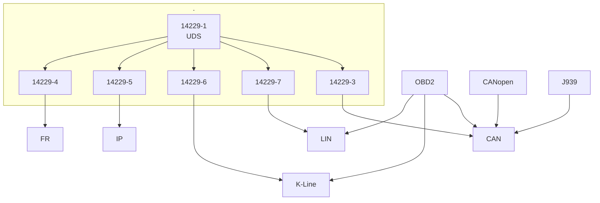
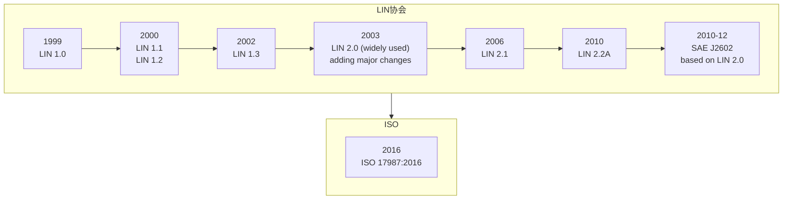
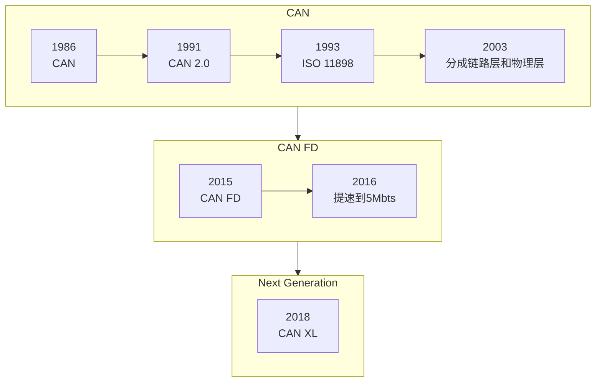
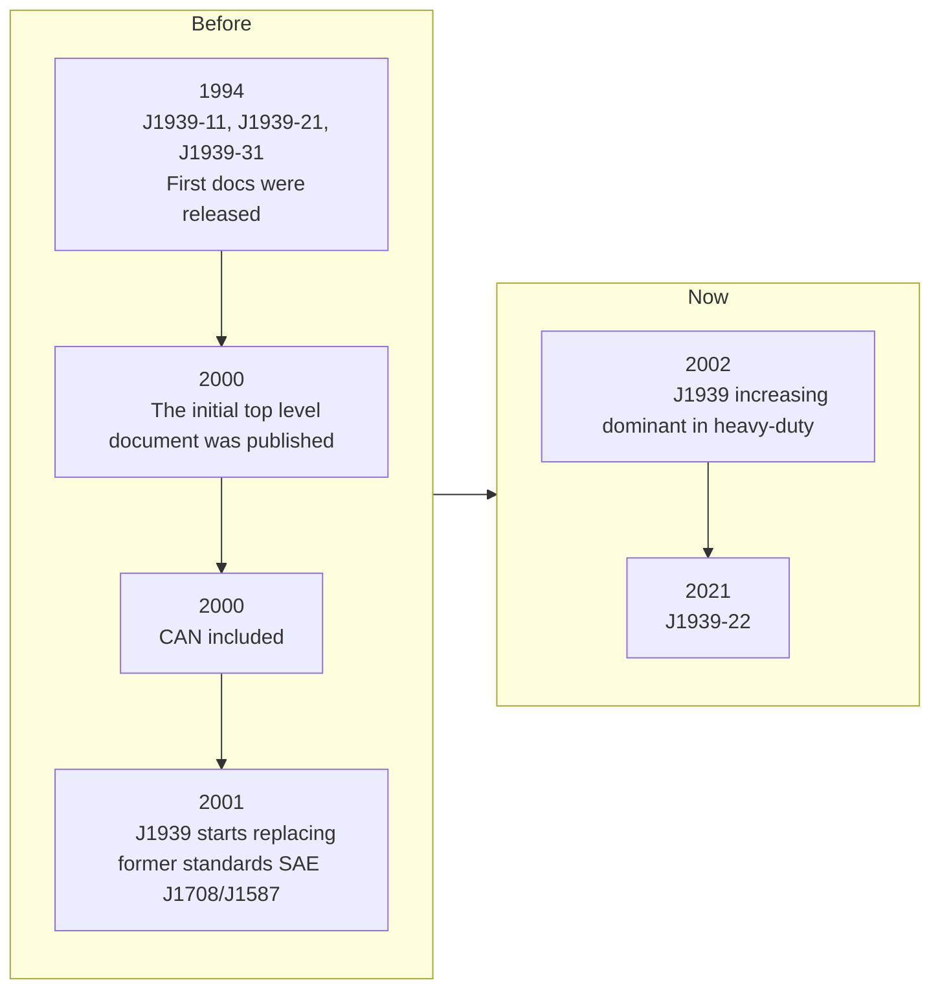
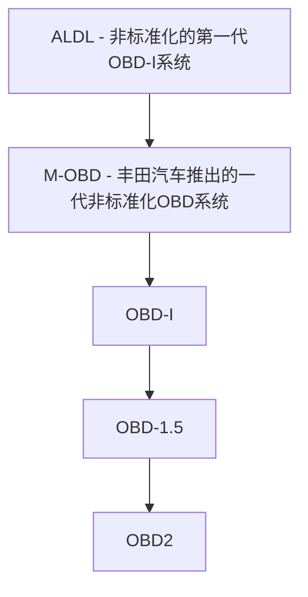
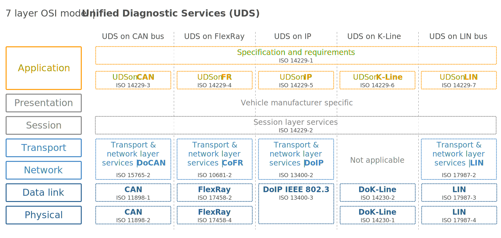

# 汽车诊断协议与技术

[toc]

## Overview

## LIN

* [LIN Bus Explained - A Simple Intro](https://www.youtube.com/watch?v=TresvW4dxlc)

* [瑞萨官方LIN入门中文资料](http://www.jingbei.com/xxpdf/R8C%20lIN%E5%85%A5%E9%97%A8.pdf)(resources已备份)

* LIN通常连接几个小功能，然后作为CAN总线的一个结点

* 协议

  | 协议   | 标准                     |
  | ------ | ------------------------ |
  | 应用层 | ISO 11987-1、ISO111987-5 |
  | 表示层 | ISO 11987-5              |
  | 会话层 | ISO 11987-3              |
  | 传输层 | ISO 11987-2              |
  | 网络层 | ISO 11987-2              |
  | 链路层 | ISO 11987-3、ISO 11987-6 |
  | 物理层 | ISO 11987-4、ISO 11987-7 |

## CAN

* [CAN Bus Explained - A Simple Intro](https://www.youtube.com/watch?v=oYps7vT708E&t=19s)

* [CAN-CIA官网](https://www.can-cia.org/)

* 功能：数据通信的基本方式

* 协议

  | 协议   | 标准        |
  | ------ | ----------- |
  | 链路层 | ISO 11898-1 |
  | 物理层 | ISO 11898-2 |

## CANopen

* [CANopen Explained - A Simple Intro](https://www.youtube.com/watch?v=DlbkWryzJqg)

* 功能：基于CAN的通信协议，工业用的多，比如工业机器人

* 协议

  | 协议   | 标准      |
  | ------ | --------- |
  | 表示层 | CiA 303-2 |
  | 会话层 | CiA 303-1 |

## J1939

* [J1939 Explained - A Simple Intro](https://www.youtube.com/watch?v=vlqxu9ojbHg)

* 功能：重型车通过CAN总线通信的方式

* 协议

  | 协议            | 标准            |
  | --------------- | --------------- |
  | J1939物理层     | 基于J1939-11/15 |
  | J1939数据链路层 | 基于J1939-21    |
  | J1939网络层     | 基于J1939-31    |
  | J1939应用层     | 基于J1939-71    |
  | J1939网络管理   | 基于J1939-81    |
  | J1939诊断       | 基于J1939-13/73 |

## OBD2

* [OBD2 Explained - A Simple Intro](https://www.youtube.com/watch?v=YcwBeNQbJ5A)

* [中华人民共和国国家环境保护标准 - 轻型汽车车载诊断（OBD）系统管理技术规范](https://www.mee.gov.cn/ywgz/fgbz/bz/bzwb/dqhjbh/xgbz/200912/W020111114549721370530.pdf)

* 功能：面向排放系统ECU的诊断协议

* 协议：https://blog.csdn.net/weixin_38451800/article/details/122567551

  | 协议    | 标准                  |
  | ------- | --------------------- |
  | KWP2000 | ISO14230-4、ISO9141-2 |
  | PWM     | SAEJ1850              |
  | VPM     | SAEJ1850              |
  | CAN-BUS | ISO15765-4            |

## UDS

* [Unified Diagnostic Services (UDS) Explained - A Simple Intro](https://www.youtube.com/watch?v=CV_B8tJgI5E)

* 功能：统一诊断协议

* 协议

  