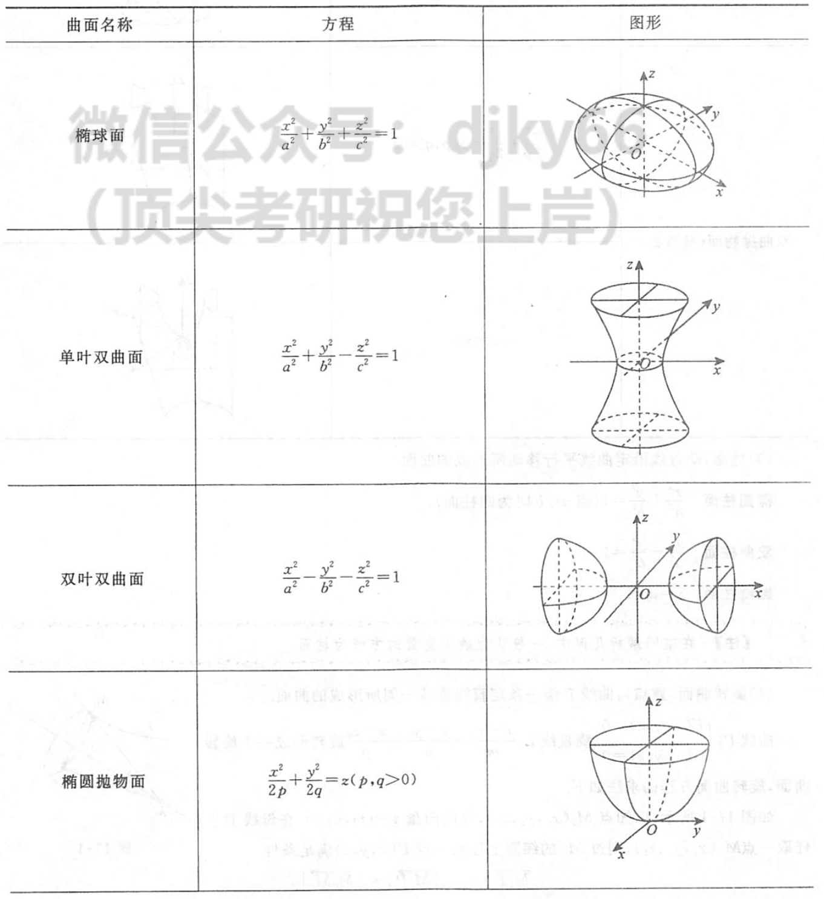
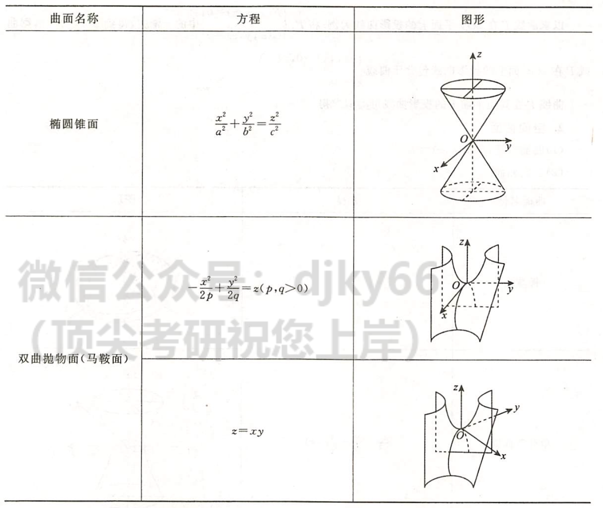

# 多元函数预备知识
2022.07.02

[TOC]

## 向量代数

* 数量积
  $$
  \boldsymbol{a}\cdot \boldsymbol{b} = (a_1,a_2,a_3)\cdot (b_1,b_2,b_3) = a_1b_1+a_2b_2+a_3b_3\\
  \boldsymbol{a}\cdot \boldsymbol{b} = |\boldsymbol{a}||\boldsymbol{b}|\cdot \cos\theta\to\cos\theta=\frac{\boldsymbol{a}\cdot\boldsymbol{b}}{|\boldsymbol{a}||\boldsymbol{b}|}=\frac{a_1b_1+a_2b_2+a_3b_3}{\sqrt{a_1^2+a_2^2+a_3^2}\cdot\sqrt{b_1^2+b_2^2+b_3^2}}\\
  \boldsymbol{a}\perp\boldsymbol{b} \Leftrightarrow |\boldsymbol{a}||\boldsymbol{b}|\cdot \cos\theta=0 \Leftrightarrow \theta=\frac{\pi}{2}\\
  Prj_b\boldsymbol{a} = \frac{\boldsymbol{a}\cdot \boldsymbol{b}}{|\boldsymbol{a}|},a在b上的投影
  $$

* 向量积
  $$
  \boldsymbol{a}\times \boldsymbol{b} =
  \begin{vmatrix}
  \boldsymbol{i} & \boldsymbol{j} & \boldsymbol{k} \\
  a_i & a_j & a_k\\
  b_i & b_j & b_k
  \end{vmatrix}\\
  |\boldsymbol{a}\times \boldsymbol{b}| = |\boldsymbol{a}|\cdot |\boldsymbol{b}|\cdot \sin\theta\\
  a\parallel b \Leftrightarrow \theta=0或\pi
  $$

* 混合积
  $$
  [\boldsymbol{abc}]=(\boldsymbol{a}\times\boldsymbol{b})\cdot \boldsymbol{c} =
  \begin{vmatrix}
  a_i & a_j & a_k\\
  b_i & b_j & b_k\\
  c_i & c_j & c_k
  \end{vmatrix}
  \\
  \begin{vmatrix}
  a_i & a_j & a_k\\
  b_i & b_j & b_k\\
  c_i & c_j & c_k
  \end{vmatrix}=0 \Leftrightarrow 三向量共面
  $$

* 方向角和方向余弦：方向角—向量与x，y，z轴正向的夹角
  $$
  方向余弦\\
  \cos \alpha = \frac{a_x}{|\boldsymbol{a}|}\\
  \cos \beta = \frac{a_x}{|\boldsymbol{a}|}\\
  \cos \gamma = \frac{a_x}{|\boldsymbol{a}|}
  \\单位向量\\
  \boldsymbol{a_0}=\frac{\boldsymbol{a}}{|\boldsymbol{a}|}={(\cos \alpha,\cos \beta,\cos \gamma)}\\
  任意向量\boldsymbol{r} = |\boldsymbol{r}|(\cos\alpha,\cos\beta,\cos\gamma)
  $$
  

## 空间平面与直线

* 平面方程
  $$
  法向量:&\boldsymbol{n} = (A,B,C)\\
  一般式:&Ax+By+Cz+D = 0\\
  点法式:&A(x-x_0)+B(y-y_0)+C(z-z_0)=0\\
  三点式:&\begin{vmatrix}
  x-x_1 & y-y_1 & z-z_1\\
  x-x_2 & y-y_2 & z-z_2\\
  x-x_3 & y-y_3 & z-z_3
  \end{vmatrix}=0\\
  截距式:&\frac{x}{a}+\frac{y}{b}+\frac{z}{c} =1
  $$

* 直线方程
  $$
  方向向量:&\tau = (l,m,n)\\
  一般式:&
  \begin{cases}
  A_1x+B_1y+C_1z+D_1 = 0,\boldsymbol{n}_1=(A_1,B_1,C_1)\\
  A_2x+B_2y+C_2z+D_2 = 0,\boldsymbol{n}_1=(A_2,B_2,C_2)\\
  \end{cases}
  (n_1不平行于n_2)\\
  点向式:&\frac{x-x_0}{l}=\frac{y-y_0}{m}=\frac{z-z_0}{n}\\
  参数式:&\begin{cases}
  x = x_0+lt\\
  y = y_0+mt\\
  z = z_0+nt
  \end{cases}\\
  两点式:&\frac{x-x_1}{x_0-x_1}=\frac{y-y_1}{y_0-y_1}=\frac{z-z_1}{z_0-z_1}
  $$

* 位置关系
  $$
  P(x_0,y_0,z_0)到Ax+By+Cz+D=0距离:&\frac{|Ax_0+By_0+Cz_0+D|}{\sqrt{A^2+B^2+C^2}}\\
  直线垂直:&方向向量内积为0\\
  直线平行:&方向向量分量成比例\\
  平面垂直:&法向量垂直\\
  平面平行:&法向量平行\\
  $$
  

## 空间曲线与曲面

* 空间曲线
  $$
  一般式:&\begin{cases}
  F(x,y,z)=0\\
  G(x,y,z)=0
  \end{cases}\\
  参数式:&\begin{cases}
  x=\phi_1(t)\\
  y=\phi_2(t)\\
  z=\phi_3(t)
  \end{cases}\\
  空间曲线在坐标面上的投影:&如果投影到XOY平面\\
  &消去\begin{cases}
  F(x,y,z)=0\\
  G(x,y,z)=0
  \end{cases}中的z,\\
  &得到\phi(x,y)=0\\
  &投影为：\begin{cases}
  \phi(x,y)=0\\
  z=0
  \end{cases}
  $$

* 空间曲面

  

  

* 柱面
  $$
  椭圆柱面:&\frac{x^2}{a^2}+\frac{y^2}{b^2}=1\\
  双曲柱面:&\frac{x^2}{a^2}-\frac{y^2}{b^2}=1\\
  抛物柱面:&y=ax^2
  $$

* **旋转曲面**
  $$
  曲线\tau：&\begin{cases}
  F(x,y,z)=0\\
  G(x,y,z)=0
  \end{cases}\\
  绕直线：&\frac{x-x_0}{l}=\frac{y-y_0}{m}=\frac{z-z_0}{n}\\
  原材料:&\begin{cases}
  直线上一点:P_0(x_0,y_0,z_0)\\
  曲线上一点:P_1(x_1,y_1,z_1)\\
  纬圆上一点:P(x,y,z)\\
  直线方向向量:(l,m,n)
  \end{cases}\\
  旋转一周所组成的曲面:&\begin{cases}
  【PP_1与直线垂直】\\
  l(x-x_1)+m(y-y_1)+n(z-z_1)=0\\
  【|P_1P_0|=|PP_0|】\\
  (x-x_0)^2+(y-y_0)^2+(z-z_0)^2=(x_1-x_0)^2+(y_1-y_0)^2+(z_1-z_0)^2\\
  【P_1在曲线上】\\
  F(x_1,y_1,z_1)=0\\
  G(x_1,y_1,z_1)=0
  \end{cases}
  $$
  

## 多元函数微分学的几何应用

* 空间曲线的切线与法平面
  $$
  空间曲线:&\begin{cases}
  x = \phi(t)\\
  y = \psi(t)\\
  z = \omega(t)
  \end{cases}\\
  空间曲线上一点:&P_0(x_0,y_0,z_0)\\
  P_0处切向量:&\tau=(\phi'(t),\psi'(t),\omega'(t))\\
  P_0处切线方程:&\frac{x-x_0}{\phi'(t)}=\frac{y-y_0}{\psi'(t)}=\frac{z-z_0}{\omega'(t)}\\
  P_0处法平面:&(x-x_0){\phi'(t)}+(y-y_0){\psi'(t)}+(z-z_0){\omega'(t)}=0
  $$

  $$
  空间曲线:&\begin{cases}
  F(x,y,z)=0\\
  G(x,y,z)=0
  \end{cases}\\
  P_0处切向量:&\tau=(
  \begin{vmatrix}
  F_y & F_z\\
  G_y & G_z
  \end{vmatrix}_{P_0},
  \begin{vmatrix}
  F_z & F_x\\
  G_z & G_x
  \end{vmatrix}_{P_0},
  \begin{vmatrix}
  F_x & F_y\\
  G_x & G_y
  \end{vmatrix}_{P_0})\\
  P_0点线:&\frac{x-x_0}{\begin{vmatrix}
  F_y & F_z\\
  G_y & G_z
  \end{vmatrix}_{P_0}}=
  \frac{y-y_0}{
  \begin{vmatrix}
  F_z & F_x\\
  G_z & G_x
  \end{vmatrix}_{P_0}}=
  \frac{z-z_0}{
  \begin{vmatrix}
  F_x & F_y\\
  G_x & G_y
  \end{vmatrix}_{P_0}}\\
  P_0切平面:&(x-x_0){\begin{vmatrix}
  F_y & F_z\\
  G_y & G_z
  \end{vmatrix}_{P_0}}+
  (y-y_0){
  \begin{vmatrix}
  F_z & F_x\\
  G_z & G_x
  \end{vmatrix}_{P_0}}+
  (z-z_0){
  \begin{vmatrix}
  F_x & F_y\\
  G_x & G_y
  \end{vmatrix}_{P_0}}=0
  $$

  

* 空间曲面的切平面与法线
  $$
  空间曲面:&F(x,y,z)=0\\
  平面上一点:&P_0(x_0,y_0,z_0)\\
  P_0点的法线:&n=(F'_x,F'_y,F'_z)_{P_0}\\
  P_0点的切平面:&F'_{x_0}(x-x_0)+F'_{y_0}(x-x_0)+F'_{z_0}(z-z_0)=0\\
  $$

  $$
  空间曲面:z=f(x,y)\to F(x,y,z)=f(x,y)-z
  $$

  

## 场论初步

* 方向导数
  $$
  \begin{align}
  定义法\\
  P(x,y,z)&=\begin{cases}
  x-x_0=\Delta x=t\cdot \cos \alpha\\
  y-y_0=\Delta y=t\cdot \cos \beta\\
  z-z_0=\Delta z=t\cdot \cos \gamma
  \end{cases}\\
  t&=\sqrt{(\Delta x)^2+(\Delta y)^2+(\Delta z)^2}\\
  \lim_{x\to 0^+}\frac{u(P)-u(P_0)}{t}
  &=\lim_{x\to 0^+}\frac{u(x_0+t\cdot \cos \alpha,y_0+t\cdot \cos \beta,z_0+t\cdot \cos \gamma)-u(x_0,y_0,z_0)}{\sqrt{(\Delta x)^2+(\Delta y)^2+(\Delta z)^2}}\\
  &=u'_x(P_0)\cos\alpha+u'_y(P_0)\cos\beta+u'_z(P_0)\cos\gamma
  \end{align}
  $$

* 梯度
  $$
  \begin{align}
  &[u'_x(P_0)\cos\alpha+u'_y(P_0)\cos\beta+u'_z(P_0)\cos\gamma]_{max}\\
  =&[u'_x(P_0),u'_y(P_0),u'_z(P_0)]\cdot[\cos\alpha,\cos\beta,\cos\gamma]_{max}\\
  =&[u'_x(P_0),u'_y(P_0),u'_z(P_0)]\cdot[1,1,1]\\
  \to&梯度方向,方向导数取的最大值
  \end{align}
  $$

* 散度
  $$
  A(x,y,z) = (P(x,y,z),Q(x,y,z),R(x,y,z))\\
  div A = \frac{\partial P}{\partial x}+ \frac{\partial Q}{\partial y}+ \frac{\partial R}{\partial z}\\
  $$

* 旋度
  $$
  A(x,y,z) = (P(x,y,z),Q(x,y,z),R(x,y,z))\\
  rot A=\begin{vmatrix}
  i & j & k\\
  \frac{\partial}{\partial x} & \frac{\partial}{\partial y}&\frac{\partial z}{\partial}\\
  P&Q&R
  \end{vmatrix}
  $$
  