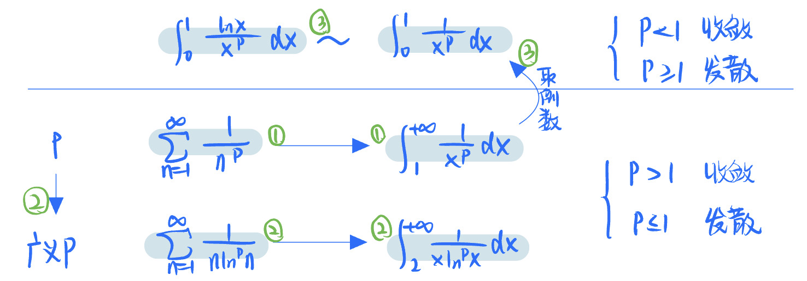

# 无穷级数
2022.06.29

[TOC]

## 常数项级数

### 概念与性质

* 遇到新题尝试下面思路
  $$
  S_n= u_1+u_2+...+u_n\\
  \lim_{x\to+\infty}S_n=A,  & 收敛\\
  \lim_{x\to+\infty}S_n=\infty或不存在,  & 发散
  $$

* 性质1：线性
  $$
  \sum_{n=1}^{\infty}{au_n+bv_n}  = \sum_{n=1}^{\infty}au_n+\sum_{n=1}^{\infty}bv_n
  $$

* 性质2：m项后余项与原级数同敛散性——改变有现项不改变敛散性

* 性质3：级数收敛，则通项趋于零

### 正项级数

* 概念
  $$
  \sum_{n=1}^{\infty}u_n\\u_n\ge0
  $$

* 收敛原则
  $$
  \sum_{n=1}^{\infty}u_n收敛\to S_n有界\\
  S_n有界\to \sum_{n=1}^{\infty}u_n收敛
  $$

* 比较判别法

  * 小发则大发，大收则小收

  * 可以结合常用不等式

    * $$
      x>\ln(x+1)>0
      $$

* 比较判别法的极限形式
  $$
  \lim_{x\to\infty}\frac{u_{n}}{v_n}=
  \begin{cases} 
  0&,按比较判别法\\
  \infty&,按比较判别法\\
  A\in(0,\infty)&,u_n,v_n同敛散
  \end{cases}
  $$

* 比值判别法（达朗贝尔判别法）
  $$
  \lim_{x\to\infty}\frac{u_{n+1}}{u_n}=\rho\\
  \begin{cases}
  收敛&,\rho<1\\
  发散&,\rho>1\\
  失效&,\rho=1
  \end{cases}
  $$

* 根值判别法（柯西判别法）
  $$
  \lim_{x\to\infty}\sqrt[n]{u_n}=\rho\\
  \begin{cases}
  收敛&,\rho<1\\
  发散&,\rho>1\\
  失效&,\rho=1
  \end{cases}
  $$

* 积分判别法
  $$
  u_n非负单减，\sum_{n=1}^{+\infty}u_n与\int_1^{+\infty}f(x)dx同敛散
  $$

### 交错级数

* 定义：$\sum_{x=1}^{+\infty}(-1)^nu_n$，注意$u_n>0$，不等于零

* 莱布尼兹判别法
  $$
  \begin{cases}
  u_n单调递减\\
  \lim_{n\to+\infty}u_n=0
  \end{cases}
  \to收敛
  $$

* 一些常用反例
  $$
  u_n = (-1)^n \frac{1}{\sqrt n}\\
  u_n = \frac{1}{\sqrt n}\\
  u_n = (-1)^n \frac{1}{n}\\
  u_n = \frac{1}{n}
  $$

* 常用结论

  * p级数
    $$
    \sum_{n=1}^{\infty}\frac{1}{x^p} 
    \begin{cases}
    收敛&,p>1\\
    发散&,p≤1
    \end{cases}
    $$

  * 广义p级数
    $$
    \sum_{n=2}^{\infty}\frac{1}{x\ln^px} 
    \begin{cases}
    收敛&,p>1\\
    发散&,p≤1
    \end{cases}
    $$

  > 1. p=1的时候都是发散的
  > 2. Pxx与广义Pxx条件是敛散性一样的。所以才叫广义。
  > 3. P积分的(0-1)与(1,+∞)积分实际上可以认为是x取倒数。
  > 4. $\int_1^{+\infty}\frac{1}{x^p}$与$\int_1^{+\infty}\frac{\ln x}{x^p}$结果一样。

### 任意项级数

#### 绝对收敛与条件收敛

* 绝对收敛：同项加绝对值也收敛，绝对收敛则原级数也收敛
* 条件收敛：原级数收敛但是加绝对值就不收敛了

#### 常用结论

1. $$
   \sum_{n=1}^\infty u_n收敛 \nrightarrow \sum_{n=1}^\infty |u_n|收敛\\
   eg. \sum_{n=1}^\infty(-1)^n\frac{1}{n}收敛，\sum_{n=1}^\infty\frac{1}{n}发散
   $$

2. $$
   \sum_{n=1}^\infty u_n收敛\to \sum_{n=1}^\infty u_{n}^2
   \begin{cases}
   收敛&,u_n≥0\\
   不确定&,u_n为任意项\\
   \end{cases}\\
   eg. \sum_{n=1}^\infty(-1)^n\frac{1}{\sqrt n}收敛，\sum_{n=1}^\infty\frac{1}{n}发散
   $$

3. $$
   \sum_{n=1}^\infty u_n收敛\to \sum_{n=1}^\infty u_{n}\cdot u_{n+1}
   \begin{cases}
   收敛&,u_n≥0,(1)\\
   不确定&,u_n为任意项,(2)\\
   \end{cases}\\
   
   prove(1). 
   u_n\cdot u_{n+1}≤\frac{1}{2}(u_n^2+u_{n+1}^2)\\
   eg(2).
   \sum_{n=1}^\infty(-1)^n\frac{1}{\sqrt n}收敛，\sum_{n=1}^\infty\frac{1}{\sqrt {n(n+1)}}发散
   $$

4. $$
   \sum_{n=1}^\infty u_n收敛 \nrightarrow \sum_{n=1}^\infty (-1)^nu_n收敛\\
   eg. \sum_{n=1}^\infty(-1)^n\frac{1}{n}收敛，\sum_{n=1}^\infty\frac{1}{n}发散
   $$

5. $$
   \sum_{n=1}^\infty u_n收敛 \nrightarrow\sum_{n=1}^\infty (-1)^n \frac{u_{n}}
   {n}收敛\\
   eg. \sum_{n=1}^\infty(-1)^n\frac{1}{\ln n}收敛，\sum_{n=2}^\infty\frac{1}{n\ln n}发散
   $$

6. $$
   \sum_{n=1}^\infty u_n收敛\to \sum_{n=1}^\infty u_{2n}与\sum_{n=1}^\infty u_{2n+1}
   \begin{cases}
   收敛&,u_n≥0\\
   不确定&,u_n为任意项\\
   \end{cases}\\
   
   eg.
   \sum_{n=1}^\infty(-1)^n\frac{1}{n}收敛，\sum_{n=1}^\infty\frac{1}{2n}发散
   $$

7. $$
   \sum_{n=1}^\infty u_n收敛\to \sum_{n=1}^\infty (u_{2n}+u_{2n-1})收敛\\
   \sum_{n=1}^\infty (u_{2n}+u_{2n-1})收敛,则\sum_{n=1}^\infty u_n收敛,错！还需要\lim_{n\to \infty}u_n=0\\
   eg. u_{2n}=1, u_{2n-1}=-1, \sum_{n=1}^\infty (u_{2n}+u_{2n-1})=0, \sum_{n=1}^\infty u_n发散
   $$

8. $$
   \sum_{n=1}^\infty u_n收敛,\sum_{n=1}^\infty (u_{2n}-u_{2n-1})不确定\\
   eg. \sum_{n=1}^\infty(-1)^n\frac{1}{n}收敛，\sum_{n=1}^\infty (u_{2n}-u_{2n-1})=\sum_{n=1}^\infty\frac{1}{n}发散
   $$

9. $$
   \sum_{n=1}^\infty u_n收敛\to
   \begin{cases}
   \sum_{n=1}^\infty (u_{n}+u_{n+1})收敛,\sum_{n=1}^\infty u_{n}+\sum_{n=1}^\infty u_{n+1}收敛\\
   
   \sum_{n=1}^\infty (u_{n}-u_{n+1})收敛,\sum_{n=1}^\infty u_{n}-\sum_{n=1}^\infty u_{n+1}发散
   \end{cases}
   $$

10. $$
    \sum_{n=1}^\infty |u_n|收敛,则\sum_{n=1}^\infty u_{n}收敛\\
    \sum_{n=1}^\infty u_n发散,则\sum_{n=1}^\infty |u_{n}|收敛
    $$

11. $$
    \sum_{n=1}^\infty u_n^2收敛,则\sum_{n=1}^\infty \frac{u_n}{n}绝对收敛\\
    因为|\frac{u_n}{n}|≤\frac{1}{2}(u_n^2+\frac{1}{n^2})
    $$

12. $$
    a,b,c≠0\\
    au_n+bv_n+cw_n=0\\
    则在\sum_{n=1}^\infty u_n,\sum_{n=1}^\infty v_n,\sum_{n=1}^\infty w_n中只有有两个收敛，另一个必收敛
    $$

13. $$
    \sum_{n=1}^\infty u_n,\sum_{n=1}^\infty v_n都收敛，则\sum_{n=1}^\infty u_n\pm v_n收敛
    $$

14. $$
    \sum_{n=1}^\infty u_n收敛, \sum_{n=1}^\infty v_n发散，则\sum_{n=1}^\infty u_n\pm v_n发散
    $$

15. $$
    \sum_{n=1}^\infty u_n,\sum_{n=1}^\infty v_n都发散，则\sum_{n=1}^\infty u_n+ v_n发散(u_n≥0, v_n≥0)\\
    \sum_{n=1}^\infty u_n,\sum_{n=1}^\infty v_n都发散，则\sum_{n=1}^\infty u_n\pm v_n不确定(u_n, v_n任意)
    $$

16. $$
    \sum_{n=1}^\infty u_n,\sum_{n=1}^\infty v_n都收敛，
    
    \begin{cases}
    (1)\sum_{n=1}^\infty u_n\cdot v_n收敛  &,u_n≥0, v_n≥0\\
    (2)\sum_{n=1}^\infty |u_n|\cdot v_n收敛&, u_n任意, v_n≥0\\
    (3)\sum_{n=1}^\infty u_n\cdot v_n不确定&, u_n, v_n不确定\\
    \end{cases}\\
    
    prove(1):(u_n\cdot v_n≤\frac{u_n^2+v_n^2}{2})\\
    $$

## 幂级数

### 幂级数与收敛域

* 函数项级数
  $$
  \sum_{n=1}^{\infty}u_n(x)
  $$

* 幂级数
  $$
  \sum_{n=1}^{\infty}a_n(x-x_0)^n\\
  \sum_{n=1}^{\infty}a_nx^n
  $$

* 阿贝尔定理
  $$
  \lim|\frac{a_{n+1}}{a_n}| = \rho\\
  R=
  \begin{cases}
  \frac{1}{\rho}&,\rho≠0\\
  0&,\rho=\infty\\
  \infty&,\rho=0
  \end{cases}\\
  注意端点要单独确认
  $$

* 收敛域求法（具体型）
  $$
  \lim|\frac{a_{n+1}}{a_n}| <1\\
  收敛区间为x范围\\
  注意端点要单独确认，得到收敛域
  $$

* 抽象型，对于$\sum_{n=0}^{\infty}a_n(x-x_0)^n$
  $$
  若x=b时条件收敛\to R=|b-x_0|\\
  (x-x_0)^n到(x-x_1)^n的变换不改变收敛域,包括乘(x-x_0)^k与平移\\
  对级数逐项求导，收敛半径不变，收敛域可能缩小\\
  对级数逐项积分，收敛半径不变，收敛域可能扩大\\
  $$

* 如何改造通项与下标
  $$
  \sum_{n=1}^{\infty}a_nx^n = \sum_{n=0}^{\infty}a_{n+1}x^{n+1}\\
  \sum_{n=1}^{\infty}a_nx^n = x\cdot \sum_{n=1}^{\infty}a_nx^{n-1}\\
  \sum_{n=0}^{\infty}a_nx^n = a_0 + \sum_{n=1}^{\infty}a_nx^n
  $$

* 先导后积
  $$
  S(x) = S(x_0)+\int_{x_0}^x(\sum_{n=1}^{\infty}a_nt^n)'dt
  $$

* 先积后导
  $$
  S(x) = (\int \sum_{n=1}^{\infty}a_nt^n dt)'
  $$

* 常用结论
  $$
  \sum_{n=1}^{\infty}\frac{x^n}{n} = -\ln(1-x),x\in[-1,1)\\
  \sum_{n=1}^{\infty}nx^{n-1} = \frac{1}{(1-x)^2},x\in(-1,1)
  $$

* 常用的展开式(注意收敛域)
  $$
  e^x = \sum_{x=0}^\infty \frac{x^n}{n!} &,x\in(-\infty,+\infty)\\
  \frac{1}{1-x} = \sum_{x=0}^\infty x^n &,x\in(-\infty,+\infty)\\
  \frac{1}{1+x} = \sum_{x=0}^\infty (-x)^n &,x\in(-\infty,+\infty)\\
  \ln(1+x) = \sum_{x=1}^\infty (-1)^{n-1}\frac{x^{n}}{n}&,x\in[-1,1)\\
  \sin x = \sum_{x=0}^\infty (-1)^n\frac{x^{2n+1}}{(2n+1)!} &,x\in(-\infty,+\infty)\\
  \cos x = \sum_{x=0}^\infty (-1)^n\frac{x^{2n}}{(2n)!} &,x\in(-\infty,+\infty)\\
  (1+x)^a = 1+ax+\frac{a(a-1)}{2!}x^2+\cdots+\frac{a(a-1)..(a-n+1)}{n!}x^n+\cdots&,
  \begin{cases}
  x\in(-1,1),a≤1\\
  x\in(-1,1],a\in(-1,0)\\
  x\in[-1,1],a>0,a\notin N^*\\
  x\in R,a\in N^*
  \end{cases}
  $$

* 函数展开
  $$
  f(x) = \sum_{n=0}^{\infty} \frac{f^{(n)}(x_0)}{n!}(x-x_0)^n\\
  f(x) = \sum_{n=0}^{\infty} \frac{f^{(n)}(0)}{n!}x^n
  $$

### 常用的求和公式

* 分母是n

$$
\ln(n-1)=\sum_{n=1}^\infty\frac{x^{n}}{n},-1<x≤1\\
\ln(n+1)=\sum_{n=1}^\infty(-1)^{n-1}\frac{x^{n}}{n},-1<x≤1\\
$$

* 分母是偶数——2n

$$
\frac{1}{2}\ln(n+1)=\sum_{n=1}^\infty(-1)^{n-1}\frac{x^{n}}{2n},-1<x≤1
$$

* 分母是奇数——2n+1

$$
\arctan x=\sum_{n=1}^\infty(-1)^{n-1}\frac{x^{2n+1}}{2n+1},-1≤x≤1
$$

* 分母有阶乘

$$
e^x = \sum_{n=1}^\infty\frac{x^{n}}{n!},-\infty<x≤\infty\\
-e^x = \sum_{n=1}^\infty(-1)^{n}\frac{x^{n}}{n!},-\infty<x≤\infty\\
\frac{e^x+e^{-x}}{2} = \sum_{n=1}^\infty\frac{x^{2n}}{(2n)!},-\infty<x≤\infty\\
\frac{e^x-e^{-x}}{2} = \sum_{n=1}^\infty\frac{x^{2n+1}}{(2n+1)!},-\infty<x≤\infty\\
\cos x=\sum_{n=1}^\infty(-1)^{n}\frac{x^{2n}}{(2n)!},-\infty<x≤\infty\\
\sin x=\sum_{n=1}^\infty(-1)^{n}\frac{x^{2n+1}}{(2n+1)!},-\infty<x≤\infty
$$

* 补充

$$
\frac{x}{(1-x)^2}=\sum_{n=1}^\infty nx^n,-1<x<1\\
-\ln(1-x)=\sum_{n=1}^\infty\frac{x^n}{n},-1≤x<1
$$

* 分母是n

$$
\ln(n-1)=\sum_{n=1}^\infty\frac{x^{n}}{n},-1<x≤1\\
\ln(n+1)=\sum_{n=1}^\infty(-1)^{n-1}\frac{x^{n}}{n},-1<x≤1\\
$$

* 分母是偶数——2n

$$
\frac{1}{2}\ln(n+1)=\sum_{n=1}^\infty(-1)^{n-1}\frac{x^{n}}{2n},-1<x≤1
$$

* 分母是奇数——2n+1

$$
\arctan x=\sum_{n=1}^\infty(-1)^{n-1}\frac{x^{2n+1}}{2n+1},-1≤x≤1
$$

* 分母有阶乘

$$
e^x = \sum_{n=1}^\infty\frac{x^{n}}{n!},-\infty<x≤\infty\\
-e^x = \sum_{n=1}^\infty(-1)^{n}\frac{x^{n}}{n!},-\infty<x≤\infty\\
\frac{e^x+e^{-x}}{2} = \sum_{n=1}^\infty\frac{x^{2n}}{(2n)!},-\infty<x≤\infty\\
\frac{e^x-e^{-x}}{2} = \sum_{n=1}^\infty\frac{x^{2n+1}}{(2n+1)!},-\infty<x≤\infty\\
\cos x=\sum_{n=1}^\infty(-1)^{n}\frac{x^{2n}}{(2n)!},-\infty<x≤\infty\\
\sin x=\sum_{n=1}^\infty(-1)^{n}\frac{x^{2n+1}}{(2n+1)!},-\infty<x≤\infty
$$

* 补充

$$
\frac{x}{(1-x)^2}=\sum_{n=1}^\infty nx^n,-1<x<1\\
-\ln(1-x)=\sum_{n=1}^\infty\frac{x^n}{n},-1≤x<1
$$

