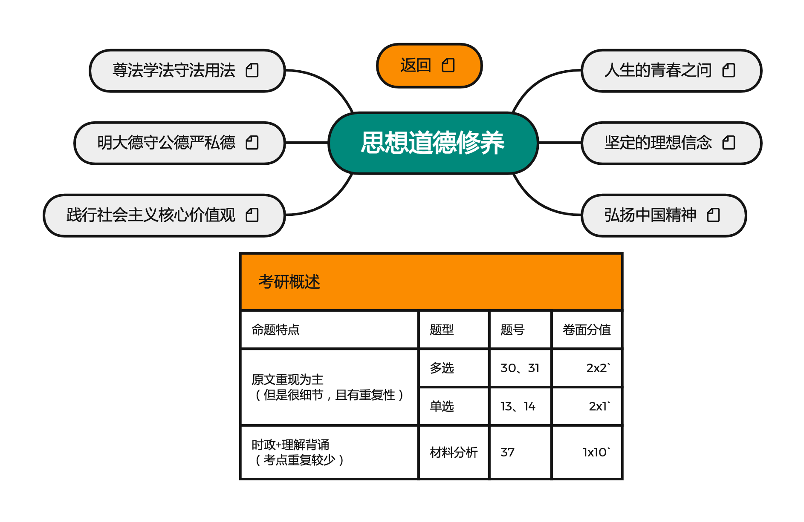

# PKM - 思想道德修养  

## 介绍
思想道德修养按照陆寓丰(腿姐)考研课程进行梳理。
## 资源
链接: https://pan.baidu.com/s/1L8VTQbpa8-xFXVeSl20uTg  
提取码: Xuc6  
如果资源失效请联系我  

## 版本
### V1 2021.10.6  
按照陆寓丰(腿姐)考研课程进行整理，完成全部知识框架搭建   
### V2  
按照陆寓丰(腿姐)考点清单与练习进行吸收理解