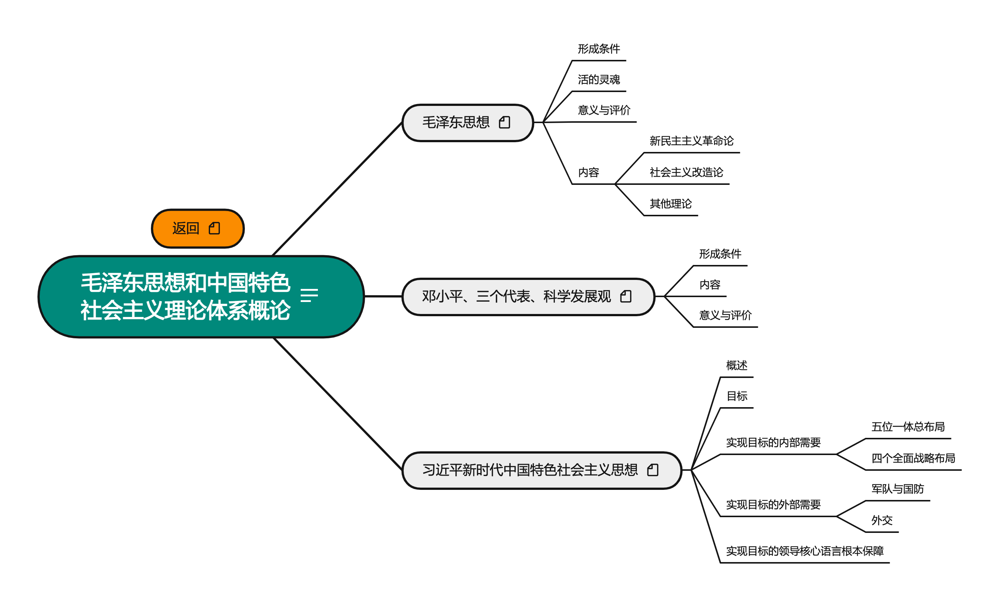

# 毛泽东思想和中国特色社会主义理论体系概论

2022.09.11

[toc]

* 知识点总结
  * [马克思主义中国化的三次飞跃](./notes/知识点总结/马克思主义中国化的三次飞跃.md)
  * [毛泽东思想及其历史地位](./notes/知识点总结/毛泽东思想及其历史地位.md)
  * [新民主主义革命理论](./notes/知识点总结/新民主主义革命理论.md)
  * [社会主义改造理论](./notes/知识点总结/社会主义改造理论.md)
  * [建设社会主义道路初步探索的理论成果](./notes/知识点总结/建设社会主义道路初步探索的理论成果.md)
  * [邓小平理论](./notes/知识点总结/邓小平理论.md)
  * [新时代、新思想](./notes/知识点总结/新时代、新思想.md)
  * [新时代的总任务](./notes/知识点总结/新时代的总任务.md)
  * [五位一体](./notes/知识点总结/五位一体.md)
  * [四个全面](./notes/知识点总结/四个全面.md)
  * [实现中华民族伟大复兴的重要保障](./notes/知识点总结/实现中华民族伟大复兴的重要保障.md)
  * [中国特色大国外交](./notes/知识点总结/中国特色大国外交.md)
  * [坚持和加强党的领导](./notes/知识点总结/坚持和加强党的领导.md)

## 介绍

本模块按照考研政治(陆寓丰和徐涛)以及1000题总结进行构建

## 资源

链接:https://pan.baidu.com/s/1L8VTQbpa8-xFXVeSl20uTg
提取码: Xuc6
如果资源失效请联系我

## 版本

 * **V1 2021.10.22**
   按照陆寓丰(腿姐)考研课程进行整理, 完成全部知识框架搭建
 * **V2 2022.09.xx**
   按照徐涛政治笔记以及1000题总结成知识点笔记