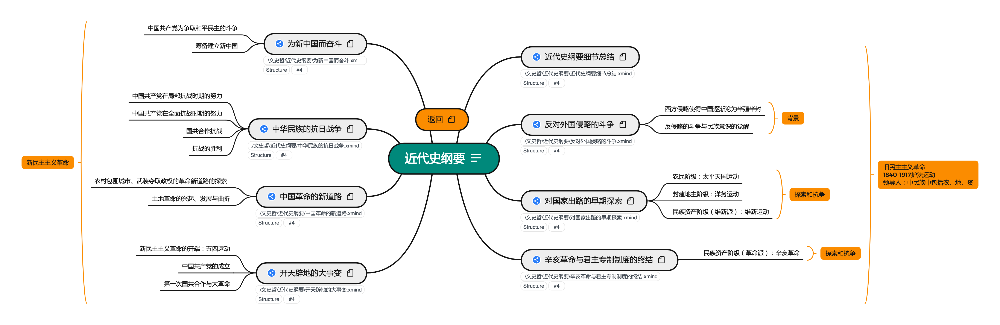

# PKM - 近代史纲要  

## 介绍
近代史纲要按照陆寓丰(腿姐)考研课程进行梳理。
## 资源
链接: https://pan.baidu.com/s/1L8VTQbpa8-xFXVeSl20uTg  
提取码: Xuc6  
如果资源失效请联系我  

## 版本
### V1 2021.9.22  
按照陆寓丰(腿姐)考研课程进行整理，完成全部知识框架搭建   
### V2  2021.11.13
按照陆寓丰(腿姐)考点清单与练习进行吸收理解，易错点标注（由@bywcy完成）

### V3 2021.11.XX

根据陆寓丰(腿姐)背诵手册进行再次梳理，完成《肖1000》练习总结

