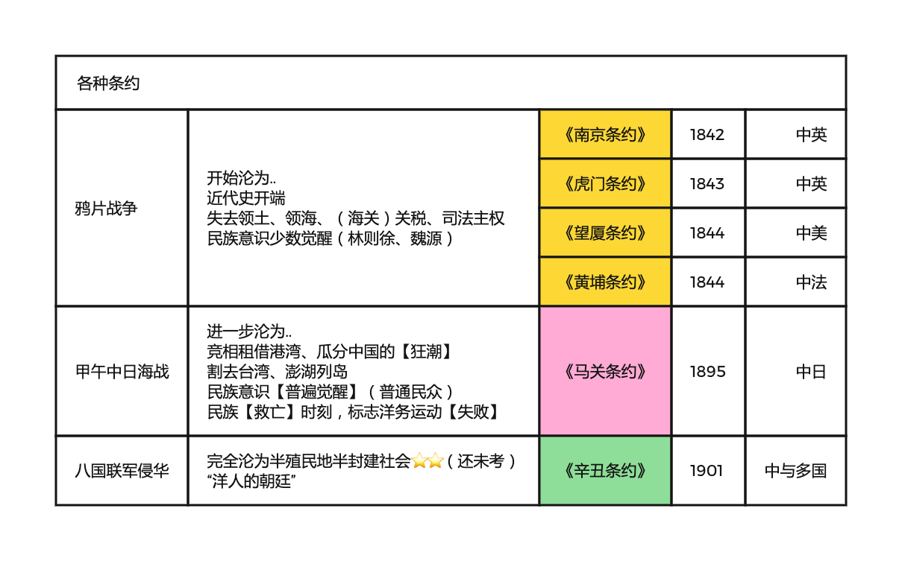
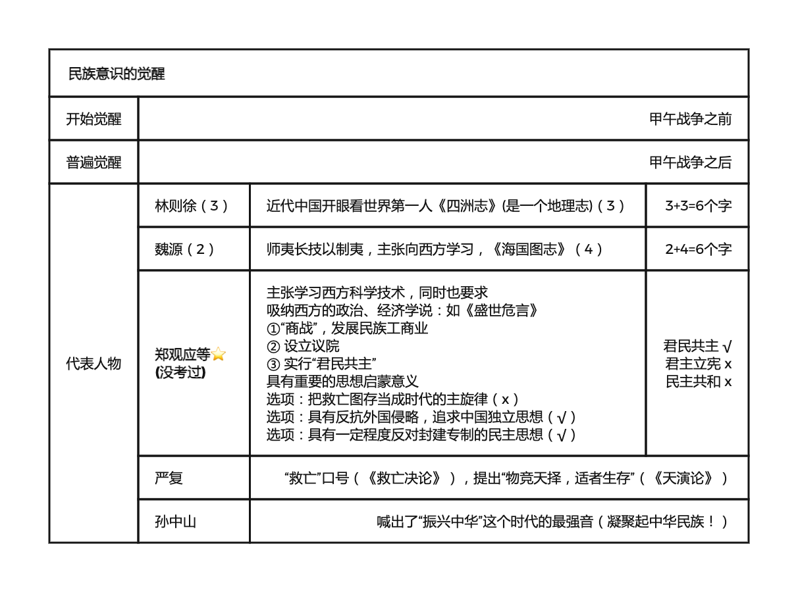

# 反对外国侵略的斗争
2022.09.11

[TOC]

## 两大历史任务&两大矛盾

1. 两大历史任务**【民族独立 人民解放】**；**【国家富强 人民富裕】**
   1. 前是后的必要前提
   2. 后是前的最终目的和必然要求
2. 两大矛盾**【帝国主义和中华民族的矛盾】**；**【封建主义和人民大众的矛盾】**
   1. 中国社会诸多矛盾中上两个是主要的
   2. 两个主要矛盾中，<u>帝国主义和中华民族的矛盾</u>，是主要中的主要

## 不平等条约与后果

|     战争     |   时间    |             条约             | 半殖半封 |      反抗      | 民族意识 |
| :----------: | :-------: | :--------------------------: | :------: | :------------: | :------: |
|   鸦片战争   |   1840    | 南京(第一)、虎门、望厦、黄埔 |   开始   | 太平天国，洋务 | 少数觉醒 |
| 甲午中日海战 | 1894-1895 |        马关（割台湾）        |  进一步  |  维新运动1989  | 普遍觉醒 |
| 八国联军侵华 |   1900    |             辛丑             |   完全   |    辛亥革命    |          |
|              |           |                              |          |    五四运动    | 全面觉醒 |

* 英国占领**香港**：《南京条约》《北京条约》《拓展香港界址专条》

* **割让台湾**：日本《马关条约》

* **收回台湾**、澎湖列岛：《开罗宣言》《波茨坦公告》《日本投降书》《中日联合声明》

## 向西方学习

* 林则徐：《四洲志》、睁眼看世界
* 魏源：《海国图志》、师夷长技以制夷、向西方学习(但是 技术)
* 郑观应：《盛世危言》、“商战、议院、君民共主”
* 严复：《救亡决论》、“救亡”、物竞天择，适者生存

