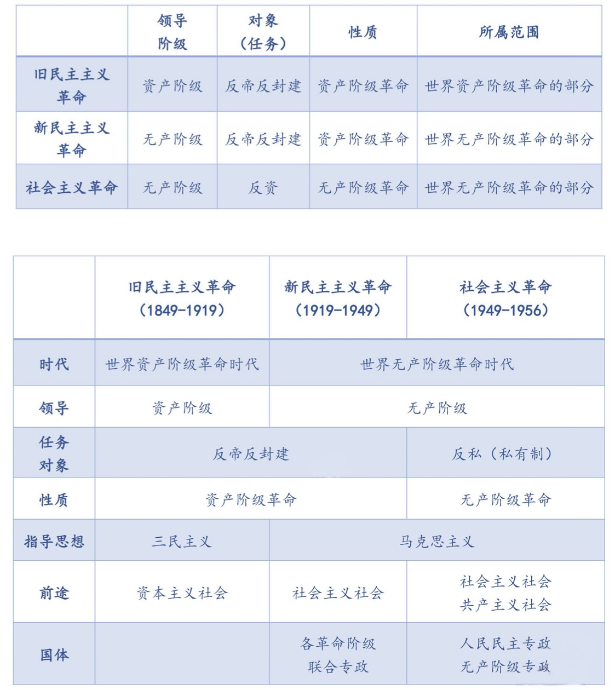

# 开天辟地的大事变
2022.09.11

[TOC]

## 小点

* 初期的新文化运动的基本内容有
  * 提倡民主科学
  * 【对】✅提倡个性解放
  * 提倡新文学
  * 反对专制和迷信盲从
* 【错】❌对孔学的批判是为发展新民主主义扫清思想障碍
* 北京大学
  * 是新文化运动的中心和五四运动的策源地
  * 【错】❌{是各地共产主义进行党建活动的联络中心}，-> 上海才是！
  * 最早在我国传播共产主义
  * 是我们党在北京早期活动的历史见证地
* 五四运动
  * 【错】❌{是无产阶级发动的}【错】❌{是无产阶级领导的}
  * 【对】✅五四运动是一场以先进青年知识分子为先锋、广大人民群众参加的彻底反帝反封建的伟大爱国革命运动，是一场中国人民为拯救民族危亡、捍卫民族尊严、凝聚民族力量而掀起的伟大社会革命运动，是一场传播新思想新文化新知识的伟大思想启蒙运动和新文化运动，以磅礴之力鼓动了中国人民和中华民族实现民族复兴的志向和信心。<u>五四运动后一阶段(6月5日以后)，中国无产阶级登上舞台，显示了伟大的力量,对五四运动的发展起着决定性作用</u>。但是，还不能说五四运动本身是无产阶级领导的，更不能说是无产阶级发动的。
  * 【错】❌五四运动点燃了中华民族伟大复兴的灯塔
  * 【对】✅中国共产党点燃了中华民族伟大复兴的灯塔
* 十月革命
  * 【错】❌十月革命一举推翻沙皇统治，建立起社会主义俄国，令中国先进分子十分向往
  * 【对】✅**二月革命**后建立的资产阶级联合政府一举推翻沙皇统治

## 李大钊著作

* 1918年7月,他发表**《法俄革命之比较观》**一文,指出：“俄罗斯之革命是二十世纪初期之革命，是立于社会主义上之革命”，向中国人民第一次正确地阐述了十月革命的性质。
* 1918年11月、12月，李大钊相继发表**《庶民的胜利》《布尔什维主义的胜利》**两篇文章,深刻揭露了第一次世界大战的本质，热情歌领了十月革命和布尔什维主义的胜利，欢呼“将来的环球，必是赤旗的世界”。
* 1919年9月、11月，他又发表**《我的马克思主义观》**一文，明确地把马克思主义称为“世界改造原动的学说”，并且对马克思的唯物史观、剩余价值学说和阶级斗争理论作了比较系统的介绍。这表明，李大钊已经成为中国的第一个马克思主义者。

## 三次革命对比

