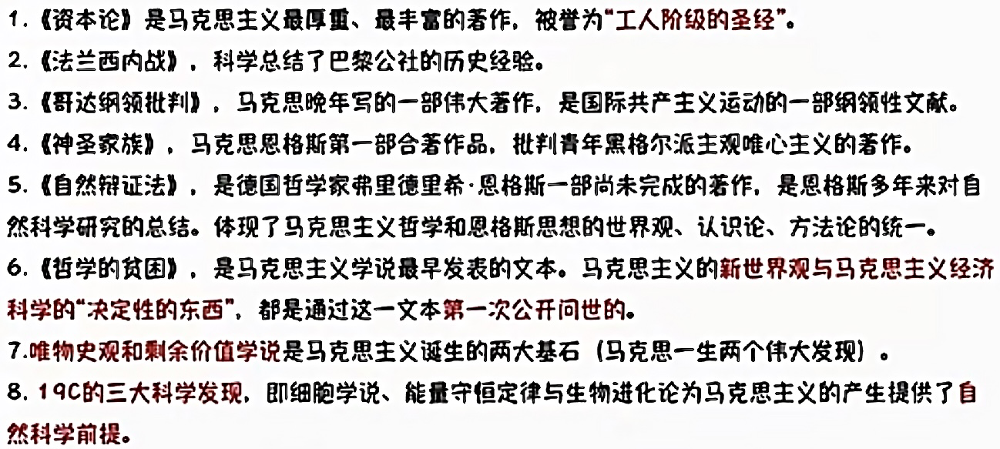
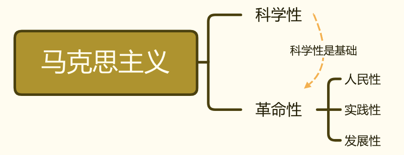

# 马克思主义是关于无产阶级和人类解放的科学

2022.07.12

[toc]

1. 马克思主义的创立和发展

   1. 三个基本**组成部分**：<u>马克思主义哲学、马克思主义政治经济学、科学社会主义</u>

   2. 三个**思想来源**：<u>德国古典哲学、英国古典政治经济学和法国、英国的空想社会主义</u>

   3. 马克思主义的**内涵**

      1. 马克思主义的基本**立场**：<u>无产阶级和人民大众的立场上</u>
      2. 马克思主义的基本**观点**：<u>一般规律的科学认识</u>
      3. 马克思主义的基本**方法**：<u>辩证唯物主义和历史唯物主义</u>

   4. 马克思主义的**创立**

      1. 【<u>资为社提基础</u>】资本主义经济的发展为马克思主义的产生提供了经济、社会历史条件。资本主义固有矛盾的发展，预示着未来社会革命的性质和历史发展的方向，这为马克思主义的产生提供了经济、社会的条件和基础。
      2. 【<u>需要理论指导</u>】无产阶级在反抗资产阶级剥削和压迫的斗争中，逐步走向自觉，并迫切渴望科学的理论指导。
      3. 【<u>革命实践后的理论创新</u>】马克思恩格斯的革命实践和对人类文明成果的继承与创新。（马克思主义是在xxx的基础上来的）

   5. 一些**工人运动**

      法、英、德的三大工人运动标志着现代无产阶级作为独立的政治力量登上了历史舞台。

      1. 1831年和1834年<u>法国里昂工人</u>先后举行了两次起义
      2. 1838年英国爆发了延续十余年的全国性的工人运动一一<u>宪章运动</u>
      3. 1844年<u>德国西里西亚纺织工人</u>举行起义。

   6. **著作**

      

      1. 1844年2月发表在**《德法年鉴》**上的论文表明，他们<u>完成了从唯心主义向唯物主义、从革命民主主义向共产主义的转变,为创立马克思主义奠定了思想前提。</u>
      2. 1844年底，马克思和恩格斯在巴黎会面后，在布鲁塞尔合写了**《德意志意识形态》**。首次系统阐述了<u>历史唯物主义</u>的基本观点，实现了<u>历史观</u>上的伟大变革。
      3. 1848年，受国际工人组织“正义者同盟”的邀请，将其改组为“共 产主义者同盟”,并为其起草了世界上第一个无产阶级政党的党纲一一**《共产党宣言》**。1848年2月《共产党宣言》的发表，标志着<u>马克思主义的公开问世</u>。
      4. 1848年欧洲革命爆发后,马克思开始逐渐全面深入研究政治经济学，撰写了**《资本论》**并出版了第一卷，<u>系统阐述了剩余价值学说</u>，揭示了资本主义生产关系的秘密。唯物史观和剩余价值学说是马克思一生的两个伟大发现。
      5. 1871年3月，巴黎工人起义并成立巴黎公社,马克思代表第一国际写出了著名的**《法兰西内战》**,高度赞扬了巴<u>黎工人的伟大创举,科学总结了巴黎公社的历史经验</u>。与后几年撰写的**《哥达纲领批判》**一起,进一步丰富了科学社会主义学说。
      6. 1876—1878年,恩格斯写出了**《反杜林论》**，全面<u>阐述了马克思主义理论体系</u>

2. 马克思主义的**鲜明特征**

   1. **科学性**：<u>马克思主义是对自然、社会和人类思维发展本质和规律的**正确反映**</u>。马克思主义具有科学的世界观和方法论基础，即辩证唯物主义和历史唯物主义，这是马克思主义的一个突出特征和理论优势，也是马克思主义科学性的重要体现。 <u>科学性是因为揭示了客观世界的本质</u>。
   2. **人民性**：<u>人民至上是马克思主义的**政治立场**和**鲜明品格**</u>。需要指出的是，马克思主义的人民性是以阶级性为深刻基础的，是无产阶级先进性的体现。 
   3. **实践性**：<u>实践观点是马克思主义**首要的和基本的观点**</u>。马克思主义具有突出的实践精神，它始终强调理论与实践的统一,始终坚持与社会主义实际运动紧密结合。 
   4. **发展性**：<u>马克思主义是不断发展的学说，具有**与时俱进**的理论品质</u>。马克思主义理论体系是开放的，不断吸收人类最新的文明成果来充实和发展自己。 

   马克思主义的鲜明特征,如果用一句话来概括，就是科学性与革命性的统一。

   其人民性、实践性和发展性集中地体现为革命性。

   革命性是马克思主义的内在品质,是马克思主义的人民性、实践性和发展性的应有之义和必然要求。

   同时要牢记,马克思主义的革命性是建立在科学性的基础上的。

   

    (2022年单选第1题)中国共产党坚持马克思主义基本原理，坚持实事求是，从中国实际出发，洞察时代大势，把握历史主动，进行艰辛探索，不断推进马克思主义中国化时代化,指导中国人民不断推进伟大社会革命。习近平总书记指出:“中国共产党为什么能，中国特色社会主义为什么好，归根到底是因为马克思主义行!”马克思主义之所以“行”,根本原因在于（）

   A. 马克思主义具有鲜明的政治立场
   B. 马克思主义具有自觉的历史担当
   C. 马克思主义是科学的世界观和方法论
   D. 马克思主义是无产阶级政党自我革命的武器 答案:C

> 小结：
>
> <button onclick='change(0)'>隐藏答案</button><button onclick='change(1)'>显示答案</button>
>
> 1. <u>马克思主义的组成部分？（3个）</u>
>
>    
马克思主义哲学、马克思主义政治经济学、科学社会主义

>
> 2. <u>马克思主义的思想来源？（3个）</u>
>
>    
德国古典哲学、英国古典政治经济学和法国、英国的空想社会主义

>
> 3. <u>马克思主义的内涵</u>
>
>    1. <u>马克思主义的基本立场</u>？
无产阶级和人民大众的立场上

>    2. <u>马克思主义的基本观点</u>？
一般规律的科学认识

>    3. <u>马克思主义的基本方法</u>？
辩证唯物主义和历史唯物主义

>
> 4. <u>马克思主义的创立（三句话）</u>
>
>    
资为社提基础;需要理论指导;革命实践后的理论创新

>
> 5. <u>三次工人运动？</u>
>
>    
法国里昂工人;宪章运动;德国西里西亚纺织工人

>
> 6. <u>马克思主义的鲜明特征？（5个）</u>
>
>    
科学性，人民性，实践性，发展性 
>    人民性+实践性+发展性 = 革命性
>    

>
> <button onclick='change(0)'>隐藏答案</button><button onclick='change(1)'>显示答案</button>
>
> 1. 马克思主义最厚量、 最丰富的看作，被登为“工人阶级的圣经”；<u>系统阐述了剩余价值学说</u>，揭示了资本主义生产关系的秘密。唯物史观和剩余价值学说是马克思一生的两个伟大发现
>
>    
《资本论》

>
> 2. 科学总结了巴黎公社的历史经验。
>
>    
《法兰西内战》

>
> 3. 马克思晚年写的一部伟大著作，是国际共产主义运动的一部纲领性文献。
>
>    
《哥达纲领批判》

>
> 4. 马克思思格斯第一部合若作品。批判青年黑格尔派主观唯心主义的著作。
>
>    
《神圣家族》

>
> 5. 德国哲学家书里德里希•恩格斯一部尚未完成的若作，是恩格斯多年来对自然科学研究的总结。体现了马克思主义哲学和恩格斯思想的世界观、认识论、方法论的统一
>
>    
《自然辨证法》

>
> 6. 马克思主义学说最早发表的文本。马克思主义的新世界观与马克思主义经济科学的“决定性的东西”。都是通过这一文本第一次公开问世的。
>
>    
《哲学的贫困》

>
> 7. 1844年2月发表在【】上的论文表明，他们<u>完成了从唯心主义向唯物主义、从革命民主主义向共产主义的转变,为创立马克思主义奠定了思想前提。</u>
>
>    
《德法年鉴》

>
> 8. 1844年底，马克思和恩格斯在巴黎会面后，在布鲁塞尔合写了。首次系统阐述了<u>历史唯物主义</u>的基本观点，实现了<u>历史观</u>上的伟大变革。
>
>    
《德意志意识形态》

>
> 9. 1848年，受国际工人组织“正义者同盟”的邀请，将其改组为“共 产主义者同盟”,并为其起草了世界上第一个无产阶级政党的党纲。1848年2月【】的发表，标志着<u>马克思主义的公开问世</u>。
>
>    
《共产党宣言》

>
> 10. 1876—1878年,恩格斯写出了，全面<u>阐述了马克思主义理论体系</u>
>
>     
《反杜林论》

>
> 

