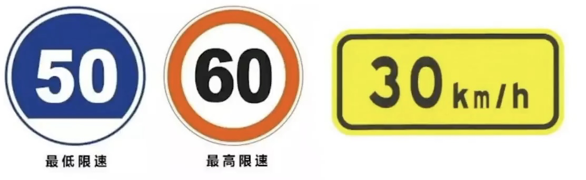
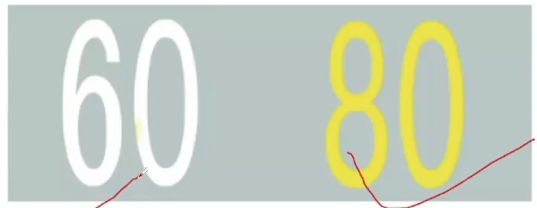
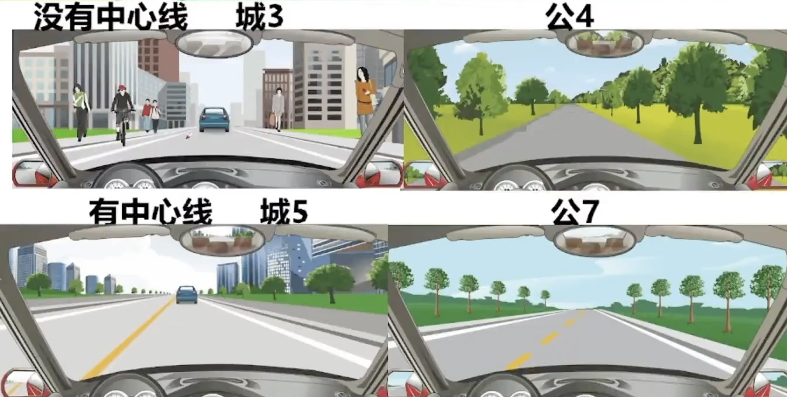
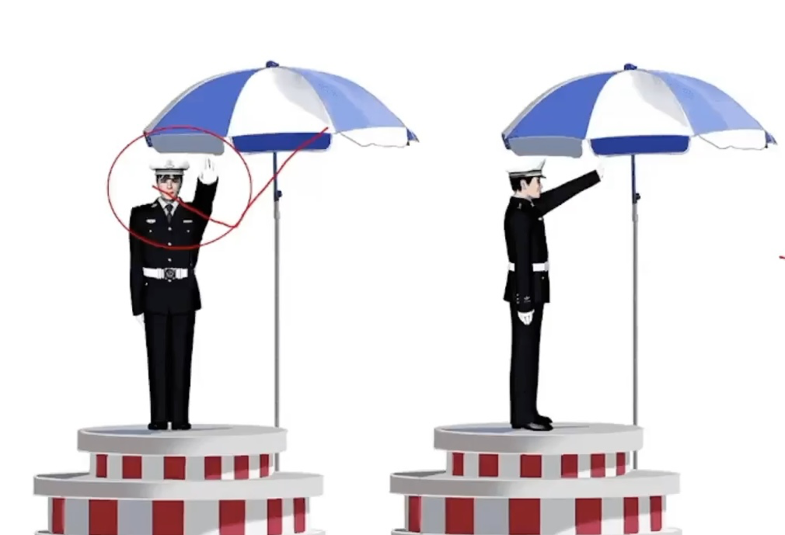
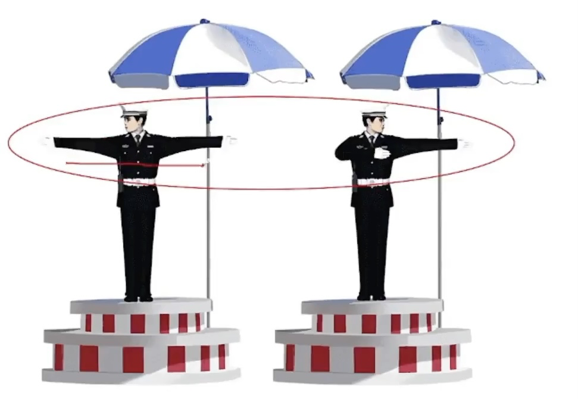
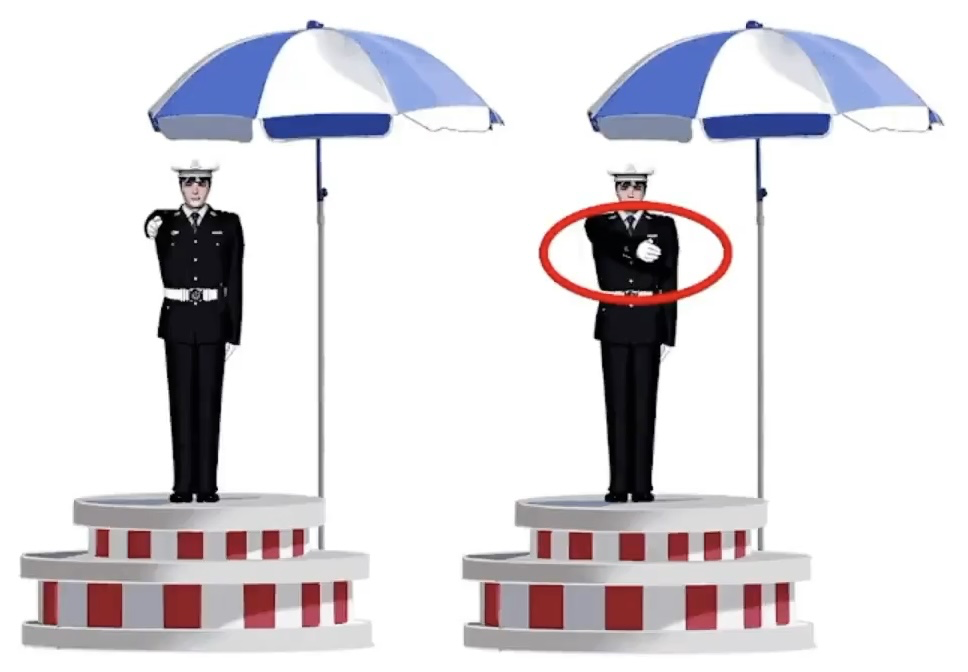
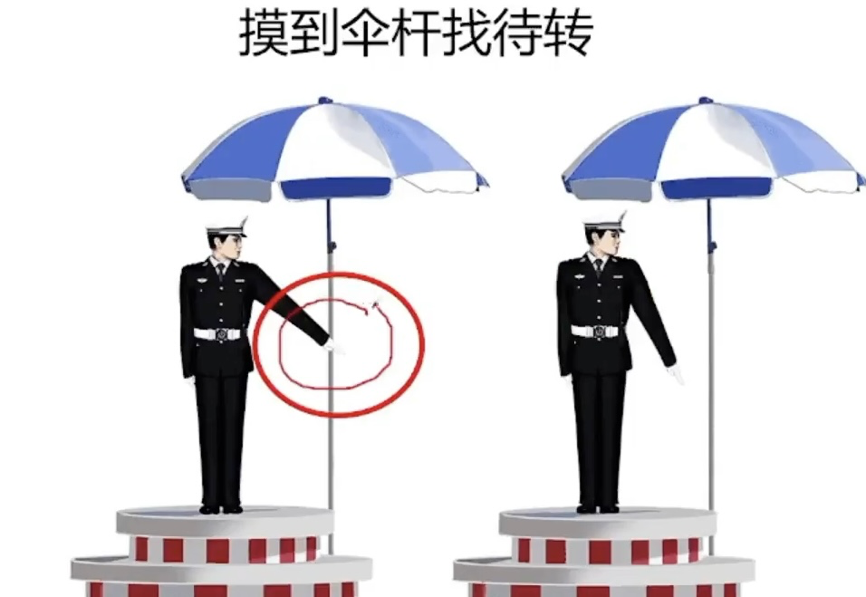
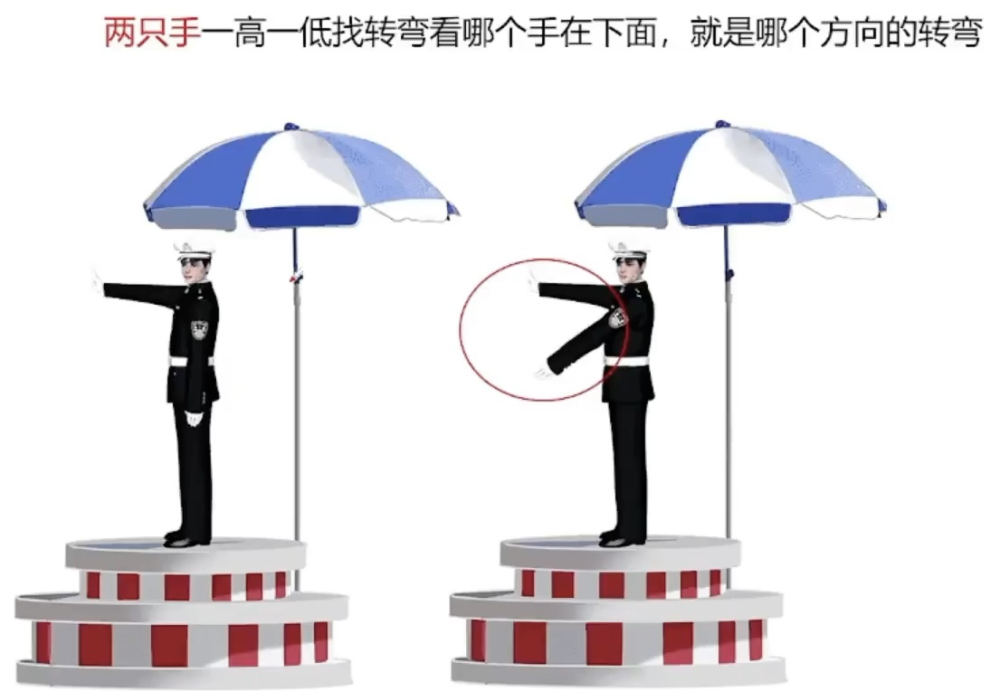
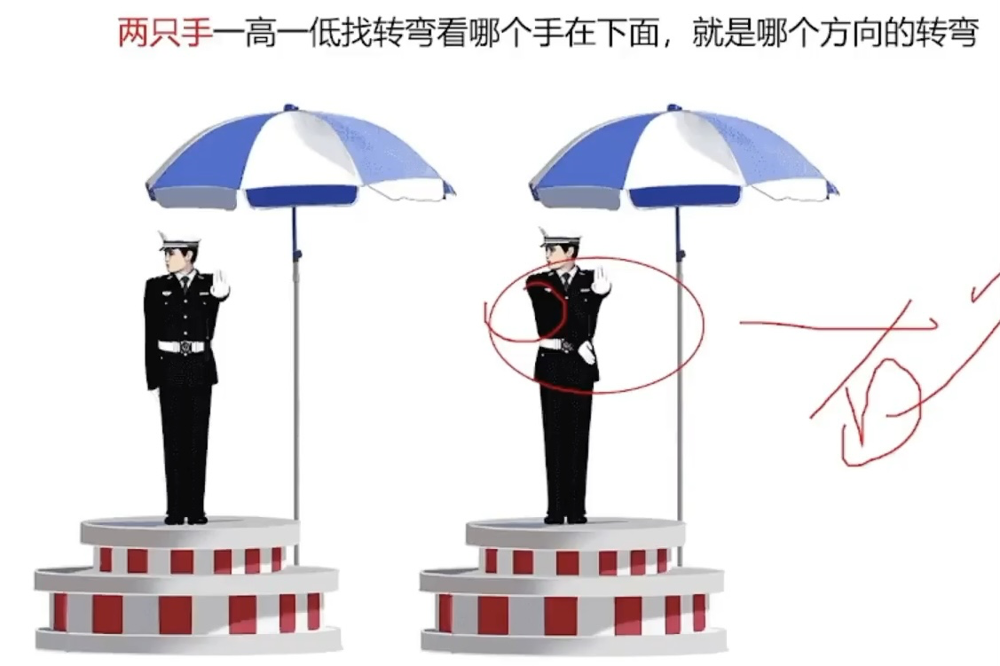
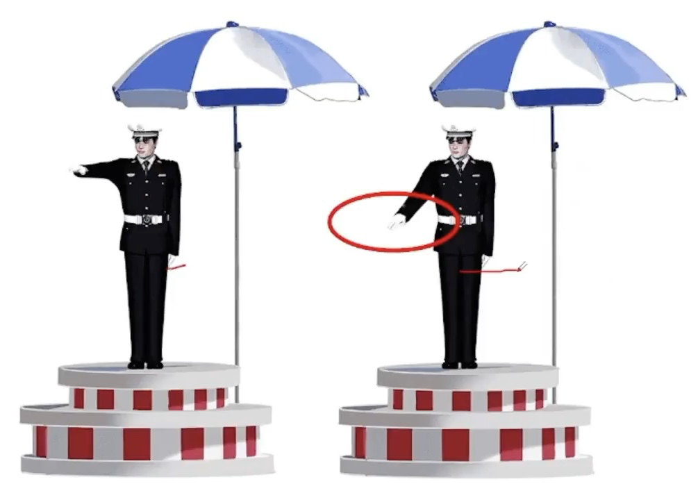

# 科目一总结

2022.01.07

[toc]

## 驾驶证与考试

* 驾驶证
  * C1允许驾驶C1，2，3，4，年龄**18 ~ +∞**
  * <u>C6轻型牵引挂车</u>，年龄**20~60**周岁
  * 增驾C6需要小型汽车、小型自动挡汽车驾驶证一年以上
  * 驾驶证有效期：**6-10-长期**
  * 驾驶证周期：**12个月**
  * 驾驶证实习期：**12个月**（看到实习就选12）
  * 驾驶证满分：**12分**
  * 有效期**三年**：<u>准考证3年/实习期上高速三年以上老司机/因xx原因不能审验3年</u>
  * 驾驶人在驾驶证有效期**满90天申请换证**
  * 驾驶人实习期不能上高速，但是增加准驾车型后的实习期可以驾驶原准驾车上高速
  * <u>小型汽车驾驶人发生交通事故造成死亡，未被吊销驾驶证</u>，记分结束后，**30日**内接受审验
  * 同一机动车所有人名下两辆车车牌交换：申请前两车<u>无未处理的交通安全违法</u>和交通违法记录
  * **“车登记，证随意”**（只有驾驶证，其余其他的都是车的，比如号牌等）
  * 驾驶证遗失、损毁需要补领！补领！——核发地，居住地，所在地，户籍地等。
  * 颜色、车架、发动机变，要登记！<u>加防撞，不用登记！</u>
  * 驾驶证没带、丢失、损毁、过期、延期审监、被吊销、被扣押不能驾驶机动车（没证不能开）
  * 驾驶证被依法扣押扣留都不能再申请补发
  * 不得申请驾驶证时间：**假1骗3毒3醉5畏罪终生**
    * 舞弊，作弊=假
    * 不正当=骗
    * 饮酒后或醉酒驾驶机动车发生重大事故构成犯罪的，多少年内不能申请驾驶证？终身！
* 体检
  * 70周岁，<u>记忆力、判断力、反应力测试</u>，**年年体检**
  * 大中客货牵引，**年年体检**，体检放宽到乡镇社区服务医院体检机构。（只要提到“两年”都是错的！）
  * <u>非营运小客车、摩托车</u>只需在登记之日起<u>第六年、第十年</u>到检验机构上线检验，在<u>十年内每两年</u>向公安机关申领一次检验合格标志。
* 考试
  * 科目二+科目三最多考5次。（**2+3=5**）
  * 出现科目二科目三字眼，题目中没有分数的判断题是正确的，有分数的是错误的
  * 如果参加不了考试，提前一次取消，否则算考试不合格
  * 行为前面 找违法： <u>违法行为</u>
  * 责任前面 找刑事 或 全部：<u>刑事责任，全部责任</u>

## 满分教育与学法减分

* 满分教育日期问题（满12分重新参加科目一）

  |          | 现场  | 网络  | 自主   | 总计   |
  | -------- | ----- | ----- | ------ | ------ |
  | **小车** | **2** | **3** | **2**  | **7**  |
  | **大车** | **5** | **5** | **20** | **30** |

  * 每增加12分，小车追加**7（最多60）**，大车追加**30（最多120）**，但网络和现场不变。

  * 满**24～36**分，参加**科目一、科目三考试**（科目一是“法律”，科目二是“场地”，科目三是“道路”，妙计：“地道！”）
  * 满**36**分，参加**科目一二三考试**

* 学法减分

  * **实习期**内**不能**学法减分
  * 有**两次以上**参加**满分**教育记录的，**不能**参加学法减分
  * 酒驾被处罚的3个计分周期内，**不能**参加学法减分
  * 每个周期**最多减6分**

  |                    | 学习时间 | 需要考试 | 扣减分数 | 技巧        |
  | ------------------ | -------- | -------- | -------- | ----------- |
  | 网络学习（三天内） | 30分钟   | 是       | 1        | 网络找30和1 |
  | 现场学习           | 1小时    | 是       | 2        | 现场找1和2  |
  | 公益活动           | 1小时    | 否       | 1        | 公益找1和1  |

## 拘留扣留、判刑、事务处理、救援

* 两证：驾驶证、行驶证

* 两标：保险标志、检验合格标志

* 一牌：车牌

* **扣留**技巧判断题：只有两种情况错（**扣留行驶证**❌，**没带身份证**❌），剩下都对

* **拘留**技巧判断题：跟钱在一起的居留就是对的，没有钱的居留就是错的

* **判刑**：（**拘役、刑、且、组织、因**）

  * 出现重大事故致人重伤、死亡，3年以下或者拘役
  * 出现重大事故致人重伤、死亡且逃逸，3年以上7年以下（申请人在机动车驾驶人考试过程中组织作弊的，情节严重构成犯罪)
  * 出现重大事故**因逃逸**致人死亡的，7年以上

  > 技巧：
  >
  > * 有**拘役**优先选拘役，有拘役就对，遇到有期**徒刑**结尾的判错
  > * 且/（组织作弊）找3-7，因找7以上
  > * 组织作弊也找3-7（新政增加）

* 事故处理

  * 有争议、有人员伤亡、有喝酒司机、有违法行为都是立刻报警（判断，有报警✅）
  * 无争议、无人员伤亡（轻微 刮擦等）撤离现场自行协商，不要影响交通，不要死等警察或保险公司，警察来了责令撤离并罚两百

* 救援

  * 骨折伤员不要碰，或者找固定，要用硬担架
  * 关键字答题判断：避免二次XX 二次选✅，疏散报警有报警（协助帮忙报警）✅
  * 有害气体找 捂住口鼻 或 新鲜空气 就v抢救一定先看呼吸、 心肺复苏100-120 判断题中四个血字就是✅的 救人烫伤要喷水有关节，不要随便的判断题都✅
  * 立即拉拽 ❌ 仰卧位就❌ 急救错误就找原地等待❌
  * 先救命，后治伤
  * 失血流血就一定先止血，止血找**近心**，用绳子就是❌ 袜子✅ 要给他保暖哦~~冷

## 英文字母题

* 车道偏离预警系统：**LDW**（离L）
* 车辆自适应巡航系统：**ACC**

## 安全常识

1. 部分一
   1. ABS车轮防抱死，**ABS找紧急制动**都有的字眼判断题是正确的。
   2. 安全带：安全带在紧急情况下，可以迅速拉紧把人束缚在座椅上，保证安全。可以减轻对驾乘人员的伤害 (**安全带找滅轻**）
   3. 安全头枕是保护颈部的。但是需要放在支撑头部的位置 才可以发挥作用保护到颈部。（**安全头枕保护<u>颈</u>部，放在<u>头</u>后**)
   4. 安全气囊，辅助可充气约束系统。(技巧：看到辅助就选择）
   5. 安全带的作用是70%，气囊的作用是30%。双重保护作用就是与安全带一起。
2. 部分二
   1. 在<u>车门、车厢没有关</u>好时行车；
   2. 在<u>禁止鸣喇叭的区域或者路段鸣喇叭</u>
   3. 拔打<u>接听手持电话、观看电视</u>等妨碍安全驾驶的行为；
   4. <u>熄火/空挡/惯性滑行</u>；【只要滑行就错】
   5. 向道路上抛撒物品;
   6. 安全带无论前后排无论大人儿童都要系;
   7. 在机动车驾驶室的前后窗范围内悬挂、放置妨碍驾驶人视线的物品；
   8. 连续驾驶机动车超过**4小时未停车休息或者停车休息时间少于20min**（420法则）
   9. 冬季给电动汽车充电前，应提前预热电池
   10. 驾驶电动汽车出行前，应检查剩余电量
   11. 提前/检查都是对的，电动车这款有普通灭火器就错

## 通行规则

* 通行技巧
  * 只要有加速XX都是❌，因为都是为了安全，减速慢行才是王道
  * 通行的时候，只要让人家就对了，吃亏是福，反正各种礼让各种让
  * 减速慢行、减速靠右、减速或停车、停车避让就直接选✅
  * 只要提到不用减速慢行，无需减速，不必减速都是❌
  * **不得** 两个字在判断题中绝大多数都是正确的✅
  * **减少并行时间**，就是对的✅，因为并行很危险
  * <u>主动、依次、顺序、有序、礼让、注意避让 确认安全，安全距离减少并行，</u>都是正确的✅
  * <u>持续/连续/长按喇叭</u>都是错的，<u>催促，逼迫，迫使，抢持原速</u>的意思都是错误的❌
* 顺序通行三大原则
  * 转弯让直行
  * 右转弯让左转弯
  * 同样直行让右侧先行
* 不得超车情况有【**超车只能从左侧**】
  * 前车正在左转弯、掉头、超车的；与对面来车有会车可能的；
  * 前车为执行紧急任务的警车、消防车、救护车、工程救险车的；
  * 特殊道路 (行经铁路道口、交叉路口、窄桥、弯道、陡坡、人行横道、市区交通流量大的路段等没有超车条件的。而且倒车停车）
  * 看线！！！只要提到虚线才可以越线 掉头 超车等，实线坚决不可以过线不可以压线！
* **铁路道口/漫水路/漫水桥**三原则：（**1停2看3通过**）
  1. 停下来，
  2. 看观察确认安全，
  3. 低速通过进入铁路道口后 不能变换档位（因为你已经低挡
* 出现故障有四步：
  1. 开启危险报警闪光灯，
  2. 移到不妨碍交通的地方，如果无法移动就继续第三步，
  3. 放置警告标志 （普通道路50-100米之间，高速150米以外）
* 人得下车去安全的地带(右侧路肩）报警等待救援
* 超车只能从左侧超车（看到题目或图片说从右侧两侧超车直接错）,超车时，如果无法保证与被超车辆的安全间距，应**主动放弃超车，停止超车**（遇到这两组词优先选，判断为正确）。
* 道路没有划分机动车道、非机动车道和人行道的，在道路中间通行，给行人非机动车在两侧留有充足的空间
* 只要变道（汇入河流，变更车道）
  * 变更车道的顺序：
    1、打开转向灯；2、观察确认安全；3、平稳变（直接驶入，迅速转的就错） ，完成后关闭转向灯即可。
  * 关于停车距离考点：（**口5站3**)
    (交叉路口、铁路道口、急弯路、窄路、桥梁、陡坡、隧道51米以内的路段，不得停车；公共汽车站、急救站、加油站、漷或者消防队(站)门前以及距离上述地点30米以内）
  * 技巧：只要没提站就找50 有站就找30
* 驾驶机动车遇有前方交叉路口交通阻塞，或者看到图中堵车，我们只能依次排队在路口外，坚决不能进入路口。（**有依次、有顺序直接选，没有选路口外**）
* 狭窄山路会车，靠山体的一方要让不靠山体的一方先行、环岛外的车让环岛内的车先行、有障碍的一方让无障碍的一方先行、辅路车让主路车先行。（**主路车流大速度快**）
* 看到随意通行随意二字的或者看到说不用减速的题目都直接判断错误就可以 （**只有行人具有随意性的特点是正确的**）
* 校车
  * 两条车道，前方有校车停下来等待
  * 三条车道，提前变道最左侧超越
* 后方有执行任务的紧急车辆时，可以借用无人通行的非机动车道让行

## 速度相关考点

* 关于速度不得超过每小时30公里的：

  机动车行驶中在冰雪、泥泞的道路上行驶时；
  遇到进出 机动车道，通过铁路道口、急弯路、窄路、窄桥时;
  遇到掉头、转弯、下陡坡时；
  遇到雲、兩、雪、沙尘、冰雹，能见度在50米以内时；

  记不住是不是？科目一里(只要不是普通道路，**特殊道路都是30公里/小时**）

  【技巧：关于判断题中出现XX公里/小时，公里前面数字不是30或者100 就是错的】

* 高速公路能见度、速度、距离的知识点总结口诀：
  > 2 6 1
  > 1 4 5
  > 5 2 离

  1. 驾驶机动车在高速公路上行驶，遇低能见度气象条件时，能见度在200米以下，车速不得超过每小时60公里，与同车道前车至少保持100米以上的距离。
  2. 驾驶机动车在高速公路上行驶，遇低能见度气象条件时，能见度在100米以下，车速不得超过每小时40公里，与同车道前少保持50米以上的距离。
  3. 驾驶机动车在高速公路上行驶，遇低能见度气象条件时，能见度在50米以下，车速不得超过每小时20公里，尽快驶窝高道

* 关于高速速度 **红高蓝低黄建议**
  红色最高速度不能超过；
  蓝色最低速度不能低于；
  黄色为建议速度；

  

* 关于路面速度：**黄高白低**
  黄色最高速度不能超过；白色最低速度不能低于；

  

* 关于安全距离：
  速度高于100，找距离100米以上
  低于100，找距离50米以上

* 三条车道：110-120，90-110，60-90

* 两条车道：100-120，60-100

* 城市/公路

  

## 特殊天气

1. 特殊天气的灯光，只有雾天雾灯，没有特殊的灯光。
2. 关键字答题：雨天找滑字；冰雪找制动问题，制动变长，雪天找车辙；
   泥泞找车轮；雾天夜晚都找能见度问题，并且回应喇叭
   正确；水淹路面找观察路面问题；车辆涉水找间断车
   没有间断轻踏就找轻踏

3. 看到题目中有困难/无法两个字找停车
4. 特殊情况和特殊天气都应该发动机制动减速，看到紧急制动减速错误
5. 有车辙就✅ 特殊路面，选择坚实的路面行驶缓慢通过✅ 大安全距离✅

## 交警手势

1. 停止等待

   

2. 直行

   

3. 回弯变道信号

   

4. 左转弯待转

   

5. 左转弯

   

6. 右转弯

   

7. 慢速

   

8. 1. 看到手心找停止通行
   2. 两手伸直找直行
   3. 捂住胸口/（回弯）找变道
   4. 摸到伞杆找待转
   5. 一只手一高一低找减速
   6. 两只手一高一低找转弯看哪个手在下面，就是哪个方向的转弯

## 灯光

* 近光灯：有车，有人，都需要，照明条件良好 隧道
* 远光灯：照明条件不好，可以开。(技巧：判断题目开远光灯，使用远光灯都是错误)
* 交替使用远近光灯：1、超车（用于提醒前车）2、夜间特殊道路(举例 交叉路口，急转弯，人行横道等）3、用来提醒开远光灯的人
* 雾灯：只有雾天开雾灯，其他天气开都是错误的
* 危险报警闪光灯：1、临时停车2、故障 3、雾天 4、 牵引故障车
* 左转向灯：只要有像左的动作，就得开。(左转弯，掉头，超车，向左变道，进高速口）
* 右转向灯：只要有像右的动作，就得开。（右转弯，向右变道，靠边停车，出环岛，出高速口）高速右进右出，但是环岛不一样，只有出需要开右
* 只要图中或者题目中遇到有人的时候，有车的时候，需要将<u>远近光灯转换近光灯</u>！
* <u>跟车 尾随车，会车（图中无论下雪下雨 前面有车） 禁止使用远光灯</u>，避免灯光照射至前车后视镜造成前车驾驶人眩目。
* 这种字眼 都不能用远光灯！只能用近光灯！
* 夜间会车遇到对向来车需要在150米以外的距离就要变成近灯。
* 机动车在夜间通过急转弯、坡路、拱桥、人行横道或者没有交通信号灯控制的路口时(特殊道路)应当交替使用远近光灯。(<u>总结：夜间，非正常道路，交替使用远近；</u>）
* 技巧判断题：远近V远、近x【远光灯非常刺眼，使人炫目，容易发生危险】

关于灯光考点技巧总结：
1、远近 判断题中比喻夫妻，远近在一起就对，远、近分开这种就是错误
2、只要题目中说开/使用远光灯就是错误的
3、只要有人、有车、跟车、会车 必须使用近光灯
4、临时停车找危险
5、答案中交替远近光灯就选交替，没有交替 选近光灯
6、夜间 特殊路（只要不提正常路） 交替变化远近光灯
7、隧道就找开灯 近光灯也行
夜间视距找变短 远光变近光找150米以外

## 标志信号

### 路面标志

## 仪表指示灯

