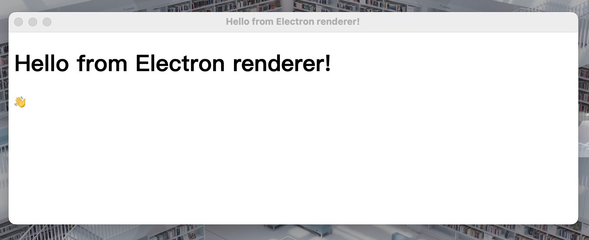
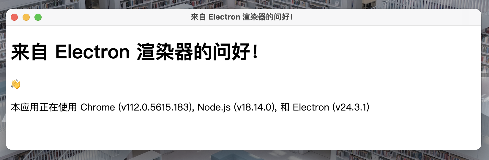
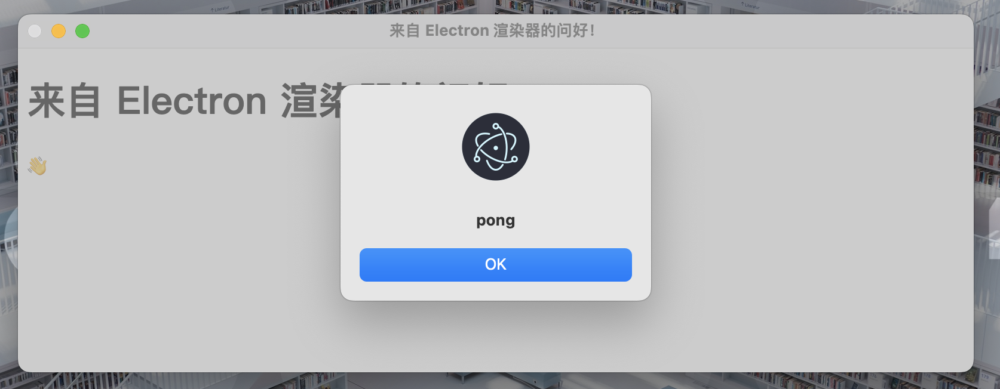

# Hello World

[toc]

## 环境要求

1. Node.js
2. npm

## 初始化 npm 项目

1. ```bash
   mkdir my-electron-app && cd my-electron-app
   npm init
   ```

   注意入口文件需要是 main.js

2. ```bash
   npm install electron --save-dev
   ```

3. 添加 .gitignore 文件

   建议您复制一份 [GitHub 的 Node.js gitignore 模板](https://github.com/github/gitignore/blob/main/Node.gitignore) 到您项目的根目录，以避免将 `node_modules` 文件夹提交到版本控制系统中。

4. 在主目录添加文件

   ```js
   // main.js
   console.log(`欢迎来到 Electron 👋`)
   ```

5. 在`package.json`的`script`添加`"start": "electron .",`

   ```json
   "scripts": {
       "start": "electron .",
       "test": "echo \"Error: no test specified\" && exit 1"
   },
   ```

6. bash运行`npm run start`

7. 运行结果

   ```bash
   (base) kimshan@MacBook-Pro IIA4 % npm start                      
   
   > iia4@1.0.0 start
   > electron .
   
   欢迎来到 Electron 👋
   ```

## 装载网页

1. 创建index.html

   ```html
   <!DOCTYPE html>
   <html>
     <head>
       <meta charset="UTF-8" />
       <!-- https://developer.mozilla.org/en-US/docs/Web/HTTP/CSP -->
       <meta
         http-equiv="Content-Security-Policy"
         content="default-src 'self'; script-src 'self'"
       />
       <meta
         http-equiv="X-Content-Security-Policy"
         content="default-src 'self'; script-src 'self'"
       />
       <title>Hello from Electron renderer!</title>
     </head>
     <body>
       <h1>Hello from Electron renderer!</h1>
       <p>👋</p>
     </body>
   </html>
   ```

2. 修改main.js

   ```js
   const { app, BrowserWindow } = require('electron')
   
   const createWindow = () => {
     const win = new BrowserWindow({
       width: 800,
       height: 300,
     })
   
     win.loadFile('index.html')
   }
   
   app.whenReady().then(() => {
     createWindow()
   })
   ```

3. 运行`npm start`，运行结果

   

## 使用预加载脚本

1. 创建`preload.js`

   ```js
   const { contextBridge } = require('electron')
   
   contextBridge.exposeInMainWorld('versions', {
     node: () => process.versions.node,
     chrome: () => process.versions.chrome,
     electron: () => process.versions.electron,
     // 能暴露的不仅仅是函数，我们还可以暴露变量
   })
   ```

2. `main.js`中添加`const path = require('path')`与`webPreferences: {preload: path.join(__dirname, 'preload.js'),}`

   ```js
   // main.js
   const { app, BrowserWindow } = require('electron')
   const path = require('path')
   
   const createWindow = () => {
     const win = new BrowserWindow({
       width: 800,
       height: 600,
       webPreferences: {
         preload: path.join(__dirname, 'preload.js'),
       },
     })
   
     win.loadFile('index.html')
   }
   
   app.whenReady().then(() => {
     createWindow()
   })
   ```

3. 修改index.html

   ```html
   <!DOCTYPE html>
   <html>
     <head>
       <meta charset="UTF-8" />
       <meta
         http-equiv="Content-Security-Policy"
         content="default-src 'self'; script-src 'self'"
       />
       <meta
         http-equiv="X-Content-Security-Policy"
         content="default-src 'self'; script-src 'self'"
       />
       <title>来自 Electron 渲染器的问好！</title>
     </head>
     <body>
       <h1>来自 Electron 渲染器的问好！</h1>
       <p>👋</p>
       <p id="info"></p>
     </body>
     <script src="./renderer.js"></script>
   </html>
   ```

4. 创建`renderer.js`

   ```js
   const { contextBridge } = require('electron')
   
   contextBridge.exposeInMainWorld('versions', {
     node: () => process.versions.node,
     chrome: () => process.versions.chrome,
     electron: () => process.versions.electron,
     // 能暴露的不仅仅是函数，我们还可以暴露变量
   })
   ```

5. 运行`npm start`，运行结果

   

## 在进程之间通信

1. 修改preload.js

   ```js
   const { contextBridge, ipcRenderer } = require('electron')
   
   contextBridge.exposeInMainWorld('versions', {
     node: () => process.versions.node,
     chrome: () => process.versions.chrome,
     electron: () => process.versions.electron,
     // 能暴露的不仅仅是函数，我们还可以暴露变量
   })
   
   contextBridge.exposeInMainWorld('connection', {
     ping: () => ipcRenderer.invoke('ping')
   })
   ```

2. 修改renderer.js

   ```js
   const func = async () => {
     const response = await window.connection.ping()
     alert(response) // 弹窗 'pong'
   }
   
   func()
   ```

3. 在main.js中引入ipcmain模块`const { app, BrowserWindow, ipcMain } = require('electron')`，并加入函数`ipcMain.handle('ping', () => 'pong')`

   ```js
   const { app, BrowserWindow, ipcMain } = require('electron')
   const path = require('path')
   
   const createWindow = () => {
     const win = new BrowserWindow({
       width: 800,
       height: 300,
       webPreferences: {
         preload: path.join(__dirname, 'preload.js'),
       },
     })
     ipcMain.handle('ping', () => 'pong')
     win.loadFile('index.html')
   }
   app.whenReady().then(createWindow)
   ```

4. 运行`npm start`，运行结果

   