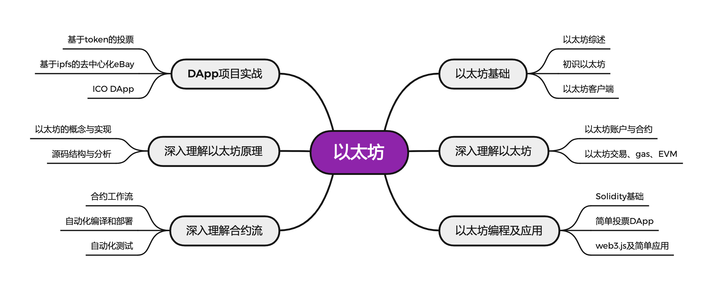

# PKM - 以太坊  
2022.2.17

## 目录

* 以太坊基础
  * [以太坊综述](./notes/以太坊基础/以太坊综述.md)
  * [初识以太坊](./notes/以太坊基础/初识以太坊.md)
  * [以太坊客户端](./notes/以太坊基础/以太坊客户端.md)
* 深入理解以太坊
  * [以太坊账户与合约](./notes/深入理解以太坊/以太坊账户与合约.md)
  * [以太坊交易、gas、EVM](./notes/深入理解以太坊/以太坊交易、gas、EVM.md)
* 以太坊编程及应用
  * [Solidity基础](./notes/以太坊编程及应用/Solidity基础.md)
  * [简单投票DApp](./notes/以太坊编程及应用/简单投票DApp.md)
  * [Web3.js及简单应用](./notes/以太坊编程及应用/Web3.js及简单应用.md)
* 深入理解合约流
  * [合约工作流](./notes/深入理解合约流/合约工作流.md)
  * [自动化编译和部署](./notes/深入理解合约流/自动化编译和部署.md)
  * [自动化测试](./notes/深入理解合约流/自动化测试.md)
* 深入理解以太坊原理
  * [以太坊的概念与实现](./notes/深入理解以太坊原理/以太坊的概念与实现.md)
  * [源码结构与分析](./notes/深入理解以太坊原理/源码结构与分析.md)
* DApp项目实战
  * [基于token的投票](./notes/DApp项目实战/基于token的投票.md)
  * [基于ipfs的去中心化eBay](./notes/DApp项目实战/基于ipfs的去中心化eBay.md)
  * [ICO-DApp](./notes/DApp项目实战/ICO-DApp.md)

## 介绍

区块链按照尚硅谷机构培训课程整理。

掌握以太坊的基本概念和工作原理

理解以太坊与比特币的联系和区别

掌握以太坊客户端的使用

深入理解智能合约

掌握Solidity语法,并能够写出复杂的合约

掌握web3js的调用,并能够实现具体的DApp

综合运用各种工具,完成较复杂的项目

## 资源
链接: https://pan.baidu.com/s/1XOjwGi4rPa5vIll5c_1lMg?pwd=u7gp  
提取码: u7gp  
如果资源失效请联系我  

* 以太坊课程
  * 【Java】
    * [尚硅谷Java入门视频教程](https://www.bilibili.com/video/BV1Kb411W75N)
  * 【Go】
    * [Golang](https://www.bilibili.com/video/BV1ME411Y71o)
    * [GoWeb](https://www.bilibili.com/video/BV1nJ411D7P4)
  * 【以太坊】
    * [以太坊](https://www.bilibili.com/video/BV1NJ411D7rf)，课件在网盘
    * [区块链项目硅谷投票系统](https://www.bilibili.com/video/BV1JJ411D7Ve)
    * [区块链项目硅谷拍卖系统](https://www.bilibili.com/video/BV1EJ411D7SL)

* 以太坊

  * [Ethereum官网](https://ethereum.org/en/)
  * [以太坊英文官方文档](https://ethereum.org/en/developers/docs/)
  * [以太坊官方文档 ( Ethereum Homestead Documentation )](http://www.ethdocs.org/en/latest/index.html) 
  * [《精通以太坊》( Mastering Ethereum ) ](https://github.com/ethereumbook/ethereumbook)
  * [《以太坊白皮书》 ( A Next-Generation Smart Contract and Decentralized Application Platform )](https://github.com/ethereum/wiki/wiki/White-Paper)
  * [《以太坊黄皮书》](https://github.com/wanshan1024/ethereum_yellowpaper)

* 以太坊区块链浏览器

  * https://etherscan.io/
  * [ropsten测试网络查看](https://ropsten.etherscan.io/)
  * [以太坊gas信息](https://ethgasstation.info/)

* 钱包

  * MetaMask - 浏览器插件钱包
  * [安装MetaMask](https://chrome.google.com/webstore/category/extensions)
  * [rinkeby测试网络水龙头](https://faucet.rinkeby.io/)
  * ~~Jaxx - 一款多平台、多币种的钱包，可在各种操作系统上运行，包括Android，iOS，Windows，Mac和Linux。~~
  * ~~MyEtherWallet(MEW) - 一个基于web的钱包，可以在任何浏览器中运行。~~
  * ~~EmeraldWallet - 旨在与ETC配合使用，但与其他基于以太坊的区块链兼容。~~

* 客户端

  * [go-ethereum ( Go )](https://github.com/ethereum/go-ethereum) - 官方推荐，开发使用最多
    * [Geth官方文档](https://geth.ethereum.org/docs/)
  * Ganache – 以太坊客户端(测试环境私链) 
  * ~~[parity ( Rust )](https://github.com/ethcore/parity/releases) - 最轻便客户端，在历次以太坊网络攻击中表现卓越~~
  * ~~[cpp-ethereum(C++)](https://github.com/ethereum/cpp-ethereum)~~
  * ~~[pyethapp (python)](https://github.com/heikoheiko/pyethapp)~~
  * ~~[ethereumjs-lib(javascript)](https://github.com/ethereumjs/ethereumjs-lib)~~
  * ~~[EthereumJ / Harmony ( Java )](https://github.com/ethereum/ethereumj)~~

* 编程语言, 编辑器, 第三方库,开发框架

  * [Solidity官方文档](https://solidity.readthedocs.io/en/latest/)
  * [Remix ](https://remix.ethereum.org/) 基于浏览器的 Solidity 在线编辑器
  * ~~solcjs Solidity 的命令行编译器~~
  * web3js – 以太坊 javascipt API库

  * Truffle – 以太坊开发框架

## 版本
### V1 2022.2.??
按照尚硅谷区块链课程进行整理，完成全部基础框架构建  
