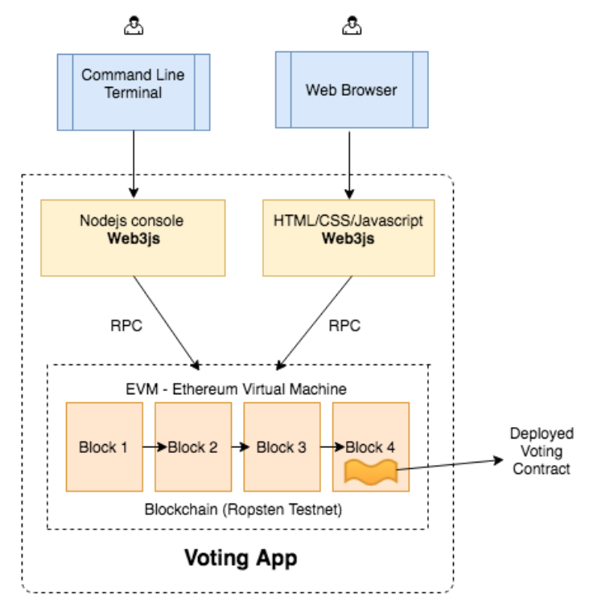

# 基于token的投票

2022.3.11

[toc]

## 前言

在课程 “简单投票 Dapp” 中，你已经在一个模拟的区块链(ganache)上 实现了一个投票合约，并且成功地通过 nodejs 控制台和网页与合约进行了交互。 在接下来的项目学习中，我们将会实现以下内容:

1. 安装叫做 truffle 的以太坊 dapp 框架，它会被用于编译和部署我们的 合约。
2. 在我们之前简单投票 DApp 上做一些小的更新来适配 truffle。
3. 编译合约，并将其部署到自己的测试私链。
4. 通过 truffle 控制台和网页与合约进行交互。
5. 一旦你熟悉 truffle 以后，我们会对合约进行扩展，加入 token 并能够购买 token 的功能。
6. 然后我们会对前端进行扩展，通过网页前端购买 token，并用这些token 为候选者投票。



## 杂项

1. 用 Geth 启动私链

   ```bash
   # Web - Http
   geth --datadir ./mychain/ --networkid 15 --dev --dev.period 0 --password password.txt --http --http.api personal,eth,net,web3 --http.corsdomain '*' console --allow-insecure-unlock 2>output.log
   # Web - WS
   geth --datadir ./mychain/ --networkid 15 --dev --dev.period 0 --password password.txt --ws --ws.api personal,eth,net,web3 --ws.origins '*' console --allow-insecure-unlock 2>output.log
   # Web - Ws and Http
   geth --datadir ./mychain/ --networkid 15 --dev --dev.period 0 --password password.txt --http --http.api personal,eth,net,web3 --http.corsdomain '*'  --ws --ws.api personal,eth,net,web3 --ws.origins '*' console --allow-insecure-unlock 2>output.log
   # 如果我们想到直接连接到测试网络，可以用下面的命令:
   nohup geth --testnet --syncmode fast --rpc --rpcapi db,eth,net,web3,personal --cache=1024 --rpcport 8545 --rpcaddr 127.0.0.1 --rpccorsdomain "*" 2>output.log &
   ```

   ```--testnet```: 这是告诉 geth 启动并连接到最新的测试网络。我们所连接的网络是 Ropsten。

   ```--syncmode fast```: 我们知道，当用 geth 连接主网或测试网络时，它必须在 本地电脑上下载整个区块链。你需要下载完整的区块链并执行每个块里面的每一 笔交易，这样你就在本地电脑上拥有了整个历史。这非常耗费时间。不过，也有 其他模式或者说优化方法，比如你只需要下载交易收据，而不用执行每一笔交易， 这就是“快速”模式。如果我们并不需要整个区块链历史，就可使用这样的 fast 模式同步区块链。

   一旦你按照指示启动 geth，它会启动以太坊节点，连接到其他对端节点并开始下载区块链。下载区块链的时间取决于很多因素，比如你的网速，内存，硬盘类型等等。一台 8GB 内存，SSD 硬盘和 10 M 网速的电脑大概需要 7~8 个小时。如果你用快速模式同步 Ropsten，大概需要 6-7 GB 的硬盘空间。

   用 Rinkeby 替换 Ropsten

   有些同学在 Ropsten 测试网上运行 geth 会遇到问题。如果耗费时间太长 的话，你可以换一个叫做 Rinkeby 的测试网(300 多万个块，下载区块大约 1 个多小时，同步状态大约需要 4~5 个小时，到 Imported new chain segment 即 已完成同步)。下面是启动 geth 并同步 Rinkeby 网络的命令。

   ```bash
   geth --rinkeby --syncmode "fast" --rpc --rpcapi db,eth,net,web3,personal --cache=1024 --rpcport 8545 --rpcaddr 127.0.0.1 --rpccorsdomain "*"
   ```

   Full Sync: 从周围节点获取 block headers, block bodies, 并且从初始区块 开始重演每一笔交易以验证每一个状态

   Fast Sync: 从周围节点获取 block headers, block bodies, 但不会重演交易 (只拿 receipts). 这样就会拿到所有状态的快照(不验证)，从此跟全节点一 样参与到网络中.

   Light Sync: 只拿当前状态(没有历史账本数据). 如果要验证一笔交易，就必 须从另外的全节点处获取历史数据

2. 工作流(Workflow)

   如果你正在构建一个基于以太坊的去中心化应用，你的 workflow 可能是像这样

   Development(开发环境): Ganache 

   Staging/Testing(模拟/测试环境): Ropsten, Rinkeby, Kovan or your own private network 

   Production(生产环境): Mainnet

3. Truffle

   1. 安装```npm install -g truffle```

   2. 然后我们创建一个空目录，在下面创建 truffle 项目

      ```bash
      mkdir simple_voting_by_truffle_dapp
      cd simple_voting_by_truffle_dapp
      npm install -g webpack
      truffle unbox webpack
      ```

      truffle init: 在当前目录初始化一个新的 truffle 空项目(项目文件只有 truffle-config.js 和 truffle.js;contracts 目录中只有 Migrations.sol;migrations 目录中只有 1_initial_migration.js)

      truffle unbox: 直接下载一个 truffle box，即一个预先构建好的 truffle 项目;

      unbox 的过程相对会长一点，完成之后应该看到提示

      这里的 webpack 就是一个基于 webpack 构建流程的官方项目框架(truffle box)，更多 truffle box 参见 https://truffleframework.com/boxes

      webpack: 一个流行的前端资源依赖管理和打包工具。

## Truffle

1. 简介：truffle unbox webpack 一条命令由于要下载众多需要的模块，大概耗时 10 分钟左右，所以我们先来了解一下 Truffle。

   Truffle 是目前最流行的以太坊 DApp 开发框架，(按照官网说法)是一个世界级的开发环境和测试框架，也是所有使用了 EVM 的区块链的资产管理通道，它基于 JavaScript，致力于让以太坊上的开发变得简单。Truffle 有以下功能:

   1. 内置的智能合约编译，链接，部署和二进制文件的管理。 
   2. 合约自动测试，方便快速开发。
   3. 脚本化的、可扩展的部署与发布框架。
   4. 可部署到任意数量公网或私网的网络环境管理功能
   5. 使用 EthPM 和 NPM 提供的包管理，使用 ERC190 标准。
   6. 与合约直接通信的直接交互控制台(写完合约就可以命令行里验证了)。
   7. 可配的构建流程，支持紧密集成。
   8. 在 Truffle 环境里支持执行外部的脚本。

2. Truffle 的客户端

   我们之后写的智能合约必须要部署到链上进行测试，所以 truffle 构建的 DApp 也必须选择一条链来进行部署。我们可以选择部署到一些公共的测试链比 如 Rinkeby 或者 Ropsten 上，缺点是部署和测试时间比较长，而且需要花费一定的时间赚取假代币防止 out of gas。当然，对于 DApp 发布的正规流程，staging (模拟环境)还是应该用测试公链的。

   还有一种方式就是部署到私链上，这在开发阶段是通常的选择。Truffle 官方推荐使用以下两种客户端:

   1. Ganache
   2. truffle develop

   Ganache 我们已经接触过了，之前的简单投票小项目就是用它来做模拟区块链的。这里再介绍一点命名背景。它的前身是大名鼎鼎的 testRPC，网上的很多 truffle 教学的老文章里都是用 testRPC。Ganache 是奶油巧克力的意思，而 Truffle 是松露巧克力，一般是以 Ganache 为核，然后上面撒上可可粉，所以这两个产品的名字还是很贴切的。

   而 truffle develop 是 truffle 内置的客户端，跟命令行版本的 Ganache 基本类似。在 truffle 目录下 bash 输入:```truffle develop```即可开启客户端，和 ganache 一样，它也会给我们自动生成 10 个账户。

   唯一要注意的是在 truffle develop 里执行 truffle 命令的时候需要省略前面的 “truffle”，比如“truffle compile”只需要敲“compile”就可以了

## 创建 Voting 项目

初始化一个 truffle 项目时，它会创建运行一个完整 dapp 所有必要的文件和目录。我们直接下载 webpack 这个 truffle box，它里面的目录也是类似的:

```bash
>ls
README.md contracts node_modules test
webpack.config.js truffle.js app migrations package.json
>ls app/
index.html javascripts stylesheets 
>ls contracts/
ConvertLib.sol MetaCoin.sol Migrations.sol
>ls migrations/
1_initial_migration.js 2_deploy_contracts.js
```

* app/ - 你的应用文件运行的默认目录。这里面包括推荐的 javascript 文件和 css 样式文件目录，但你可以完全决定如何使用这些目录。
* contract/ - Truffle 默认的合约文件存放目录。
* migrations/ - 部署脚本文件的存放目录
* test/ - 用来测试应用和合约的测试文件目录
* truffle.js - Truffle 的配置文件

truffle 也会创建一个你可以快速上手的示例应用(在本课程中我们并不会用到该示例应用)。你可以放心地删除项目下面 contracts 目录的 ConvertLib.sol 和 MetaCoin.sol 文件。

```bash
rm contracts/ConvertLib.sol contracts/MetaCoin.sol
```

此外，在你的项目目录下查找一个叫做 truffle.js 的配置文件。它里面包含了一个用于开发网络的配置。将端口号从 7545 改为 8545，因为我们的私链及 ganache 默认都会在该端口运行。

## Migration

### migration 的概念

理解 migrations(迁移)目录的内容非常重要。这些迁移文件用于将合约部署到区块链上。如果你还记得的话，我们在之前的项目中通过在 node 控制台中调用 VotingContract.new 将投票合约部署到区块链上。以后，我们再也不需要这么做了，truffle 将会部署和跟踪所有的部署。

Migrations(迁移)是 JavaScript 文件，这些文件负责暂存我们的部署任务，并且假定部署需求会随着时间推移而改变。随着项目的发展，我们应该创建新的迁移脚本，来改变链上的合约状态。所有运行过的 migration 历史记录，都会通过特殊的迁移合约记录在链上。

第一个迁移 1_initial_migration.js 向区块链部署了一个叫做 Migrations 的合约，并用于存储你已经部署的最新合约。每次你运行 migration 时，truffle会向区块链查询获取最新已部署好的合约，然后部署尚未部署的任何合约。然后它会更新 Migrations 合约中的 last_completed_migration 字段指向最新部署的合约。你可以简单地把它当成是一个数据库表，里面有一列last_completed_migration ，该列总是保持最新状态。

migration 文件的命名有特殊要求:前缀是一个数字(必需)，用来标记迁移是否运行成功;后缀是一个描述词汇，只是单纯为了提高可读性，方便理解。 

在脚本的开始，我们用 artifacts.require() 方法告诉 truffle 想要进行部署迁移的合约，这跟 node 里的 require 很类似。不过需要注意，最新的官方文档告 诫，应该传入定义的合约名称，而不要给文件名称——因为一个.sol 文件中可能 包含了多个 contract。

migration js 里的 exports 的函数，需要接收一个 deployer 对象作为第一个参数。这个对象在部署发布的过程中，主要是用来提供清晰的语法支持，同时提供一些通用的合约部署职责，比如保存部署的文件以备稍后使用。deployer 对象 是用来暂存(stage)部署任务的主要操作接口。

像所有其它在 Truffle 中的代码一样，Truffle 提供了我们自己代码的合约抽象层(contract abstractions)，并且进行了初始化，以方便你可以便利的与以太坊 的网络交互。这些抽象接口都是部署流程的一部分。

### 更新 migration 文件

将```2_deploy_contracts.js```内容更新为以下信息:

```js
var Voting = artifacts.require("./Voting.sol");
module.exports = function(deployer) {
deployer.deploy(Voting, ['Alice', 'Bob', 'Cary'], {gas:
               290000});
};
```

从上面可以看出，部署者希望第一个参数为合约名，跟在构造函数参数后面。

在我们的例子中，只有一个参数，就是一个候选者数组。第三个参数是一个哈希，我们用来指定部署代码所需的 gas。gas 数量会随着你的合约大小而变化。对于投票合约，290000 就足够了。

### 更新 truffle 配置文件

修改`truffle-config.js`:

```js
networks: {
    // Useful for testing. The `development` name is special - truffle uses it by default
    // if it's defined here and no other network is specified at the command line.
    // You should run a client (like ganache-cli, geth or parity) in a separate terminal
    // tab if you use this network and you must also set the `host`, `port` and `network_id`
    // options below to some value.
    //
    development: { // 改成自己的私链的地址
      host: "127.0.0.1",     // Localhost (default: none)
      port: 8545,            // Standard Ethereum port (default: none)
      network_id: "*",       // Any network (default: none)
    },
    ...
}
```


## 实验记录

2022.4.9

1. geth命令

```bash
geth --datadir ./mychain/ --networkid 15 --dev --dev.period 0 --password password.txt --http --http.api personal,eth,net,web3 --http.corsdomain '*'  --ws --ws.api personal,eth,net,web3 --ws.origins '*' console --allow-insecure-unlock 2>output.log
```

2. 安装环境
   
   1. 全局安装truffle：```npm install -g truffle@5.1.48```
   2. truffle安装成功后输入```truffle --help```可以显示可以输入的命令
   3. 为本项目安装webpack：```npm install webpack```；```npm install webpack-cli ```
   
3. truffle
   
   1. ```truffle unbox webpack```，这步会报错，因为无法访问国外DNS.
   
      我们可以直接去[官网](https://github.com/truffle-box)下载资源:https://github.com/truffle-box/webpack-box
   
   2. 修改`truffle-config.js`：
   
      ```js
      networks: {
          // Useful for testing. The `development` name is special - truffle uses it by default
          // if it's defined here and no other network is specified at the command line.
          // You should run a client (like ganache-cli, geth or parity) in a separate terminal
          // tab if you use this network and you must also set the `host`, `port` and `network_id`
          // options below to some value.
          //
          development: {
            host: "127.0.0.1",     // Localhost (default: none)
            port: 8545,            // Standard Ethereum port (default: none)
            network_id: "*",       // Any network (default: none)
          },
          ...
      }
      ```
   
   3. 可以运行```truffle console```
   
   4. 修改`2_deploy_contracts.js`:
   
      ```js
      //const ConvertLib = artifacts.require("ConvertLib");// 案例
      //const MetaCoin = artifacts.require("MetaCoin"); // 案例
      
      const Voting = artifacts.require("./Voting");
      
      module.exports = function(deployer) {
        //deployer.deploy(ConvertLib);  // 案例
        //deployer.link(ConvertLib, MetaCoin);  // 案例
        //deployer.deploy(MetaCoin);  // 案例
        deployer.deploy(Voting, {gas:290000});
      };
      ```
   
   5. 在contract文件夹中创建`Voting.sol`:
   
      ```solidity
      pragma solidity ^0.5.0;
      contract Voting{
          mapping (string => uint8) public votesReceived;
          string[] public candidateList;
          constructor() public {
              candidateList=["Alice","Bob","Cary"];
      
          }
          function totalVotesFor(string memory candidate) view public returns (uint8) {
              require(validCandidate(candidate));
              return votesReceived[candidate];
          }
          function voteForCandidate(string memory candidate) public {
              require(validCandidate(candidate)); 
              votesReceived[candidate] += 1;
          }
          function validCandidate(string memory candidate) view public returns (bool) {
              for(uint i = 0; i < candidateList.length; i++) {
                  if (compareStr(candidateList[i], candidate)) {
                      return true;
                  }
              }
              return false;
          }
          function compareStr(string memory _str1, string memory _str2) pure public returns(bool) {
              if(bytes(_str1).length == bytes(_str2).length)
                  if(keccak256(abi.encodePacked(_str1)) == keccak256(abi.encodePacked(_str2)))
                      return true;
              return false;
          }
      }
      ```
   
   6. 编译：`truffle compile`:
   
      ```bash
      Compiling your contracts...
      ===========================
      > Compiling ./contracts/Voting.sol
      > Artifacts written to /Users/kimshan/workplace/blockchain/MyTokenVoteDapp/build/contracts
      > Compiled successfully using:
         - solc: 0.5.16+commit.9c3226ce.Emscripten.clang
      ```
   
   7. 部署：`truffle migrate`：
   
      ```bash
      truffle(development)> truffle migrate
      
      Compiling your contracts...
      ===========================
      > Everything is up to date, there is nothing to compile.
      
      
      
      Starting migrations...
      ======================
      > Network name:    'development'
      > Network id:      15
      > Block gas limit: 8000000 (0x7a1200)
      
      
      2_deploy_contracts.js
      =====================
      
         Deploying 'Voting'
         ------------------
         > transaction hash:    0x84881612efd5c53c02f2f6f2e508999d6cbeb9a19102f36675c5033110d84fcb
      
      Error:  *** Deployment Failed ***
      
      "Voting" -- The contract code couldn't be stored, please check your gas limit..
      
          at /usr/local/lib/node_modules/truffle/build/webpack:/packages/deployer/src/deployment.js:364:1
          at processTicksAndRejections (internal/process/task_queues.js:97:5)
          at Migration._deploy (/usr/local/lib/node_modules/truffle/build/webpack:/packages/migrate/Migration.js:68:1)
          at Migration._load (/usr/local/lib/node_modules/truffle/build/webpack:/packages/migrate/Migration.js:55:1)
          at Migration.run (/usr/local/lib/node_modules/truffle/build/webpack:/packages/migrate/Migration.js:171:1)
          at Object.runMigrations (/usr/local/lib/node_modules/truffle/build/webpack:/packages/migrate/index.js:150:1)
          at Object.runFrom (/usr/local/lib/node_modules/truffle/build/webpack:/packages/migrate/index.js:110:1)
          at Object.run (/usr/local/lib/node_modules/truffle/build/webpack:/packages/migrate/index.js:87:1)
          at runMigrations (/usr/local/lib/node_modules/truffle/build/webpack:/packages/core/lib/commands/migrate.js:269:1)
          at /usr/local/lib/node_modules/truffle/build/webpack:/packages/core/lib/commands/migrate.js:231:1
      ```
   
      
