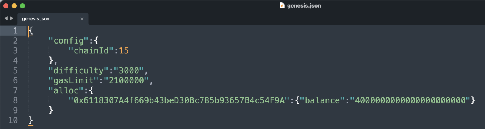
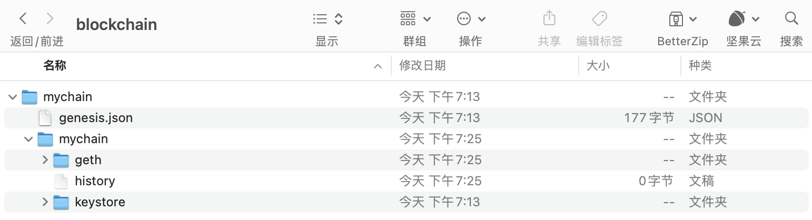
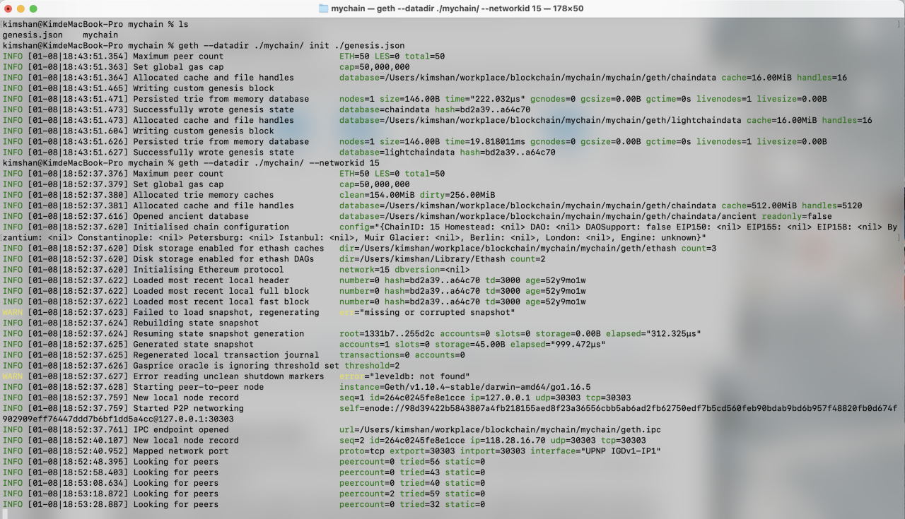
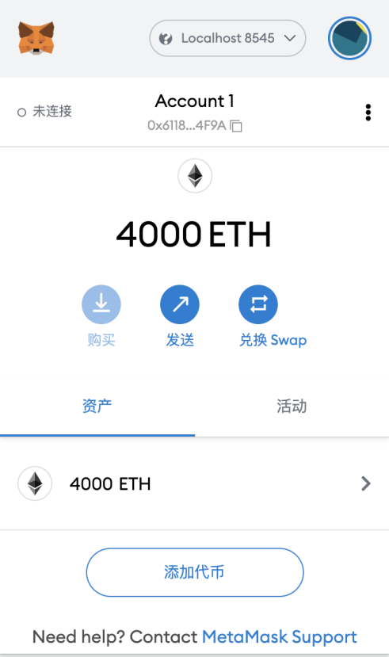

# 以太坊客户端

2022.2.18

## 主要内容

客户端;Geth的安装和使用;搭建私链

## 什么是以太坊客户端

【珍惜生命：以太坊是个规范，符合这个规范的程序，是以太坊客户端】

* 以太坊客户端是一个软件应用程序，它实现以太坊规范并通过p2p 网络与其他以太坊客户端进行通信。如果不同的以太坊客户端符合参考规范和标准化通信协议，则可以进行相互操作。

* 以太坊是一个开源项目，由“黄皮书”正式规范定义。除了各种以太坊改进提案之外，此正式规范还定义了以太坊客户端的标准行为。

- 因为以太坊有明确的正式规范，以太网客户端有了许多独立开发的软件实现，它们之间又可以彼此交互。

## 基于以太坊规范的网络

* 存在各种基于以太坊规范的网络，这些网络基本符合以太坊“黄皮书”中定义的形式规范，但它们之间可能相互也可能不相互操作。
* 这些基于以太坊的网络中有:以太坊，以太坊经典，Ella，Expanse，Ubiq，Musicoin等等。
* 虽然大多数在协议级别兼容，但这些网络通常具有特殊要求，以太坊客户端软件的维护人员、需要进行微小更改、以支持每个网络的功能或属性。

## 以太坊的多种客户端

- go-ethereum ( Go )

  官方推荐，开发使用最多，别称，geth

  地址:https://github.com/ethereum/go-ethereum

- parity ( Rust )

  最轻便客户端，在历次以太坊网络攻击中表现卓越

  地址:https://github.com/ethcore/parity/releases

- cpp-ethereum(C++)

  地址:https://github.com/ethereum/cpp-ethereum

- pyethapp (python)

  地址:https://github.com/heikoheiko/pyethapp

- ethereumjs-lib(javascript)

  地址:https://github.com/ethereumjs/ethereumjs-lib

- EthereumJ / Harmony ( Java )

  地址:https://github.com/ethereum/ethereumj

## 以太坊全节点

* **全节点是整个主链的一个副本**，存储并维护链上的**所有数据**，并随时验证新区块的合法性。

- 区块链的健康和扩展弹性，取决于具有许多独立操作和地理上分散的全节点。每个全节点都可以帮助其他新节点获取区块数据，并提供所有交易和合约的独立验证。
- 运行全节点将耗费**巨大的成本**，包括硬件资源和带宽。
- 以太坊开发不需要在实时网络(主网)上运行的全节点。我们可以使用测试网络的节点来代替，也可以用本地私链，或者使用服务商提供的基于云的以太坊客户端;这些几乎都可以执行所有操作。

## 远程客户端和轻节点

* **远程客户端**

不存储区块链的本地副本或验证块和交易。这些客户端一般只提供钱包的功能，可以创建和广播交易。远程客户端可用于连接到 现有网络，**MetaMask就是一个这样的客户端**。

* **轻节点**

**不保存链上的区块历史数据，只保存区块链当前的状态**。轻节点可以对块和交易进行验证。

## 全节点的优缺点

优点

* 为以太坊网络的灵活性和抗审查性提供有力支持。 
* 权威地验证所有交易。
* 可以直接与公共区块链上的任何合约交互。
* 可以离线查询区块链状态(帐户，合约等)。
* 可以直接把自己的合约部署到公共区块链中。 

缺点

* 需要巨大的硬件和带宽资源，而且会不断增长。
* 第一次下载往往需要几天才能完全同步。
* 必须及时维护、升级并保持在线状态以同步区块。

## 公共测试网络节点的优缺点

优点

- 一个testnet节点需要同步和存储更少的数据，大约10GB，具体取决于不同的网络。
- 一个testnet节点一般可以在几个小时内完全同步。
- 部署合约或进行交易只需要发送测试以太，可以从“水龙头”免费获得。
- 测试网络是公共区块链，有许多其他用户和合约运行(区别于私链)。

缺点

- 测试网络上使用测试以太，它没有价值。因此，无法测试交易对手的 安全性，因为没有任何利害关系。
- 测试网络上的测试无法涵盖所有的真实主网特性。例如，交易费用虽 然是发送交易所必需的，但由于gas免费，因此 testnet 上往往不会考虑。而且一般来说，测试网络不会像主网那样经常拥堵。

## 本地私链的优缺点

优点

- 磁盘上几乎没有数据，也不同步别的数据，是一个完全“干净”的 环境。
- 无需获取测试以太，你可以任意分配以太，也可以随时自己挖矿获 得。
- 没有其他用户，也没有其他合约，没有任何外部干扰。 

缺点

- 没有其他用户意味与公链的行为不同。发送的交易并不存在空间或 交易顺序的竞争。
- 除自己之外没有矿工意味着挖矿更容易预测，因此无法测试公链上 发生的某些情况。
- 没有其他合约，意味着你必须部署要测试的所有内容，包括所有的依赖项和合约库。

## JSON-RPC

• 以太坊客户端提供了API和一组远程调用(RPC)命令，这些命令被编码为 JSON。这被称为 JSON-RPC API。本质上，JSON-RPC API 就是一个接口，允许我们编写的程序使用以太坊客户端作为网 关，访问以太坊网络和链上数据。

• 通常，RPC接口作为一个HTTP服务，端口设定为8545。出于安全原因，默认情况下，它仅限于接受来自 localhost 的连接。

• 要访问JSON-RPCAPI，我们可以使用编程语言编写的专用库，例如JavaScript的 web3.js。

• 或者也可以手动构建HTTP请求并发送/接收JSON编码的请求，如:

```bash
$ curl -X POST -H "Content-Type: application/json" --data \ '{"jsonrpc":"2.0","method":"web3_clientVersion","params":[],"id":1 }' \ http://localhost:8545
```

## geth的安装与同步全节点

推荐源码安装，详细文件参考[这里](https://pan.baidu.com/s/1mdKzZNvKD1R0ItlNhYAXIg?pwd=6s2d)。

1. 我们的第一步是克隆 git 仓库，以获取源代码的副本。

```bash
git clone https://github.com/ethereum/go-ethereum.git
```

2. 从源码构建Geth,要构建 Geth，切换到下载源代码的目录并使用 make 命令:

```bash
cd go-ethereum 
make geth
```

如果一切顺利，我们将看到 Go 编译器构建每个组件，直到它生成 geth 可执行文件:

```bash
build/env.sh go run build/ci.go install ./cmd/geth
>>> /usr/local/go/bin/go install -ldflags -X main.gitCommit=58a1e13e6dd7f52a1d5e67bee47d23fd6cfdee5c -v ./cmd/geth github.com/ethereum/go-ethereum/common/hexutil github.com/ethereum/go-ethereum/common/math
github.com/ethereum/go-ethereum/crypto/sha3 github.com/ethereum/go-ethereum/rlp github.com/ethereum/go-ethereum/crypto/secp256k1 github.com/ethereum/go-ethereum/common [...] github.com/ethereum/go-ethereum/cmd/utils
github.com/ethereum/go-ethereum/cmd/geth Done building. Run "build/bin/geth" to
launch geth.
```

3. 查看 geth version，确保在真正运行之前安装正常:

```bash
$ ./build/bin/geth version
Geth
Version: 1.8.0-unstable
Git Commit: e37f7be97e47a032d723db16d8b195998547805a Architecture: amd64
Protocol Versions: [63 62] Network Id: 1
Go Version: go1.9
Operating System: linux GOPATH=/home/ubuntu/project GOROOT=/usr/local/go
```


4. 安装好了 Geth，现在我们可以尝试运行一下它。执行下面的命令，geth 就会开始同步区块，并存储在当前目录下。这里的 --syncmode fast 参数表示我们会以“快速”模式同步区块。在这种模式下，我们只会下载每个区块头和区块体，但不会执行验证所有的交易，直到所有区块同步完毕再去获取一个系统当前的状态。这样就节省了很多交易验证的时间。

```bash
$ geth --datadir . --syncmode fast
```

通常，在同步以太坊区块链时，客户端会一开始就下载并验证每个块和每个交易，也就是说从创世区块开始。 毫无疑问，如果我们不加 --syncmode fast 参数，同步将花费很长时间并且具有很高的资源要求(它将需要更多的 RAM，如果你没有快速存储，则需要很长时间)。

有些文章会把这个参数写成 --fast，这是以前快速同步模式的参数写法，现在已经被 –syncmode fast取代。

|     参数类型     | 意义           |
| :--------------: | -------------- |
| --syncmode fast  |                |
| --syncmode full  | 下载所有信息   |
| --syncmode light | 连区块都不下载 |

如果我们想同步**测试网络**的区块，可以用下面的命令:

```
$ geth --testnet --datadir . --syncmode fast
```

--testnet 这个参数会告诉 geth 启动并连接到最新的测试网络，也就是 Ropsten。测试网络的区块和交易数量会明显少于主网，所以会更快一点。但即使是用快速模式同步测试网络，也会需要几个小时的时间。

【我们除了要真正运行主链或测试链，否则不用同步这些东西】

## geth搭建私链

(本节内容均为尚硅谷课程笔记摘录)

因为公共网络的区块数量太多，同步耗时太长，我们为了方便快速了解 Geth，可以试着用它来搭一个只属于自己的私链。

首先，我们需要创建网络的“创世”(genesis)状态，这写在一个小小的 JSON 文件里(例如，我们将其命名为genesis.json):

```json
{
  "config": {
  "chainId": 15 // 注意这个chainId最好不要和主网和测试网一样
  },
  "difficulty": "2000", // 难度
  "gasLimit": "2100000", 
  "alloc": {
    // 对应的每个对象的余额
    "7df9a875a174b3bc565e6424a0050ebc1b2d1d82": { "balance": "300000" },
    "f41c74c9ae680c1aa78f42e5647a62f353b7bdde": { "balance": "400000" } 
  }
}
```

【创造链】要创建一条以它作为创世块的区块链，我们可以使用下面的命令:

```bash
geth --datadir path/to/custom/data/folder init genesis.json
```

【启动链】在当前目录下运行 geth，就会启动这条私链，注意要将 networked 设置为与创世块配置里的chainId 一致。

```bash
geth --datadir path/to/custom/data/folder --networkid 15
```

【启动+可以连接】不过经过测试，上边这个命令并不能让我本地的钱包通过local8584连接到私连上，需要这样做

```bash
geth --datadir ./mychain/ --networkid 15 console --rpc --rpccorsdomain "*" --allow-insecure-unlock
```

我们可以看到节点正常启动:

```
WARN [10-23|02:38:19] No etherbase set and no accounts found as default INFO [10-23|02:38:19] Starting peer-to-peer node instance=Geth/v1.8.0-unstable-e37f7be9/linux-amd64/go1.9
...
INFO [10-23|02:38:21] IPC endpoint opened: /home/ubuntu/project/go_ethereum_test/geth.ipc INFO [10-23|02:38:21] Mapped network port
proto=tcp
extport=30303 intport=30303 interface="UPNP IGDv1-IP1"
```

恭喜!我们已经成功启动了一条自己的私链。

**【下边是运行记录】：**！！！









Configure the Ethereum client geth to set up and run own private chain

Creat
geth --datadir ./mychain/ init ./genesis.json
Start
geth --datadir ./mychain/ --networkid 15 console --rpc --rpccorsdomain "*" --allow-insecure-unlock

## Geth控制台命令

#### 常用资料链接

[Geth官方文档](https://geth.ethereum.org/docs/)

#### geth常用命令

运行私链的时候同时加上```console```这个参数，就会开启Geth控制台。Geth Console 是一个交互式的 JavaScript 执行环境，里面内置了一些用来操作以太坊的 JavaScript对象，我们可以直接调用这些对象来获取区块链上的相关信息。这些对象主要包括：

[geth命令总结](https://www.cnblogs.com/wanghui-garcia/p/10256520.html)

|           命令           |                   含义                   |
| :----------------------: | :--------------------------------------: |
|           eth            | 主要包含对区块链进行访问和交互相关的方法 |
|           net            |     主要包含查看 p2p 网络状态的方法      |
|          admin           |       主要包含与管理节点相关的方法       |
|          miner           |        主要包含挖矿相关的一些方法        |
|         personal         |            包含账户管理的方法            |
|          txpool          |         包含查看交易内存池的方法         |
|           web3           |   包含以上所有对象，还包含一些通用方法   |
|  personal.newAccount()   |                 创建账户                 |
| personal.unlockAccount() |                 解锁账户                 |
|       eth.accounts       |             列出系统中的账户             |
|     eth.getBalance()     |     查看账户余额，返回值的单位是 Wei     |
|     eth.blockNumber      |             列出当前区块高度             |
|   eth.getTransaction()   |               获取交易信息               |
|      eth.getBlock()      |               获取区块信息               |
|      miner.start()       |                 开始挖矿                 |
|       miner.stop()       |                 停止挖矿                 |
|      web3.fromWei()      |             Wei 换算成以太币             |
|       web3.toWei()       |             以太币换算成 Wei             |
|      txpool.status       |              交易池中的状态              |

#### geth实验记录

实验日期：2022.2.18

自己的账户是```0x6118307A4f669b43beD30Bc785b93657B4c54F9A```,创世链的时候创建了2000以太

* 通过ether为单位查看余额

  ```bash
  web3.fromWei(eth.getBalance("0x..."))
  ```

* 创建新账户,控制台输入```personal.newAccount()```, 然后会然我输入密码, 之后创建好了账户```"0xfa2a67d6a6c0a0f6407b743ade22d80b5df38af8"```.

* 查看所有账户，就可以看到刚才创建的账户了，控制台输入```eth.accounts```, 控制台返回```["0xfa2a67d6a6c0a0f6407b743ade22d80b5df38af8"]```.

* 由于账户在js里边是一个数组，我们要查看第一个账户的余额可以直接控制台输入```eth.getBalance(eth.accounts[0])```,这个账户是新创建的, 没有以太, 控制台返回了```0```.

* 【错误】我们尝试用原始钱包的账户为新创建的用户转账, 控制台输入```eth.sendTransaction({from:"0x6118307A4f669b43beD30Bc785b93657B4c54F9A",to:eth.accounts[0],value:100000})```,控制台会弹出错误:

  ```
  Error: unknown account
  at web3.js:6357:37(47)
  at web3.js:5091:62(37)
  at <eval>:1:20(13)
  ```

  这是因为```0x6118307A4f669b43beD30Bc785b93657B4c54F9A```是创世的地址，不是geth有权限操作的，就像你不能随便拿别人的用户转钱。

* 我们用新创建的用户转钱前需要首先解锁账户,控制台输入```personal.unlockAccount(eth.accounts[0])```,输入密码,解锁。现在这是个可以交易的账户了。

* 使用刚创建的账户进行挖矿, 控制台输入```miner.start(1)```,参数1就是不要停的意思。过一会儿输入```miner.stop()```,代表停止挖矿。然后输入```eth.blockNumber```,查看区块数量, 已经不是0了。这是控制台输入```web3.fromWei(eth.getBalance(eth.accounts[0]))```，发现这个账户已经拥有很多ether了。

* [将刚才在geth创建的账户到入MetaMesk钱包中](https://www.cxyzjd.com/article/qq_46526828/113784232go),是哟哦那个MetaMesk导入钱包功能的通过json导入方法，然后json在自己的创建的链的keystore文件夹下。

* 现在我们用挖矿的账号，给初始账号转一些以太试一下, 首先进行账户的解锁,```personal.unlockAccount(eth.accounts[0],"密码")```,然后进行转账,```eth.sendTransaction({from:eth.accounts[0],to:"0x6118307A4f669b43beD30Bc785b93657B4c54F9A",value:web3.toWei(10,'ether')})```,结果还是报错 invaild sender。原来是视频中配置文件没配置全, 根据[官网](https://geth.ethereum.org/docs/interface/private-network)修改后的genesis.json:

  ```json
  {
  	"config": {
  		"chainId": 15,
  		"homesteadBlock": 0,
  		"eip150Block": 0,
  		"eip155Block": 0,
  		"eip158Block": 0,
  		"byzantiumBlock": 0,
  		"constantinopleBlock": 0,
  		"petersburgBlock": 0,
  		"ethash": {}
  	},
  	"difficulty": "2000",
  	"gasLimit": "8000000",
  	"alloc": {
  		"0x6118307A4f669b43beD30Bc785b93657B4c54F9A": { 
  			"balance": "4000000000000000000000" 
  		}
  	}
  }
  ```

* 另外挖矿指令输入后出现```WARN [02-18|16:06:09.012] Block sealing failed, err="unauthorized signer"```,最后发现原来是geth新版本只有在有提交的时候才会有矿挖，如果需要不停的挖矿要这样启动```geth --nodiscover console --dev --dev.period 1```

* 控制台输入```eth.get```，控制台会返回所有可以get的函数，比如```eth.getTransaction("某哈希值")```

* **目前总结：**

  * 创建私链：```geth --datadir ./mychain/ init ./genesis.json```
  * 启动私链-普通模式：```geth --datadir ./mychain/ --networkid 15  --http --http.api personal,eth,net,web3 console --allow-insecure-unlock 2>output.log```
  * 创建两个账户：```personal.newAccount()```
  * 创建password.txt
  * 启动私链-测试模式：```geth --datadir ./mychain/ --networkid 15 --dev --dev.period 1 --password password.txt --http --http.api personal,eth,net,web3 console --allow-insecure-unlock 2>output.log```
  * 余额：```web3.fromWei(eth.getBalance(eth.accounts[0]))```
  * 区块高度：```eth.blockNumber```
  * 开始挖矿：```miner.start(1)```
  * 结束挖矿：```miner.stop()```
  * 解锁账户：```personal.unlockAccount(eth.accounts[0])```
  * 进行转账(给自己转1以太)：```eth.sendTransaction({from:eth.accounts[0],to:eth.accounts[1],value:web3.toWei(1,'ether')})```