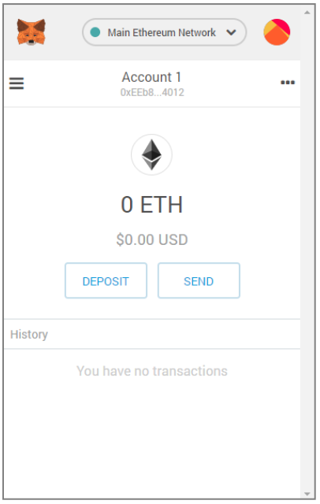

# 初识以太坊

2022.2.17

## 主要内容

钱包、测试网络和简单交易

## 以太币单位

• 以太坊的货币单位称为以太，也称为ETH或符号Ξ

- ether被细分为更小的单位，直到可能的最小单位，称为**wei**;

  1 ether = 10^18 wei

- 以太的值总是在以太坊内部表示为以wei表示的无符号整数值。

- 以太的各种单位都有一个使用国际单位制(SI)的科学名 称，和一个口语名称。

| 值(wei)                           | 指数     | 通用名称 | SI名称                |
| --------------------------------- | -------- | -------- | --------------------- |
| 1                                 | $$10^0$$ | wei      | wei                   |
| 1,000                             | $$10^1$$ | babbage  | kilowei or femtoether |
| 1,000,000                         | $$10^2$$ | lovelace | megawei or picoether  |
| 1,000,000,000                     | $$10^3$$ | shannon  | gigawei or nanoether  |
| 1,000,000,000,000                 | $$10^4$$ | szabo    | microether or micro   |
| 1,000,000,000,000,000             | $$10^5$$ | finney   | milliether or mill    |
| 1,000,000,000,000,000,000         | $$10^6$$ | ether    | ether                 |
| 1,000,000,000,000,000,000,000     | $$10^7$$ | grand    | kiloether             |
| 1,000,000,000,000,000,000,000,000 | $$10^8$$ |          | megaether             |

## 以太坊钱包

以太坊钱包是我们进入以太坊系统的门户。**它包含了私钥，可以代表我们创建和广播交易**。

- [MetaMask](https://chrome.google.com/webstore/category/extensions):一个浏览器扩展钱包，可在浏览器中运行。
- Jaxx:一款多平台、多币种的钱包，可在各种操作系统上运行，包括Android，iOS，Windows，Mac和Linux。
- MyEtherWallet(MEW):一个基于web的钱包，可以在任何浏览器中运行。
- EmeraldWallet:旨在与ETC配合使用，但与其他基于以太坊的区块链兼容。

## 私钥、公钥和地址

• 私钥(PrivateKey) 以太坊私钥事实上只是一个**256**位的随机数，用于发送以太的交易中创建签名来证明自己对资金的所有权。

• 公钥(PublicKey) 公钥是由私钥通过椭圆曲线加密secp256k1算法单向生成的512位 (64字节)数。

• 地址(Address) 地址是由公钥的 Keccak-256 单向哈希，取最后20个字节(160位) 派生出来的标识符。

## 安全须知

- keystore文件就是加密存储的私钥。所以当系统提示你选择密码时:将其设置为强密码，备份并不要共享。如果你没有密码管理器，请将其写下来并将其存放在带锁的抽屉或保险箱中。要访问账户，你必须同时有 keystore文件和密码。
- **助记词可以导出私钥，所以可以认为助记词就是私钥。请使用笔和纸进行物理备份。不要把这个任务留给“以后”，你会忘记。**
- 切勿以简单形式存储私钥，尤其是以电子方式存储。
- 不要将私钥资料存储在电子文档、数码照片、屏幕截图、在线驱动器、加密PDF等中。使用密码管理器或笔和纸。
- 在转移任何大额金额之前，首先要做一个小的测试交易(例如，小于1美 元)。收到测试交易后，再尝试从该钱包发送。

## MetaMask

1. [安装](https://www.bilibili.com/video/BV1NJ411D7rf?p=9)

2. 内容——账户名称:Account1 ——以太坊地址 ——账户余额:0 ETH

   

3. 切换网络

   - **Main Network**(Network ID: 1)：主要的、公共的，以太坊区块链。真正的ETH，真正的价值，真正的结果。
   - **Ropsten Test** Network(Network ID: 3)：以太坊公共测试区块链和网络，使用工作量证明共识(挖矿)。该网络上的 ETH 没有任何价值。
     - **用Pow共识**
   - **Kovan Test** Network(Network ID: 42)：以太坊公共测试区块链和网络。该网络上的 ETH 没有任何价值。
     - 此测试网络仅由 **Parity（客户端）** 支持。
     - 使用“Aura”协议进行权威证明 **POA共识**(联合签名)
   - **Rinkeby Test** Network(Network ID: 4)：以太坊公共测试区块链和网络。该网络上的 ETH 没有任何价值。
     - 使用“Clique”协议进行权威证明 **POA共识**(联合签名)
     - 主要支持 **Geth（客户端）**
     - 官网：https://www.rinkeby.io/#stats
   - **Localhost 8545**：连接到与浏览器在同一台计算机上运行的节点。该节点可以是任何公共区块链(main 或 testnet)的一部分，也可以是私有testnet。
   - **Custom RPC**：允许将 Netmask连接到意兼容eth的RPC接口的点。该节点可以是任何公共或私人区块链的一部分。

4. **获取测试以太**

   * 钱包有了，地址有了，接下来需要做的就是为我们的钱包充值。 我们不会在主网络上这样做，因为真正的以太坊需要花钱。

   * 以太坊测试网络给了我们免费获取测试以太的途径:水龙头 ( **faucet** )

   * 现在，我们将尝试把一些测试以太充入我们的钱包。

   * 下图是Ropsten测试网络的水龙头，直接点击获取，但是有稳定性不好。也可以用https://www.rinkeby.io/#stats，但是比较麻烦。

   

5. Gas编辑选项

   1. Metamask 计算了最近成功交易的平均 gas 价格为4 GWEI

   2. 发送基本交易的 gas 成本是21000个 gas单位

   3. 花费的最大 ETH 量是 4 * 21000 GWEI = 84000 GWEI = 0.000084ETH

   4. 做 1 ETH 交易成本为 1.000084 ETH

   5. 从水龙头请求多一些的以太，如果有2 个ETH的余额，我们就可以再试一次

      

   6. **搜索地址的交易记录**：

      

   7. 动态的查询现在网络上gas的信息：https://ethgasstation.info/

## 在Remix上构建简单的水龙头合约

打开浏览器：https://remix.ethereum.org

```solidity
// Fauset.sol

// Our first contract is a faucet:
pragma solidity >=0.4.19;

contract Fauset {
    // Give out ether to anyone who asks
    function withdraw(uint withdraw_amount) public {
        // Limit withdrawal amount
        require(withdraw_amount<=100000000000000000);//0.1 ether
        // Send the amount to the address that requested it
        msg.sender.transfer(withdraw_amount);
    }

    function () public payable{} // 回退函数, 假如用户调用的方法在本合约中没实现, 就用这个函数

}
```

