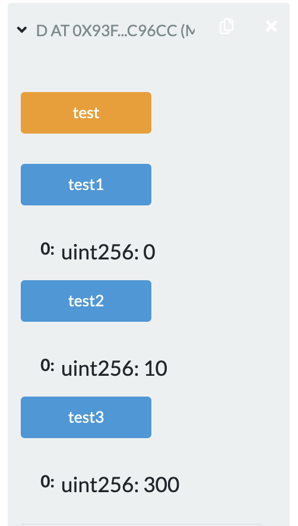
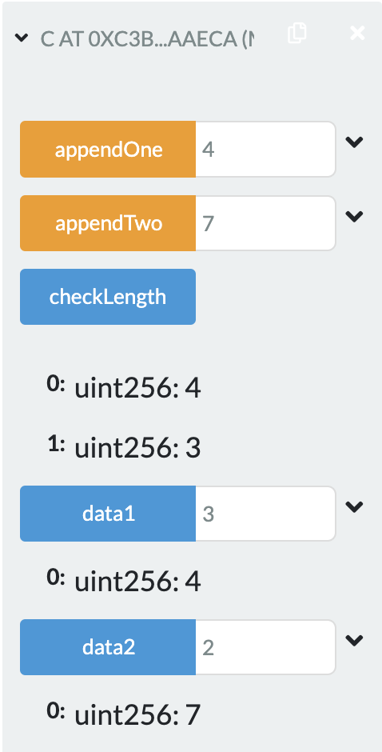
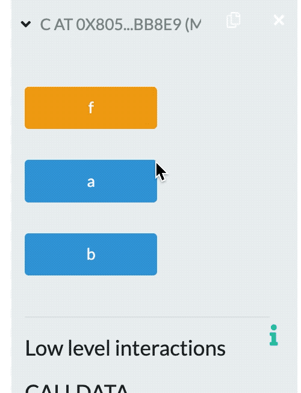

# Solidity进阶

2022.2.21

## 主要内容

Solidity语法

## [Solidity源文件布局](https://solidity-cn.readthedocs.io/zh/develop/layout-of-source-files.html)

* **pragma (版本杂注)**

  * 源文件可以被版本杂注pragma所注解，表明要求的编译器版本
  * 例如:```pragma solidity ^0.4.0;```
  * 源文件将既不允许低于 0.4.0 版本的编译器编译，也不允许高于(包含) 0.5.0 版本的编译器编译(第二个条件因 使用 ^ 被添加)

* **import(导入其它源文件)**

  * Solidity 所支持的导入语句import，语法同 JavaScript(从 ES6 起)非常类似

  * ```import "filename";```

    从“filename”中导入所有的全局符号到当前全局作用域中

  * ```import * as symbolName from "filename";```

    创建一个新的全局符号 symbolName，其成员均来自 “filename” 中全局符号

  * ```import {symbol1 as alias, symbol2} from "filename";```
    创建新的全局符号alias和symbol2，分别从"filename"引用 symbol1 和 symbol2

  * ```import "filename" as symbolName;```
    这条语句等同于 import * as symbolName from "filename";

## [Solidity值类型](https://solidity-cn.readthedocs.io/zh/develop/types.html)

* **布尔(bool)**:可能的取值为字符常量值 true 或 false

- **整型(int/uint)**:分别表示有符号和无符号的不同位数的整型变量; 支持关键字 uint8 到 uint256(无符号，从 8 位到 256 位)以及 int8 到 int256，以 8 位为步长递增
- **定长浮点型(fixed / ufixed)**: 表示各种大小的有符号和无符号的定长浮点型;在关键字 ufixedMxN 和 fixedMxN 中，M 表示该类型占用的位数，N 表示可用的小数位数
- **地址(address)**:存储一个 20 字节的值(以太坊地址大小)
- **定长字节数组**:关键字有 bytes1，bytes2，bytes3，...，bytes32
- **枚举(enum)**:一种用户可以定义类型的方法，与C语言类似，默认从0 开始递增，一般用来模拟合约的状态
- **函数(function)**:一种表示函数的类型

## [Solidity引用类型](https://solidity-cn.readthedocs.io/zh/develop/types.html#index-13)

* **数组(Array)**

  * 数组可以在声明时指定长度(定长数组)，也可以动态调整大小(变长数组、动态数组)

  - 对于**存储型(storage)**的数组来说，元素类型可以是**任意**的(即元素也可以是数组类型，映射类型或者结构体);对于**内存型 (memory)**的数组来说，元素类型**不能是映射(mapping)类型**

* **结构(Struct)**

  * Solidity 支持通过构造结构体的形式定义新的类型

* **映射(Mapping)**

  * 映射可以视作哈希表 ，在实际的初始化过程中创建每个可能的 key，并将其映射到字节形式全是零的值(类型默认值)

## Solidity地址类型

* address

  - 地址类型存储一个 20 字节的值(以太坊地址的大小);地址类型也有成员变量，并作为所有合约的基础

* address payable(v0.5.0引入)

  - 与地址类型基本相同，不过多出了 transfer 和 send 两个成员变量

* 两者区别和转换

  - Payable 地址是可以发送 ether 的地址，而普通 address 不能允许从 payable address 到 address 的隐式转换，而反过来的直接转换是不可能的(唯一方法是通过uint160来进行中间转换)

  - 从0.5.0版本起，合约不再是从地址类型派生而来，但如果它有payable的回退函数，那同样可以显式转换为 address 或者 address payable 类型

* ```<address>.balance (uint256)```:该地址的 ether 余额，以Wei为单位

* ```<address payable>.transfer(uint256 amount)```:向指定地址发送数量为 amount 的 ether(以Wei为单位)，失败时抛出异常，发送 2300 gas 的矿工费，不可调节

  * **注意是向address send代币！**

* ```<address payable>.send(uint256 amount) returns (bool)```:向指定地址发送数量为 amount的 ether(以Wei为单位)，失败时返回 false，发送 2300 gas 的矿工费用，不可调节

  * **注意是向address send代币！**
  * **send没有异常，所以默认是执行成功的！**

* ```<address>.call(bytes memory) returns (bool, bytes memory)```:发出底层函数 CALL，失败时返回 false，**发送所有可用 gas**，可调节 

  * 失败没有异常

* ```<address>.delegatecall(bytes memory) returns (bool, bytes memory)```:发出底层函数 DELEGATECALL，代理调用，失败时返回 false，**发送所有可用 gas**，可调节 

* ```<address>.staticcall(bytes memory) returns (bool, bytes memory)```:发出底层函数 STATICCALL ，失败时返回 false，**发送所有可用 gas**，可调节

* 地址成员变量用法

  * **balance 和 transfer**

    * 可以使用balance属性来查询一个地址的余额，可以使用transfer函数向一个payable地址发送 以太币Ether(以 wei 为单位) 

    * ```solidity
      address payable x = address(0x123);
      address myAddress = address(this);
      if (x.balance < 10 && myAddress.balance >= 10) 
      	x.transfer(10);
      ```

  * **send**

    * send 是 transfer 的低级版本。如果执行失败，当前的合约不会因为异 常而终止，但 send 会返回 false

  * **call**

    * 也可以用call来实现转币的操作，通过添加.gas()和.value()修饰器: 

    * ```solidity
      nameReg.call.gas(1000000).value(1 ether)(abi.encodeWithSignature("register(string)", "MyName"));
      ```

## 字符数组(Byte Arrays)

**定长字符数组**

* 属于值类型，bytes1，bytes2，...，bytes32分别代表了长度为1到32的字

**节序列**

* 有一个**.length**属性，返回数组长度(只读)

* ```solidity
  function test() public pure return(unit){ // 最后函数输出17
  	bytes17 a;
  	return a.length;
  }
  ```

**变长字符数组**

* 属于引用类型，包括 bytes和string，不同的是bytes是Hex字符串，而string是UTF-8编码的字符串

## 枚举(Enum)

* 枚举类型用来用户自定义一组常量值
* 与C语言的枚举类型非常相似，对应整型值
* **枚举类型、结构类型、状态变量需要在函数外声明！！**

```solidity
pragma solidity >=0.4.0 <0.6.0; 
contract Purchase {
	// 枚举类型、结构类型、状态变量需要在函数外声明！！
	enum State { Created, Locked, Inactive } 
	function test() public pure return(unit){ // 最后函数输出17
    State st = State.Created;
    return uint(st); // Created, Locked, Inactive 分别是0,1,2
  }
}
```

## 数组(Array)

- 固定大小k和元素类型T的数组被写为T[k]，动态大小的数组为T[]。

  **例如，一个由5个uint动态数组组成的数组是uint[]\[5]**(定义的时候，和C语言顺序是不一样的)

- 要**访问第三个动态数组中的第二个uint，可以使用x[2]\[1]**（访问的时候，和C语言顺序是一样的）

- 越界访问数组，会导致调用失败回退

- 如果要添加新元素，则必须使用.push()或将.length增大, (**如果存在storage里边，长度可以变，如果存在memory里边，长度不能变**)

- 变长的storage数组和bytes(不包括string)有一个push()方法。可以将一个新元素附加到数组末端，返回值为当前长度

- 数组示例

  ```solidity
  pragma solidity >=0.4.16 <0.6.0; 
  contract C {
    function f(uint len) public pure {
      uint[] memory a = new uint[](7);
      bytes memory b = new bytes(len); 
      assert(a.length == 7); 
      assert(b.length == len);
      a[6] = 8;
    } 
  }
  ```

## [结构(Struct)](https://solidity-cn.readthedocs.io/zh/develop/types.html#structs)

* 结构类型可以在映射和数组中使用，它们本身可以包含映射和数组。
* **结构不能包含自己类型的成员**，但可以作为自己数组成员的类型，也可以作为自己映射成员的值类型

```solidity
pragma solidity >=0.4.0 <0.6.0; 
contract Ballot {
  struct Voter {
    uint weight;
    bool voted;
    uint vote; 
  }
}
```

## 映射(Mapping)

* 声明一个映射:```mapping(_KeyType => _ValueType)```
* _KeyType可以是任何基本类型。这意味着它可以是任何内置值类型加上字符数组和字符串。**不允许使用用户定义的或复杂的类型，如枚举，映射，结构以及除bytes和string之外的任何数组类型**。 
* _ValueType可以是任何类型，包括映射。

```solidity
pragma solidity >=0.4.0 <0.6.0;
contract MappingExample { 
	mapping(address => uint) public balances; 
	
	function update(uint newBalance) public {
  	balances[msg.sender] = newBalance;
  }
}

  contract MappingUser {
    function f() public returns (uint) {
    MappingExample m = new MappingExample();
    m.update(100);
    return m.balances(address(this));
  }
}
```

* 下面是上课讲的例子，比较绕：

```solidity
pragma solidity ^0.8.0;

contract C{
	mapping (address=>uint) public balances;
	constructor(){
		balances[address(this)]=300;
    }
	function update(uint amount)public{
		balances[msg.sender]=amount;
    }
}


contract D{
    uint public test1;
    uint public test2;
    uint public test3;
    function test()public{
        C c = new C();
        c.update(10);
        test1 = c.balances(msg.sender);
        test2 = c.balances(address(this));
        test3 = c.balances(address(c));
    }
}
```

应该返回300，10，0.因为c.update传入的参数，是调用他的地址，address(c)是c的地址，在合约C创建的时候，c的balances就是300；address(this)的this是D，fun()中的c.update传入了D的地址，所以d的balances经过updated成了10；c.balances(msg.sender)获取的是用户的地址对应的balances，并没有设置过，是0。

运行结果贴图：



## Solidity数据位置

* 所有的复杂类型，即数组、结构和映射类型，都有一个额外属性，“数据位置”，用来说明数据是保存在内存 memory 中还是 存储 storage 中
* 根据上下文不同，大多数时候数据有默认的位置，但也可以通过在类型名后增加关键字 storage 或 memory 进行修改
* 函数**参数**(包括返回的参数)的数据位置默认是**memory**，**局部变量**的数据位置默认是 **storage**，**状态变量**的数据位置强制是 **storage**
* 另外还存在第三种数据位置，calldata，这是一块只读的，且不会永久存储的位置，用来存储函数参数。外部函数的参数(非返回参数) 的数据位置被强制指定为 calldata ，效果跟 memory 差不多

## 数据位置总结

* **强制指定**的数据位置

  - **外部函数的参数**(不包括返回参数):**calldata**;

  - **状态变量**:**storage**

- **默认**数据位置
  - **函数参数**(包括返回参数):**memory**;
  - **引用类型的局部变量**:**storage**
  - **值类型的局部变量**:**栈(stack)**
- 特别要求
  - 公开可见(**public**lyvisible)的函数参数一定是**memory**类型，如果要求是 storage 类型则必须是 private 或者 internal 函数，这是为了防止随意的公开调用占用资源

## 案例程序

### 数组案例

```solidity
pragma solidity ^0.8.0; 
contract C {
  uint[] public data1; // 默认存在storgae,不定长度只存头，剩下的散列出去
  uint[] public data2; // 默认存在storgae
  function checkLength() view public returns(uint,uint){
      return (data1.length,data2.length);
  }
  function appendOne(uint8 data) public{
  	append(data1,data);
  }
  function appendTwo(uint8 data) public {
  	append(data2,data);
  }
  function append(uint[] storage d,uint8 data) internal {
    // d只是data1或data2的引用
  	d.push(data); 
  }
}
```

运行截图：

（appendOne和appendTwo已经输入了多个数，截图展示的是最后一个；data1和data2是输入下标点击显示对应内容）



### 程序改错1

```solidity
// 下面代码包含一个错误 
pragma solidity ^0.4.0;
contract C {
  uint public a; 
  uint public b; 
  uint[] data;
  function f() public {
  	uint[] x; 
  	x.push(2); 
  	data = x;
	} 
}

```



这是因为```uint[] x; ```定义的时候没有初始化，形成了野指针，指针默认指向程序开头。长度可变的数组在存储过程中，会存储这个数组的长度。所以会产生错误。

### 程序改错2

```solidity
// 下面代码编译错误 
pragma solidity ^0.4.0; 
contract C {
  uint[] x;
  function f(uint[] memoryArray) public {
  	// 这个是可以的，memory给storage类型赋值：会进行数据的拷贝
    x = memoryArray;
    // 这个是可以的，这个局部变量y只当一个引用
    uint[] y = x;
    // 如果没越界是可以的
    y[7];
    // 是可以的，storage的可变数组可以直接用.length
    y.length = 2; 
    // 是可以的，软删除（把长度置为零）
    delete x;
    // TypeError: Type uint256[] memory is not implicitly convertible to expected type uint256[] storage pointer.
    // memory类型的变长数组（可以认为无限大），不能直接指向y这一块很小的内存
    y = memoryArray; 
    delete y;
    g(x);
    h(x);
  }
  // 如果传入类型为storage，函数类型只能是internal或private而不能是public
  function g(uint[] storage storageArray) internal {} 
  function h(uint[] memoryArray) public {} 
}
```

* memory给storage类型赋值：会进行数据的拷贝
* storage给状态变量storage类型赋值：会进行数据的拷贝
* storage给局部变量storage类型赋值：这个局部变量只当一个引用
* ```function f(uint[] memoryArray) public {```在0.8.n里边，需要指定成```calldata```或```memory```!
* ```uint[] y = x;```在0.8.n里边也不被允许，需要指定类型。如果类型为```memory```后边的```y.length=2```就又错了$$\to$$memory类型的变量给定了后就不能变了
* ```y = memoryArray```中的```y``如果是storage类型的，就会失败；只有memory类型才会成功

### 猜数字游戏

```solidity
pragma solidity >0.4.22;
contract Honeypot{
	uint luckyNum = 52;
	uint public last;
	struct Guess{ address player; uint number; } 
	Guess[] public guessHistory;
	address owner = msg.sender;
	function guess(uint _num) public payable{
		Guess newGuess; 
		newGuess.player = msg.sender; 
		newGuess.number = _num; 
		guessHistory.push( newGuess ); 
		if( _num == luckyNum )
			msg.sender.transfer( msg.value * 2 ); 
		last = now;
	} 
}
```

```Guess newGuess; ```错误在这里！还是指针没赋初始值

## Solidity函数声明和类型

函数的值类型有两类: **内部(internal)函数**和**外部(external)函数**

- 内部函数只能在当前**合约内**被调用(更具体来说，在当前代码内，包括内 部库函数和继承的函数中)，因为它们不能在当前合约上下文的外部被执行。调用一个内部函数是通过跳转到它的入口标签来实现的，就像在当前合约的内部调用一个函数。
- 外部函数由一个地址和一个函数签名组成，可以通过外部函数调用传递或者返回
- 调用内部函数:直接使用名字 f
- 调用外部函数:this.f(当前合约)，a.f(外部合约)

## Solidity函数可见性

* 函数的可见性可以指定为 ```external```，```public``` ，```internal``` 或者 ```private```; 对于状态变量,不能设置为 ```external``` ，默认是 ```internal```。
* ```external```:外部函数作为合约接口的一部分，意味着我们可以从其他合约和交易中调用。一个外部函数f不能从内部调用(即 f 不起作用，但 this.f() 可以)。 当收到大量数据的时候, 外部函数有时候会更有效率。
* ```public``` :public 函数是合约接口的一部分，可以在内部或通过消息调用。 对于 public 状态变量，会自动生成一个 getter 函数。
* ```internal```:这些函数和状态变量只能是内部访问(即从当前合约内部或从它派生的合约访问)，不使用 this 调用。
* ```private```:private函数和状态变量仅在当前定义它们的合约中使用，并且不能被派生合约使用。

* 函数可见性实例

  ```solidity
  pragma solidity >=0.4.16 <0.6.0; 
  contract C {
  	function f(uint a) private pure returns (uint b) { 
  		return a + 1;
  	}
  	function setData(uint a) internal {
  		data = a;
  	}
  	
  	uint public data; 
  	
  	function x() public {
      data = 3; // 内部访问
      uint val = this.data(); // 外部访问 
      uint val2 = f(data);
    } 
  }
  ```


## Solidity函数状态可变性

* ```pure```: 纯函数，不允许修改或访问状态
* ```view```: 不允许修改状态
* ```payable```: 允许从消息调用中接收以太币Ether
* ```constant```: 与view相同，一般只修饰状态变量，不允许赋值 (除初始化以外)

* 以下情况被认为是**修改状态**:
  * 修改状态变量。
  * 产生事件。
  * 创建其它合约。
  * 使用 selfdestruct。
  * 通过调用发送以太币。
  * 调用任何没有标记为 view 或者 pure 的函数。
  * 使用低级调用。
  * 使用包含特定操作码的内联汇编。

* 以下被认为是从状态中进行读取:
  * 读取状态变量。
  * 访问 this.balance 或者 <address>.balance。
  * 访问 block，tx， msg 中任意成员 (除 msg.sig 和 msg.data 之外)。
  * 调用任何未标记为pure的函数。
  * 使用包含某些操作码的内联汇编。

## 函数修饰器(modifier)

- 使用修饰器modifier可以轻松改变函数的行为。例如，它们可以在执行函数之前自动检查某个条件。修饰器modifier 是合约的可继承属性，并可能被派生合约覆盖

- 如果同一个函数有多个修饰器modifier，它们之间以空格隔开，修饰器modifier会依次检查执行。

- Modifier示例

  ```solidity
  pragma solidity >=0.4.22 <0.6.0; 
  contract Purchase {
    address public seller;
    modifier onlySeller() { // Modifier
      require( msg.sender == seller, "Only seller can call." );
      _;  // 这是一个占位符，代表被修饰代码
    }
    function abort() public view onlySeller returns(...){ // Modifier usage
      // ...
    }
  }
  ```

  

## 回退函数(fallback)

* 回退函数(fallbackfunction)是合约中的特殊函数; 没有名字，不能有参数也不能有返回值
* **如果在一个到合约的调用中，没有其他函数与给定的函数标识符匹配 (或没有提供调用数据)，那么这个函数(fallback 函数)会被执行**

- 每当合约收到以太币(没有任何数据)，回退函数就会执行。此外， 为了接收以太币，fallback 函数必须标记为 payable。如果不存在这样的函数，则合约不能通过常规交易接收以太币
- 在上下文中通常只有很少的gas可以用来完成回退函数的调用，所以使 fallback 函数的调用尽量廉价很重要

```solidity
pragma solidity >0.4.99 <0.6.0; 
contract Sink {
	// 这是一个回退函数
	function() external payable { }
}
	
contract Test {
  // 这是一个回退函数
  function() external { x = 1; }
  uint x; 
}
  
contract Caller {
	// 把合约当成一个参数传了进来
  function callTest(Test test) public returns (bool) {
  	// 调用了一个没有定义的函数来触发回退函数
    (bool success,) = address(test).call(abi.encodeWithSignature("nonExistingFunction()"));
    require(success);
    // 把一个普通的地址类型，转换成一个payable的地址类型
    address payable testPayable = address(uint160(address(test))); 
    return testPayable.send(2 ether);
  }
}
```

## 事件(event)

• 事件是以太坊EVM提供的一种日志基础设施。事件可以用来做操作记录，存储为日志。也可以用来实现一些交互功能，比如通知UI，返回函数调用结果等

• 当定义的事件触发时，我们可以将事件存储到EVM的交易日志中，日志是区块链中的一种特殊数据结构;日志与合约关联，与合约的存储合并存入区块链中;只要某个区块可以访问，其相关的日志就可以访 问;但在**合约中，我们不能直接访问日志和事件数据**

• 可以通过日志实现简单支付验证SPV(SimplifiedPayment Verification)，如果一个外部实体提供了一个带有这种证明的合约，它可以检查日志是否真实存在于区块链中

## Solidity异常处理

- Solidity使用“状态恢复异常”来处理异常。这样的异常将撤消对 当前调用(及其所有子调用)中的状态所做的所有更改，并且向 调用者返回错误。
- 函数assert和require可用于判断条件，并在不满足条件时抛出异常
- assert()一般只应用于测试内部错误，并检查常量
- require()应用于确保满足有效条件(如输入或合约状态变量)，或验证调用外部合约的返回值
- revert()用于抛出异常，它可以标记一个错误并将当前调用回退

## Solidity中的单位

* 以太币 Ether 单位之间的换算就是在数字后边加上 ```wei```、 ```finney```、 ```szabo``` 或 ```ether``` 来实现的，如果后面没有单位，缺省为 Wei。例如 ```2 ether == 2000 finney``` 的逻辑判断值为 true

* 时间:秒是缺省时间单位，在时间单位之间，数字后面有 seconds、 minutes、 hours、 days、 weeks 和 years 的可以进行换算。规定一年365天。

* 这些后缀不能直接用在变量后边。如果想用时间单位(例如 days)来将输入变量 换算为时间，你可以用如下方式来完成:

  ```solidity
  function f(uint start, uint daysAfter) public {
  	if (now >= start + daysAfter * 1 days) { // ... }
  }
  ```