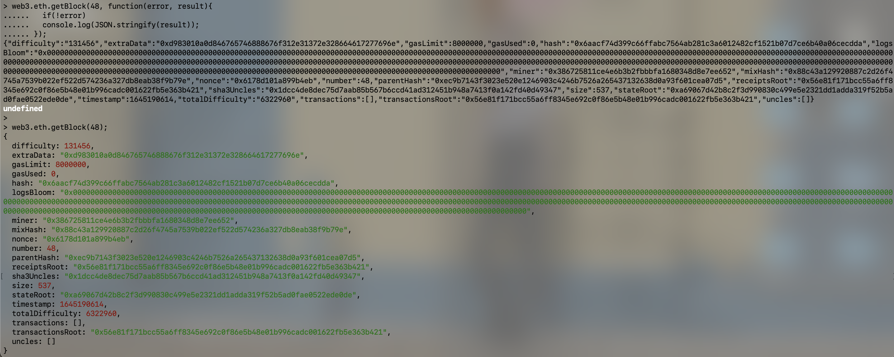
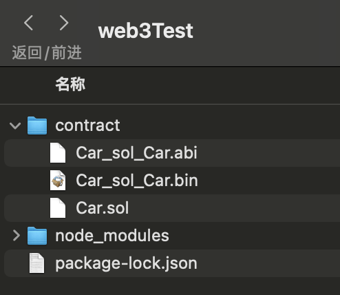

# Web3.js及简单应用

2022.2.24

## 主要内容

web3.js API，转币脚本，监听脚本

## [web3.js](https://web3js.readthedocs.io/)

* Web3 JavaScript app API
* web3.js 是一个JavaScript API库。要使DApp在以太坊上运行，我们可以使用web3.js库提供的web3对象
* web3.js 通过RPC调用与本地节点通信，它可以用于任何暴露了RPC层的以太坊节点
* web3 包含 eth 对象 - web3.eth(专门与以太坊区块链交互) 和 shh 对象 - web3.shh(用于与 Whisper 交互)

## web3 模块加载

* [npm安装参数详解](https://segmentfault.com/a/1190000014480038)

* 首先需要将web3模块安装在项目中:

  ```bash
  # 全局安装
  npm install web3@0.20.1 -g
  # 仅安装到这个项目中
  npm install web3@0.20.1 --save-dev
  ```

* 然后创建一个web3实例，设置一个“provider”

  为了保证我们的MetaMask设置好的provider不被覆盖掉，在引入web3之前我们一般要做当前环境检查(以v0.20.1为例):

  ```javascript
  if (typeof web3 !== 'undefined') {
    web3 = new Web3(web3.currentProvider); 
  } else {
    web3 = new Web3(new Web3.providers .HttpProvider("http://localhost:8545"));
  }
  ```

## 异步回调(callback)

* web3js API 设计的最初目的，主要是为了和本地 RPC 节点共同使用，所 以默认情况下发送的是同步 HTTP 请求

* 如果要发送异步请求，可以在函数的最后一个参数位置上，传入一个回调函数。回调函数是可选(optioanl)的
* 前端开发往往会用异步而不是同步

* 我们一般采用的回调风格是所谓的“错误优先”，例如:

  ```js
  // 同步回调
  web3.eth.getBlock(48);
  
  // 异步回调
  web3.eth.getBlock(48, function(error, result){
    if(!error)
    	console.log(JSON.stringify(result));
    else
    	console.error(error);
  });
  ```

  

## 回调 Promise 事件(v1.0.0)

- 为了帮助 web3 集成到不同标准的所有类型项目中，1.0.0 版本提供了**多种方式来处理异步函数**。大多数的 web3 对象允许将一个回调函数作为最后一个函数参数传入，同时会返回一个 **promise** 用于链式函数调用。

- 以太坊作为一个区块链系统，**一次请求具有不同的结束阶段**。为了满足这样的要求，1.0.0 版本将这类函数调用的返回值包成一个“承诺事件”(promiEvent)，这是一个 promise 和 EventEmitter 的结合体。

- PromiEvent 的用法就像 promise 一样，另外还加入了.on，.once 和.off方法

  ```js
  web3.eth.sendTransaction({from: '0x123...', data: '0x432...'}) 
  // 检测到交易哈希
  .once('transactionHash', function(hash){ ... })
  // 检测到打包进块后的收据
  .once('receipt', function(receipt){ ... })
  // 检测到确认
  .on('confirmation', function(confNumber, receipt){ ... })
  // 检测到错误
  .on('error', function(error){ ... })
  .then(function(receipt){ // will be fired once the receipt is mined });
  ```

## 应用二进制接口(ABI)

* **web3.js** 通过以太坊智能合约的 json 接口(Application Binary Interface，ABI)创建一个 JavaScript 对象，用来**在 js 代码中描述**

* 函数(functions）
  * type:函数类型，默认“function”，也可能是“constructor”
  * constant, payable, stateMutability:函数的状态可变性 • inputs, outputs: 函数输入、输出参数描述列表
* 事件(events)
  * type:类型，总是“event”
  * inputs:输入对象列表，包括 name、type、indexed

## 批处理请求(batch requests)

* 批处理请求允许我们将请求排序，然后一起处理它们。
* 注意:批量请求**不会更快**。实际上，在某些情况下，一次性地发出许多请求会更快，因为请求是异步处理的。
* 批处理请求主要用于**确保请求的顺序**，并**串行处理**。(所以尽管是批处理，但是速度并不会更快，主要是为了保证顺序)

```js
var batch = web3.createBatch(); 
batch.add(web3.eth.getBalance.request('0x0000000000000000000000000000000000000000', 'latest', callback)); 
batch.add(web3.eth.contract(abi).at(address).balance.request(a
ddress, callback2)); 
batch.execute();
```

## 大数处理(big numbers)

* JavaScript中默认的数字精度较小，所以web3.js会自动添加一个**依赖库 BigNumber**，专门用于大数处理

* 对于数值，我们应该习惯把它转换成BigNumber对象来处理 

```js
var BigNumber = require('bignumber.js');
var balance = new BigNumber('131242344353464564564574574567456'); 
// or var balance = web3.eth.getBalance(someAddress); 
balance.plus(21).toString(10); //"131242344353464564564574574567477"
// (10)代表十进制，对于整数可以保证精度，而对于浮点数会导致精度缺失
```

* BigNumber.toString(10)对小数只保留20位浮点精度。所以推荐的做法是，我们内部总是用 wei 来表示余额(大整数)，只有在需要显示给用户看的时候才转换为ether或其它单位

* BigNumber对象内部格式：

  ```js
  >balance
  >BigNumber { s: 1, e: 32, c: [ 13124, 23443534645645, 64574574567456 ] }
  ```

  * s：是代表正负数
  * e：代表科学技术法
  * c：分片记录了完整的数字

## 常用 API —— 基本信息查询

* **基本信息**

  * **查看 web3 版本**
    * v0.2x.x:```web3.version.api```
    * v1.0.0:```web3.version```
  * **查看 web3 连接到的节点版本(clientVersion)**
    * 同步:```web3.version.node```
    * 异步: ```web3.version.getNode((error,result)=>{console.log(result)})```
    * v1.0.0:```web3.eth.getNodeInfo().then(console.log)```

  - **获取 network id**
    - 同步:```web3.version.network```
    - 异步:```web3.version.getNetwork((err,res)=>{console.log(res)})```
    - v1.0.0:```web3.eth.net.getId().then(console.log)```

  - **获取节点的以太坊协议版本**
    - 同步:```web3.version.ethereum```
    - 异步:```web3.version.getEthereum((err,res)=>{console.log(res)}) ```
    - v1.0.0:```web3.eth.getProtocolVersion().then(console.log)```

* **网络状态查询**

  * **是否有节点连接/监听，返回true/false**
    * 同步:```web3.isConnect()``` 或者 ```web3.net.listening```
    * 异步:```web3.net.getListening((err,res)=>console.log(res))```
    * v1.0.0:```web3.eth.net.isListening().then(console.log)```

  * **查看当前连接的 peer 节点**
    * 同步:```web3.net.peerCount```
    * 异步:```web3.net.getPeerCount((err,res)=>console.log(res)) ```
    * v1.0.0:```web3.eth.net.getPeerCount().then(console.log)```

* **Provider**(重新设置连接到一个链接)

  * **查看当前设置的 web3 provider**
    * ```web3.currentProvider```
  * **查看浏览器环境设置的 web3 provider(v1.0.0)**
    * ```web3.givenProvider```
  * **设置 provider**
    * ```web3.setProvider(provider)```
    * ```web3.setProvider(new web3.providers.HttpProvider('http://localhost:8545'))```

* **web3 通用工具方法**

  * v1.0.0开始都放进了```web3.utils```
  * **以太单位转换**
    * ```web3.fromWei```
    * ```web3.toWei```
  * **数据类型转换**
    * ```web3.toString```
    * ```web3.toDecimal```
    * ```web3.toBigNumber```
  * **字符编码转换**
    * ```web3.toHex```
    * ```web3.toAscii```
    * ```web3.toUtf8```
    * ```web3.fromUtf8```
  * **地址相关**
    * ```web3.isAddress```
    * ```web3.toChecksumAddress```

* **web3.eth – 账户相关**

  * **coinbase 查询**	
    * 同步:```web3.eth.coinbase```
    * 异步:```web3.eth.getCoinbase( (err, res)=>console.log(res) ) ```
    * v1.0.0:```web3.eth.getCoinbase().then(console.log)```
  * **账户查询**
    * 同步:```web3.eth.accounts```
    * 异步:```web3.eth.getAccounts( (err, res)=>console.log(res) )```
    * v1.0.0:```web3.eth.getAccounts().then(console.log)```

* **web3.eth – 区块相关**

  * **区块高度查询**
    * 同步:```web3.eth. blockNumber```
    * 异步:```web3.eth.getBlockNumber( callback )```
  * **gasPrice 查询**
    * 同步:```web3.eth.gasPrice```
    * 异步:```web3.eth.getGasPrice( callback )```
  * **区块查询**
    * 同步:```web3.eth.getBlock(hashStringOrBlockNumber[ ,returnTransactionObjects] )```
    * 异步:```web3.eth.getBlock( hashStringOrBlockNumber, callback )```
  * **块中交易数量查询**
    * 同步:```web3.eth.getBlockTransactionCount( hashStringOrBlockNumber )```
    * 异步:```web3.eth.getBlockTransactionCount( hashStringOrBlockNumber, callback )```

* **web3.eth – 交易相关**

  * **余额查询**
    * 同步:```web3.eth.getBalance(addressHexString [, defaultBlock])``` 
    * 异步:```web3.eth.getBalance(addressHexString [, defaultBlock][, callback])```
  * **交易查询**
    * 同步:```web3.eth.getTransaction(transactionHash)```
    * 异步:```web3.eth.getTransaction(transactionHash [, callback])```

* **web3.eth – 交易执行相关**

  - **交易收据查询(已进块)**
    - 同步:```web3.eth.getTransactionReceipt(hashString)```
    - 异步:```web3.eth.getTransactionReceipt(hashString [, callback])```
  - **估计 gas 消耗量**
    - 同步:```web3.eth.estimateGas(callObject)```
    - 异步:```web3.eth.estimateGas(callObject [, callback])```

* **web3.eth – 发送交易**

  * ```web3.eth.sendTransaction(transactionObject [, callback])```
  * 交易对象:
    * from:发送地址
    * to:接收地址，如果是创建合约交易，可不填
    * value:交易金额，以wei为单位，可选
    * gas:交易消耗 gas 上限，可选
    * gasPrice:交易 gas 单价，可选
    * data:交易携带的字串数据，可选
    * nonce:整数 nonce 值，可选

* **web3.eth – 消息调用**

  * ```web3.eth.call(callObject[,defaultBlock][,callback])```

  * 参数:

    * 调用对象:与交易对象相同，只是from也是可选的
    * 默认区块:默认“latest”，可以传入指定的区块高度
    * 回调函数，如果没有则为同步调用

    ```js
    var result = web3.eth.call({ to: "0xc4abd0339eb8d57087278718986382264244252f",
    data:
    "0xc6888fa10000000000000000000000000000000000000000000000000000000000000003" });
    console.log(result);
    ```

* **web3.eth – 日志过滤(事件监听)**

  * web3.eth.filter( filterOptions [ , callback ] )

    ```js
    // filterString 可以是 'latest' or 'pending' 
    var filter = web3.eth.filter(filterString); 
    
    // 或者可以填入一个日志过滤 
    options var filter = web3.eth.filter(options);
    
    // 监听日志变化
    filter.watch(function(error, result){ if (!error) console.log(result); }); 
    
    // 还可以用传入回调函数的方法，立刻开始监听日志 
    web3.eth.filter(options, function(error, result){
    	if (!error) console.log(result); 
    });
    ```

* **web3.eth – 合约相关 —— 创建合约**

  * web3.eth.contract

    ```js
    var MyContract = web3.eth.contract(abiArray); // 通过地址初始化合约实例
    
    var contractInstance = MyContract.at(address); // 或者部署一个新合约
    
    var contractInstance = MyContract.new([constructorParam1][, constructorParam2], {data: '0x12345...', from: myAccount, gas: 1000000});
    ```

* **调用合约函数**

  * 可以通过已创建的合约实例，直接调用合约函数

    ```js
    // 直接调用，自动按函数类型决定用 sendTransaction 还是 call
    
    myContractInstance.myMethod(param1 [, param2, ...] [, transactionObject] [,defaultBlock] [, callback]);
    
    // 显式以消息调用形式 call 该函数 myContractInstance.myMethod.call(param1 [, param2, ...] [,
    
    transactionObject] [, defaultBlock] [, callback]);
    
    // 显式以发送交易形式调用该函数
    
    myContractInstance.myMethod.sendTransaction(param1 [, param2, ...] [,transactionObject] [, callback]);
    ```

* **监听合约事件**

  * 合约的 event 类似于 filter，可以设置过滤选项来监听 

    ```js
    var event = myContractInstance.MyEvent({valueA: 23}[, additionalFilterObject]) 
    // 监听事件
    event.watch(function(error, result){ if (!error) console.log(result); }); 
    //还可以用传入回调函数的方法，立刻开始监听事件
    var event = myContractInstance.MyEvent([{valueA: 23}][, additionalFilterObject], 		
    	function(error, result){ 
        if (!error) console.log(result);
      } 
    );
    ```

## 实验记录

### Solc简单使用

2022.2.21

Car.sol

```solidity
pragma solidity ^0.8.0; 
contract Car {
    bytes brand=new bytes(12);
    uint price;
    constructor(string memory newBrand,uint newPrice){
        brand=bytes(newBrand);
        price=newPrice;
    }
    function setBrand(string memory newBrand) public{
        brand=bytes(newBrand);
    }
    function getBrand() public view returns(string memory) {
        return string(brand);
    }
    function setPrice(uint newPrice) public{
        price=newPrice;
    }
    function getPrice() public view returns(uint) {
        return price;
    } 
}
```

* 构建node_modules：```npm install web3@0.20.1 --save-dev```

* 编写合约：Car.sol，放在./contract目录

* 在./contract目录运行：```solc --abi Car.sol```，生成Car_sol_Car.abi（json）

* 在./contract目录运行：```solc --bin Car.sol```，生成Car_sol_Car.bin（字节码）

* 运行结果：

   

### 通过node控制台尝试web3模块

2022.2.21

```js
kimshan@MacBook-Pro contract % node
Welcome to Node.js v12.18.3.
Type ".help" for more information.
> var Web3 = require('web3');
undefined
> Web3
[Function: Web3] {
  providers: {
    HttpProvider: [Function: HttpProvider],
    IpcProvider: [Function: IpcProvider]
  }
}
> var web3 = new Web3(new Web3.providers.HttpProvider('http://localhost:8545'))
undefined
> web3.isConnected() // 是否已经连接
true
> web3.version
{
  api: '0.20.1',
  node: [Getter],
  getNode: [Function: get] { request: [Function: bound ] },
  network: [Getter],
  getNetwork: [Function: get] { request: [Function: bound ] },
  ethereum: [Getter],
  getEthereum: [Function: get] { request: [Function: bound ] },
  whisper: [Getter],
  getWhisper: [Function: get] { request: [Function: bound ] }
}
> 
```

### 通过web3部署合约

2022.2.22

先复制abi文件和bin文件内容

```bash
kimshan@MacBook-Pro contract % cat Car_sol_Car.abi
....
kimshan@MacBook-Pro contract % cat Car_sol_Car.bin
....
```

在geth里边解锁用户

```bash
> personal.unlockAccount(eth.accounts[0])
Unlock account 0x386725811ce4e6b3b2fbbbfa1680348d8e7ee652
Passphrase: 
true
```

下面内容在node控制台操作(创建合约)

```bash
> var abi = “cat Car_sol_Car.abi”输出的内容;
> var byteCode = "0x"+“cat Car_sol_Car.bin”输出的内容;
> var carContract = web3.eth.contract(abi);
> var diployTxObject = {from:web3.eth.accounts[0],data:byteCode,gas:1000000};
undefined
> var carContractInstance = carContract.new("MyCar",1234500,diployTxObject);
undefined
> carContractInstance.address
'0x9daa31533be0de26d6ea8fc605f38d7145685347'
```

下面内容在node控制台操作(调用合约)

```bash
> carContractInstance.getBrand.call()
'MyCar'
> carContractInstance.getPrice.call()
BigNumber { s: 1, e: 6, c: [ 1234500 ] }
> carContractInstance.getBrand({from:web3.eth.accounts[0]})
'0x12999f1db59a614744b6b52b74f58ef503a0944fbdf4dd24725cdd216ce0bcec'
```

## 使用Web3js构建脚本

2022.2.22

1. 最简单的转账脚本: test.js

```js
var Web3 = require('web3');
var web3 = new Web3(new Web3.providers.HttpProvider('http://localhost:8545'));

var arguments_ = process.argv.splice(2);

if(!arguments_ || arguments_.length!=2){
	console.log("Parameter error!");
	return;
}

var _from = web3.eth.accounts[0];
//var _to = web3.eth.accounts[1];
var _to = arguments_[0];
//var _value = 10000000;
var _value = arguments_[1];

web3.eth.sendTransaction({from:_from,to:_to,value:_value},(err,res)=>{
	if(err){
		console.log("Error: ",err);
	}else{
		console.log("Result: ",res);
	}
});
```

命令台运行记录:

```bash
kimshan@MacBook-Pro web3Test % node test.js 0xbb4e3e33b7dfd4b1c44173638546941ed1bb611e 1000000000000000000
Result:  0xe88a7967744dcc8fde46b161558c5f0c804c89cd99cee322fbf96aee46e8a593
```


2. 调用子货币合约案例：sendCoin.js

   1. Geth需要开启转账密码模式( --http.api personal )

      ```bash
      geth --datadir ./mychain/ --networkid 15 --dev --dev.period 1 --password password.txt --http --http.api personal,eth,net,web3 console --allow-insecure-unlock 2>output.log
      ```

   2. Coin.sol

      ```solidity
      pragma solidity >0.4.21 <0.6.0; 
      contract Coin {
          address public minter;
          mapping (address => uint) public balances;
          event Sent(address from, address to, uint amount); 
          constructor() public { 
              minter = msg.sender; 
          } 
          function mint(address receiver, uint amount) public {
              require(msg.sender == minter); 
              balances[receiver] += amount;
          }
          function send(address receiver, uint amount) public {
              require(amount <= balances[msg.sender]); 
              balances[msg.sender] -= amount; 
              balances[receiver] += amount;
              emit Sent(msg.sender, receiver, amount);
          }
      }
      ```

   3. 合约部署(主要是获取合约地址):这是我的合约地址```0x6341D3f5f08B945517Cb2C564E72062DB6506809```

   4. sendCoin.js

      1. 通过外部给定参数(转帐对象,转账金额,本账户密码)来进行子代币转账
         1. 可以通过脚本自动解锁账户
         2. 异步调用
      2. 直接调用脚本查看用户余额
      3. 错误调用格式判断

      ```js
      // 连接到私链
      var Web3 = require('web3');
      var web3 = new Web3(new Web3.providers.HttpProvider('http://localhost:8545'));
      
      
      // 选择运行
      var arguments_ = process.argv.splice(2);
      if(!arguments_ || arguments_.length!=3){
      	if(arguments_.length==0){
          // 直接调用脚本不出传参数>查询账户余额
      		just_check=true;
      		var _from = web3.eth.accounts[0];
      	}else{
          // 调用方式错误
      		console.log('Wong Parms')
      		return;
      	}
      }else{
        // 转账模式
        var just_check=false;
      	var _from = web3.eth.accounts[0];
      	//var _to = web3.eth.accounts[1];
      	var _to = arguments_[0];
      	//var _value = 10000000;
      	var _value = arguments_[1];
      	var _password = arguments_[2];
      }
      
      // 创建合约
      const fs = require('fs'); 
      var code = fs.readFileSync('Coin.sol').toString()
      var solc = require('solc');
      var compiledCode = solc.compile(code);
      var abi = JSON.parse(compiledCode.contracts[':Coin'].interface);
      var CoinContract = web3.eth.contract(abi);
      var contractAddress = "0x6341D3f5f08B945517Cb2C564E72062DB6506809";
      var contractInstance = CoinContract.at(contractAddress);
      
      
      // 查看余额操作
      console.log('accounts[0] balance: ',contractInstance.balances(web3.eth.accounts[0]).plus(21).toString(10));
      console.log('accounts[1] balance: ',contractInstance.balances(web3.eth.accounts[1]).plus(21).toString(10));
      
      if(just_check==true)
      	return
      
      
      // 解锁账户
      web3.personal.unlockAccount(_from,_password, (err,res)=>{
      	if(err){
      		console.log("Error: ",err);
      	}else{
      		console.log("Result: ",res);
          // 进行交易
      		contractInstance.send(_to, _value, {from:_from},(err,res)=>{
      			if(err){
      				console.log("Error: ",err);
      			}else{
      				console.log("Result: ",res);
      			}
      		});
      	}
      });
      ```

   5. 本地node_modules需要进行配置：

      注意solc的版本需要和```pragma solidity >0.4.21 <0.6.0; ```匹配！

      ```bash
      kimshan@MacBook-Pro web3Test % npm install process  --save-dev
      kimshan@MacBook-Pro web3Test % npm install solc@0.4.22  --save-dev
      kimshan@MacBook-Pro web3Test % npm install web3  --save-dev
      ```

   6. 运行结果展示

      ```bash
      kimshan@MacBook-Pro web3Test % node test.js wrong
      Wong Parms
      kimshan@MacBook-Pro web3Test % node test.js 0xbb4e3e33b7dfd4b1c44173638546941ed1bb611e 10 111111
      accounts[0] balance:  211
      accounts[1] balance:  131
      Result:  true
      Result:  0x9b5fa7f7562d5f7ecf051b12e1ed3d8db01808fb04b90f966dd7f5a1ef24be88
      kimshan@MacBook-Pro web3Test % node test.js 
      accounts[0] balance:  201
      accounts[1] balance:  141
      ```

3. 监听的脚本

   1. test2.js

      ```js
      var Web3 = require('web3');
      var web3 = new Web3(new Web3.providers.HttpProvider('http://localhost:8545'));
      
      const fs = require('fs'); 
      var code = fs.readFileSync('Coin.sol').toString()
      var solc = require('solc');
      var compiledCode = solc.compile(code);
      var abi = JSON.parse(compiledCode.contracts[':Coin'].interface);
      var CoinContract = web3.eth.contract(abi);
      var contractAddress = "0x6341D3f5f08B945517Cb2C564E72062DB6506809";
      var contractInstance = CoinContract.at(contractAddress);
      
      contractInstance.Sent("latest",(err,res)=>{
      	if(err){
      		console.log("Error: ",err);
      	}else{
      		console.log("Sent Event occurs: ",res);
      	}
      });
      ```

   2. 终端调用:先运行test2.js, 然后发起test.js脚本定义的转账, 出块后事件会被监听到

      其中的```args```参数，是event规定的参数。

      ```bash
      kimshan@MacBook-Pro web3Test % node test2.js
      Sent Event occurs:  {
        address: '0x6341d3f5f08b945517cb2c564e72062db6506809',
        blockNumber: 823,
        transactionHash: '0x4fb3f803587fbdd778a7e2917307f8f53971a5699346b509b52f3fd216ce4156',
        transactionIndex: 0,
        blockHash: '0xdc1300412c9136ab1e9a9f60e20f52a38584cdbf0cca546dbb890f9b45701bab',
        logIndex: 0,
        removed: false,
        event: 'Sent',
        args: {
          from: '0x75ff5f62085e14713fffa2e13a1b8ddd455a1ec3',
          to: '0xbb4e3e33b7dfd4b1c44173638546941ed1bb611e',
          amount: BigNumber { s: 1, e: 1, c: [Array] }
        }
      }
      ```

