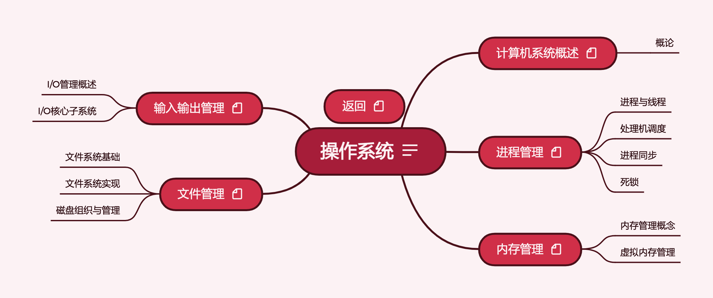

# PKM - 操作系统  


* 计算机系统概述
* 进程管理
* 内存管理
* 文件管理
* 输入输出管理

## 介绍

操作系统按照408考研辅导进行梳理。
## 资源
链接: https://pan.baidu.com/s/1QxzWfLDufuI2BAkbIk_1_g  
提取码: yq2f  
如果资源失效请联系我  

* __2022王道操作系统资料__ : 2022王道配套视频与习题解答

  ```
  1. 2022操作系统知识点
  2. 2022操作系统知识点课件
  3. 2022操作系统知识点习题讲解
  4. 2022操作系统知识点思维导图
  5. 2022操作系统强化直播
  6. 2022操作系统考研真题讲解
  7. 2022王道操作系统.pdf（课本）
  8. 2022操作系统考点补充文档.pdf
  9. 22版操作系统勘误.pdf
  10. 408真题原题与解析
  ```

* __2022天勤操作系统.pdf__: 2022年408考研辅导教材  

* __《操作系统概念 第7版翻译》.pdf__: 北邮计算机学院操作系统课程教材  

* __现代操作系统(第4版)[高清扫描版].pdf__: 国际知名教材  

* __汤子瀛操作系统__

  ```
  1. 计算机操作系统（第4版）汤小丹、汤子瀛.pdf
  2. 《计算机操作系统（第4版）》学习指导与题解.pdf
  ```

  

## 外部资源
* __studytonight__: https://www.studytonight.com/operating-system/
```
In this tutorial, we will cover the Operating System along with its various concepts.
The operating system acts as an intermediary between the user of a computer and the computer hardware. The main purpose of the Operating system is to provide an environment where the user can execute the programs in a convenient and efficient manner.
We will cover various scheduling algorithms in Operating system.
We will cover various operations done by the Operation System
Process Management
Memory Management
Virtual Memory Management
We will cover the concept of deadlocks in detail.
```
* __北京大学 Principles of Operating System 操作系统原理 by 陈向群__: https://www.bilibili.com/video/av9555596  
详细资料: https://www.yuque.com/ob26eq/nshoar/mhvtss
```
北京大学的网课，有一些配套资料在第二个链接中
```
* __OS Tutorial on OS2ATC2019__: 
https://github.com/rcore-os/rCore/wiki/os-tutorial-os2atc

* __操作系统的基本原理与简单实现--基于ucore OS + RISC-V__: 
https://chyyuu.gitbooks.io/simple_os_book/

* __rCore_tutorial V2__: 
https://rcore-os.github.io/rCore_tutorial_doc/

* __rCore-Tutorial V3（原作者开发中)__: 
https://rcore-os.github.io/rCore-Tutorial-deploy/
https://github.com/rcore-os/rCore-Tutorial
```
rCore_tutorial V2与rCore_tutorial V3是两个高质量实验教程
```
* __操作系统实验：基于 uCore OS__: 
https://www.shiyanlou.com/courses/221

## 版本
### V1 2021.9.10
按照《2022年操作系统考研复习指导》与相关课程进行整理，完成全部知识框架搭建  
### V2 2021.9.25
按照《2022年操作系统考研复习指导》与《2022年408考研大纲》进行整理，第四章扩充汤小丹《计算机操作系统（第4版）》内容，进行习题归纳与知识整合  