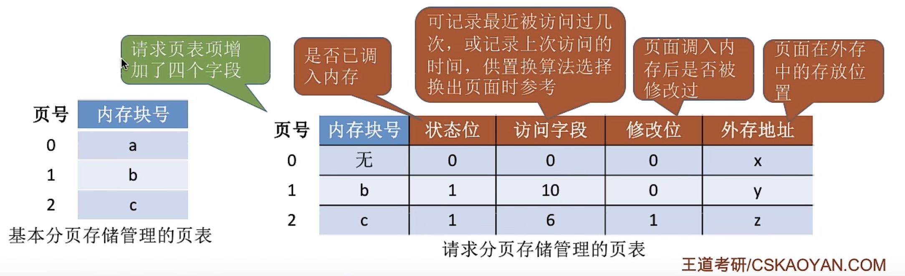
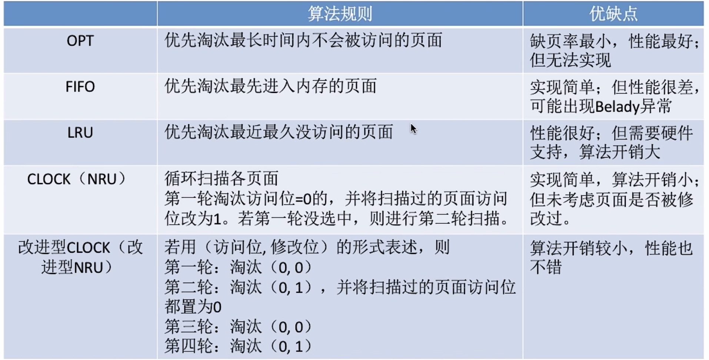
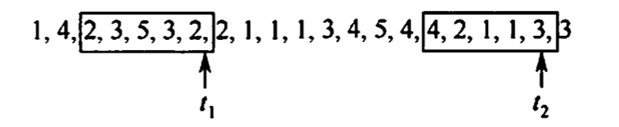

# 虚拟内存管理
2022.07.16

[TOC]

## 虚拟内存的基本概念

### 传统存储管理方式的特征

1. 一次性：一次全部调入内存
2. 驻留性：作业驻留在内存直到作业运行结束

### 局部性原理

1. 时间局部性：现在用的以后可能用
2. 空间局部性：某处用了附近可能用

### 虚拟存储器的定义和特征

1. 多次性：作业可以多次调入内存

2. 对唤性：暂时不用的作业部分调出内存

3. 虚拟性：逻辑上扩充内存

4. 注意

   虚拟内存<u>最大</u>容量：由CPU寻址范围确定

   虚拟内存<u>实际</u>容量：min{CPU寻址范围，内外存大小和}

### 虚拟内存技术的实现

三种方式：请求分页、请求分段、请求段页式

硬件支持：内存外存、页表机制、中断机构、地址变换机构

## 请求分页管理方式

### 页表机制

页号（隐藏）、内存块号、状态位（是否调入内存）、访问字段（for置换算法）、修改位、外存地址

### 缺页中断机构

缺页中断是**内中断**

> 中断
>
> 内中断(内部异常)：陷入Trap、故障(eg. 缺页中断)、终止
>
> 外中断：IO中断请求、人工干预

### 地址变换机构

1. 查快表
2. 查页表，修改位
3. 缺页中断 & 页面置换算法 & 调入调出

## 页框分配

### 驻留级大小

给一个进程分配的物理页框的集合就是**驻留集**

1. 页框越少，主存中进程越多，CPU利用率越高
2. 进程驻留集越小，缺页率越高
3. 进程驻留集越多，缺页率变化不大

### 内存分配策略

1. 分配：固定分配 & 可变分配
2. 置换：全局置换 & 局部置换
3. <u>固定分配局部置换</u>：进程的内存不变，缺页时自己换自己
4. <u>可变分配全局置换</u>：进程的内存不受限，缺页时随便找空的
5. <u>可变分配局部置换</u>：进程的内存受限但可变，缺页率越高分配的越多，缺页时自己换自己

> 没有固定+全局这种组合！

### 物理块调入算法

采用固定分配的算法！

1. <u>平均分配算法</u>：按“人头儿”算（进程数量平均分配）
2. <u>按比例分配算法</u>：按进程大小算
3. <u>优先权分配算法</u>：通常分成两部分，一部分按比例，一部分按优先权

### 调入页面的时机

1. <u>预调页策略</u>：程序员指出一会儿调啥，常用于进程的首次调入。
2. <u>请求调页策略</u>：一次调一页。运行期间的调入当时。

### 从何处调入页面

From where？

1. 文件区：存文件，离散分配
2. 对换区：存用于对换的页面，连续分配

Three Method

1. <u>系统拥有足够的对换区空间</u>：进程运行前把文件全都放到对换区，提高速度
2. <u>系统缺少足够的对换区空间</u>：不被修改的文件都放入文件区，会被修改的部分放到对换区
3. <u>UNIX方式</u>：进程相关的页面全在文件区，未运行过的从文件区调入，运行过又被换出的放到对换区，下次调着快。

## 页面置换算法

<iframe height=498 src="//player.bilibili.com/player.html?aid=70156862&bvid=BV1YE411D7nH&cid=235890180&page=46" scrolling="no" border="0" frameborder="no" framespacing="0" allowfullscreen="true"> </iframe>

### 最佳（OPT）置换算法

淘汰以后永远不使用的页面，或最长时间不使用的页面

缺点：人们无法预测未来，算法不能实现

### 先进先出（FIFO）置换算法

淘汰最先进来的页面

缺点：最早来的不见得不经常访问的；**Belady异常**（物理块数增大，缺页故障数不减反增）

### 最近最久未使用（LRU）置换算法

最近最长时间未访问的淘汰

### 时钟（CLOCK）置换算法

1. 将每一个进程视为一个循环队列。每个页面一个访问位，访问过是1，没访问过是0。
2. 新页面要被置换进来时，会寻找第一个访问位是0的将其替换，被扫描过的页面由1变0。
3. 如果找了一轮没找到，就将页面的访问位依次置0后，扫描第二遍。

### 改进型的时钟置换算法

1. 简单的时钟置换算法仅考虑到一个页面最近是否被访问过。事实上，如果被淘汰的页面没有被修改过就不需要执行1/0操作写回外存。只有被淘汰的页面被修改过时，才需要写回外存。
2. 因此，除了考虑一个页面最近有没有被访问过之外，操作系统还应考虑页面有没有被修改过。在其他条件都相同时，应优先淘汰没有修改过的页面，避免/0操作。这就是改进型的时钟置换
3. 算法的思想。修改位=0，表示页面没有被修改过；修改位=1，表示页面被修改过。为方便讨论，用（访问位，修改位）的形式表示各页面状态。如（1，1）表示一个页面近期被访问过，且被修改过。
4. 算法规则：将所有可能被置换的页面排成一个循环队列
   第一轮：从当前位置开始扫描到第一个（0,0）的帧用于替换。本轮扫描不修改任何标志位
   第二轮：若第一轮扫描失败，则重新扫描，查找第一个（0,1）的帧用于替换。本轮将所有扫描过的帧访问位设为0
   第三轮：若第二轮扫描失败，则重新扫描，查找第一个（0,R）的帧用于替换。本轮扫描不修改任何标志位

> 我的理解：
>
> 1. 普通的时钟置换算法，只考虑把没访问的也先换出去。改进的时钟置换算法，想把没写过的内容先换出去，因为这样不用改主存。
> 2. （访问位，修改为）。先把没改没用（0，0）的换出去，找不到就找改了没用的（1，0）。这里可能会想，我都改了怎么可能没用过呢。实际上我的理解是，找（0，0）找（0，1）是一个整体。如果两轮没找到会刷新访问位。然后再来找（0，0），（0，1），不过这次就可以找到了，算法就可以结束了。
> 3. 简化：「找(0,0)，找(0,1)，访问位(第一位)置0」

## 抖动和工作集

### 抖动

* 抖动：刚换出就要换入，刚换入就要换出
* 抖动根本原因：系统运行进程太多，每个进程的物理块太少

### 工作集

* **工作集**：某段时间间隔内，进程要访问的页面的集合：比如下图t1的工作集是{2,3,5}

  

* **工作集窗口** Delta，比如上图的Delta = 5；（也就是保留五个）

* **把工作及窗口里边的重复的去掉得到工作集**，也就是说工作级内容只能是窗口里的！不可能出现窗口前边的！也就是说工作集随着进程推进不断删除！

## 内存映射文件

内存映射文件（Memory- Mapped Files）与虚拟内存有些相似，将磁盘文件的全部或部分内容与进程虚拟地址空间的某个区域建立映射关系，便可以直接访问被映射的文件

## 虚拟存储器性能影响因素

* 抖动与工作集
* 局部性原理
* 页面置换算法
* 写回磁盘

## 地址翻译与地址保护

与页一样

