# 文件管理基础
2022.09.21

[TOC]

> 关键字小结:
>
> 1. 文件的组成
>    1. 数据项（基本数据项、组和数据项）
>    2. 记录
>    3. 关键字
> 2. 文件的逻辑结构
>    1. 无结构文件 / 流式文件
>    2. 有结构文件 / 文档式文件
>       1. 顺序文件（串结构，顺序结构）
>       2. 索引文件（for 定长 / 不定长 -> 索引表）
>       3. 索引顺序文件
>       4. 直接文件/散列文件(Hash File)
> 3. 文件的目录结构
>    1. 文件控制块FCB、文件目录/目录文件、(索引)结点
> 4. 文件的物理结构
>    1. 连续分配
>    2. 链接分配：隐式链接；显式连接，文件分配表 (File Allocation Table FAT)
>    3. 索引分配：链接方案、多层索引、混合索引
>    4. 混合索引分配：直接寻址、一次间接寻址、多次间接寻址
> 5. 文件的访问控制
>    1. 访问控制列表(Access-Control List, ACL)
>    2. 精简的访问列表：拥有者、组、其他
>    3. 口令
>    4. 密码

## 文件的基本概念

1. 计算机以**进程**为基本单位进行**资源的调度和分配**
   用户以**文件**为单位进行**输入和输出**
2. **数据项**（文件系统中最低级的数据组织形式）：**基本数据项**（用于描述一个对象的某种属性的一个值，是数据中的最小逻辑单位）；**组合数据项**（由多个基本数据项组成）。
3. **记录**（是组相关的数据项的集合，用于描述一个对象在某方面的属性）。
4. **文件**。**有结构文件**（文件由若干个相似的记录组成，如一个班的学生记录）和**无结构文件**（一个字符流，比如一个二进制文件或宇符文件）两种。

## 文件控制块和索引结点

1. 文件的属性：名称、类型、创建者、所有者、位置、大小、保护、创建时间、最后修改时间、最后存取时间。由文件控制块FCB控制文件的属性

2. **文件控制块**

   文件控制块 (FCB）是用来存放控制文件需要的各种信息的数据结构，以实现**“按名存取”**。FCB 的有序集合称为**文件目录**，一个**FCB** 就是一个**文件目录项**。下图图一个典型的FCB。为了创建一个新文件，系统将分配一个 FCB 并存放在文件目录中，称为目录项。一个文件目录也被视为一个文件，称为**目录文件**。

   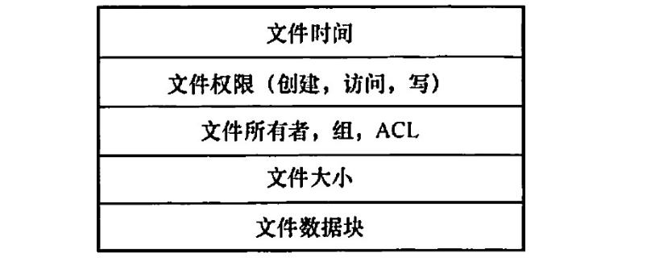

3. **索引结点**

   文件目录通常存放在磁盘上，当文件很多时，文件目录会占用大量的盘块。在查找目录的过程中，文件的其他描述信息不会用到，也不需要调入内存。因此，有的系统（如UNIX，下图）便采用了<u>文件名和文件描述信息分开的方法</u>，使<u>文件描述信息单独形成一个称为**索引结点**的数据结构</u>，简称**结点**(inode)。在文件目录中的每个目录项仅由文件名和指向该文件所对应的i结点的指针构成。

   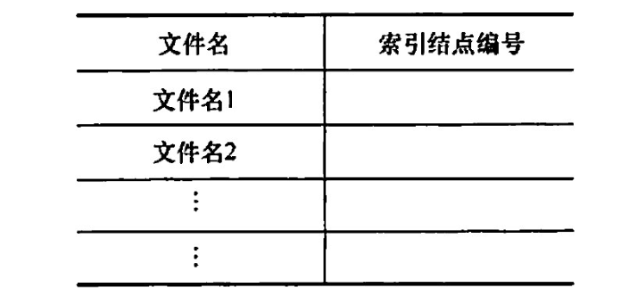

   1. 磁盘索引结点
   2. 内存索引结点。当文件被打开时，要将磁盘索引结点复制到内存的索引结点中。

## 文件的操作

1. 基本操作：创建、写、读、重定位、删除、截断

2. 文件的打开和关闭：

   open系统调用->在打开文件表添加表项

   close系统调用->从打开文件表删除表项

   <u>在多个不同进程可以同时打开文件的操作系统中</u>：【1】采用**两级表：每个进程表和整个系统表**。每个进程表根据它打开的所有文件，表中存储的是进程对文件的使用信息。系统打开文件表包含文件相关信息，如文件在磁盘的位置、访问日期和大小。一旦有进程打开了一个文件，系统表就包含该文件的条目。【2】当另一个进程执行调用open 时，只不过是在其进程打开表中增加一个条目，并指向系统表的相应条目。通常，系统打开文件表为每个文件关联一个**打开计数器 (Open Count）**，以记录多少进程打开了该文件。每个关闭操作close 使 count 递减，当打开计数器为0时表示该文件不再被使用，并且可从系统打开文件表中删除相应条目。

   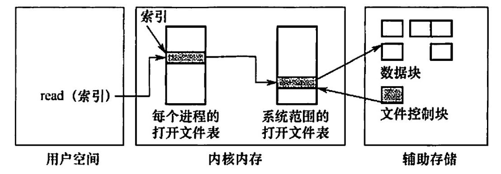

## 文件的保护

1. 访问类型

   * 读。从文件中读，
   * 写。向文件中写。
   * 执行。将文件装入内存并执行。
   * 添加。将新信息添加到文件结尾部分。
   * 删除。删除文件，释放空间。
   * 列表清单。列出文件名和文件属性。

2. 访问控制

   * 最常用——根据身份：为每个文件和目录增加一个**访问控制列表**(Access-Control List, ACL)

   * 访问控制列表的优点是可以使用复杂的访问方法，缺点是长度无法预计并且可能导致复杂的空间管理，使用**精简的访问列表**可以解决这个问题

   * 精简的访问列表采用**拥有者**(创建文件的用户)、**组**(一组需要共享文件且具有类似访问的用户)和**其他**(系统内的所有其他用户)三种用户类型。

   * **口令**指用户在建立一个文件时提供一个口令，系统为其建立 FCB 时附上相应口令，同时告诉允许共享该文件的其他用户。用户请求访问时必须提供相应的口令。这种方法时间和空间的开销不多，缺点是<u>口令直接存在系统内部</u>，不够安全。

   * **密码**指用户对文件进行加密，文件被访问时需要使用密钥。这种方法保密性强，节省了存储空间，不过编码和译码要花费一定的时间。口令和密码都是防止用户文件被他人存取或份取，并没有控制用户对文件的访问类型。

   * 注意两个问题：

     1. 现代操作系统常用的文件保护方法是，将<u>访问控制列表与用户、组和其他成员访问控制方案一起组合使用</u>。
     2. 对于多级目录结构而言，不仅需要保护单个文件，而且需要保护子目录内的文件，即需要提供<u>目录保护机制</u>。目录操作与文件操作并不相同，因此需要不同的保护机制。

## 文件的逻辑结构

文件的逻辑结构是从用户观点出发看到的文件的组织形式。

1. **无结构文件/流式文件**

   以字节（Byte）为单位。由于无结构文件没有结构，因而对记录的访问只能通过穷举搜索的方式，因此这种文件形式对大多数应用不适用。但字符流的无结构文件管理简单，用户可以方便地对其进行操作。所以，那些对基本信息单位操作不多的文件较适于采用宇符流的无结构方式，如源程序文件、目标代码文件等。

2. **有结构文件/记录式文件**

   1. **顺序文件**

      文件中的记录一个接一个地顺序排列，记录通常是定长的，可以顺序存储或以链表形式存储。

      顺序文件有以下两种结构：第一种是**串结构**，记录之间的顺序与关键字无关，<u>通常是按存入时间的先后进行排列</u>，对串结构文件进行检索必须从头开始顺序依次查找，比较费时。第二种是**顺序结构**，指文件中的所有记录<u>按关键字顺序排列</u>，可采用<u>折半查找法</u>，提高了检索效率。在对记录进行批量操作，即每次要读或写一大批记录时，<u>顺序文件的效率是所有逻辑文件中最高的</u>。此外，对于顺序存储设备（如磁带），也只有顺序文件才能被存储并能有效地工作。在经常需要查找、修改、增加或删除单个记录的场合，顺序文件的性能也比较差。

   2. **索引文件**

      对于定长记录文件，要查找第 i 条记录，可直接根据下式计算得到第i条记录相对于第1条记录的地址：$A,=i\times L$

      对于可变长记录的文件，要查找第 i条记录，必须顺序地查找前i-1条记录，从而获得相应记录的长度L，进而按下式计算出第i 条记录的首址$A_i=\sum_{i=0}^{n-1} L_i +1$

      变长记录文件只能顺序-查找，效率较低。为此，可以建立一张**索引表**，为主文件的每个记录在索引表中分别设置一个表项，包含指向变长记录的指针（即逻辑起始地址）和记录长度，索引表按关键字排序，因此其本身也是一个定长记录的顺序文件。这样就把对变长记录顺序文件的检索转变为对定长记录索引文件的随机检索，从而加快了记录的检索速度。

      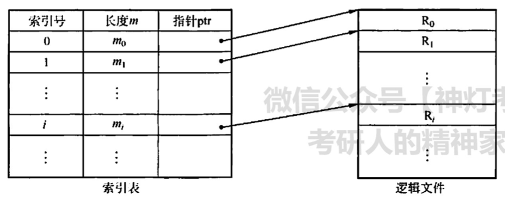

   3. **索引顺序文件**

      索引顺序文件是顺序文件和索引文件的结合。最简单的素引顺序文件只使用了一级索引。<u>索引顺序文件将顺序文件中的所有记录分为若干组，为顺序文件建立一张索引表</u>，在索引表中为每组中的第一条记录建立一个索引项，其中含有该记录的关键字值和指向该记录的指针。
      
      主文件名包含姓名和其他数据项。姓名为关键字，索引表中为每组的第1条记录（不是每条记录）的关键字值，用指针指向主文件中该记录的起始位置。索引表只包含关键字和指针两个数据项，所有姓名关键字递增排列。主文件中记录分组排列，同一个组中的关键字可以无序，但组与组之间的关键字必须有序。查找一条记录时，首先通过索引表找到其所在的组，然后在该组中使用顺序查找，就能很快地找到记录。

      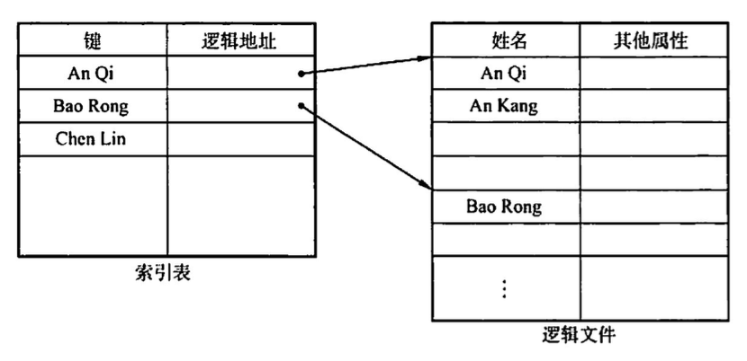

      对于含有 n 条记录的顺序文件，查找某关键字的记录时，平均需要查找 N/2 次。在索引顺序文件中，假设 N条记录分为 $\sqrt{n}$ 组，索引表中有、$\sqrt{n}$个 表项，每组有 $\sqrt{n}$ 条记录，在查找某关键宇的记录时，先顺序查找索引表，需要查找、$\sqrt{n}/2$ 次，然后在主文件中对应的组中顺序查找，也需要查找（$\sqrt{n}/2$ 次，因此共需查找、$\sqrt{n}/2$  + $\sqrt{n}/2$ = $\sqrt{n}$  次。显然，索引顺序文件提高了查找效率，若记录数很多，则可采用两级或多级索引。这种方式就是数据结构中的分块查找。索引文件和索引顺序文件都提高了存取的速度，但因为配置素引表而增加了存储空间。

   4. **直接文件或散列文件(Hash File)**
   
   给定记录的键值或通过散列函数转换的键值直接决定记录的物理地址。这种映射结构不同于顺序文件或索引文件，<u>没有顺序的特性</u>。
   
   散列文件有很高的存取速度，但是会引起冲突，即不同关键字的散列函数值相同。
   
   复习了数据结构的读者读到这里时，会有这样的感觉：有结构文件逻辑上的组织，是为在文件中查找数据服务的（顺序查找、索引查找、索引顾序查找、哈希查找）。前面介绍了文件内部的逻辑结构，下面介绍多个文件之间在逻辑上是如何组织的，这实际上是文件 “外部” 的逻辑结构的问题。

## 文件的物理结构

文件的物理结构就是<u>研究文件的实现</u>，即文件数据在物理存储设备上是如何分布和组织的。同一个问题有两个方面的回答：一是文件的分配方式，讲的是对磁盘非空闲块的管理：二是文件存储空间管理，讲的是对磁盘空闲块的管理。

1. **连续分配**

   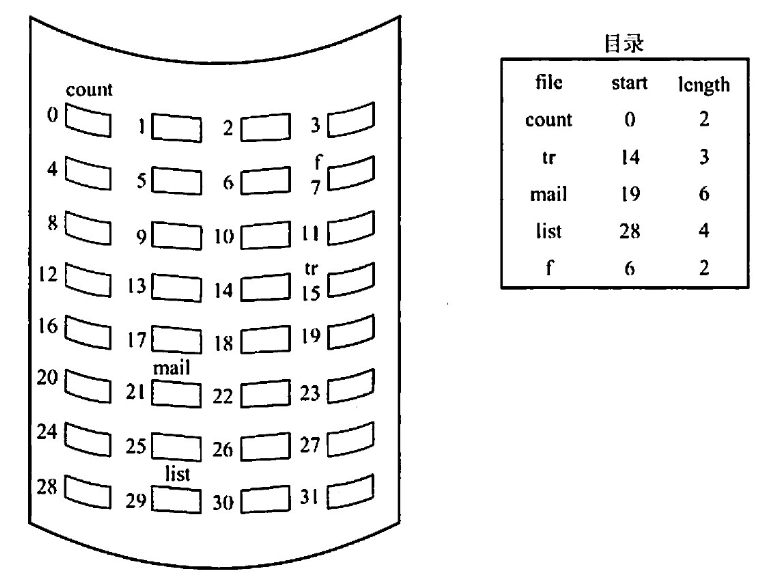

   采用连续分配时，逻辑文件中的记录顺序也存储在相邻接的块中。

   连续分配支持顺序访问和直接访问。优点是实现简单、存取速度快。缺点是：①文件长度不宜动态增加，因为一个文件末尾后的盘块可能己分配给其他文件，一旦需要增加，就需要大量移动盘块。②为保持文件的有序性，删除和插入记录时，需要对相邻的记录做物理上的移动，还会动态改变文件的长度。③反复增删文件后会产生外部碎片（与内存管理分配方式中的碎片相似）.④很难确定一个文件需要的空问大小，因而只适用于长度固定的文件。

2. **链接分配**

   消除了磁盘的外部碎片

   1. **隐式链接分配**

      隐式链接的缺点是只适合顺序访问。系统运行过程中由于软件或硬件错误导致链表中的指针丢失或损坏，会导致文件数据的丢失。通常的解决方案是，将几个<u>盘块组成族（cluster）</u>，按族而不按块来分配，可以成倍地滅少查找时间。比如一族为 4块，这样，指针所占的磁盛空间比例也要小得多。这种方法的代价是增加了内部碎片。族可以改善许多算法的磁盛访问时间，因此应用于大多数操作系统

      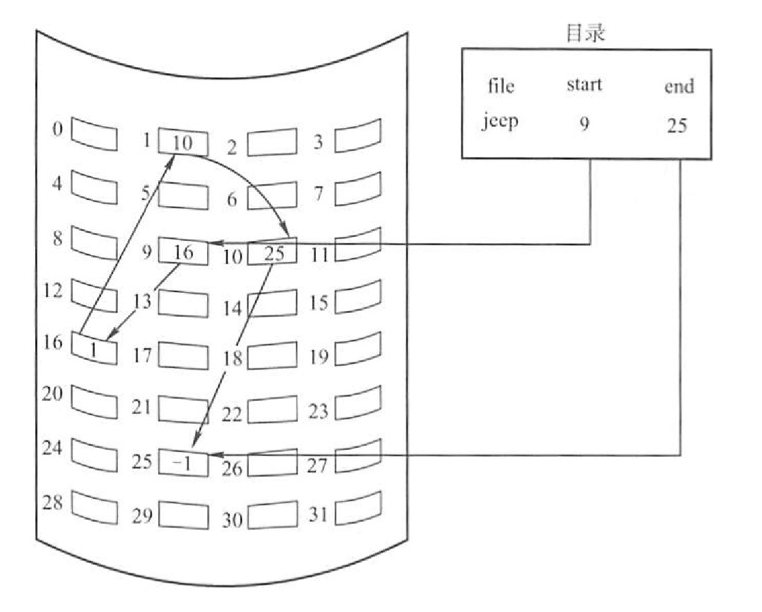

   2. **显示链接分配**

      显式链接是指把用于链接文件各物理块的指针，从每个物理块的末尾中提取出米，显示地存放在内存的一张链接表中。该表在整个磁盛中仅设置一张，称为**文件分配表 (File Allocation Table FAT)**。每个表项中存放链接指针，即下一个盘块号。文件的第一个盘块号记录在目录项“物理地址”字段中，后续的盘块可通过查 FAT 找到。-1代表最后一块。
      
   
   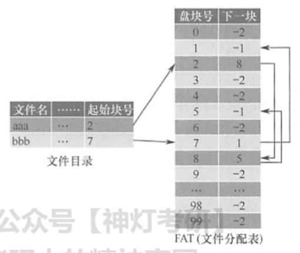
   
3. **索引分配**

   链接分配解决了连续分配的外部碎片和文件大小管理的问题。但依然存在问题：①链接分配不能有效支持直接访问(FAT 除外）：②FAT 需要占用较大的内存空间。事实上，<u>在打开某个文件时，只需将该文件对应盘块的编号调入内存即可，完全没有必要将整个 FAT 调入内存</u>。为此，索引分配将每个文件所有的盘块号都集中放在一起构成**索引块（表）**。

   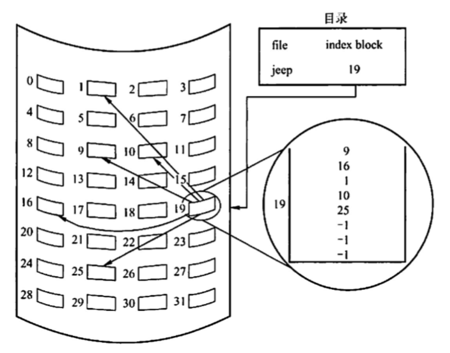

   每个文件都有其索引块，这是一个磁盘块地址的数组。索引块的第i个条目指向文件的第i个块。要读第i块，通过索引块的第i个条目的指针来查找和读入所需的块。

   索引分配的优点是<u>支持直接访问</u>，且<u>没有外部碎片问题</u>。缺点是由于索引块的分配，增加了系统存储空间的开销。索引块的大小是一个重要的问题，每个文件必须有一个索引块，因此索引块应尽可能小，但索引块太小就无法支持大文件。可以采用以下机制来处理这个问题

   * **链接方案**。一个索引块通常为一个磁盘块，因此它本身能直接读写。为了支持大文件，可以将多个索引块链接起来。
   * **多层索引**。通过第一级索引块指向一组第二级的索引块，第二级索引块再指向文件块。查找时，通过第一级索引查找第二级索引，再采用这个第二级索引查找所需数据块。这种方法根据最大文件大小，可以继线到第三级或第四级。例如，4096B 的块，能在索引块中存入 1024个4B 的指针。两级素引支持 1048576 个数据块，即支持最大文件为 4GB。
   * **混合索引**。将多种索引分配方式相结合的分配方式。例如，系统既采用直接地址，又采用单级索引分配方式或两级索引分配方式。该内容为***高频考点***，下面用一节专门介绍。此外，访问文件需两次访问外存，先读取索引块的内容，然后访问具体的磁盘块，因而降低了文件的存取速度。为了解决这一问题，通常将文件的索引块读入内存，以提高访问速度。

4. **混合索引分配**

   为了能够较全面地照顾到小型、中型、大型和特大型文件，可采用混合索引分配方式。对于**小文件**，为了提高对众多小文件的访问速度，最好能将它们的每个盘块地址直接放入 FCB，这样就可以直接从 FCB 中获得该文件的盘块地址，即为**直接寻址**。对于**中型文件**，可以采用**单级索引**方式，需要先从 FCB 中找到该文件的索引表，从中获得该文件的盘块地址，即为**一次间址**。对于**大型或特大型文件**，可以采用**两级和三级索引分配方式**。UNIX 系统采用的就是这种分配方式在其索引结点中，共设有13个地址项，即i.addr(o)~i.addr(12)，如下图。

   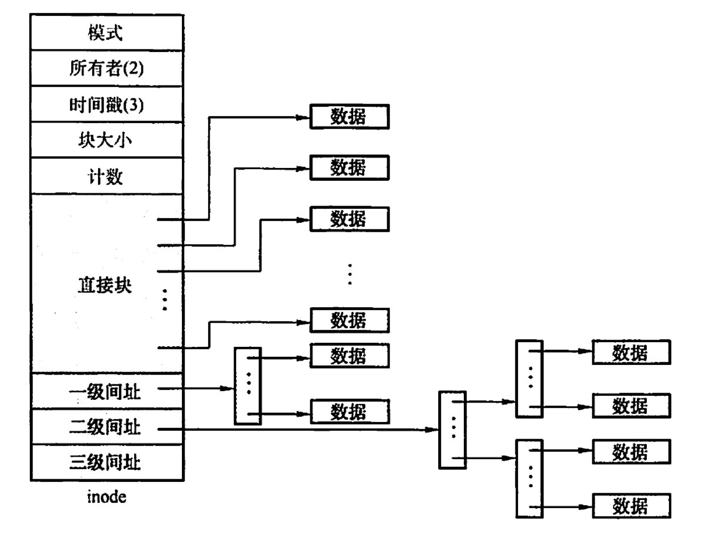

   1. **直接地址**。为了提高对文件的检索速度，在索引结点中可设置 10 个直接地址项，即用iaddr(O) ~ iaddr(9)来存放直接<u>地址，即文件数据盘块的盘块号</u>。假如每个盘块的大小为4KB，当文件不大于 40KB 时，便可直接从素引结点中读出该文件的全部盘块号。
   2. **一次间接地址**。对于中、大型文件，只采用直接地址并不现实的。为此，可再利用索引结点中的地址项 iaddr(10)来提供一次间接地址。这种方式的实质就是一级索引分配方式图中的一次问址块也就是索引块，系统将分配给文件的多个盘块号记入其中。在一次间址块中可存放1024 个盘块号，因而允许文件长达4MB。
   3. **多次间接地址**。当文件长度大于 4MB + 40KB（一次间接地址与10个直接地址项）时系统还需采用二次间接地址分配方式。这时，用地址项 iaddr(11)提供二次间接地址。该方式的实质是两级索引分配方式。系统此时在二次间址块中记入所有一次间址块的盘号地址项 i.addr(11)作为二次间址块，允许文件最大长度可达4GB。同理，地址项 iaddr(12)作为三次问址块，其允许的文件最大长度可达4TB。

## 例题

1. 【2009 統考真题】文件系统中，文件访问控制信息存储的合理位置是（）.
   A.文件控制块
   B.文件分配表
   C.用户口令表
   D.系统注册表

   【答案】：A

2. 【2009 統考真题】下列文件物理结构中，适合随机访问且易于文件扩展的是（）。
   A.连续结构
   B.索引结构
   C.链式结构且磁盘块定长
   D.链式结构且磁盘块变长

   【答案】：B

3. 【2010 统考真题】设文件索引结点中有7个地址项，其中4个地址项是直接地址索引，2个地址项是一级问接地址索引，1个地址项是二级间接地址索引，每个地址项大小为 4B，若磁盘索引块和磁盘数据块大小均为 256B，则可表示的单个文件最大长度是(）。
   A. 33KB
   B. 519KB
   C. 1057KB
   D. 16516KB

   【答案】：

   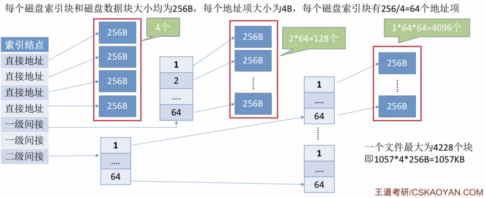

4. 【2012 统考真题】若一个用户进程通过read 系统调用读取一个磁盘文件中的数据，则下列关于此过程的叙述中，正确的是（)。
   I．若该文件的数据不在内存，则该进程进入睡眠等待状态
   II. 请求read 系统调用会导致CPU 从用户态切换到核心态
   III. read 系统调用的参数应包含文件的名称
   A. 仅I、II
   B. 仅I、III
   C. 仅II、II
   D. I、II和III

   【答案】：B -> A。read不需要文件名，open需要。

5. 【2013 统考真题】用户在删除某文件的过程中，操作系统不可能执行的操作是（）
   A. 刪除此文件所在的目录
   B. 删除与此文件关联的目录项
   C. 删除与此文件对应的文件控制块
   D. 释放与此文件关联的内存缓冲区

   【答案】：A

6. 【2013統考真题】若某文件系统索引结点(inode）中有直接地址项和问接地址项，则下列选项中，与单个文件长度无关的因素是（)
   A. 索引结点的总数
   B. 间接地址索引的级数
   C. 地址项的个数
   D. 文件块大小

   【答案】：A

7. 【2013 统考真题】为支持 CD-ROM 中视频文件的快速随机播放，播放性能最好的文件数据块组织方式是（）
   A. 连续结构
   B. 链式结构
   C. 直接索引结构
   D. 多级索引结构

   【答案】：A

8. 【2014 统考真题】在一个文件被用户进程首次打开的过程中，操作系统需做的是（）.
   A.将文件内容读到内存中
   B. 将文件控制块读到内存中
   C.修改文件控制块中的读写权限
   D.将文件的数据缓冲区首指针返回给用户进程

   【答案】：B

9. 【2015 统考真题】在文件的索引结点中存放直接索引指针10个，一级和二级索引指针各1个。磁盘块大小为 1KB，每个索引指针占 4B。若某文件的索引结点已在内存中，则把该文件偏移量（按字节编址）为 1234 和307400处所在的磁盘块读入内存，需访问的磁盘块个数分别是（）.
   A. 1,2
   B. 1,3
   C. 2,3
   D.2,4

   【答案】：D -> B

   10，1，1

   1KB/4B=1024B/4B=256

   8x1KB = 8096 > 1234，访存两次 -> 一次

   256x1KB = 262144<307400，访存4次 -> 3次

   注意问的是访问的磁盘块，访存不是访问的磁盘块！

10. 【2017統考真题】某文件系统中，针对每个文件，用户类别分为4 类：安全管理员、文件主、文件主的伙件、其他用户；访问权限分为5种：完全控制、执行、修改、读取、写入。若文件控制块中用二进制位串表示文件权限，为表示不同类别用户对一个文件的访问权限，则描述文件权限的位数至少应为（）。
    A. 5
    B. 9
    C. 12
    D. 20

    【答案】：2+3=5，A❌

    可以把用户访问权限抽象为一个矩阵，行代表用户，列代表权限。矩阵四行五列

    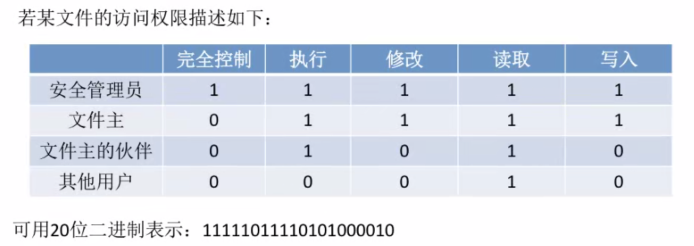

11. 【2018 统考真题】下列优化方法中，可以提高文件访问速度的是（）
    I. 提前读
    II. 为文件分配连续的筷
    III.延迟写
    IV.来用磁盘高速缓存
    A. 仅I、II
    B.仅II、III
    C.仅I、III、IV
    D. I、 II、 III、 IV

    【答案】：D

12. 【2020 统考真题】下列选项中，支持文件长度可变、随机访问的磁盘存储空间分配方式是（ ）。
    A.索引分配
    B.链接分配
    C.连续分配
    D.动态分区分配

    【答案】：A

13. 【2020 统考真题】某文件系统的目录项由文件名和索引结点号构成。若每个目录项长度为64字节，其中4宇节存放索引结点号，60 字节存放文件名。文件名由小写英文字母构成，则该文件系统能创建的文件数量的上限为（）
    A. 2^26
    B. 2^32
    C. 2^60
    D. 2^64

    【答案】：B

14. 【2011 统考真题】某文件系统为一级目录结构，文件的数据一次性写入磁盘，已写入的文件不可修改，但可多次创建新文件。请回答如下问题
    1）在连续、链式、索引三种文件的数据块组织方式中，哪种更合适？说明理由。为定位文件数据块，需要在 FCB 中设计哪些相关描述字段？
    2）为快速找到文件，对于 FCB，是集中存储好，还是与对应的文件数据块连续存储好？说明理由。

    【答案】：

    1. 采用连续存储，磁盘寻道时间更短，文件随机访问效率更高。

       <起始块号，块数>

    2. 集中存储，因为随机查找文件名的时候可以快速找到FCB。

15. 【2012统考真题】某文件系统空间的最大容量为4TB（1TB =2^40B），以磁盘块为基本分配单位。磁盘块大小为 1KB。文件控制块（FCB）包含一个512B 的索引表区。请回答下列问题：
    1）假设素引表区仅采用直接索引结构，索引表区存放文件占用的磁盘块号，索引表项中块号最少占多少字节？可支持的单个文什的最大长度是多少字节？
    2）假设索引表区来用如下结构：第0-7字节采用<起始块号，块数>格式表示文件创建时预分配的连续存储空间。其中起始块号占 6B，块数占 2B，剩余 504B 采用直接索引引结构，一个索引项占6B，则可支持的单个文件的最大长度是多少字节？为使单个文件的长度达到最大，请指出起始块号和块数分别所占字节数的合理值并说明理由

    【答案】：

    1. 总块数：2^40/2^10 = 2^30，4B

       512/4=128, 128KB

    2. 总块数1:2^48

       总块数2:2^16 -> 2^16KB，（连续分配）

       504/6=84，84KB，（索引）

       总大小：(84+2^16)KB

16. 【2014 统考真题】文件F由200条记录组成，记录从1开始编号。用户打开文件后，欲将内存中的一条记录插入文件F，作为其第30条记录。请回答下列问题，并说明理由。
    1）若文件系统采用连续分配方式，每个磁盘块存放一条记录，文件 F存储区域前后均有足够的空闲磁盘空间，则完成上述插入操作最少需要访问多少次磁盘块？F的文件控制块内容会发生哪止改变？
    2）若文件系统来用链接分配方式，每个磁盘块存放一条记录和一个链接指针，则完成上述插入操作需要访问多少次磁盘块？若每个存储块大小为1KB，其中4B 存放链接指针，则该文件系统支持的文件最大长度是多少？

    【答案】：

    1. 170❌，最少可以向前移动，是29x2+1=59次。移动是两次！

       首地址和总长度会改变

    2. 找到第29个块(29)，并修改(1)，写入第30个块(1) = 31次

       1KB x 2^32 = 4T，其中数据部分：4080GB

17. 【2016 统考卖题】莱磁盘文件系統使用链接分配方式组织文件，族大小为 4KB。目录文件的每个目录项包括文件名和文件的第一个筷号，其他族号存放在文件分配表 FAT中。
    1）假定目录树如下图所示，各文件占用的族号及顺序如下表所示，其中dir, dir1 是目录，file1, file2 是用户文件。请给出所有目录文件的内容。
    2）若FAT 的每个表项仅存放族号，占2B，则FAT 的最大长度为多少字节？该文件系统支持的文件长度最大是多少？
    3）系统通过目录文件和FAT 实现对文件的按名存取，说明file1的106,108 两个族号分别存放在 FAT 的哪个表项中。

    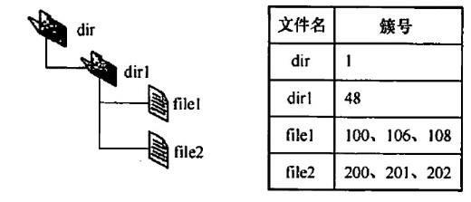

    4）假设仅FAT 和dir日录文件已读入内存，若需将文件dir/dir1/file1的第 5000个字节读入内存，则要访问哪几个族？

    【答案】：

    1. dir目录文件：\<dir1,1\>

       dir1目录文件：\<file1,100\>,\<file2,200\>

    2. 2B -> 2^16个簇

       FAT 的最大长度: 2^16 x 2B = 128KB

       文件最大: 2^16 x 4KB = 256MB

    3. FAT 的每个表项中存放下一个族号。file1 的族号106 存放在FAT 的100 号表项中，筷号108 存放在FAT 的106号表项中。

    4. 5000/4096 > 1 -> 在106簇里边。首先访问48簇获取file1的FAT。然后访问106簇读取文件内容。

18. 【2018 統考其题】某文件系统来用索引结点存放文件的属性和地址信息，簇大小为 4KB。每个文件索引结点占 64B，有11个地址项，其中直接地址项8个，一级、二级和三级间接地址项各1个，每个地址项长度为 4B。请回答下列问题：
   1）该文件系统能支持的最大文件长度是多少？（给出计算表达式即可）
   2）文件系统用 1M （1M =2^20）个簇存放文件索引结点，用512M 个筷存放文件数据。若一个图像文件的大小为 5600B，则该文件系统最多能存放多少个这样的图像文件？
   3）若文件F1的大小为6KB，文件F2 的大小为 40KB，则该文系统获取F1 和F2最后一个筷的簇号需要的时间是否相同？为什么？

   【答案】：

   1. 4KB x (8+1024+1024^2+1024^3) = 32KB + 4MB + 4GB + 4TB

   2. 5600B=5.46875KB,存一个照片需要两个簇。512M/2 = 256M。1Mx4KB/64B=64M。min{256,64}=64M

   3. 6KB/4KB->第二个簇

      40KB/4KB->第10个簇，需要间接寻址。所以时间不相同

   