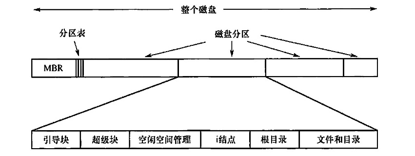
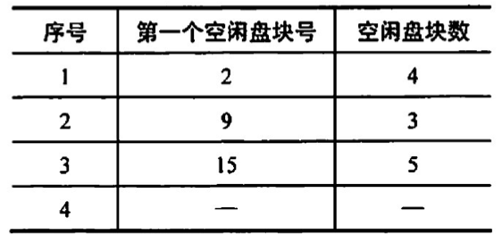
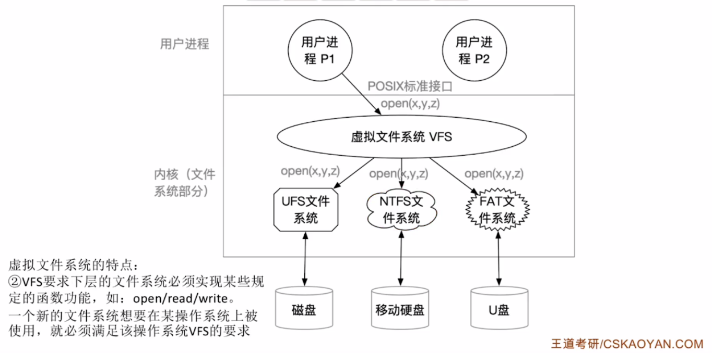

# 文件系统
2022.09.21

[TOC]

## 文件系统结构

1. IO控制
2. 基本文件系统
3. 文件组织模块：eg逻辑块、物理块
4. 逻辑文件系统：eg元数据（不是实际数据）

## 文件系统分布

1. 文件系统在**磁盘**中的结构

   

   1. **主引导记录**（Master Boot Record, MBR），位于磁盘的0号扇区，用来引导计算机，MBR后面是分区表，该表给出每个分区的起始和结束地址。表中的一个分区被标记为活动分区，当计算机启动时，BIOS 读入并执行 MBR。MBR 做的第一件事是确定活动分区，读入它的第一块，即引1导块。
   2. **引导块**（boot block)，MBR 执行引导块中的程序后，该程序负责启动该分区中的操作系统。为统一起见，每个分区都从一个引导块开始，即使它不含有一个可启动的操作系统，也不排除以后会在该分区安装一个操作系统。Windows 系统称之为分区引导扇区。除了从引导块开始，磁盘分区的布局是随着文件系统的不同而变化的。文件系统经常包含有如上图所列的一些项目。
   3. **超级块**（super block），包含文件系统的所有关键信息，在计算机启动时，或者在该文件系统首次使用时，超级块会被载入内存。超级块中的典型信息包括分区的块的数量、块的大小、空闲块的数量和指针、空闲的 FCB 数量和 FCB 指针等。
   4. 文件系统中**空闲块的信息**，可以使用**位示图或指针链接**的形式给出。后面也许跟的是一组i结点（**i结点区**），每个文件对应一个结点，i结点说明了文件的方方面面。接着可能是**根目录**，它存放文件系统目录树的根部。最后，磁盘的其他部分存放了其他所有的目录和文件。

2. 文件系統在**内存**中的结构

  内存中的信息用于管理文件系统并通过**缓存**来提高性能。这些数据在安装文件系统时被加载，在文件系统操作期间被更新，在卸载时被丢弃。这些结构的类型可能包括：

  1）内存中的安装表(mount table），包含每个已安装文件系统分区的有关信息。
  2）内存中的目录结构的缓存包含最近访问目录的信息。对安装分区的目录，它可以包括个指向分区表的指针。
  3）【**系统打开文件表**】（整个系统只有一张）整个系统的打开文件表，包含每个打开文件的 FCB 副本及其他信息。
  4）【**进程打开文件表**】（包含在PCB中）每个进程的打开文件表，包含一个指向整个系统的打开文件表中的适当条目的指针，以及其他信息

  为了创建新的文件，应用程序调用逻辑文件系统。逻辑文件系统知道目录结构的格式，它将为文件分配一个新的 FCB。然后，系统将相应的目录读入内存，使用新的文件名和 FCB 进行更新，并将它写回磁盘。

  一旦文件被创建，它就能用于 IO。不过，首先要打开文件。系统调用open0将文件名传递给逻辑文件系统。调用open0首先搜索整个系统的打开文件表，以确定这个文件是否已被其他进程使用。如果己被使用，则在单个进程的打开文件表中创建一个条目，让其指向现有整个系统的打开文件表的相应条目。该算法在文件己打开时，能节省大量开销。如果这个文件尚未打开，则根据给定文件名来搜索目录结构。部分目录结构通常缓存在内存中，以加快目录操作。找到文件后，它的 FCB 会会复制到整个系统的打开文件表中。该表不但存储FCB，而且跟踪打开该文件的进程的数量。然后，在单个进程的打开文件表中创建一个条目，并且通过指针将整个系统打开文件表的条目与其他域(如文件当前位置的指针和文件访问模式等）相连。调用open0返回的是一个指向单个进程的打开文件表中的适当条目的指针。以后，所有文件操作都通过该指针执行。一旦文件被打开，内核就不再使用文件名来访问文件，而使用文件描述符(Windows 称之为文件句柄）。

  当进程关闭一个文件时，就会州除单个进程打开文件表中的相应条目，整个系统的打开文件表的文件打开数量也会递减。当所有打开某个文件的用户都关闭该文件后，任何更新的元数据将复制到磁盘的目录结构中，并且整个系统的打开文件表的对应条目也会被删除。

  

## 外存管理

1. 逻辑卷与物理盘的关系

   

2. 空闲表法

   

3. 空闲链表法

   1. 空闲盘块链：把空闲盘块拉成一条链，需要空间时依次分配。
   2. 空闲盘区链：把空闲盘区（盘区包含多个盘块）拉成一条链，需要空间时依次分配。

4. 位示图法

   0表示空闲，1表示已分配

   ⚠️注意下标从1开始⚠️

   

5. 成组链接法

   

   ## 虚拟文件系统

   

1. VFS：虚拟文件系统
2. 要求下层具体文件系统统一接口
3. VFS会创建VNode，统一代表多种多样的文件索引结点

## 习题

1. 从用户的观点看，操作系统中引入文件系统的目的是( ）。
   A.保护用户数据
   B.实现对文件的按名存取
   C.实现虛拟存储
   D.保存用户和系统文档及数据

   【答案】：B

2. UNIX 操作系统中，文件的索引结构放在（ ）。
   A.超级块
   B.索引结点
   C.目录项
   D.空闲块

   【答案】：A->B

3. 位示图可用于( ）
   A.文件目录的查找
   B.磁盘空间的管理
   C.主存空问的管理
   D.文件的保密

   【答案】：B

4. 文件的存储空问管理实质上是对（ ）的组织和管理
   A. 文件目录
   B. 外存已占用区域
   C. 外存空闲区
   D. 文件控制块

   【答案】：B->C

5. 若用8个字（字长32位）组成的位示图管理内存，假定用户归还一个块号为 100的内存块时，它对应位示图的位置为（）。
   A. 宇号为3，位号为5
   B. 字号为4，位号为4
   C. 宇号为3，位号为4
   D. 字号为4，位号为5

   【答案】：32bit代表32块。100/32=3...4，B

6. 下列选项中，（）不是Linux 实现虛拟文件系统VFS 所定义的对象类型。
   A. 超級块(superblock）对象
   B. 目录项（inode）对象
   C. 文件（file）对象
   D. 数据（data）对象

   【答案】：D

7. **【2015 统考真题】**文件系统用位图法表示磁盘空问的分配情况，位图存于磁盘的 32~127号块中，每个盘块占 1024B，盘块和块内字节均从0开始编号。假设要释放的盘块号为409612，则位图中要修改的位所在的盘块号和块内宇节序号分别是（）。
   A. 81,1
   B. 81,2
   C. 82,1
   D. 82,2

   【答案】：409612/1024=400...12。400/8=50，50+32-1=81，80+1=82，C

8. **【2019 统考真题】**下列选项中，可用于文件系统管理空闲磁盘块的数据结构是（）。
   I.位图
   II.索引结点
   III.空闲磁盘块链
   IV.文件分配表 (FAT)
   A. 仅I、II
   B. 仅I、III、IV
   C. 仅I、III
   D. 仅II、III、IV

   【答案】：C -> B. 文件分配表（FAT）的表项与物理磁盘块一一对应，并且可以用一个特殊数字 -1表示文件的最后一块，用 -2 表示这个磁盘块是空闲的，因此文件分配表（FAT）不仅记录了文件中各个块的先后链接关系，同时还标记了空闲的磁盘块，操作系统可以通过FAT对文件存储空间进行管理，即 IV 正确。