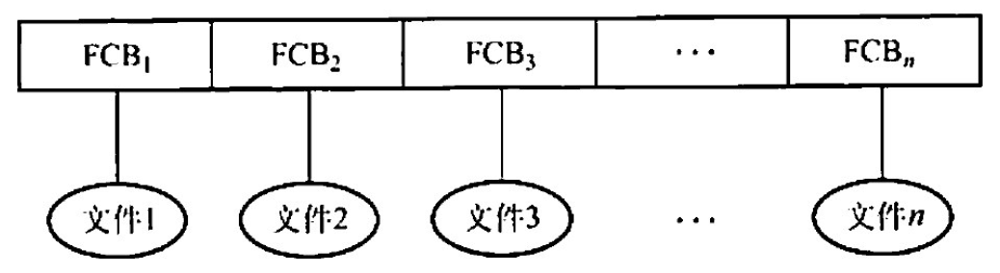
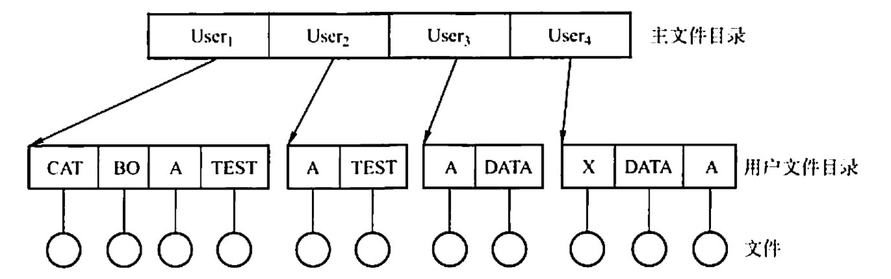
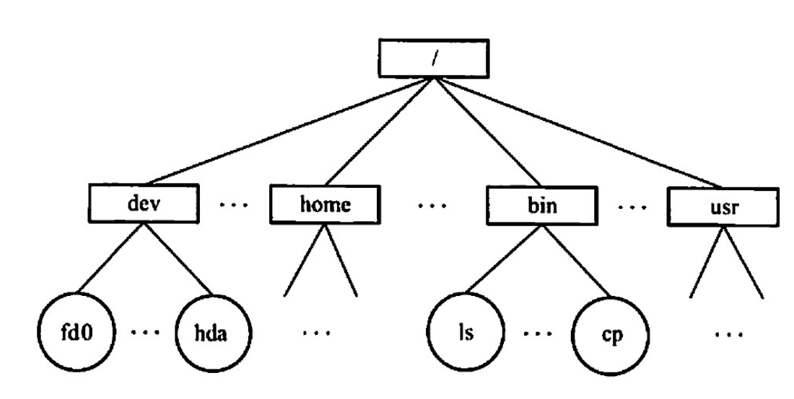
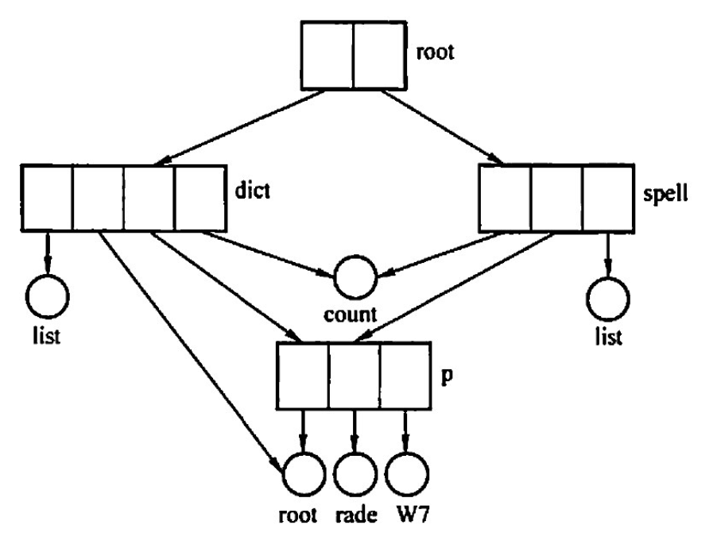
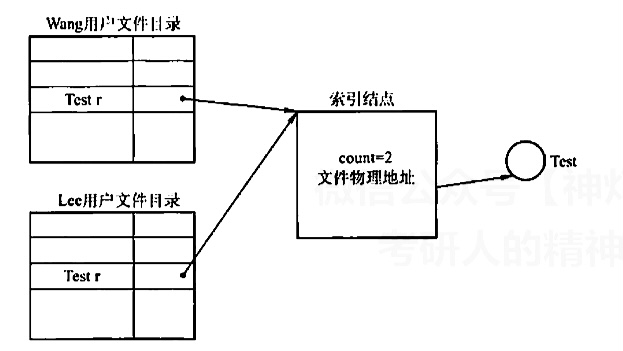

# 目录
2022.09.21

[TOC]

## 目录结构

1. 单目录结构

   

2. 两级目录结构

   

   * 主文件目录（Master File Dictionary，MFD）
   * 用户文件目录（File File Dictionary，UFD）

3. 树型目录结构

   

4. 无环图目录结构

   

## 文件共享

1. 基于索引结点的共享方式（硬链接）

   

2. 利用符号链实现文件共享（软链接）

   系统创建LINK类型文件。也可以用于网络共享中。软链接速度比硬链接慢。

## 例题

1. 一个文件系统中，其FCB 占64B，一个盘块大小为 1KB，采用一级目录。假定文件目录中有3200个目录项。则查找一个文件平均需要（）次访问磁盘。
   A. 50
   B. 54
   C. 100
   D. 200

   【答案】：1600/2^{4}=100，C

2. 下列关于目录检索的论述中，正确的是（）。
   A. 由于散列法具有较快的检索速度，因此现代操作系统中都用它来替代传统的顺序检索方法
   B. 在利用顺序检索法时，对树形目录应采用文件的路径名，且应从根目录开始逐级检索
   C. 在利用顺序检索法时，只要路径名的一个分量名未找到，就应停止查找
   D. 利用顺序检索法查找完成后，即可得到文件的物理地址

   【答案】：C

3. 一个文件的相对路径名是从（ ）开始，逐步沿着各级子目录追溯，最后到指定文件的整个通路上所有子目录名组成的一个字符串
   A. 当前目录
   B. 根目录
   C. 多级目录
   D. 二级目录

   【答案】：A

4. 文件系统来用各级目录结构的目的是( ）
   A. 减少系统开销
   B. 节省存储空间
   C. 解决命名冲突
   D. 缩短传送时间

   【答案】：C

5. 若文件系统中有两个文件重名，则不应来用（ )。
   A.单级目录结构
   B.两级目录结构
   C.树形目录结构
   D.名级目录丝构

   【答案】：A

6. 下西的说法中，错误的是（）。
   I.一个文件在同一系统中、不同的存储介质上的复制文件，应来用同一种物理结构
   II.对一个文件的访问，常由用户访问权限和用户优先级共同限制
   III.文件系统采用树形目录结构后，对于不同用户的文件，其文件名应该不同
   IV.为防止系统故障造成系统内文件受损，常采用存取控制矩阵方法保护文件
   A. II
   B. I、III
   C. I、III、IV
   D. 全选

   **【答案】**：B->D。II：对一个文件的访问，常由用户访问权限和**文件属性**共同限制。为防止系统故障造成系统内文件受损，采用备份。多用户权限采用存取控制矩阵方法保护文件。

7. 【2010统考真题】设当前工作目录的主要目的是（）。
   A. 节省外存空问
   B. 节省内存空间
   C. 加快文件的检索速度
   D. 加快文件的读/写速废

   【答案】：C

8. 【2009 统考真题】设文件F1的当前引用计数值为 1，先建立文件 F1的符号链接（软链按）文件 F2，再建立文件F1的硬链接文件F3，然后州除文件F1。此时，文件F2和文件F3的引用计数值分別是（）。
   A. 0.1
   B. 1.1
   c. 1.2
   D. 2.1

   **【答案】**：A -> B。**建立符号链接时，计数值直接复制**

9. 【2017统考真题】若文件f1的硬链接为 f2，两个进程分别打开f1和12，获得对应的文件描述符为f1和f2，则下列叙述中正确的是（)
   I.   f1和12的读写指针位置保持相同
   II.  f1和12共享同一个内存索引结点
   III. fd1 和fa2分别指向各自的用户打开文件表中的一项
   A. 仅III
   B. 仅II、III
   C. 仅I、II
   D. I、II和III

   **【答案】**：D -> B

10. 【2020 统考真题】若多个进程共享同一个文件F，则下列叙述中，正确的是（ ）。
    A.各进程只能用“读”方式打开文件下
    B.在系统打开文件表中仅有一个表项包含F的属性
    C.各进程的用户打开文件表中关于F的表项内容相同
    D.进程关闭F时，系统删除F 在系统打开文件表中的表项

    **【答案】**：B

11. 【2021 统考真题】若目录dir下有文件file1，则为删除该文件内校不必完成的工作是（）
    A. 删除 file1 的快捷方式
    B.释放file1 的文件控制块
    C.释放file1 占用的磁盘空间
    D.删除目录dir 中与file1对应的目录项

    **【答案】**：A

