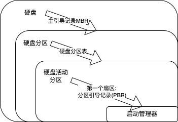

# 操作系统引导
2022.05.21

[TOC]

①**激活 CPU**。激活的 CPU 读取 **ROM** 中的 **boot** 程序，将**指令寄存器**置为 **BIOS**(基本输入/输出系统）的第一条指令，即开始执行 BIOS 的指令。

②**硬件自检**。启动 BIOS 程序后，先进行硬件自检，检查硬件是否出现故障。如有故障，主板会发出不同含义的蜂鸣，启动中止；如无故障，屏幕会显示 CPU、内存、硬盘等信息。

③**加载带有操作系统的硬盘**。硬件自检后，BIOS 开始读取 **Boot Sequence**(通过 CMOS 里保存的启动顺序，或者通过与用户交互的方式），把控制权交给启动顺序排在第一位的存储设备，然后 CPU 将该存储设备引导扇区的内容加载到内存中。

④**加载主引导记录 MBR**。硬盘以特定的标识符区分引导硬盘和非引导硬盘。如果发现一个存储设备不是可引导盘，就检查下一个存储设备。如无其他启动设备，就会死机。主引导记录MBR 的作用是告诉 CPU 去硬盘的哪个主分区去找操作系统。

⑤**扫描硬盘分区表**，**并加载硬盘活动分区**。MBR 包含硬盘分区表，硬盘分区表以特定的标识符区分活动分区和非活动分区。主引导记录扫描硬盘分区表，进而识別含有操作系统的硬盘分区（活动分区）。找到硬盘活动分区后，开始加载硬盘活动分区，将控制权交给活动分区。

⑥**加载分区引导记录 PBR**。读取活动分区的第一个扇区，这个扇区称为分区引导记录(PBR)，其作用是寻找并激活分区根目录下用于引导操作系统的程序（启动管理器)。

⑦**加载启动管理器**。分区引导记录搜索活动分区中的启动管理器，加载启动管理器。

⑧**加载操作系统**。

> 小结：
>
> * 硬盘
>
> * -(主引导记录MBR)> 
>
> * 硬盘分区
>
> * -(硬盘分区表)> 
>
> * 硬盘活动分区
>
> * -(第一个扇区: 分区引导记录(PBR))> 
>
> * 启动管理器
> * 

* 计算机操作系统的引导程序位于（）中。

  A. 主板BIOS，B. 片外Cache, C. 主存ROM区 D. 硬盘

  D。操作系统的引导程序位于磁盘活动分区的引导扇区中。引导程序分为两种：一种是位子 ROM中的自举程序 （B1OS 的组成部分），用于启动具体的设备：另一种是位于装有操作系统硬盘的活动分区的引导扇区中的引导程序（称为启动管理器），用于引导操作系统。

* 计算机的启动过程是（）。 OCPU 加电，CS:IP 指向 FFFFOF; ②进行操作系统引导；
  ③执行 JMP 指令跳转到 BIOS; ④登记 B1OS 中断例程入口地址；⑤硬件自检。

  答案：13452

* 检查分区表是否正确，确定哪个分区为活动分区，并在程序结束时将该分区的启动程序
  （操作系统引导扇区）调入内存加以执行，这是（）的任务。
  A. MBR
  B. 引导程序
  C.操作系统
  D. BIOS

  A。

  **Step1. CPU找第一顺位设备，控制权给第一顺位设备**

  **Step2. 第一顺位设备找MBR，控制权给MBR**

  **Step3. MBR找活动分区，控制权给活动分区**

  **Step4. 活动分区找引导程序(启动管理器)，控制权给引导程序**