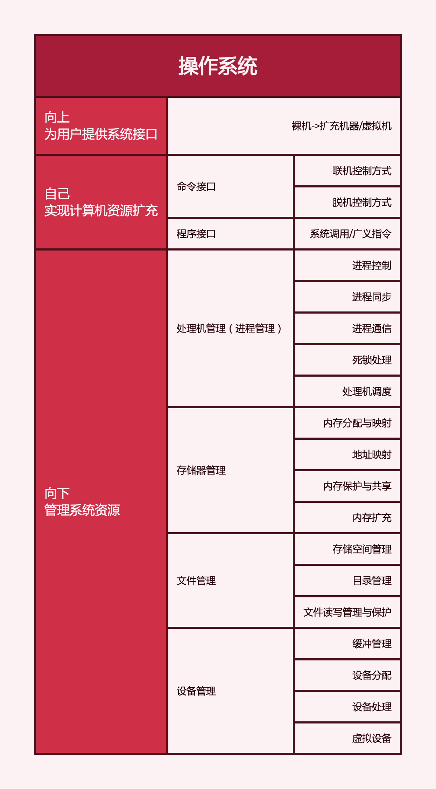

# 操作系统的基本概念
2022.05.20

[TOC]

1. 计算机分层：硬件、操作系统、应用软件、用户。

2. 操作系统概念是：控制和管理计算机系统的硬件和软件资源、组织调度计算机工作与分配资源、为用户和软件提供接口与环境的程序集合。

3. 特征

   1. **并发**：多个时间同一时间间隔内发生。
   2. **并发与并行**
   3. **共享**：系统中的资源可以供内存中多个并发执行的进程共同使用。
   4. **互斥共享方式**，**临界资源**
   5. **同时访问方式**
   6. 并发与共享是**最基本**的特征，两者互为条件。
   7. **虚拟**：物理上的实体变为若干逻辑上的对应物。
   8. **时分复用技术**：**虚拟处理器**
   9. **空分复用技术**：**虚拟存储器**
   10. **异步**：多道程序环境允许多个程序并发执行，但由于资源受限，执行不能一贯到底。

4. 功能与目标

   

5. 接口 = **命令接口** + **程序接口**
   1. 命令接口 = **联机命令接口**(交互式命令接口) + **脱机命令接口**(批处理命令接口)
   2. 程序接口 = {广义指令(系统调用)}
   3. 系统调用只能通过用户程序间接使用
   4. 用户可以通过命令接口和系统调用两种方式使用计算机
   5. GUI（图形接口），GUI通过调用程序接口实现。GUI不是操作系统的一部分，GUI调用的系统调用是操作系统的一部分。

