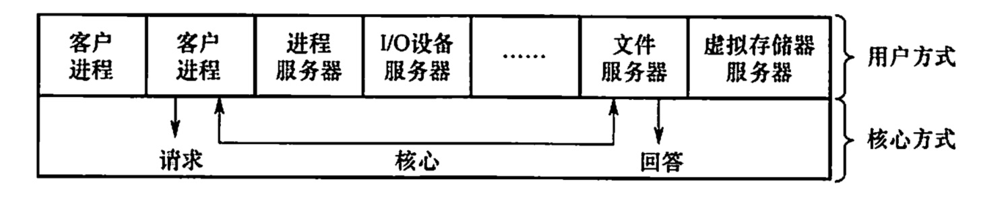

# 操作系统结构
2022.05.21

[TOC]

## 分层式结构

优点：方便调试与验证；方便扩充和维护

缺点：分层本身困难；效率差

## 模块化

标准：内聚性(模块内部紧密程度，越高越好)；耦合度(模块间紧密程度，越低越好)

优点：提高正确性、可理解性、可维护性；增强系统可适应性；加速了开发效率

缺点：模块间接口难以规定；各个模块同时开发，难以找到已验证的基础

## 宏内核

优点：效率高

缺点：设计困难

Windows，Linux，IOS，Android等等都是宏内核，但随着演化，已经吸收了微内核的内容，变成了混合内核

## 微内核

1. 概念

   把**不需要核心态执行的内容**，放到用户态执行。被移出的内容做成**多个服务器**，剩下的内容构成**内核**。

   微内核通常包含：与硬件处理紧密相关的部分；较为基本的功能；客户端与服务器之间的通信

   

2. 基本功能（“机制与策略分离”原理）

   ①进程（线程）管理。进程（线程）之间的通信功能是微内核 OS 最基本的功能，此外还有进程的切换、进程的调度，以及多处理机之间的同步等功能，都应放入微内核中。

   > 举个例子，为实现进程调度功能，需要在进程管理中设置一个或多个进程优先级队列，这部分属于调度功能的机制部分，应将它放入微内核中。而对用户进程如何分类，以及优先级的确认方式，则属于策略问题，可将它们放入微内核外的进程管理服务器中。

   ②低级存储器管理。在微内核中，只配置最基本的低级存储器管理机制.

   > 如用于实現将逻镇地址变换为物理地址等的页表机制和地址变换机制，这一部分是依赖于硬件的，因此放入微内核。而实现虚拟存储器管理的策路，则包含应采取何种页面置换算法，采用何种内存分配与回收的策略，应將这部分放在微内核外的存储器管理服务器中。

   ③中断和陷入处理。微内核 OS 将与硬件紧密相关的一小部分放入微内核，此时微内核的主要功能是捕获所发生的中断和陷入事件，并进行中断响应处理，在识别中断或陷入的事件后，再发送给相关的服务器来处理，故中断和陷入处理也应放入微内核。

3. 特点

   1. 扩展性和灵活性
   2. 可靠性和安全性
   3. 可移植性。CPU和IO有关的代码在内核中，其他的与硬件无关，操作系统移植到另一个硬件上，修改的东西少。
   4. 分布式计算

4. 问题

   需要频繁的切换用户态和核心态

## 外核

不同于虚拟机克隆真实机器，另一种策略是对机器进行分区，给每个用户整个资源的一个子集。这样，某个虚拟机可能得到磁盘的 0至1023 盘块，而另一合虛拟机会得到磁盘的 1024 至 2047盘块，等等。在底层中，一种称为外核 (exokernel）的程序在内核态中运行。它的任务是为虚拟机分配资源，并检查使用这些资源的企图，以确保没有机器会使用他人的资源。每个用户层的虚拟机可以运行自己的操作系统，但限制只能使用己经申请并且获得分配的那部分资源。外核机制的优点是减少了映射层。在其他的设计中，每个虚拟机都认为它有自己的磁盘，其盘块号从0到最大编号，这样虚拟机监控程序就必须维护一张表格以重映像磁盘地址（或其他资源），有了外核，这个重映射处理就不需要了。外核只需要记录已经分配给各个虛拟机的有关资源即可。这种方法还有一个优点，它将多道程序（在外核内）与用户操作系统代码（在用户空间内）加以分离，而且相应的负载并不重，因为外核所做的只是保持多个虚拟机彼此不发生冲突。