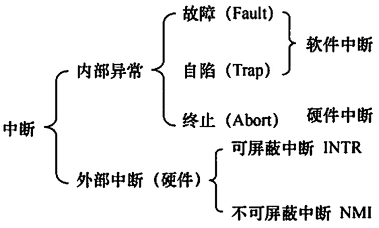
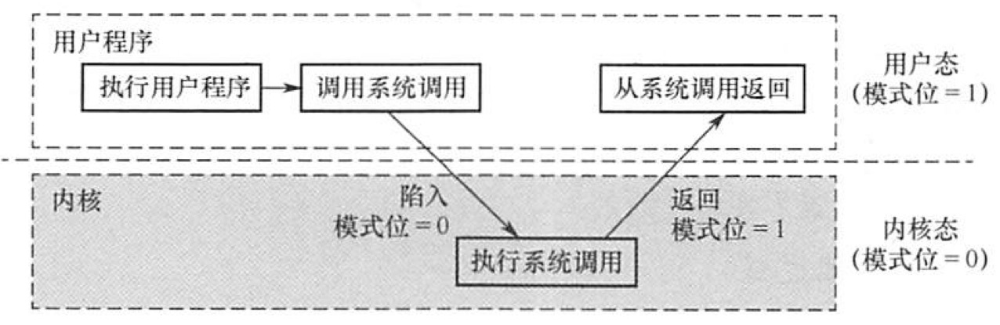

# 操作系统运行环境
2022.05.21

[TOC]

## 处理器运行模式

1. **特权指令**：不允许用户直接使用的指令 

   I/O指令、置中断指令、存取用户内存保护的寄存器、送程序状态字到程序状态字寄存器指令、切换到用户态指令...

2. **非特权指令**：允许用户直接使用的指令 

   切换到核心态指令...

3. **用户态**（目态）

4. **核心态**（管态、内核态）

5. 内核 = 底层{时钟管理，中断管理，设备驱动..} + 其余{进程管理，存储器管理，设备管理...}

6. **原语**：最底层，原子性，运行时间短，调用频繁

## 中断与异常

1. **中断** = **内部异常** + **外部中断**(硬件)
2. 内部异常 = 故障(软件) + 自陷(软件) + 终止(硬件)
3. **故障**：由**软件故障**引起，比如**非法操作码、缺页、0除数、溢出**
4. **自陷**：预先安排好的异常，用于在用户态下调用内核程序，比如**条件陷阱指令**
5. **终止**：出现了让**CPU无法继续工作**的故障，比如**控制器出错**、**存储器校验错**
6. 外部中断 = 可屏蔽中断 + 不可屏蔽中断
7. **可屏蔽中断**：通过INTR线发送中断请求，比如**改变屏蔽字**，可以中断中中断
8. **不可屏蔽中断**：通过NMI线发送中断请求，比如**紧急的硬件故障**，**电源掉电**
9. 

## 系统调用

1. 系统调用类别，略

2. 运行流程

   

* （）是操作系统必须提供的功能。
  A. 图形用户界面 (GUT)
  C.中断处理
  B. 为进程提供系统调用命今
  D.编译源程序

  答案：C，中断！

* 计算机区分核心态和用户态指令后，从核心态到用户态的转换是由操作系统程序执行后
  完成的，而用户态到核心态的转换则是由（）完成的。
  A.硬件
  B. 核心态程序
  C. 用户程序
  D.中断处理程序

  计算机通过硬件中断机制完成由用户态到核心态的转换。B 显然不正确，核心态程序只有在操作系统进入核心态后才可以执行。D中的中断处理程序一般也在核心态执行，因此无法完成“转换成核心态”这一任务。若由用户程序将操作系统由用户态转换到核心态，则用户程序中就可使用核心态指令，这就会威胁到计算机的安全，所以C 不正确。
  计算机通过硬件完成操作系统由用户态到核心态的转换，这是通过中断机制水实现的。发生中断事件时（有可能是用户程序发出的系统调用），触发中断，硬件中断机制将计算机状态置为核心态。

* 【2012 统考真题】下列选项中，不可能在用户态发生的事件是（）。
  A.系统调用
  B. 外部中断
  C.进程切换
  D.缺页

  答案：C

* 【2012 统考真题】中断处理和子程序调用都需要压栈以保护现场，中断处理一定会保存
  而子程序调用不需要保存其内容的是（）。
  A. 程序计数器
  B. 程序状态字寄存器
  C.通用数据奇存器
  D.通用地址寄存器

  答案：C

* 【2015 统考真题】处理外部中断时，应该由操作系统保存的是（）。
  A程序计数器（PC）的内容
  B. 通用寄存器的内容
  C. 块表（TLB）中的内容
  D. Cache 中的内容

  答案：B

* 【2018統考真题】定时器产生时钟中断后，由时钟中断服务程序更新的部分内容是(）。

  1. 内核中时钟变量的值
  2. 当前进程占用 CPU 的时间
  3. 当前进程在时问片内的剩余执行时间

  A.仅工2
  B. 仅江1
  C. 仅1，3
  D. 1，2，3

  答案：D

* 2020统考真题】下列与中断相关的操作中，由操作系统完成的是（）。

  1. 保存被中断程序的中断点
  2. 提供中断服务
  3. 初始化中断向量表
  4. 保存中断屏蔽宇
     A. 仅1，2
     B. 仅1，2、4
     C.仅3，4
     D.仅2，3，4

* 当 CPU 检测到中断信号后，由**硬件自动保存被中断程序的断点**(即程序计数器PC)，I错误。之后，硬件找到该中断信号对应的中断向量，中断向量指明中断服务程序入口地址 （各中断向量统一存放在中断向量表中，该表由操作系统初始化，IIl 正确)。接下来开始执行中断服务程序，保存 PSW、保存中断屏蔽字、保存各通用寄存器的值，并提供与中断信号对应的中断服务，中断服务程序属于操作系统内核，II和IV正确。答案：D