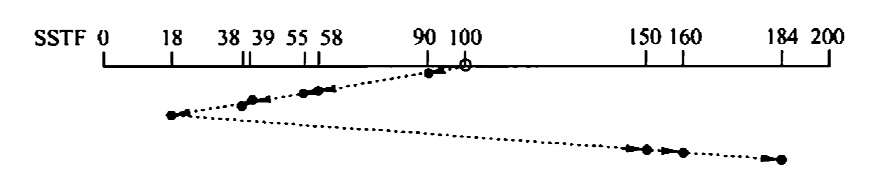
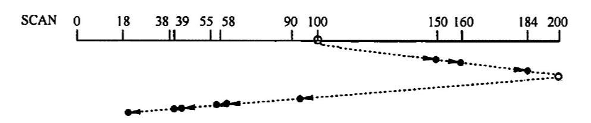
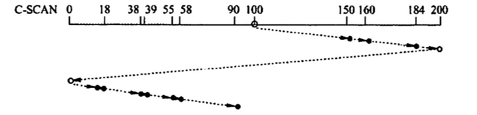
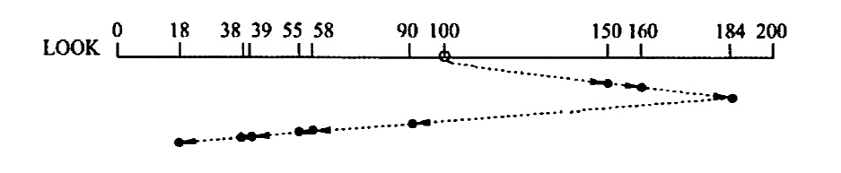
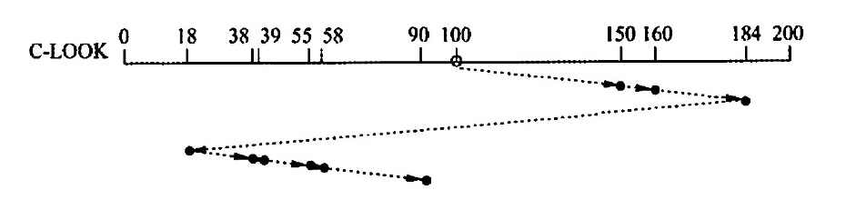
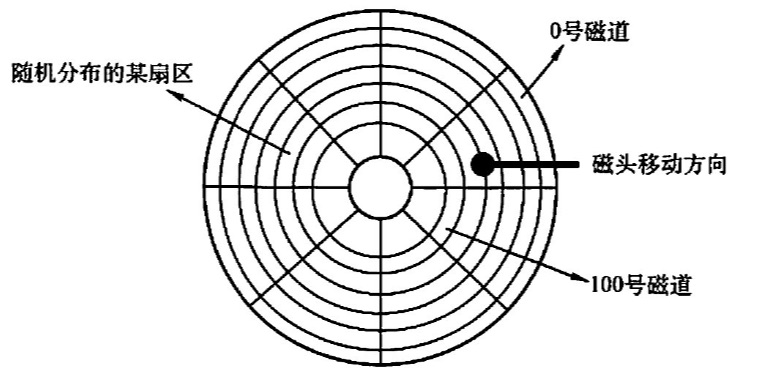

# 磁盘和固态硬盘
2022.09.19

[TOC]

## 磁盘

* 磁盘、磁道、磁头、扇区(最小寻址单位)
* 固定头磁盘 & 活动头磁盘
* 固定盘磁盘 & 可换盘磁盘

## 磁盘的管理

1. 磁盘初始化

   低级格式化——物理格式化

   高级格式化——硬盘的操作系统引导扇区产生在此

   > [高级格式化和低级格式化的区别](https://blog.csdn.net/Gao068465/article/details/125234367)

2. 分区、簇

3. 引导块

4. 坏块

## 磁盘调度时间

1. 寻找时间

   * m：与磁盘驱动器速度有关的常数，约为0.2ms
   * n：跨越n条磁道
   * s：启动磁臂时间

   $$
   T_s = m\times n+s
   $$

2. 旋转延迟时间

   * r：旋转速度(每秒)

   $$
   T_r = \frac{1}{2r}
   $$

3. 传输时间

   * r：旋转速度(每秒)
   * N：磁道上的字节数

   $$
   T_t = \frac{b}{rN}
   $$

## 磁盘调度算法

1. 先来先服务：不饥饿

   

2. 最短寻找时间优先算法(SSTF)：饥饿

   

3. 扫描算法(电梯调度算法)(SCAN)：不饥饿，从头到尾 从尾到头

   

4. 循环扫描算法(C-SCAN)：不饥饿，只从头到尾

   

5. LOOK算法：不饥饿，从最小到最大 从最大到最小

   

6. CLOOK算法：不饥饿，只从最小到最大

   

## 固态硬盘

1. 擦写寿命
2. 动态磨损均衡：写入数据自动选择较新的内存块
3. 静态磨损均衡：让老的块承担数据存储任务，新的块承担需要写的任务

## 例题

1. 磁盘是可共享设备，但在每个时刻（ ）作业启动它
   A.可以由任意多个
   C.至少能由一个
   B.能限定多个
   D.至多能由一个

   【答案】：D

2. 既可以随机访问又可顺序访问的有(）
   I 光盘
   II.磁带
   III U盘
   IV.磁盘

   A. I、II、III
   B. I、III、IV

   C. III, IV

   D.  IV

   【答案】：C -> B。光盘竟然可以随机访问

3. 磁盘调度的目的是缩短（）时间。
   A. 找道
   B.延迟
   C．传送
   D.启动

   【答案】：A

4. 磁盘上的文件以（ ）为单位读/写。
   A.块
   B.记录
   C柱面
   D.磁道

   【答案】：A

5. 在磁盘中读取数据的下列时间中，影响最大的是(）.
   A.处理时间
   B.延迟时间
   C．传送时间
   D.导找时间

   【答案】：D

6. 硬盘的操作系统引导扇区产生在(）.
   A对硬盘进行分区时
   B.对硬盘进行低级格式化时
   C.硬盘出厂时自带
   D.对硬盘进行高级格式化时

   【答案】：A -> D

7. 在下列有关旋转延迟的叙述中，不正确的是（）
   A. 旋转延迟的大小与磁盘调度算法无关
   B. 旋转延迟的大小取决于磁盘空闲空间的分配程序
   C. 旋转延迟的大小与文件的物理结构有关
   D.扇区数据的处理时间对旋转延迟的影响较大

   【答案】：D

8. 下列算法中，用于磁盘调度的是(）。
   A. 时问片轮转调度笋法
   C.最短寻找时间优先算法
   B. LRU 算法
   D.优先级高者优先箅法

   【答案】：C

9. 以下算法中，（）可能出现“饥饿” 现象。
   A. 电梯调度
   B．最短寻找时问优先
   C.循环扫描笋法
   D.先来先服务

   【答案】：A -> B

10. 在以下算法中，（）可能会随时改变磁头的运动方向。
    A. 电梯调度
    B. 先来先服务
    C.循环扫描笄法
    D.以上答案都不对

    【答案】：B

11. 已知莱磁盐的平均转速为r秒/转，平均寻找时问为T秒，每个磁道可以存储的宇节数为N，现向该磁盘读写b字节的数据，来用随机导道的方法，每道的所有扇区组成一个筷，其平均访问时间是(）
    A. (r+T)b/N
    B. b/NT
    C. (b/N+T)r
    D. bT/N+r

    【答案】：A

12. 设磁盘的转速为3000 转/分，盘面划分为 10个扇区，则读取一个扇区的时间为（）
    A. 20ms
    B. Sms
    C. 2ms
    D. 1ms

    【答案】：C

13. 一个磁盘的转速为7200转/分，每个磁道有160个扇区，每扇区有512B，那么理想情况下，其数据传揄率为（）
    A. 7200x160KB/s
    B. 7200KB/s
    C. 9600KB/S
    D.19200KB/s

    【答案】：120x160x512，C

14. 设一个磁道访问请求序列为 55，58，39，18，90，160，150，8，184，磁头的超始位置为 100，若采用SSTF （最短寻道时间优先）算法，则磁头移动（ ）个磁道．
    A. 55
    B. 184
    C. 200
    D. 248

    【答案】：

    [√55，√58，√39，√18，√90，160，√150，√8，184]

    100-90 = 10

    90-58 = 32

    58-55=3

    55-39=16

    39-18=21

    18-8=10

    150-8=142

    160-150=10

    184-160=24

    45+37+152+34=268，D

15. 假定磁带的记录密度为 400 字符/英寸（1in = 0.0254m ），每条逻辑记录为80字符，块间隙为 0.4 英寸，现有3000个逻辑记录需要存储，存储这些记录需要长度为（）的磁带，磁带利用率是（）。
    A. 1500英寸，33.3%
    B. 1500英寸，43.5%
    C. 1800 英寸，33.3%
    D. 1800英寸，43.5%

    【答案】：0.2+0.4=0.6，0.6x3000=1800，C

16. 下列关于固态硬盘（SSD）的说法中，错误的是(）
    A．基于闪存的存储技术
    B.随机读写性能明显高于磁盘
    C.随机写比较慢
    D.不易磨损

    【答案】：D

17. 下列关于固态硬盘的说法中，正确是的（）
    A. 固态硬盛的写速度比较慢，性能甚至弱于常规硬盘
    B. 相比常规硬盘，固态硬盘优势主要体现在连续存取的速度
    C. 静态磨损均街算法比动态磨损均衡箅法的表现吏优秀
    D. 写入时，每次选择使用长期存放数据而很少擦写的存储块

    【答案】：C

18. 【2009 统考真题】假设磁头当前位于第105道，正在向磁道序号增加的方向移动。现有一个磁道访问请求序列为35，45，12，68，110，180，170，195，来用SCAN 调度（电梯调度）算法得到的磁道访问序列是（）
    A. 110, 170, 180, 195, 68, 45, 35, 12
    C. 110, 170, 180, 195, 12, 35, 45, 68
    B. 110,68. 45, 35. 12. 170. 180. 195
    D. 12, 35, 45, 68, 110, 170, 180, 195

    【答案】：A

19. **【2015统考真题】**某硬盘有200个磁道（最外侧磁道号为0），磁道访问请求序列为 130,42,180,15,199，当前磁头位于第58号磁道并从外侧向内侧移动。按照 SCAN 调度方法处理完上述请求后，磁头移过的磁道数是（ ）。
    A. 208
    B. 287
    C. 325
    D. 382

    【答案】：199 180 130 42 15（外）58

    400 - (58-42)=400-16-2=382，D错

    (199-58)+(199-15)=325，C

20. **【2017统考真题】**下列选项中，磁盘逻辑格式化程序所做的工作是（ ）.
    I. 对磁盘进行分区
    II  建立文件系统的根目录
    III. 确定磁盘扇区校验码所占位数
    IV. 对保存空闲磁盘块信息的数据结构进行初始化
    A. 仅II
    B. 仅II、IV
    C. 仅III、IV
    D. 仅I、II、IV

    【答案】：D -> B

21. **【2017 统考真题】**某文件系统的族和磁盘扇区大小分别为 1KB 和512B。若一个文件的大小为 1026B，则系统分配给该文件的磁盘空间大小是（）。
    A. 1026B
    B. 1536B
    C. 1538B
    D 2048B

    【答案】：1024+512=1536,B -> D以簇分配！！！

22. **【2018 统考真题】**系统总是访问磁盘的某个磁道而不响应对其他磁道的访问请求，这种现彖称为磁臂黏着。下列磁盛调度算法中，不会导致磁臂黏着的是（）
    A. 先来先服务(FCFS)
    B. 最短寻道时间优光 (SSTF )
    C. 扫描算法 (SCAN)
    D. 循环扫描算法 (CSCAN)

    【答案】：C -> A

23. 【2021统考真题】某系统中磁盘的磁道数为 200（0~ 199），磁头当前在184 号磁道上，用户进程提出的磁盘访问请求对应的磁道号依次为 184, 187，176,182，199。若来用最短寻道时问优先调度算法(SSTF）完成磁盛访问，则磁头移动的距离（磁道数）是（）.
    A. 37
    B. 38
    C. 41
    D.42

    【答案】：2+5+11+23=23+18=41，C

24. 【2010 统考真题】如下图所示，假设计算机系统采用 C-SCAN（循环扫描）磁盘调度策略，使用2KB 的内存空问记录 16384 个磁盘块的空闲状态

    

    1）请说明在上述条件下如何进行碰盘块空闲状态的管理。
    2）设某单面磁盘的旋转速度为6000转/分，每个碰道有100个扇区，相邻磁道问的平均移动时问为 1ms。若在某时刻，磁头位于 100 号磁道处，并沿着磁道号增大的方向移动（见上图），磁道号请求队列为 50,90,30,120，对请求队列中的每个磁道需读取1个随机分布的扇区，则读完这4个扇区点共需要多少时间？要求给出计算过程
    3）若将磁盛替换为随机访问的Flash 半导体存储器（如口盘、固态硬盛等），是否有比C-SCAN 更高效的磁盘调度策略？若有，给出磁盘调度策略的名称并说明理由；若无，说明理由。

    【答案】：

    1. 2KB=2^14b。16384=2^14块。用1bit代表某一个磁盘块的空闲状态，16384块对应的位图刚好是2KB

    2. 6000转/分 = 100转/秒，读取平均时间：5ms

       读取总时间：20ms

       移动距离： （120-100）+（120-30）+（50-30）+（90-50）=110+60=170，170x1 = 170ms

       0.1ms是读取一个扇区的时间

       170+20+0.1x4=190.4ms

    3. 采用FCFS更高效，因为FLASH不需要移动磁头，可以随机访问

25. 【2019 统考真题】某计算机系统中的磁盘有300 个柱面，每个柱面有10个磁道，每个磁道有 200个扇区，扇区大小为 512B。文件系统的每族包含2个扇区。请回答下列问题：
    1）磁盘的容量是多少？
    2）设磁头在85号柱面上，此时有4 个磁盘访问请求，筷号分别为 100260, 60005, 101660和110560。采用最短寻道时间优先 SSTF 调度算法，系统访问族的先后次序是什么？
    3）族号 100530 在磁盘上的物理地址是什么？将筷号转换成磁盘物理地址的过程由 IO系统的什么程序完成？

    【答案】：

    1. 300x10x200x512B = 300000KB

    2. 200/2x10=1000，85号柱面的簇号是85000～85999，访问顺序是：100260，101660，110560，60005

    3. 物理地址：[柱面号、磁道号、扇区号]

       柱面号：100

       磁道号：5

       扇区号：30x2=60

       磁盘驱动程序

26. 【2021统考真题】某计算机用硬盘作为启动盘，硬盘的第一个扇区存放主引导记录，其中包含磁盘引导程序和分区表。碰盘引导程序用于选择引导哪个分区的操作系统，分区表记录硬盘上各分区的位置等描述信息。硬盘被划分成若干分区，每个分区的第一个扇区存放分区引导程序，用于引导该分区中的操作系统。系统来用多阶段引导方式，除了执行磁盘引导程序和分区引导程序，还需要执行 ROM 中的引导程序。回答下列问题：
    1）系统启动过程中操作系统的初始化程序、分区引导程序、ROM 中的引导程序、磁盘引导程序的执行顺序是什么？
    2）把硬盘制作为启动盘时，需要完成操作系统的安装、磁盘的物理格式化、逻辑格式化、对磁盘进行分区，执行这4个操作的正确顺序是什么？
    3）磁盘扇区的划分和文件系统根目录的建立分別是在第2）问的哪个採作中完成的？

27. 

    【答案】：

    1. ROM 中的引导程序、磁盘引导程序、分区引导程序、操作系统的初始化程序

    2. 磁盘的物理格式化、对磁盘进行分区、逻辑格式化、操作系统的安装

    3. 磁盘扇区的划分：磁盘的物理格式化

       文件系统根目录：逻辑格式化

    