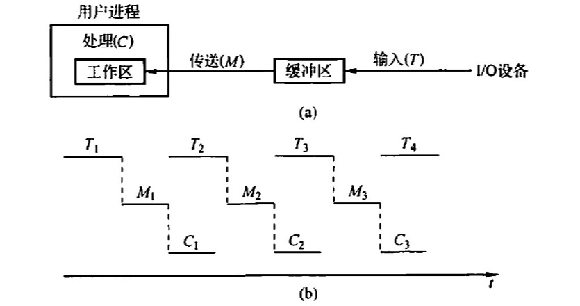
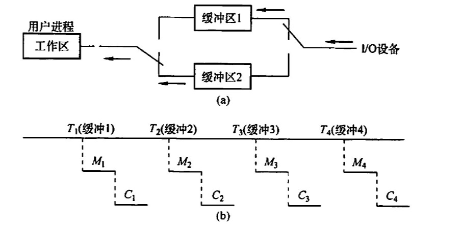
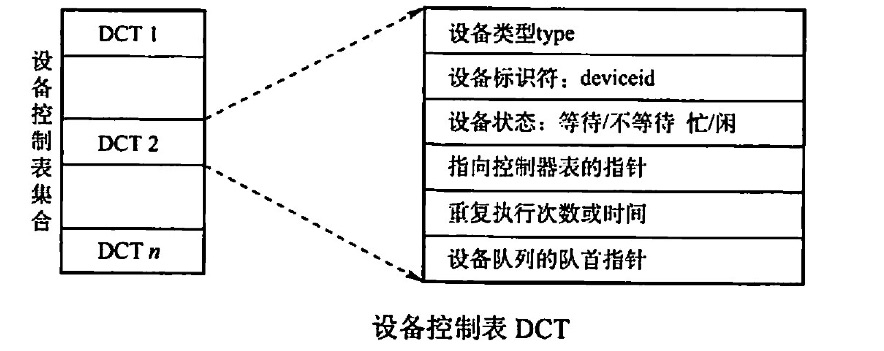
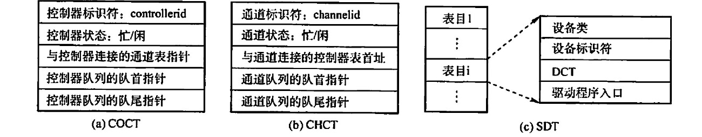
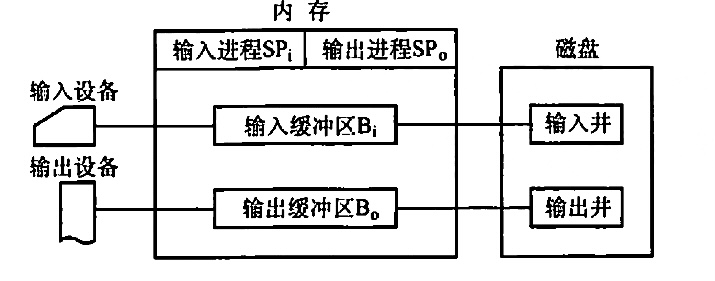
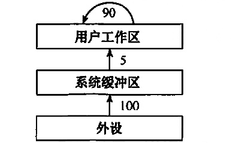

# 设备独立性软件
2022.09.19

[TOC]

## 设备无关的软件

IO系统的最高层软件，它的下层是设备驱动程序。

## 高速缓存与缓冲区

1. 磁盘高速缓存

   1. 用内存暂存一部分磁盘信息。逻辑上属于磁盘，物理上驻留内存。
   2. 两种形式：一种是在内存中开辟一个单独的空间作为磁盘高速缓存，大小固定；另一种是把未利用的内存空间作为一个缓冲池，供请求分页系统和磁盘IO时共享

2. 缓冲区

   1. 硬件缓冲器（成本高）、缓冲区（位于内存）

   2. 单缓冲：一个缓冲区，读写互斥

      

   3. 双缓冲：

      

      处理一块数据用时：Max(C+M,T)

      如果C+M<T：块设备可以连续输入

      如果C+M>T：CPU不必等待设备输入

   4. 循环缓冲

   5. 缓冲池

## 设备分配与回收

1. 设备分配概述

   1. 独占式使用设备
   2. 分时式共享使用设备
   3. SPOOLing方式使用外部设备：虚拟设备

2. 设备分配的数据结构

   1. 设备控制表DCT：一个<u>设备控制表</u>代表一个<u>设备</u>。
   2. 控制器控制表COCT
   3. 通道控制表CHCT：通道控制表与控制器控制表一对多。
   4. 系统设备表SDT：一个系统一张表，记录所有连接的设备情况。

   

   

3. 设备分配策略

   1. 设备分配原则：效率+避免死锁+隔离应用程序与具体设备
   2. 设备分配方式：静态分配/动态分配
   3. 设备分配算法：现请求先分配、优先级高者得等

4. 设备分配安全性

   1. 安全分配方式：进程IO请求后进入阻塞，IO完成后唤醒
   2. 不安全分配方式：进程IO请求后继续运行

5. 逻辑设备名到物理设备名的映射

   逻辑设备表LUT

## SPOOLing技术

* 输入井与输出井：磁盘上开辟的两个存储区域。收容设备输入数据，收容用户输出数据。
* 输入缓冲区与输出缓冲区：内存上开辟两个存储区域。
* 输入进程与输出进程：用于模拟脱机输入输出时的外围控制机。

## 设备驱动程序接口

略

## 例题

1. 设备的独立性是指（ ）。
   A. 设备独立于计算机系统
   B. 系统对设备的管理是独立的
   C.用户编程时使用的设备与实际使用的设备无关
   D. 每台设备都有一个唯一的编号

   【答案】：C

2. 引入高速缓冲的主要目的是（）。
   A. 提高 CPU 的利用率
   B. 提高IO设备的利用率
   C.改善CPU与IO设备速度不匹配的问题 
   D.节省内存

   【答案】：C

3. 为了使并发进程能有效地进行输入和输出，最好来用（）结构的缓冲技术
   A. 缓冲池
   B. 循环缓冲
   C. 单缓冲
   D. 双缓冲

   【答案】：A

4. 缓冲技术中的缓冲池在（ ）中
   A.主存
   B.外存
   C. ROM
   D.寄存器

   【答案】：A

5. 设从磁盛将一块数据传送到缓冲区所用的时间为 80uS，将缓冲区中的数据传送到用户区所用的时间为 40uS， CPU 处理一块数据所用的时间为30ps。若有多块数据需要处理，并采用单缓冲区传送菜磁盘数据，则处理一块数据所用的总时问为（）
   A. 120us
   B. 110us
   C.150us
   D.70us

   【答案】：A

6. 某操作系统来用双缓冲区传送磁盘上的数据。设从磁盘将数据传送到缓冲区所用的时间为T1，将缓冲区中的数据传送到用户区所用的时间为T2（假设T2远小于T1），CPU 处理数据所用的时间为T3，则处理该数据，系统所用的总时间为（ ）
   A. T1+T2+T3
   B. max(T2,T3)+T1
   C. max(T1,T3)+T2
   D. max(T1, T3)

   【答案】：D

7. 若IO所花费的时间比CPU 的处理时间短得多，则缓冲区（)

   A. 最有效
   C.均衡
   B.几乎无效
   D. 以上答象都不对

   【答案】：B

8. 缓冲区管理着重要考虑的问题是（）。
   A. 选择缓冲区的大小
   B.决定缓冲区的数量
   C.实现进程访问缓冲区的同步
   D.限制进程的数量

   【答案】：A -> C

9. 考虑单用户计算机上的下列IO 操作，需要使用缓冲技术的是(）。
   I图形用产界面下使用鼠标
   II 多任务操作系统下的磁带驱动器（假设没有设备预分配）
   III. 包含用户文件的磁盘驱动器
   IV. 使用存储器映射I0，直接和总线相连的图形卡
   A. I、 III
   B. II、IV
   C. II, III, IV
   D.全选

   【答案】：C -> D

10. 以下（）不属于设备管理数据结构。
    A. PCB
    B. DCT
    C. COCT
    D. CHCT

    【答案】：A

11. 下列（）不是设备的分配方式
    A. 独享分配
    B. 共享分配
    C.虛拟分配
    D.分区分配

    【答案】：D

12. 下面设备中属于共享设备的是（）。
    A.打印机
    B.磁带机
    C. 磁盘
    D.磁带机和磁盘

    【答案】：C

13. 提高单机资源利用率的关键技术是(）。
    A. SPOOLing 技术
    C. 交换技术
    B. 虛拟技术
    D.多道程序设计技术

    【答案】：A -> D

14. 虚拟设备是靠（ ）技术来实现的。
    A.通道
    B.缓冲
    C. SPOOLing
    D.控制器

    【答案】：C

15. SPOOLing 技术的主要目的是（）。
    A．提高CPU 和设备交换信息的速度
    B. 提高独占设备的利用率
    C.减轻用产编程负担
    D.提供主、辅存接口

    【答案】：B

16. 在来用SPOOLing 技术的系统中，用户的打印结果首先被送到（）。
    A. 磁盘固定区域
    B.内存固定区域
    C终端
    D.打印机

    【答案】：A

17. 来用SPOOLing 技术的计算机系统，外围计算机需要（）.
    A.一台
    B.多台
    C至少 一台
    D. 0 台

    【答案】：C -> D。需要磁盘空间（输入输出井）和内存空间（输入输出缓冲区）而不需要外围计算机！

18. SPOOLing 系统由（）组成
    A．预输入程序、井管理程序和缓输出程序
    B. 预输入程序、井管理程序和井管理输出程序
    C.输入程序、井管理程序和输出程序
    D.预输入程序、井管理程序和输出程序

    【答案】：A

19. 在SPOOLing 系统中，用户进程实际分配到的是(）
    A． 用户所要求的外设
    B.外存区，即虛拟设备
    C.设备的一部分存储区
    D.设备的一部分空间

    【答案】：B

20. 下面关于 SPOOLing 系统的说法中，正确的是（ ）
    A 构成SPOOLing 系统的基本条件是有外围输入机与外围输出机
    B，构成 SPOOLing 系统的基本条件是要有大容量、高速度的硬盘作为输入井和输出井
    C.当输入设备忙时，SPOOLing 系统中的用户程序暂停执行，待IO 空闲时再被唤醒执衍输出操作
    D. SPOOLing 系统中的用户程序可以随时将输出数据送到输出井中，待输出设备空闲时再由 SPOOLing 系统完成数据的揄出操作

    【答案】：D

21. 下面关于 SPOOLing 的叙述中，不正确的是()。
    A. SPOOLing 系统中不需要独占设备
    B. SPOOLing 系统加快了作业执行的速度
    C. SPOOLing 系统使独占设备变成共享设备
    D. SPOOLing 系统提高了独占设备的利用率

    【答案】：A

22. (）是操作系统中宋用的以空问换取时问的技术。
    A. SPOOLing 技术 B.虚拟存储技术
    C.覆盖与交换技术 D.通道技术

    【答案】：A

23. 采用假脱机技术，将磁盘的一部分作为公共缓冲区以代替打印机，用户对打印机的操作实际上是对磁盘的存储操作，用以代替打印机的部分由（ ）完成。
    A. 独占设备
    B. 共享设各
    C.虚拟设备
    D一般物理设备

    【答案】：C

24. 下面关子独占设备和共享设备的说法中，不正确的是（）.
    A. 打印机、扫描仪等属于独占设备
    B. 对独占设备往往来用静态分配方式
    C.共享设备是指一个作业尚未撤离，另一个作业即可使用，但每个时刻只有一个作业使用
    D.对共享设备往往来用静态分配方式

    【答案】：D

25. 在采用SPOOLing 技术的系统中，用户的打印数据首先被送到（）.
    A.磁盘固定区域
    B.内存固定区域
    C.终端
    D.打印机

    【答案】：A。先放到输出井

26. 【2009 统考真题】程序员利用系统调用打开IO 设各时，通常使用的设备标识是（）
    A.逻辑设备名
    B.物理设备名
    C.主设备号
    D. 从设备号

    【答案】：A

27. 【2011 统考真题】某文件占 10 个磁盘块，现要把该文件的磁盘块逐个读入主存缓冲区并且送到用户区进行分析，假设一个缓冲区与一个磁盘块大小相同，把一个磁盛块读入缓冲区的时间为100µs，将缓冲区的数据传送到用户区的时间是50µs，CPU 对一块数据进行分析的时问为 50µs。在单绥冲区和双绥冲区结构下，读入并分析完该文件的时间分别是（）
    A. 1500µs, 1000µs
    B. 1550µs, 1100µs
    C.1550µs, 1550µs
    D. 2000µs, 2000µs

    【答案】：B。别忘了最后一轮没有重叠部分！

28. 【2012统考真题】下列选项中，不能改变磁盘设备IO性能的是（）
    A. 重排IO 请求次序
    B.  在一个磁盘上设置多个分区
    C. 预读和滞后写
    D. 优化文件物理块的分布

    【答案】：C -> B

29. 【2013统考真题】设系统缓冲区和用户工作区均采用单绥冲，从外设读入一个数据块到系统级冲区的时间为 100，从系统缓冲区读入一个数据快到用户工作区的时问为 5，对用户工作区中的一个数据块进行分析的时间为 90（如下图所示）。进程从外设读入并分析2个数据块的最短时间是（)

    

    A. 200
    B 295
    C. 300
    D. 390

    【答案】：C

30. 【2015 统考真题】在系統内存中设置磁盘缓冲区的主要目的是（）。
    A.减少磁盘IO次数
    B.减少平均寻址时间
    C.提高磁盘数据可靠性
    D.实现设备无关性

    【答案】：D -> A

31. 【2016统考真题】下列关于 SPOOLing 技术的叙迷中，错识的是（ ）
    A. 需要外存的支持
    B. 需要多道程序设计技术的支持
    C可以让多个作业共享一台独占式设备
    D. 由用户作业控制设备与输入输出井之间的数据传送

    【答案】：D

32. 【2020 统考卖题】对于具各设各独立性的系统，下列叙述中，错误的是（ ）。
    A. 可以使用文件名访问物理设备
    B. 用户程序使用逻拼设各名访问物理设备
    C. 需要建立逻辑设备与物理设备之间的映射关系
    D. 更换物理设备后必须修改访问该设备的应用程序

    【答案】：D