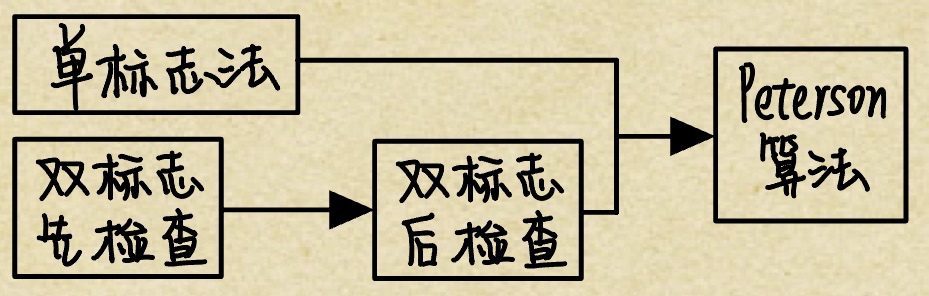

# 同步与互斥
2022.07.12

[TOC]

## 同步与互斥的基本概念

在多道程序环境下，进程是并发执行的，不同进程之间存在着不同的相互制约关系。为了协调进程之间的相互制约关系，引入了进程同步的概念。下面举一个简单的例子来帮大家理解这个概念。例如，让系统计算 1+2×3，假设系统产生两个进程：一个是加法进程，一个是乘法进程。

要让计算结果是正确的，一定要让加法进程发生在乘法进程之后，但实际上操作系统具有异步性，若不加以制约，加法进程发生在乘法进程之前是绝对有可能的，因此要制定一定的机制去约束加法进程，让它在乘法进程完成之后才发生，而这种机制就是本节要讨论的内容。

### 临界资源

虽然多个进程可以共享系统中的各种资源，但其中许多资源一次只能为一个进程所用，我们将<u>一次仅允许一个进程使用的资源</u>称为**临界资源**。许多物理设备都属于临界资源，如打印机等。此外，还有许多变量、数据等都可以被若干进程共享，也属于临界资源。

<u>对临界资源的访问，必须互斥地进行</u>，在每个进程中，<u>访问临界资源的那段代码</u>称为**临界区**。

为了保证临界资源的正确使用，可把临界资源的访问过程分成4个部分：

* **进入区**。为了进入临界区使用临界资源，在进入区要<u>检查可否进入临界区</u>，若能进入临界区，则应<u>设置正在访问临界区的标志</u>，以阻止其他进程同时进入临界区。
* **临界区**。<u>进程中访问临界资源的那段代码，又称临界段</u>。
* **退出区**。将正在访问临界区的<u>标志清除</u>。
* **剩余区**。代码中的其余部分。

```c
do{
	entry section; // 进入区	
  critical section; // 临界区
  exit section; // 退出区
  reminderr section; // 剩余区
}
```

### 同步

**同步**亦称**直接制约关系**，是指为完成某种任务而建立的两个或多个进程，这些进程因为需要在某些位置上<u>协调它们的工作次序而等待、传递信息所产生的制约关系</u>。进程间的直接制约关系源于它们之间的相互合作。

例如，输入进程 A 通过单缓冲向进程B提供数据。当该缓冲区空时，进程B不能获得所需数据而阻塞，一旦进程 A 将数据送入缓冲区，进程B就被唤醒。反之，当缓冲区满时，进程 A被阻塞，仅当进程B取走缓冲数据时，才唤醒进程 A。

### 互斥

**互斥**也称**间接制约关系**。当一个进程进入临界区<u>使用临界资源</u>时，另一个进程必须等待，当占用临界资源的进程退出临界区后，另一进程才允许去访问此临界资源。

例如，在仅有一台打印机的系统中，有两个进程 A 和进程 B，若进程 A 需要打印时，系统己将打印机分配给进程 B，则进程 A 必须阻塞。一旦进程 B 将打印机释放，系统便将进程 A唤醒，并将其由阻塞态变为就绪态。

为禁止两个进程同时进入临界区，同步机制应遵循以下准则：

* **空闲让进**。临界区空闲时，可以允许一个请求进入临界区的进程立即进入临界区。
* **忙则等待**。当己有进程进入临界区时，其他试图进入临界区的进程必须等待。
* **有限等待**。对请求访问的进程，应保证能在有限时间内进入临界区。
* **让权等待**。当进程不能进入临界区时，应立即释放处理器，防止进程忙等待

### 例题

<button onclick='change(0)'>隐藏答案</button><button onclick='change(1)'>显示答案</button>

* 一个正在访问临界资源的进程由于申请等待I/0 操作而被中断时，它（）。
  A.允许其他进程进入与该进程相关的临界区
  B. 不允许其他进程进入任何临界区
  C.允许其他进程抢占处理器，但不得进入该进程的临界区
  D. 不允许任何进程抢占处理器

  <div class="DynamicShow">答案：C</div>

* 进程 A 和进程 B 通过共享缓冲区协作完成数据处理，进程A 负责产生数据并放入缓冲
  区，进程B从缓冲区读数据并输出。进程A和进程B之间的制约关系是(）。
  A. 互斥关系
  B. 同步关系
  C.至斥和同步关系 
  D.无制约关系

  <div class="DynamicShow">答案：C</div>

* 在用信号量机制实现互斥时，**互斥**信号量的初值为（)。
  A. 0
  B. 1
  C. 2
  D. 3

  <div class="DynamicShow">答案：B</div>

* PV操作实现同步时，信号量的初值为（）。
  A. -1
  B. 0
  C. 1
  D. 由用户确定

  <div class="DynamicShow">答案：D</div>

* 一个进程映像由程序、数据及PCB 组成，其中（）必须用可重入编码编写。
  A. PCB
  B. 程序
  C.数据
  D．共享程序段

  <div class="DynamicShow">答案：D</div>

* 一个系统中共有5个并发进程涉及某个相同的变量A，变量A的相关临界区是由（）个临界区构成的。
  A. 1
  B. 3
  C. 5
  D. 6

  <div class="DynamicShow">答案：C。这里的临界区是指访问临界资源 A 的那段代码（临界区的定义）。那么5个并发进程共有 5个操作共享变量 A 的代码段。</div>

* 系统有n个进程，则就绪队列中进程的个数最多有（①）个；阻塞队列中进程的个数最多有（②）个。
  ① A. n+1 B. n  C. n-1 D. 1
  ② A. n+1 B. m C. n-1 D. 1

  <div class="DynamicShow">答案：B、C。<br>① 系统中有n个进程，其中至少有一个进程正在执行（处理器至少有一个），因此就绪队列中的进程个数最多有n-1个。B选项容易被错选，以为出现了处理器为空、就绪队列全满的情况，实际调度无此状态。<br>
  注意：系统中有n个进程，其中至少有一个进程正在执行（处理器至少有一个），其实这句话对于一般情況是错误的，但我们只需考虑就绪队列中进程最多这种特殊情況即可。<br>
  ② 此题C 选项容易被错选，阻塞队列有n-1个进程这种情况是可能发生的，但不是最多的情况。可能不少读者会忽视死锁的情况，死锁就是n个进程都被阻塞，所以最多可以有n个进程在阻塞队列。</div>

> 小结：
>
> 1. 临界资源
> 2. 临界区
> 3. 临界资源的访问过程（进入区，临界区，退出区，剩余区）
> 4. 同步/直接制约关系
> 5. 互斥/间接制约关系
> 6. 临界资源的访问机制（空闲让进、忙则等待、优先等待、让权等待）

## 实现临界区互斥的基本方法

### 软件实现方法

进入区设置并检杳一些标志来标明是否有进程在临界区中，若己有进程在临界区，则在进入区通过循环检查进行等待，进程离开临界区后则在退出区修改标志

#### 单标志法

该算法设置一个公用整型变量 <u>turn</u>，用于指示<u>被允许进入临界区的进程编号</u>，即若 turn=0，则允许P0进程进入临界区。该算法可确保每次只允许一个进程进入临界区。但<u>两个进程必须交替进入临界区</u>，若某个进程不再进入临界区，则另一个进程也将无法进入临界区(违背“空闲让进”)。这样很容易造成资源利用不充分。

若P0顺利进入临界区并从临界区离开，则此时临界区是空闲的，但P1并没有进入临界区的打算，turn = 1 一直成立，P0就无法再次进入临界区（一直被while 死循环困住）。

```c
// P0进程访问
while(turn!=0);    // trun不是自己就等待
critical section;  // 临界区
trun = 1;          // 把trun交给1
remainder section; // 剩余区

// P1进程访问
while(turn!=1);    // trun不是自己就等待
critical section;  // 临界区
trun = 0;          // 把trun交给0
remainder section; // 剩余区
```

> 妙记：
>
> 男生女生去厕所，厕所只有一间，门上挂一个牌子。男生看牌子是男，进去💩，出来把牌子改成女。女生看牌子是女，进去💩，出来把牌子改成男。如果两个男的都想💩，第一个进去出来把牌子一改，如果一直没女生来的话，第二个男生就要憋死。

#### 双标志先检查

该算法的基本思想是在每个进程访问临界区资源之前，<u>先查看临界资源是否正被访问，若正被访问，该进程需等待</u>；否则，进程才进入自己的临界区。为此，设置一个 flag数组，如第i个元素值为 FALSE， 表示Pi进程末进入临界区，值为 TRUE，表示Pi进程进入临界区。

优点：不用交替进入，可连续使用：缺点：Pi和Pj可能同时进入临界区。按序列①②③④执行时，会同时进入临界区（违背“忙则等待”)。即在检查对方的 flag 后和切换自己的flag 前有一段时间，结果都检查通过。这里的问题出在检查和修改操作不能一次进行

```c
// P0进程访问
while(flag[1]==true);  // 别的进程占用自己就等待【1】
flag[0] = true;        // 标记自己占用【3】
critical section;      // 临界区
flag[0] = false;       // 标记自己未占用
remainder section;     // 剩余区

// P1进程访问
while(flag[0]==true);  // 别的进程占用自己就等待【2】
flag[1] = true;        // 标记自己占用【4】
critical section;      // 临界区
flag[1] = false;       // 标记自己未占用
remainder section;     // 剩余区

// 按照1，2，3，4执行，就会同时进入临界区！！违背忙则等待
```

> 妙记：
>
> 一男一女去厕所，厕所只有一间，门上挂两个牌子，男生一个牌，女生一个牌，牌子的正反代表自己是否在💩。男生看到了女生不在💩，决定要进去。男生还没翻自己的牌子，说时迟那时快，女生也来厕所了，看到男生不在💩，也决定进去。于是两人先后翻了牌子。。然后。。

#### 双标志后检查

算法二<u>先检测对方的进程状态标志，再置自己的标志</u>，由于在检测和放置中可插入另一个进程到达时的检测操作，会造成两个进程在分别检测后同时进入临界区。为此，算法三先将自己的标志设置为 TRUE，再检测对方的状态标志，若对方标志为 TRUE，则进程等待：否则进入临界区。

个进程几乎同时都想进入临界区时，它们分别将自己的标志值 flag 设置为 TRUE， 并且同时检测对方的状态（执行 while 语句），发现对方也要进入临界区时，双方互相谦让，结果谁也进不了临界区，从而导致“饥饿”现象。

```c
// P0进程访问
flag[0] = true;        // 标记自己想占用【1】
while(flag[1]==true);  // 别的进程占用自己就等待【3】
critical section;      // 临界区
flag[0] = false;       // 标记自己未占用
remainder section;     // 剩余区

// P1进程访问
flag[1] = true;        // 标记自己想占用【2】
while(flag[0]==true);  // 别的进程占用自己就等待【4】
critical section;      // 临界区
flag[1] = false;       // 标记自己未占用
remainder section;     // 剩余区

// 按照1，2，3，4执行，就会同时进入不了临界区！！违背有限等待
```

> 妙记：
>
> 一男一女去厕所，厕所只有一间，门上挂两个牌子，男生一个牌，女生一个牌，牌子的正反代表自己是否在💩。吸取了刚才的尴尬经验，现在男生把自己的牌子翻了，然后再看女生在不在。女生也是这样。结果男生女生一次翻了自己的牌子，然后发现对方的被翻了，结果双双憋死在厕所🚽。。。

#### Peterson算法

[Peterson算法 wiki](https://zh.m.wikipedia.org/wiki/Peterson%E7%AE%97%E6%B3%95)

为了防止两个进程为进入临界区而无限期等待，又设置了变量 turn，每个进程在先设置自己的标志后再设置 turn 标志。这时，再同时检测另一个进程状态标志和允许进入标志，以便保证两个进程同时要求进入临界区时，只允许一个进程进入临界区。

具体如下：考虑进程Pi，一旦设置 flag[i]=true，就表示它想要进入临界区，同时 turn=j，此时若进程 Pj己在临界区中，符合进程Pi中的while 循环条件，则Pi不能进入临界区。

若Pj不想要进入临界区，即flag[j]=false，循环系件不符合，则P,可以顺利进入，反之亦然。本算法的基本思想是算法一和算法三的结合。利用flag 解决临界资源的互斥访问，而利用 tunr 解决“饥饿”现象。理解 Peterson’s Algorithm 的最好方法就是手动模拟。

```c
// P0进程
flag[0] = true;          // 自己意愿  - 设置 【1】
turn = 1;                // 谦让一下，先给对面一个机会
while(flag[1]&&turn==1); // 如果对面想要，也没把机会给回来，就等他
critical section;        // 如果对面不想要(flag=false)，或者对面把机会给回来了就执行
flag[0] = false;         // 自己意愿  - 清除
reminder section;

// P1进程
flag[1] = true;          // 自己意愿  - 设置
turn = 0;                // 谦让一下，先给对面一个机会
while(flag[0]&&turn==0); // 
critical section;
flag[1] = false;         // 自己意愿  - 清除
reminder section;
```

> 妙记：
>
> 一男一女去厕所，厕所只有一间。一个牌子正面是男反面是女，另外男女各自有一块自己的牌子。分别考虑刚才两次尴尬场面：
>
> 单标志法时，厕所只有一个性别牌。如果男生闹肚子，刚拉完还想拉时，门上的性别牌已经被改成了女。比如现在不要紧了，只有性别牌是女同时女生表示要去厕所男生才会等待。所以在没有女生的情况下，男生可以继续去厕所了。
>
> 双标志后检查时，厕所只有两个人自己意愿牌。如果男生女生先后表示意愿，两个人都去不了厕所。现在不要紧了，即使两个人都想去厕所，门上的性别牌规定了只有男/女可以进入。就不会出现两人都在等待的情况了。

>我的理解：
>
>1. 之前的算法有缺陷
>   1. 单标志法会导致只能轮流进入，违背了空闲让进。 
>   2. 双标志后检查法会导致过分谦让，违背了有限等待。 
>2. 皮特森算法将两者结合： 
>   1. 单标志法违背空闲让进的原因是turn只能是轮流的0和1，新加入的flag[0],flag[1]可以代表意愿。如果是别人的turn，但别人没意愿，自己就可以进去了。 
>   2. 双标志后检查法违背了有限等待的原因是flag[0],flag[1]会依次设置成true，新加入的turn可以决定谁才有资格进入。如果对方想进入，但他没资格，自己就可以进去了。 
>
>单标志法和双标志后检查法只有刚才的两种情况会有bug，现在皮特森算法让彼此修改了对方的bug，新算法就没bug了，无论怎么组合都是正常的。

### 硬件实现方法

理解本节介绍的硬件实现，对学习后面的信号量很有帮助。计算机提供了特殊的硬件指令，允许对一个字中的内容进行检测和修正，或对两个字的内容进行交换等。通过硬件支持实现临界段问题的方法称为**低级方法**，或称**元方法**。

#### 中断屏蔽方法

当一个进程正在执行它的临界区代码时，防止其他进程进入其临界区的最简方法是关中断。因为CPU 只在发生中断时引起进程切换，因此屏蔽中断能够保证当前运行的进程让临界区代码顺利地执行完，进而保证互斥的正确实现，然后执行开中断。其典型模式为

```c
// ...
关中断
临界区
开中断
// ...
```

这种方法限制了处理机交替执行程序的能力，因此执行的效率会明显降低。对内核来说，在它执行更新变量或列表的几条指令期间，关中断是很方便的，但将关中断的权力交给用户则很不明智，若一个进程关中断后不再开中断，则系统可能会因此终止

#### 硬件指令方法

**TestAndset 指令**：这条指令是原子操作，即执行该代码时不允许被中断。其功能是<u>读出指定标志后把该标志设置为真</u>。

为每个临界资源设置一个共享布尔变量 lock，表示资源的两种状态：true 表示正被占用，初值为 false。进程在进入临界区之前，利用 TestAndset 检查标志 lock，若无进程在临界区，则其值为false，可以进入，关闭临界资源，把lock 置为 true，使任何进程都不能进入临界区；若有进
程在临界区，则循环检查，直到进程退出。

```c++
/**
 * TestAndSet
 * 读出指定标志后把该标志设置为真
 */
bool TestAndSet(bool &lock){
  bool old = lock;
  lock = true;
  return old;
}

// 为每个临界资源设置一个共享布尔变量 lock
bool lockArray[3] = {false,false,false};

// 访问第二个临界资源的过程
while(TestAndSet(lockArray[1]));
// 临界区
// ...
lockArray[1]=false;
// 剩余区
// ...
  
```

**Swap 指令**：该指令的功能是交换两个字（字节）的内容。

用 Swap 指令可以简单有效地实现互斥，为每个临界资源设置一个共享布尔变量 lock，初值false：在每个进程中再设置一个局部布尔变量key，用于与lock 交换信息。在进入临界区前，先利用 Swap 指令交换lock 与key 的内容，然后检查key 的状态：有进程在临界区时，重复交换和检查过程，直到进程退出。

硬件方法的优点：适用于任意数目的进程，而不管是单处理机还是多处理机：简单、容易验证其正确性。可以支持进程内有多个临界区，只需为每个临界区设立一个布尔变量。

硬件方法的缺点：进程等待进入临界区时要耗费处理机时间，<u>不能实现让权等待</u>。从等待进程中随机选择一个进入临界区，有的进程可能一直选不上，从而导致“饥饿”现象。

无论是软件实现方法还是硬件实现方法，读者只需理解它的执行过程即可，关键是软件实现方法。实际练习和考试中很少让读者写出某种软件和硬件实现方法，因此读者并不需要默写或记忆。以上的代码实现与我们平时在编译器上写的代码意义不同，以上的代码实现是为了表述进程实现同步和互斥的过程，并不是说计算机内部实现同步互斥的就是这些代码。

```c++
/**
 * Swap
 * 交换
 */
void Swap(bool &a,bool &b){
  bool temp = a;
  a = b;
  b = temp;
}

// 为每个临界资源设置一个共享布尔变量 lock
bool lockArray[3] = {false,false,false};

// 访问第二个临界资源的过程
bool key = true; // 局部变量
while(key==true) 
  // 这里的key是换完的key, true代表lockArray[i]是true（正在使用）
  // 如果lockArray[i]是true，不停的换也是俩true
  Swap(key,lockArray[1])
// 临界区
// ...
lockArray[1]=false;
// 剩余区
// ...
```

### 互斥锁

解决临界区<u>最简单</u>的工具就是<u>互斥锁(mutex lock)</u>。

一个进程在进入临界区时应获得锁，在退出临界区时释放锁。函数 <u>acquire()</u>获得锁，用函数<u>release()</u>释放锁。

每个互斥锁有一个布尔变量 available， 表示锁是否可用。如果锁是可用的，调用 acaiure()会成功，且锁不再可用。当一个进程试图获取不可用的锁时，会被阻塞，直到锁被释放。

acquire()或 release()的执行必须是原子操作，因此互斥锁通常采用<u>硬件机制</u>来实现。

互斥锁的主要缺点是<u>忙等待</u>，当有一个进程在临界区中，任何其他进程在进入临界区时必领连续循环调用 acquire()。当多个进程共享同一 CPU 时，就浪费了 CPU 周期。因此，互斥锁通常用于<u>多处理器系统</u>，一个线程可以在一个处理器上等待，不影响其他线程的执行

本节后面，将会研究如何使用互斥锁解决经典同步问题。

```c
acquire(){
  while(!available); // 忙等待
  available = false; // 获得锁
}

release(){
  available = true;  // 释放锁
}
```

### 信号量

信号量机制是一种功能较强的机制，可用来解决互斥与同步问题，它只能被两个标准的**原语wait(S)和 signal(S)**访问，也可记为**“P操作”和“V操作”**。

原语是指完成某种功能且不被分割、不被中断执行的操作序列，通常可由硬件来实现。例如，前述的 Test-and-Set 和 Swap 指令就是由硬件实现的原子操作。原语功能的不被中断执行特性在单处理机上可由软件通过屏蔽中断方法实现。原语之所以不能被中断执行，是因为原语对变量的操作过程若被打断，可能会去运行另一个对同一变量的操作过程，从而出现临界段问题。

#### 整型信号量

S代表资源数目

```c++
//P
wait(S){
  while(S<=0);
  S--;
}

// V
signal(S){
  S++;
}
```

#### 记录型信号量

记录型信号量机制是一种<u>不存在“忙等”现象</u>的进程同步机制。除了需要一个用于代表资源数目的整型变量 value 外，<u>再增加一个进程链表 L</u>，用于链接所有等待该资源的进程。记录型信号量得名于采用了记录型的数据结构。

```c++
// 记录型信号量
typedef struct{
  int value;         // 代表资源数目
  struct process *L; // 链接所有等待该资源的进程
}semaphore;

// wait
void wait(semaphore S){
  S.value--;
  if(S.value<0){
    // push this process to S.L;
    block(S.L);
  }
}

// signal
void signal(semaphore S){
  S.value++;
  if(S.value<=0){
    // pop a process P from S.L;
    wakeup(P);
  }
}
```

#### 利用信号量实现同步

```c++
smaphore S = 0;

P1(){
  before();
  V(S);
}

P2(){
  P(S);
  after();
}
```

#### 利用信号量实现互斥

```c++
semaphore S = 1;

P1(){
  P(S);
  // 临界区 访问S
  V(S);
}

P2(){
  P(S);
  // 临界区 访问S
  V(S);
}
```

#### 利用信号量实现前驱关系

```c++
// a -> b ---> c
// \--> d --/

semaphore b,c,d=0;

P_a{
  // ...
  V(b);
  V(d);
}

P_b{
  P(b);
  // ...
  V(c1);
}

P_b{
  P(d);
  // ...
  V(c2);
}

P_c{
  P(c1);
  P(c2);
  // ...
}
```

### 例题

<button onclick='change(0)'>隐藏答案</button><button onclick='change(1)'>显示答案</button>

* 【2018统考真题】 在下列同步机制中，可以实现让权等待的是（）。
  A. Peterson 方法
  B. swap指今
  C. 信号量方法
  D. TestAndSet 指令

  <div class="DynamicShow">答案：C。硬件方法实现进程同步时不能实现让权等待，B和口错误;Peterson 算法满足有限等待但不满足让权等待，A错误；记录型信号量由于引入阻塞机制，消除了不让权等待的情况，C正确。</div>

* 【2016真题】进程P1和P2均包含并罚执行的线程，部分为代码描述如下所示。

  ```c++
  // 进程P1
  int x=0;
  Thread1(){
    int a;
    a=1;
    x+=1;
  }
  Thread2(){
    int a;
    a=2;
    x+=2;
  }
  ```

  ```c++
  // 进程P2
  int x=0;
  Thread3(){
    int a;
    a=x;
    x+=3;
  }
  Thread4(){
    int b;
    b=x;
    x+=4;
  }
  ```

  下列选项中需要互斥之行的操作（）

  A `a=1`与`a=2`

  B `a=x`与`b=x`

  C `x+=1`与`x+=2`

  D `x+=1`与`x+=3`

  <button onclick='change(0)'>隐藏答案</button><button onclick='change(1)'>显示答案</button>

  <div class="DynamicShow">答案：C<br>
  P1中对a进行赋值，并不影响最终的结果，因此a=1与a=2不需要互斥执行;<br>
  a=x与b=x执行先后不影响a与6的结果，无须互斥执行;<br>
  x+=1与x+=2执行先后会影响× 的结果，需要互斥执行;<br>
  P1中的x1和P2中的x是不同范围中的×，互不影响，不需要互斥执行。</div>

> 小结：
>
> 1. 软件实现方法
>
>    1. 单标志法 - 违背“空闲让进”
>    2. 双标志先检查法 - 违背“忙则等待”
>    3. 双标志后检查法 - 违背“有限等待”
>    4. 皮特森算法 - 结合了单标志法和双标志后检查法
>
>    
>
> 2. 硬件实现方法（低级方法，元方法）
>    1. 中断屏蔽方法
>    2. 硬件指令方法
>       1. TestAndSet指令
>       2. Swap指令
> 3. 互斥锁
> 4. 信号量
>    1. 整型信号量
>    2. 记录型信号量
>    3. 利用信号量实现同步
>    4. 利用信号量实现互斥
>    5. 利用信号量实现前驱图

## 管程

信号量机制中，每个要访问临界资源的进程都必须自各同步的 PV 操作，大量分散的同步操作给系统管理带来了麻烦，且容易因同步操作不当而导致系统死锁。于是，便产生了一种新的进程同步工具——管程。管程的特性保证了进程互斥，无须程序员自己实现互斥，从而降低了死锁发生的可能性。同时管程提供了条件变量，可以让程序员灵活地实现进程同步。

### 管程的定义

系统中的各种硬件资源和软件资源，均可用<u>数据结构</u>抽象地描达其资源特性，即用少量信息和对资源所执行的操作来表征该资源，而忽略它们的内部结构和实现细节.

利用<u>共享数据结构</u>抽象地表示系统中的共享资源，而把对该数据结构实施的操作定义为一组过程。进程对共享资源的申请、释放等操作，都通过这组过程来实现，这组过程还可以根据资源情况，或接受或阻塞进程的访问，确保每次仅有一个进程使用共享资源，这样就可以统一管理对共享资源的所有访问，实现进程互斥。

<u>这个代表共享资源的数据结构，以及由对该共享数据结构实施操作的一组过程所组成的资源管理程序，称为管程(monitor）</u>。管程定义了一个数据结构和能为并发进程所执行（在该数据结构上）的一组操作，这组操作能同步进程和改变管程中的数据。

上述定义可知，管程由4部分组成：
<u>①管程的名称；</u>
<u>②局部于管程内部的共享数据结构说明；</u>
<u>③对该数据结构进行操作的一组过程（或函数）：</u>
<u>④对局部于管程内部的共享数据设置初始值的语句。</u>

熟悉面向对象程序设计的读者看到管程的组成后，会立即联想到管程很像一个类 (class)。

1. 管程把对共享资源的操作封装起来，<u>管程内的共享数据结构只能被管程内的过程所访问</u>。一个进程只有通过调用管程内的过程才能进入管程访问共享资源。对于上例，外部进程只能通过调用 take_ avay() 过程来申请一个资源：归还资源也一样。
2. <u>每次仅允许一个进程进入管程，从而实现进程互斥</u>。若多个进程同时调用 take_away(), give_back()，则只有某个进程运行完它调用的过程后，下个进程才能开始运行它调用的过程。也就是说，各个进程只能串行执行管程内的过程，这一特性保证了进程 “互斥”访问共享数据结构S。

### 条件变量

当一个进程进入管程后被阻塞，直到阻塞的原因解除时，在此期间，如果该进程不释放管程，那么其他进程无法进入管程。为此，将阻塞原因定义为条件变量 condition。通常，一𠆤进程被阻塞的原因可以有多个，因此在管程中设置了多个条件变量。每个条件变量保存了一个等待队列，用于记录因该条件变量而阻塞的所有进程，对条件变量只能进行两种操作，即wait 和 signal。

* x.wait：当x对应的条件不满足时，正在调用管程的进程调用 x.wait 将自己插入×条件的等待队列，并释放管程。此时其他进程可以使用该管程
* x.signal：×对应的条件发生了变化，则调用 x.signal，唤醒一个因x条件而阻塞的进程，下面给出条件变量的定义和使用

```c++
monitor Demo{
  共享数据结构 S;
  condition x;	//定义一个【条件变量】
  init_code(){...}
  take_away(){
    if(S<=0) x.wait();  //资源不够，在条件变量× 上阻塞等待
      // 资源足够，分配资源，做一系列相应处理;
  }
  give_back(){
    // 归还资源，做一系列相应处理;
    if(有进程在等待) x.signal; //唤醒一个阻塞进程
  }
}
```

条件变量和信号量的比较：

相似点：条件变量的wait/signal 操作类似于信号量的P/V操作，可以实现进程的阻塞/唤醒。

不同点：<u>条件变量是“没有值”的</u>，仅实现了 “排队等待”功能;而信号量是“有值”的，信号量的值反映了剩余资源数，而在管程中，剩余资源数用共享数据结构记录。

### 例题

<button onclick='change(0)'>隐藏答案</button><button onclick='change(1)'>显示答案</button>

* 【2016统考真题】下列关于管程的积迷中，错误的是（）。
  A. 管程只能用于实现进程的互斥
  B. 管程是由编程语言支持的进程同步机制
  C. 任何时候只能有一个进程在管程中执行
  D. 管程中定义的变量只能被管程内的过程访问

  <div class="DynamicShow">答案：A</div>

* 【2018统考真题】若x是管程内的条件交量。则当进程执行 x.wait()时所做的工作()
  A．实现对变量x的互斥访问
  B．唤醒一个在x上阻塞的进程
  C.   根据x 的值判断该进程是否进入阻塞态
  D．阻塞该进程，并将之插入×的阻塞队列中

  <div class="DynamicShow">答案：D</div>

  ## 经典同步问题

### 生产者消费者问题

#### 生产者消费者问题原型

* 同步关系：产品
  * 生产者生产后消费者才能使用
  * 消费者消费后生产者才有地方放
* 互斥关系：生产者与消费者对缓存的访问
  * 设置mutex=1

```c++
semaphore mutex = 1;
semaphore product = 0;
semaphore place = N;

productor(){
  while(1){
    // produce a product
    P(place);
    P(mutex);
    // input the product
    V(mutex);
    V(product);
  }
}

comsumer(){
  while(1){
    P(product);
    P(mutex);
    // get a product
    V(mutex);
    V(place);
    // use the product
  }
}
```

#### 生产者消费者问题提高

问题描述：桌子上有一个盘子，每次只能向其中放入一个水果。爸爸专向盘子中放苹果，妈妈专向盛子中放橘子，儿子专等吃盘子中的橘子，女儿专等吃盘子中的苹果。只有盘子为空时，爸爸或妈妈才可向盘子中放一个水果；仅当盘子中有自己需要的水果时，儿子或女儿可以从盘子中取出。

* 互斥问题：对盘子的访问
* 同步问题：
  * 爸爸妈妈放水果的地方
  * 两种水果

```c++
semaphore mutex = 1;
semaphore orange = 0;
semaphore apple = 0;
semaphore place = 1;

father(){
  while(1){
    P(place);
    P(mutex);
    // put an apple
    V(mutex);
    V(apple);
	}
}

mother(){
  while(1){
    P(place);
    P(mutex);
    // put an orange
    V(mutex);
    V(orange);
	}
}

son(){
  while(1){
    P(orange);
    P(mutex);
    // get an orange
    V(mutex);
    V(place);
	}
}

daughtor(){
  while(1){
    P(apple);
    P(mutex);
    // get an apple
    V(mutex);
    V(place);
	}
}
```

**改进：由于盘子的大小为1。所以当水果放入时，不能放新水果。没有水果是，不能再拿水果。所以其实本题不需要mutex！**

### 读者写者问题

#### 读者写者问题一般情况

每一个读者可以随便读文件。但是写文件的时候只能有一个进程在工作，不能有别的读或写。

* 创新点：使用计数器记录读者的数量，只有最后一个读者的退出才能让写进程进入
* 互斥：对计数器的访问；写变量与其他变量互斥

```c++
int count = 0;
semaphore mutex=1;
semaphore write=1;

writer(){
  while(1){
    P(write);
    // write
    V(write);
  }
}

reader(){
  while(1){
    P(mutex);
    if(count==0) P(write); // 代表写进程用不了了
    V(mutex);
    count++;
    
    // read
    
    count--;
    P(mutex);
    if(count==0) V(write); // 代表写进程可以用了
    V(mutex);
  }
}
```

#### 读者写者问题优化

上面的问题如果有读者正在运行时，新的读者可以随笔进入，这是写者会一直进入不了。下面方案会检查是否有读写着在等待。

```c++
int count = 0;
semaphore mutex = 1;
semaphore wait = 1;

writer(){
  while(1){
    P(wait); // [1] - 写者等待（针对进程）
    P(write); // [2] - 共享文件访问互斥（针对文件）
    // write
    V(write); // [2]
    V(wait); // [1]
  }
}

reader(){
  while(1){
    P(wait); // [1] - 检查是否有等待的写者
    P(mutex); // [2] - 互斥访问计数器
    if(count==0) P(write); // 代表写进程用不了了
    count++;
    V(mutex); // [2]
    V(wait); // [1]
    
    // read
    
    P(mutex);
    count--;
    if(count==0) V(write); // 代表写进程可以用了
    V(mutex);
  }
}
```

### 哲学家进餐问题

问题描述：
一张圆桌边上坐着 5 名哲学家，每两名哲学家之间的桌上摆一根筷子，两根筷子中间是一碗米饭。哲学家们倾注毕生精力用于思考和进餐，哲学家在思考时，并不影响他人。只有当哲学家饥饿时，才试图拿起左、右两根筷子（一根一根地拿起）。若筷子已在他人手上，则需要等待。饥饿的哲学家只有同时拿到了两根筷子才可以开始进餐，进餐完毕后，放下筷子继续恩考。

#### 哲学家进餐基础方案

```c++
semaphore c[5]={1,1,1,1,1};
P(i){
  while(1){
    P(c[i]);
    P(c[(i+1)%5]);
    //eating
    V(c[i]);
    V(c[(i+1)%5]);
  }
}
```

#### 哲学家进餐防止死锁

```c++
// 方案1，仅允许n-1个人同时进餐
semaphore c[5]={1,1,1,1,1};
semaphore n = 4;
P(i){
  while(1){
    P(n);
    P(c[i]);
    P(c[(i+1)%5]);
    //eating
    V(c[i]);
    V(c[(i+1)%5]);
    V(n);
  }
}

// 方案2，一个人检查左右筷子都可用后，下一个人才开始检查
semaphore c[5]={1,1,1,1,1};
semaphore mutex = 1;
P(i){
  while(1){
    P(mutex);
    P(c[i]);
    P(c[(i+1)%5]);
    V(mutex);
    //eating
    V(c[i]);
    V(c[(i+1)%5]);
  }
}
```

### 吸烟者问题

假设一个系统有三个抽烟者进程和一个供应者进程。每个抽烟者不停地卷烟并抽它，但要卷起并抽掉一支烟，抽烟者需要有三种材料：<u>烟草、纸和胶水</u>。三个抽烟者中，第一个拥有烟草，第二个拥有纸，第三个拥有胶水。供应者进程无限地提供三种材料，供应者每次将两种材料放到桌子上，拥有剩下那种材料的抽烟者卷一根烟并抽掉它，并给供应者一个信号告诉己完成，此时供应者就会将另外两种材料放到桌上，如此重复（让三个抽烟者轮流地抽烟）。

```c++
semaphore needG=0;
semaphore needP=0;
semaphore needW=0;
// semaphore mutex=1; -> place=1不用mutex
semaphore place=1;

P(){
  for(int i=0;;i=(i++)%3){
    P(place);
    switch(i){
      case 0:
        //P(mutex);
        put_P_W();
        //V(mutex);
        P(needG);
        break;
       
      case 1:
        //P(mutex);
        put_W_G()
        //V(mutex);
        P(needP);
        break;
        
      case 2:
        //P(mutex);
        put_G_P
        //V(mutex);
        P(needW);
        break;
    }
  }
}

PG(){
  while(1){
    P(needG);
    //P(mutex);
    get();
    //V(mutex);
    V(place);
  }
}

PP(){
  while(1){
    P(needP);
    //P(mutex);
    get();
    //V(mutex);
    V(place);
  }
}

PW(){
  while(1){
    P(needW);
    //P(mutex);
    get();
    //V(mutex);
    V(place);
  }
}
```

### 例题

* 在一个仓库可以存放A、B两种产品，要求

  * 每次只能存入一种产品
  * A产品数量 - B产品数量 < M
  * B产品数量 - A产品数量 < N

  ```c++
  semaphore mutex = 1;
  semaphore moreA = M-1;
  semaphore moreB = N-1;
  
  productA(){
    while(1){
      P(moreA);
      P(mutex);
      put(A);
      V(mutex);
      V(moreB);
    }
  }
  
  productB(){
    while(1){
      P(moreB);
      P(mutex);
      put(B);
      V(mutex);
      V(moreA);
    }
  }
  ```

* 面包师有很多面包，由n名销售人员推销。每名顾客进店后取一个号，并且等待叫号，当一名销售人员空闲时，就叫下一个号。试设计一个使销售人员和顾客同步的算法。

  ```c++
  // 下面是我自己想的方法
  semaphore seller = 0;
  semaphore customer = 0;
  
  seller(){
    while(1){
      V(seller);
      P(customer);
      // serve();
    }
  }
    
  customer(){
    V(customer);
    P(seller);
    // buy();
  }
  ```

  > 我的想法，销售员和顾客的地位一样。两人碰成一对就可以产生一笔交易。

  ```c++
  //下面是答案
  int i=0,j=0;
  semaphore mutex_i = 1; // 互斥访问计数器
  semaphore mutex_j = 1;
  
  Consumer(){
    //进入面包店;
    P(mutex_i);
    取号;
    i++;
    V(mutex_i);
    // 等待叫号i并购买面包;
  }
  
  Seller(){
    while(1){
      P(mutex_j);
      if(j<i){
        叫号j;
        j++;
        V(mutex_j);
        销售面包;
      }else{
        V(mutex_j);
        休息片刻;
      }
    }
  }
  ```

* 某工厂有两个生产车间和一个装配车间，两个生产车间分别生产 A，B两种零件，装配车间的任务是把A，B 两种零件组装成产品。两个生产车间每生产一个零件后，都要分别把它们送到专配车问的货架F1，F2上。F1存放零件A，F2存放零件B，F1和F2的容量均可存放10个零件。裝配工人每次从货架上取一个零件A和一个零件B后组装成产品。
  请用 P,V操作进行正确管理。

  ```c++
  semaphore f1 = 10;
  semaphore f2 = 10;
  semaphore A = 0;
  semaphore B = 0;
  semaphore mutex1 = 1;
  semaphore mutex2 = 1;
  
  room1(){
    while(1){
      // produce A
      P(f1);
      P(mutex1);
      // put A
      V(mutex1);
      V(A);
    }
  }
  
  room2(){
    while(1){
      // produce B
      P(f2);
      P(mutex2);
      // put B
      V(mutex2);
      V(B);
    }
  }
  
  room3(){
    while(1){
      P(A);
      P(B);
      P(mutex1);
      // get A
      V(mutex1);
      V(f1);
      P(mutex2);
      // get B
      V(mutex2);
      V(f2);
      // prroduce with A and B
    }
  }
  ```

* 寺庙有小和尚、老和尚若干，有一水缸，由小和尚提水入缸供老和尚饮用。水缸可容10桶水，水取自同一井中。水井径窄，每次只能容一个桶取水。水桶总数为3个。每次入缸取水仅为 1桶水，且不可同时进行。试给出有关从缸取水、入水的算法描述。

  ```c++
  semaphore bucket = 3;
  semaphore place = 10;
  semaphore water = 0;
  semaphore mutex = 1; // 互斥的访问水缸
  semaphore mutex2 = 1;// 互斥的访问水井
  
  small(){
    P(place);   // 确认有地方放再去打水（防止桶都拿走了，缸满了，老和尚没法喝水）
    P(bucket);  // 拿桶
    
    P(mutex2);
    // 取水
    V(mutex2);
    P(mutex);
    // 倒水
    V(mutex);  
    
    V(water);
    V(bucket);  // 放桶
  }
  
  old(){
    P(water);   // 确认有水再去打水（防止桶都拿走了，缸空了，小和尚没办法打水）
    P(bucket);  // 拿桶
    
    P(mutex);
    // 取水
    V(mutex);  
    V(place);
    // 喝水
    V(bucket);  // 放桶
  }
  ```

* 下图所示，三个合作进程P1，P2，P3，它们都需要通过同一设备输入各自的数据a，b，c，该输入设备必须互斥地使用，而且其第一个数据必须由P1进程读取，第二个数据必须由P2进程读取，第三个数据必须由P3进程读取．然后，三个进程分别对输入数据进行下列计算

  

  ```c
  P1: x = a+b;
  P2: y = a*b;
  P3: z = y+c-a;
  ```

  最后，P1进程通过所连接的打印机将计算结果 x，y，z的值打印出来。请用信号量实现它
  们的同步。

  ```c++
  semaphore g1,g2 = 0;
  semaphore c21,c22 = 0;
  //semaphore mutex=1; // 三个进程不会同时访问输入设备，所以不用mutex了
  
  P1(){
    // 获取数据
    getA();     
    V(g1);
    
    // 计算数据
    calculate();
    
    // 打印输出
    P(c21);
    print();
  }
  
  P2(){
    // 获取数据
    P(g1);
    getB();     
    V(g2);
    V(c21);
    
    // 计算数据
    calculate();
    V(c22);
  }
  
  P3(){
    // 获取数据
    P(g2);
    getC();     
    
    // 计算数据
    P(c22);
    calculate();
  }
  
  ```

* 桥如下图所示。车流方向如箭头所示。回答如下问题：
  1）假设桥上每次只能有一辆车行驶，试用信号灯的 P,V操作实现交通管理。
  2）假设桥上不允许两车交会，但允许同方向多辆车一次通过（即桥上可有多辆同方向行驶的车）。试用信号灯的 P.V操作实现桥上的交通管理。

  

  ```c++
  semaphore mutex=1;
  
  sorth(){
    P(mutex);
    // 过桥
    V(mutex);
  }
  
  north(){
    P(mutex);
    // 过桥
    V(mutex);
  }
  ```

  ```c++
  // 错误答案，没有考虑到第一个方向的车很多时，counter>0，对面来的同样会进去，产生冲突
  // 所以要拆解成两个计数器
  
  int counter=0;
  semaphore mutex=1;
  semaphore mutex_c=1;
  
  sorth(){
    P(mutex_c);
    if(counter==0) P(mutex);
    count++;
    V(mutex_c);
    // 过桥
    P(mutex_c);
    count--;
    if(counter==0) V(mutex);
    V(mutex_c);
  }
  
  sorth(){
    P(mutex_c);
    if(counter==0) P(mutex);
    count++;
    V(mutex_c);
    // 过桥
    P(mutex_c);
    count--;
    if(counter==0) V(mutex);
    V(mutex_c);
  }
  ```

  ```c++
  int counterNS=0;
  int counterSN=0;
  semaphore mutex=1;
  semaphore mutex_NS=1;
  semaphore mutex_SN=1;
  
  sorth(){
    P(mutex_SN);
    if(counterSN==0) P(mutex);
    counterSN++;
    V(mutex_SN);
    // 过桥
    P(mutex_SN);
    counterSN--;
    if(counterSN==0) V(mutex);
    V(mutex_SN);
  }
  
  sorth(){
    P(mutex_NS);
    if(counterNS==0) P(mutex);
    counterNS++;
    V(mutex_NS);
    // 过桥
    P(mutex_NS);
    counterNS--;
    if(counterNS==0) V(mutex);
    V(mutex_NS);
  }
  ```

* 假如有两个线程（编号为0和1）需要去访问同一个共享资源，为避免竞争状态的问题，我们必须实现一种互斥机制，使得在任何时候只能有一个线程访问这个资源。假设有如下一段代码：

  ```c++
  bool flag[2];      // flag数组，初始化为FALSE
  Enter_Critical_Section(int my_thread_id, int other_thread_id){
    while(flag[other_thread_id]==true);
    flag[my_thread_id]=true;
  }
  Exit_Critical_Section(int my_thread_id, int other_thread_id){
    flag[my_thread_id]=false;
  }
  ```

  当一个线程想要访问临界资源时，就要掉用上述的这两个函数。例如，线程0的代码可能是这样的：

  `Enter_Critical_Section(0,1);`

  使用这个资源;

  `Exit_Critical_Section(0,1);`

  做其他的事情;

  试问：

  1. 以上的这种机制能够实现资源互斥访问吗？为什么？
  2. 若把Enter_Critical_Section()函数中的两条语句互换一下位置，结果会如何？

  不可以，因为自己的flag标志成了正在使用前如果对方进程也正好要标记，两个进程都可以访问资源。

  也不可以，那样造成死锁，两个进程都以为对方要进入但实际上都在等待。

* 自行车生产线上有一个箱子，其中有N个位置（N≥3），每个位置可存放一个车架或一个车轮；又设有3名工人，其活动分别为：

  ```c++
  // 工人1
  do{
    加工一个车架;
    车架放到箱中;
  }while(1)
    
  // 工人2
  do{
    加工一个车轮;
    车架放到箱中;
  }while(1)
    
  // 工人3
  do{
    取车架;取车轮;
    组装;
  }while(1)
  ```

  是分别用信号量与PV操作实现三名工人的合作，解中不含死锁

  ```c++
  // 错误答案，没有意识到车架或车轮完全占满存储区的情况
  
  semaphore mutex = 1;
  semaphore place = N;
  semaphore 车架 = 0;
  semaphore 车轮 = 0;
  
  p1(){
    while(1){
      //加工一个车架;
      P(place);
      P(mutex);
      //放入
      V(mutex);
      V(车架);
    }
  }
  
  p2(){
    while(1){
      //加工一个车轮;
      P(place);
      P(mutex);
      //放入
      V(mutex);
      V(车轮);
    }
  }
  
  p3(){
    while(1){
      P(车架);
      P(车轮);
      P(mutex);
      // 拿走车架车轮
      V(mutex);
      V(place);
    }
  }
  ```

  ```c++
  // 正确答案
  
  semaphore mutex = 1;
  semaphore placeJ = N-2;
  semaphore placeL = N-1;
  semaphore 车架 = 0;
  semaphore 车轮 = 0;
  
  p1(){
    while(1){
      //加工一个车架;
      P(placeJ);
      P(mutex);
      //放入
      V(mutex);
      V(车架);
    }
  }
  
  p2(){
    while(1){
      //加工一个车轮;
      P(placeL);
      P(mutex);
      //放入
      V(mutex);
      V(车轮);
    }
  }
  
  p3(){
    while(1){
      P(车架);
      P(车轮);
      P(车轮);
      P(mutex);
      // 拿走车架车轮
      V(mutex);
      V(placeJ);
      V(placeL);
      V(placeL);
    }
  }
  ```

* P，Q，R共享一个缓冲区，P，Q构成一对生产者-消费者，R既为生产者又为消费者。使用PV操作实现其同步。

  ```c++
  semaphore mutex = 1;  //共享缓冲区互斥访问
  semaphore product = 0;// 产品
  semaphore place = N;  // 存储区大小
  
  P(){
    while(1){
      // 生产商品
      P(place);
      P(mutex);
      // 放入产品
      V(mutex);
      V(product);
    }
  }
  
  Q(){
    while(1){
      P(product);
      P(mutex);
      // 拿出产品
      V(mutex);
      V(place);
    }
  }
  
  R(){
    while(1){
      if(product==N){
        P(product);
        P(mutex);
        // 拿出产品
        V(mutex);
        V(place);
      }
      if(place==N){
        // 生产商品
        P(place);
        P(mutex);
        // 放入产品
        V(mutex);
        V(product);
      }
  	}
  }
  ```

* 理发店里有一位理发师、一把理发椅和n把供等候理发的顾客坐的椅子。若没有顾客，理发师便在理发椅上睡觉，一位顾客到来时，顾客必须叫醒理发师，若理发师正在理发时又有顾客来到，若有空椅子可坐，则坐下来等待，否则就离开。试用P,V操作实现，并说明信号量的定义和初值。

  ```c++
  int waiting = 0; // 等待理发的顾客数
  int chairs = n;  // 未顾客准备的椅子数
  semaphore customer=0,barber=0,mutex=1;
  
  Barber(){
    while(1){
      P(customer);
      P(mutex);
      waiting--;
      V(barber);
      P(mutex);
      Cut_Hair();
    }
  }
  
  Customer(){
    P(mutex);
    if(waiting<chairs){
      waiting++;
      V(customer);
      V(mutex);
      P(barber);
      Get_Hair();
    }else{
      V(mutex);
    }
  }
  ```

* 假设一个录像厅有1,2,3三种不同的录像片可由观众选择放映，录像厅的放映规则如下：
  1）任一时刻最多只能放映一种录像片，正在放映的录像片是自动循环放映的，最后一名观众主动离开时结束当前录像片的放映。
  2）选择当前正在放映的录像片的观众可立即进入，允许同时有多位选择同一种录像片的观众同时观看，同时观看的观众数量不受限制。
  3）等待观看其他录像片的观众按到达顺序排队，当一种新的录像片开始放映时，所有等待观看该录像片的观众可依次序进入录像厅同时观看。用一个进程代表一个观众，
  要求：用信号量方法 PV 操作实现，并给出信号量定义和初始值。

  ```c++
  semaphore s0=1,s1=1,s2=1;
  semaphore movie1=1,movie2=0,movie3=0;
  int count0=0,count1=0,count2=0;
  videoshow1(){ // 一个看movie1的观众
  	/* 观众入座 */
    P(s0);
    count0++;
    if(count0==1) P(movie1);
    V(s0);
    
    /* 看电影 */
    
    /* 观众离场 */
    P(s0);
    count0--;
    if(count0==0) V(movie2); // 当天停止，下一个可以播放
    V(s0);
  }
  
  videoshow2(){ // 一个看movie2的观众
  	/* 观众入座 */
    P(s1);
    count1++;
    if(count1==1) P(movie2);
    V(s1);
    
    /* 看电影 */
    
    /* 观众离场 */
    P(s1);
    count1--;
    if(count1==0) V(movie3); // 当天停止，下一个可以播放
    V(s1);
  }
  
  videoshow3(){ // 一个看movie1的观众
  	/* 观众入座 */
    P(s2);
    count2++;
    if(count2==1) P(movie2);
    V(s2);
    
    /* 看电影 */
    
    /* 观众离场 */
    P(s2);
    count2--;
    if(count2==0) V(movie1); // 当天停止，下一个可以播放
    V(s2);
  }
  ```

  


* 【注释】写到了大题15题了✨✨✨✨✨✨✨✨✨✨


<script> 
  function change(v){
    var ele = document.getElementsByClassName('DynamicShow')
    if(v==1){
      for(let i in ele){
        ele[i].style.display = ""
      }
    }else{
  		for(let i in ele){
        ele[i].style.display = "none"
      }
    }
	}
</script>