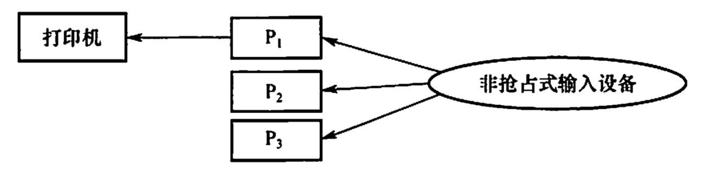
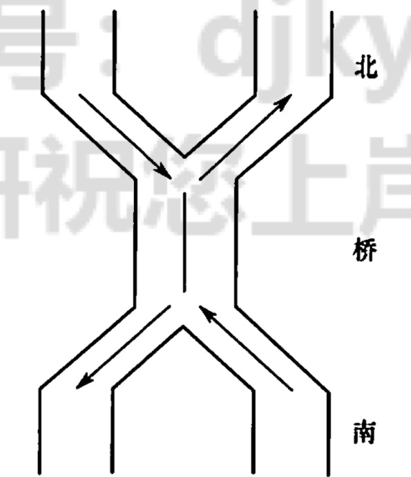
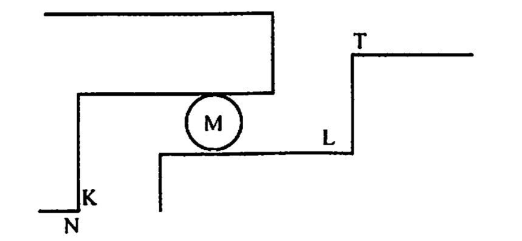

# 同步与互斥例题

2022.07.15

[toc]

* 在一个仓库可以存放A、B两种产品，要求

  * 每次只能存入一种产品
  * A产品数量 - B产品数量 < M
  * B产品数量 - A产品数量 < N

  ```c++
  semaphore mutex = 1;
  semaphore moreA = M-1;
  semaphore moreB = N-1;
  
  productA(){
    while(1){
      P(moreA);
      P(mutex);
      put(A);
      V(mutex);
      V(moreB);
    }
  }
  
  productB(){
    while(1){
      P(moreB);
      P(mutex);
      put(B);
      V(mutex);
      V(moreA);
    }
  }
  ```

* 面包师有很多面包，由n名销售人员推销。每名顾客进店后取一个号，并且等待叫号，当一名销售人员空闲时，就叫下一个号。试设计一个使销售人员和顾客同步的算法。

  ```c++
  // 下面是我自己想的方法
  semaphore seller = 0;
  semaphore customer = 0;
  
  seller(){
    while(1){
      V(seller);
      P(customer);
      // serve();
    }
  }
    
  customer(){
    V(customer);
    P(seller);
    // buy();
  }
  ```

  > 我的想法，销售员和顾客的地位一样。两人碰成一对就可以产生一笔交易。

  ```c++
  //下面是答案
  int i=0,j=0;
  semaphore mutex_i = 1; // 互斥访问计数器
  semaphore mutex_j = 1;
  
  Consumer(){
    //进入面包店;
    P(mutex_i);
    取号;
    i++;
    V(mutex_i);
    // 等待叫号i并购买面包;
  }
  
  Seller(){
    while(1){
      P(mutex_j);
      if(j<i){
        叫号j;
        j++;
        V(mutex_j);
        销售面包;
      }else{
        V(mutex_j);
        休息片刻;
      }
    }
  }
  ```

* 某工厂有两个生产车间和一个装配车间，两个生产车间分别生产 A，B两种零件，装配车间的任务是把A，B 两种零件组装成产品。两个生产车间每生产一个零件后，都要分别把它们送到专配车问的货架F1，F2上。F1存放零件A，F2存放零件B，F1和F2的容量均可存放10个零件。裝配工人每次从货架上取一个零件A和一个零件B后组装成产品。
  请用 P,V操作进行正确管理。

  ```c++
  semaphore f1 = 10;
  semaphore f2 = 10;
  semaphore A = 0;
  semaphore B = 0;
  semaphore mutex1 = 1;
  semaphore mutex2 = 1;
  
  room1(){
    while(1){
      // produce A
      P(f1);
      P(mutex1);
      // put A
      V(mutex1);
      V(A);
    }
  }
  
  room2(){
    while(1){
      // produce B
      P(f2);
      P(mutex2);
      // put B
      V(mutex2);
      V(B);
    }
  }
  
  room3(){
    while(1){
      P(A);
      P(B);
      P(mutex1);
      // get A
      V(mutex1);
      V(f1);
      P(mutex2);
      // get B
      V(mutex2);
      V(f2);
      // prroduce with A and B
    }
  }
  ```

* 寺庙有小和尚、老和尚若干，有一水缸，由小和尚提水入缸供老和尚饮用。水缸可容10桶水，水取自同一井中。水井径窄，每次只能容一个桶取水。水桶总数为3个。每次入缸取水仅为 1桶水，且不可同时进行。试给出有关从缸取水、入水的算法描述。

  ```c++
  semaphore bucket = 3;
  semaphore place = 10;
  semaphore water = 0;
  semaphore mutex = 1; // 互斥的访问水缸
  semaphore mutex2 = 1;// 互斥的访问水井
  
  small(){
    P(place);   // 确认有地方放再去打水（防止桶都拿走了，缸满了，老和尚没法喝水）
    P(bucket);  // 拿桶
    
    P(mutex2);
    // 取水
    V(mutex2);
    P(mutex);
    // 倒水
    V(mutex);  
    
    V(water);
    V(bucket);  // 放桶
  }
  
  old(){
    P(water);   // 确认有水再去打水（防止桶都拿走了，缸空了，小和尚没办法打水）
    P(bucket);  // 拿桶
    
    P(mutex);
    // 取水
    V(mutex);  
    V(place);
    // 喝水
    V(bucket);  // 放桶
  }
  ```

* 下图所示，三个合作进程P1，P2，P3，它们都需要通过同一设备输入各自的数据a，b，c，该输入设备必须互斥地使用，而且其第一个数据必须由P1进程读取，第二个数据必须由P2进程读取，第三个数据必须由P3进程读取．然后，三个进程分别对输入数据进行下列计算

  

  ```c
  P1: x = a+b;
  P2: y = a*b;
  P3: z = y+c-a;
  ```

  最后，P1进程通过所连接的打印机将计算结果 x，y，z的值打印出来。请用信号量实现它
  们的同步。

  ```c++
  semaphore g1,g2 = 0;
  semaphore c21,c22 = 0;
  //semaphore mutex=1; // 三个进程不会同时访问输入设备，所以不用mutex了
  
  P1(){
    // 获取数据
    getA();     
    V(g1);
    
    // 计算数据
    calculate();
    
    // 打印输出
    P(c21);
    print();
  }
  
  P2(){
    // 获取数据
    P(g1);
    getB();     
    V(g2);
    V(c21);
    
    // 计算数据
    calculate();
    V(c22);
  }
  
  P3(){
    // 获取数据
    P(g2);
    getC();     
    
    // 计算数据
    P(c22);
    calculate();
  }
  
  ```

* 桥如下图所示。车流方向如箭头所示。回答如下问题：
  1）假设桥上每次只能有一辆车行驶，试用信号灯的 P,V操作实现交通管理。
  2）假设桥上不允许两车交会，但允许同方向多辆车一次通过（即桥上可有多辆同方向行驶的车）。试用信号灯的 P.V操作实现桥上的交通管理。

  

  ```c++
  semaphore mutex=1;
  
  sorth(){
    P(mutex);
    // 过桥
    V(mutex);
  }
  
  north(){
    P(mutex);
    // 过桥
    V(mutex);
  }
  ```

  ```c++
  // 错误答案，没有考虑到第一个方向的车很多时，counter>0，对面来的同样会进去，产生冲突
  // 所以要拆解成两个计数器
  
  int counter=0;
  semaphore mutex=1;
  semaphore mutex_c=1;
  
  sorth(){
    P(mutex_c);
    if(counter==0) P(mutex);
    count++;
    V(mutex_c);
    // 过桥
    P(mutex_c);
    count--;
    if(counter==0) V(mutex);
    V(mutex_c);
  }
  
  sorth(){
    P(mutex_c);
    if(counter==0) P(mutex);
    count++;
    V(mutex_c);
    // 过桥
    P(mutex_c);
    count--;
    if(counter==0) V(mutex);
    V(mutex_c);
  }
  ```

  ```c++
  int counterNS=0;
  int counterSN=0;
  semaphore mutex=1;
  semaphore mutex_NS=1;
  semaphore mutex_SN=1;
  
  sorth(){
    P(mutex_SN);
    if(counterSN==0) P(mutex);
    counterSN++;
    V(mutex_SN);
    // 过桥
    P(mutex_SN);
    counterSN--;
    if(counterSN==0) V(mutex);
    V(mutex_SN);
  }
  
  sorth(){
    P(mutex_NS);
    if(counterNS==0) P(mutex);
    counterNS++;
    V(mutex_NS);
    // 过桥
    P(mutex_NS);
    counterNS--;
    if(counterNS==0) V(mutex);
    V(mutex_NS);
  }
  ```

* 假如有两个线程（编号为0和1）需要去访问同一个共享资源，为避免竞争状态的问题，我们必须实现一种互斥机制，使得在任何时候只能有一个线程访问这个资源。假设有如下一段代码：

  ```c++
  bool flag[2];      // flag数组，初始化为FALSE
  Enter_Critical_Section(int my_thread_id, int other_thread_id){
    while(flag[other_thread_id]==true);
    flag[my_thread_id]=true;
  }
  Exit_Critical_Section(int my_thread_id, int other_thread_id){
    flag[my_thread_id]=false;
  }
  ```

  当一个线程想要访问临界资源时，就要掉用上述的这两个函数。例如，线程0的代码可能是这样的：

  `Enter_Critical_Section(0,1);`

  使用这个资源;

  `Exit_Critical_Section(0,1);`

  做其他的事情;

  试问：

  1. 以上的这种机制能够实现资源互斥访问吗？为什么？
  2. 若把Enter_Critical_Section()函数中的两条语句互换一下位置，结果会如何？

  不可以，因为自己的flag标志成了正在使用前如果对方进程也正好要标记，两个进程都可以访问资源。

  也不可以，那样造成死锁，两个进程都以为对方要进入但实际上都在等待。

* 自行车生产线上有一个箱子，其中有N个位置（N≥3），每个位置可存放一个车架或一个车轮；又设有3名工人，其活动分别为：

  ```c++
  // 工人1
  do{
    加工一个车架;
    车架放到箱中;
  }while(1)
    
  // 工人2
  do{
    加工一个车轮;
    车架放到箱中;
  }while(1)
    
  // 工人3
  do{
    取车架;取车轮;
    组装;
  }while(1)
  ```

  是分别用信号量与PV操作实现三名工人的合作，解中不含死锁

  ```c++
  // 错误答案，没有意识到车架或车轮完全占满存储区的情况
  
  semaphore mutex = 1;
  semaphore place = N;
  semaphore 车架 = 0;
  semaphore 车轮 = 0;
  
  p1(){
    while(1){
      //加工一个车架;
      P(place);
      P(mutex);
      //放入
      V(mutex);
      V(车架);
    }
  }
  
  p2(){
    while(1){
      //加工一个车轮;
      P(place);
      P(mutex);
      //放入
      V(mutex);
      V(车轮);
    }
  }
  
  p3(){
    while(1){
      P(车架);
      P(车轮);
      P(mutex);
      // 拿走车架车轮
      V(mutex);
      V(place);
    }
  }
  ```

  ```c++
  // 正确答案
  
  semaphore mutex = 1;
  semaphore placeJ = N-2;
  semaphore placeL = N-1;
  semaphore 车架 = 0;
  semaphore 车轮 = 0;
  
  p1(){
    while(1){
      //加工一个车架;
      P(placeJ);
      P(mutex);
      //放入
      V(mutex);
      V(车架);
    }
  }
  
  p2(){
    while(1){
      //加工一个车轮;
      P(placeL);
      P(mutex);
      //放入
      V(mutex);
      V(车轮);
    }
  }
  
  p3(){
    while(1){
      P(车架);
      P(车轮);
      P(车轮);
      P(mutex);
      // 拿走车架车轮
      V(mutex);
      V(placeJ);
      V(placeL);
      V(placeL);
    }
  }
  ```

* P，Q，R共享一个缓冲区，P，Q构成一对生产者-消费者，R既为生产者又为消费者。使用PV操作实现其同步。

  ```c++
  semaphore mutex = 1;  //共享缓冲区互斥访问
  semaphore product = 0;// 产品
  semaphore place = N;  // 存储区大小
  
  P(){
    while(1){
      // 生产商品
      P(place);
      P(mutex);
      // 放入产品
      V(mutex);
      V(product);
    }
  }
  
  Q(){
    while(1){
      P(product);
      P(mutex);
      // 拿出产品
      V(mutex);
      V(place);
    }
  }
  
  R(){
    while(1){
      if(product==N){
        P(product);
        P(mutex);
        // 拿出产品
        V(mutex);
        V(place);
      }
      if(place==N){
        // 生产商品
        P(place);
        P(mutex);
        // 放入产品
        V(mutex);
        V(product);
      }
  	}
  }
  ```

* 理发店里有一位理发师、一把理发椅和n把供等候理发的顾客坐的椅子。若没有顾客，理发师便在理发椅上睡觉，一位顾客到来时，顾客必须叫醒理发师，若理发师正在理发时又有顾客来到，若有空椅子可坐，则坐下来等待，否则就离开。试用P,V操作实现，并说明信号量的定义和初值。

  ```c++
  int waiting = 0; // 等待理发的顾客数
  int chairs = n;  // 未顾客准备的椅子数
  semaphore customer=0,barber=0,mutex=1;
  
  Barber(){
    while(1){
      P(customer);
      P(mutex);
      waiting--;
      V(barber);
      P(mutex);
      Cut_Hair();
    }
  }
  
  Customer(){
    P(mutex);
    if(waiting<chairs){
      waiting++;
      V(customer);
      V(mutex);
      P(barber);
      Get_Hair();
    }else{
      V(mutex);
    }
  }
  ```

* 假设一个录像厅有1,2,3三种不同的录像片可由观众选择放映，录像厅的放映规则如下：
  1）任一时刻最多只能放映一种录像片，正在放映的录像片是自动循环放映的，最后一名观众主动离开时结束当前录像片的放映。
  2）选择当前正在放映的录像片的观众可立即进入，允许同时有多位选择同一种录像片的观众同时观看，同时观看的观众数量不受限制。
  3）等待观看其他录像片的观众按到达顺序排队，当一种新的录像片开始放映时，所有等待观看该录像片的观众可依次序进入录像厅同时观看。用一个进程代表一个观众，要求：用信号量方法 PV 操作实现，并给出信号量定义和初始值。

  ```c++
  semaphore s0=1,s1=1,s2=1;
  semaphore movie1=1,movie2=0,movie3=0;
  int count0=0,count1=0,count2=0;
  videoshow1(){ // 一个看movie1的观众
  	/* 观众入座 */
    P(s0);
    count0++;
    if(count0==1) P(movie1);
    V(s0);
    
    /* 看电影 */
    
    /* 观众离场 */
    P(s0);
    count0--;
    if(count0==0) V(movie2); // 当天停止，下一个可以播放
    V(s0);
  }
  
  videoshow2(){ // 一个看movie2的观众
  	/* 观众入座 */
    P(s1);
    count1++;
    if(count1==1) P(movie2);
    V(s1);
    
    /* 看电影 */
    
    /* 观众离场 */
    P(s1);
    count1--;
    if(count1==0) V(movie3); // 当天停止，下一个可以播放
    V(s1);
  }
  
  videoshow3(){ // 一个看movie1的观众
  	/* 观众入座 */
    P(s2);
    count2++;
    if(count2==1) P(movie2);
    V(s2);
    
    /* 看电影 */
    
    /* 观众离场 */
    P(s2);
    count2--;
    if(count2==0) V(movie1); // 当天停止，下一个可以播放
    V(s2);
  }
  ```

* 南开大学和天津大学之间有一条弯曲的路，每次只九许一辆自行车通过，但中间有小的安全岛 M（同时允许两辆车通过)，可供已进入两端的两辆小车错车，如下图所示。设计算法并使用P，V操作实现。

  

  ```c++
  semaphore LT = 1;
  semaphore KN = 1;
  semaphore N = 1;
  semaphore T = 1;
  
  N(){
    P(N);
    
    P(KN);
    // go N to K;
    // go into M;
    V(KN);
    P(LT);
    // go L to T
    V(LT);
    
    V(N);
  }
  
  T()同理
  ```

* 公共汽车上驾驶员和售票员的活动分别如下图所示。驾驶员的活动：启动车辆，正常行车，到站停车；售票员的活动：关车门，售票，开车门。在汽车不断地到站、停车、行驶的过程中，这两个活动有什么同步关系？用信号量和B，V操作实现它们的同步

  

  ```c++
  semaphore ticket = 0;
  semaphore stop = 1;
  
  驾驶员(){
    while(1){
      P(ticket);
      启动车辆();
      正常行车();
      到站停车();
      V(stop);
    }
  }
  
  售票员(){
    while(1){
      乘客上下();
      关车门();
      售票();
      V(ticket);
      P(stop);
      开车门();
    }
  }
  ```

* 【2009 统考真题】三个进程P1,P2,P3互斥使用一个包含N(N>0）个单元的缓冲区。P1每次用produce()生成一个正整数并用put()送入缓冲区某一空单元;P2每次用getodd()从该缓冲区中取出一个奇数并用countodd()统计奇数个数；P3每次用geteven()从该缓冲区中取出一个偶数并用counteven()统计偶数个数。请用信号量机制实现这三个进程的同步与互斥活动，并说明所定义的信号量的含义（要求用伪代码描迷）。

  ```c++
  semaphore mutex = 1; // 互斥访问存储区
  semaphore odd = 0;   // 记录奇数个数
  semaphore even = 0;  // 记录偶数个数
  semaphore place = N; // 记录空余存储区数量
  
  P1(){
    int number;
    while(1){
      number = produce();
      P(place);
      P(mutex);
      put(number);
      V(mutex);
      if(number%2)
        V(odd);
      else
        V(even);
  	}
  }
  
  P2(){
    int number;
    while(1){
      P(odd);
      P(mutex);
      number = getodd();
      V(mutex);
      V(place);
      countodd();
    }
  }
  
  P2(){
    int number;
    while(1){
      P(even);
      P(mutex);
      number = geteven();
      V(mutex);
      V(place);
      counteven();
    }
  }
  ```

* 【2011 统考真题】某银行提供1个服务窗口和10个供顾客等待的座位。顾客到达银行时，若有空座位，则到取号机上领取一个号，等待叫号。取号机每次仅九许一位顾客使用。当营业员空闲时，通过叫号选取一位顾客，并为其服务。顾客和营业员的活动过程描述如下：

  ```c++
  cobegin
  {
    provess 顾客i
    {
      从取号机获取一个号码;
      等待叫号;
      获取服务；
    }
    process 营业员
    {
      while(TRUE)
      {
        叫号;
        为客户服务;
      }
    }
  }
  coend
  ```

  请添加必要的信号量和P,V[或 wait(), signal()]操作，实现上述过程中的互斥与同步要求写出完整的过程，说明信号量的含义并赋初值。

  ```c++
  semaphore mutex = 1;   // 互斥访问取号机
  semaphore officer = 0; // 互斥访问营业员
  semaphore wait = 10;   // 空位
  semaphore customer = 0;// 等待的人
  
  cobegin
  {
    provess 顾客i
    {
      P(wait);
      P(mutex);
      从取号机获取一个号码;
      V(mutex);
      V(customer);
      P(officer); // 等待叫号;
      V(wait);
      获取服务;
    }
    process 营业员
    {
      while(TRUE)
      {
        P(customer);
        V(officer); // 叫号;
        为客户服务;
      }
    }
  }
  coend
  ```

* 【2013 统考真题】某博物馆最多可容纳 500人同时参观，有一个出入口，该出入口一次仅允许一人通过一人通过。参观者的活动描述如下：

  ```c++
  cobegin
  {
    参观者进程i:
    {
      ...
      进门;
      ...
      参观;
      ...
      出门;
      ...
    }
  }
  coend
  ```

  ```c++
  semaphore place = 500;
  semaphore mutex = 1;
  cobegin
  {
    参观者进程i:
    {
      P(place)
      P(mutex);
      进门;
      V(mutex);
      参观;
      P(mutex);
      出门;
      V(mutex);
      V(place);
    }
  }
  coend
  ```

* 【2014统考真题】系統中有多个生产者进程和多个消费者进程，共享一个能存放 1000件产品的环形缓冲区（初始为空）。缓冲区未满时，生产者进程可以放入其生产的一件产品，否則等待;缓冲区未空时，消费者进程可从缓冲区取走一件产品，否则等待。要求一个消费者进程从缓冲区连续取出 10件产品后，其他消费者进程才可以取产品。请使用信号量P,V (waito,signal（）操作实现进程间的互斥与同步，要求写出完整的过程，并说明所用信号量的含义和初值。

  ```c++
  int count = 0;
  semaphore cus = 1;
  semaphore place = 1000;
  semaphore product = 0;
  semaphore mutex = 1;
  
  producer(){
    while(1){
      P(place);
      P(mutex);
      put();
      V(mutex);
      V(product);
    }
  }
  
  customer(){
    while(1){
      P(cus);
      for(int i;i<10;i++){
        P(product);
        P(mutex);
        get();
        V(mutex);
        V(place);
      }
      V(cus);
    }
  }
  ```

* 【2015统考真题】有A,B两人通过信箱进行辨论，每个人都从自己的信箱中取得对方的问题。将答案和向对方提出的新问题组成一个邮件放入对方的邮箱中。假设A的信箱最多放M个邮件，B的信箱最多放N个邮件。初始时 A的信箱中有x个邮件(0<x<M），B的信箱中有y个邮件（0<y<N）。辦论者每取出一个邮件，邮什数减 1。A和B两人的操作过程描述如下：

  ```c++
  A{
    while(TRUE){
      从A的信箱中取出一个邮件;
      回答问题并提出一个新问题;
      将新邮件放入B的信箱;
    }
  }
  
  B{
    while(TRUE){
      从B的信箱中取出一个邮件;
      回答问题并提出一个新问题;
      将新邮件放入A的邮箱;
    }
  }
  ```

  当信箱不为空时，辨论者才能从信箱中取邮件，否则等待。当信箱不满时，辩论者才能将新邮件放入信箱，否则等待。请添加必要的信号量和P,VI或wait0, signalO 1 操作，以实现上述过程的同步。要求写出完整的过程，并说明信号量的含义和初值。

  ```c++
  semaphore Anum = x;
  semaphore Bnum = y;
  semaphore Aplace = N-x;
  semaphore Bplace = M-y;
  semaphore Amutex = 1;
  semaphore Bmutex = 1;
  A{
    while(TRUE){
      P(Anum);
      P(Amutex);
      从A的信箱中取出一个邮件;
      V(Amutex);
      V(Aplace);
      回答问题并提出一个新问题
      P(Bplace);
      P(Bmutex);
      将新邮件放入B的信箱;
      V(Bmutex);
      V(Bnum);
    }
  }
  
  B{
    while(TRUE){
      P(Bnum);
      P(Bmutex);
      从B的信箱中取出一个邮件;
      V(Bmutex);
      V(Bplace);
      回答问题并提出一个新问题;
      P(Aplace);
      P(Amutex);
      将新邮件放入A的邮箱;
      V(Amutex);
      V(Anum);
    }
  }
  ```

* 【2017统考真题】某进程中有了个并发执行的线程threadl,thread2 和thread3，其伪代码如下所示。

  ```c++
  //复数的结构类型定义
  typedef struct
  {
    float a;
    float b;
  }cnum;
  cnum x,y,z;//全局变量
  
  // 计算两个复数之和
  cnum add(cnum p,cnum q)
  {
    cnum s;
    s.a = p.a + q.a;
    s.b = p.b + q.b;
    return s;
  }
  
  thread1{
    cnum w;
    w = add(x,y);
    // ...
  }
  
  thread2{
    cnum w;
    w = add(y,z);
    // ...
  }
  
  thread3{
    cnum w;
    w.a = 1;
    w.b = 1;
    z = add(z,w);
    y = add(y,w);
    // ...
  }
  ```

  请添加必要的信号量和P,V[ 或 wait(), signal() ]操作，要求确保线程互斥访问临界资源，并且最大限度地并发执行。

  ```c++
  //复数的结构类型定义
  typedef struct
  {
    float a;
    float b;
  }cnum;
  cnum x,y,z;//全局变量
  
  semaphore Y=0;
  
  // 计算两个复数之和
  cnum add(cnum p,cnum q)
  {
    cnum s;
    s.a = p.a + q.a;
    s.b = p.b + q.b;
    return s;
  }
  
  thread1{
    cnum w;
    P(Y);
    w = add(x,y);
    // ...
  }
  
  thread2{
    cnum w;
    P(Y);
    w = add(y,z);
    // ...
  }
  
  thread3{
    cnum w;
    w.a = 1;
    w.b = 1;
    z = add(z,w);
    y = add(y,w);
    V(Y);V(Y);
    // ...
  }
  ```

* 【2019统考真题】有n(n≥3）名哲学家團坐在一张園桌边，每名哲学家交替地就餐和思考。在國東中心有m（m≥1）个碗，每两名哲学家之问有一根筷子。每名哲学家必须取到一个碗和两侧的筷子后，才能就餐，进餐完毕，将碗和筷子放回原位，并继续思考．
  为使尽可能多的哲学家同时就餐，且防止出现死锁现象，请使用信号量的P，V操作[ wait()，signal()操作】描述上述过程中的至斥与同步，并说明所用信号量及初值的含义。

  ```c++
  semaphore mutex = 1; // 保证哲学家需要一次性获得两个筷子
  semaphore bowl = m;
  semaphore k[n];
  for(int i=0;i<n;i++)
    k[i] = 1;
    
  phi(i){ // i = 0,1,2,3...
    while(1){
      P(bowl);
      P(mutex);
      P(i);
      P((i+1)%n);
      V(mutex);
      // 吃饭
      P(mutex);
      V(i);
      V((i+1)%n);
      V(mutex);
      V(bowl);
    }
  }
  ```

  ```c++
  方法2：利用🥣碗的数量避免死锁，只需要让bowl = min{n-1,m}
  ```

  

* 【2020 统考真题】现有5个操作A、B、C、D和E，操作C 必须在A和B完成后执行，操作E必须在C和D完成后执行，请使用信号量的wait()、signal()操作（P、V操作）描述上述操作之间的同步关系，并说明所用信号量及其初值。

  ```c++
  A,B -> C
  C,D -> E
    
  semaphore C_A=0,C_B=0;
  semaphore E_C=0,E_D=0;
  
  A{
    V(C_A);
  }
  B{
    V(C_B);
  }
  C{
    P(C_A);
    P(C_B);
    V(E_C);
  }
  D{
    V(E_D);
  }
  E{
    P(C_E);
    P(D_E);
  }
  ```

* 【2021 统考真题】下表给出了整型信号量S 的wait()和 signal()操作的功能描述，以及来用开/关中断指令实现信号量操作互斥的两种方法。

  ```c++
  // 功能描述
  semaphore S;
  wait(S){
    while(S<=0);
    S=S-1;
  }
  signal(S){
    S=S+1;
  }
  
  // 方法1
  semaphore S;
  wait(S){
    关中断;
    while(S<=0);
    S=S-1;
    开中断;
  }
  signal(S){
    关中断;
    S=S+1;
    开中断;
  }
  
  // 方法2
  semaphore S;
  wait(S){
    关中断;
    while(S<=0){
      开中断;
      关中断;
    }
    S=S-1;
    开中断;
  }
  signal(S){
    关中断;
    S=S+1;
    开中断;
  }
  ```

  回答下列问题
  1）为什么在wait()和 signal()操作中对信号量S的访问必须互斥执行？

  因为S属于共享资源，多个进程都可以通过wait()，signal()对S进行读写，所以他们不可以同时访问（互斥访问）。

  2）分别说明方法1和方法2是否正确。若不正确，请说明理由。

  方法1不正确，如果S≤0，方法一将持续等待资源，并且由于设置了开中断，该进程不能下处理机，新的进程没办法继续提供资源。方法二正确，检查S后，开中断，允许别的进程抢占处机。

  3）用户程序能否使用开/关中断指令实现临界区互斥？为什么？

  不能。因为用户程序不能定义开中断和关中断，只能由操作系统进行，运行在内核态。