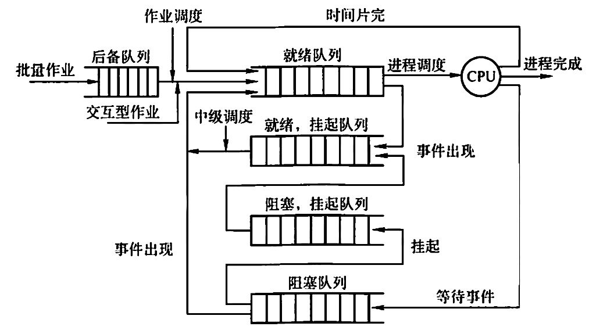
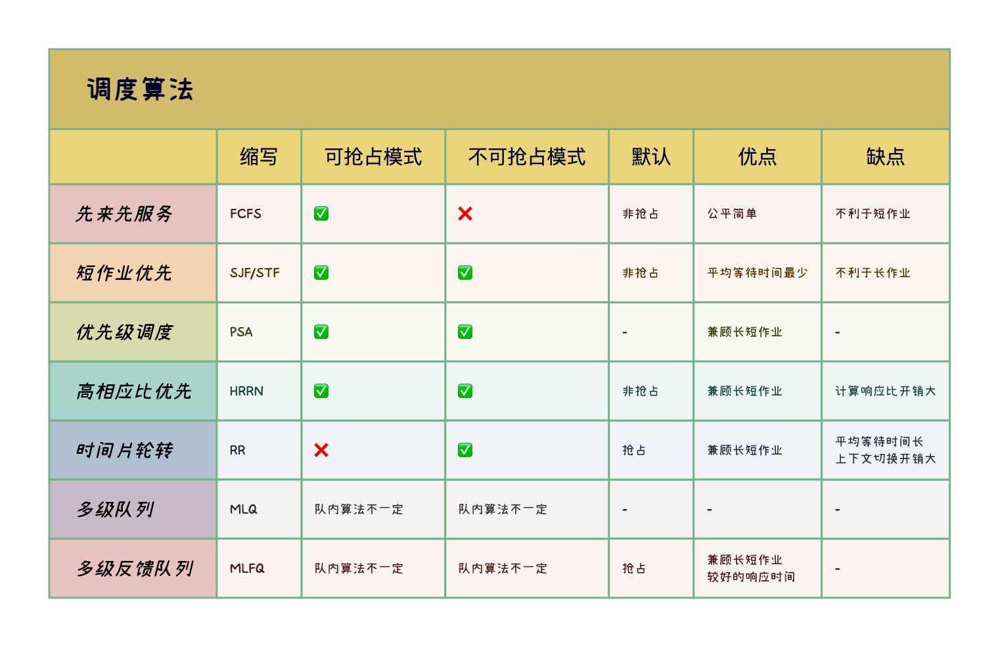

# 处理机调度

2022.10.14

[toc]

> 本文是《处理机调度》专题的精简总结版，包含概念关键词、图表汇总、易错点汇总。
>
> ➡️ [详细版入口](./处理机调度(详细版).md)

1. 调度的层次

   

   1. 高级调度/作业调度：外存与内存之间的调度，每个作业只调入一次、调出一次。
   2. 中级调度/内存调度：挂起进程与挂起态转就绪态。挂起时调入外存，转就绪再掉入内存。
   3. 低级调度/进程调度：就绪队列中选取一个进程，将处理机分配给它，最基本。

2. 调度的指标

   1. CPU利用率：$CPU利用率 = \frac{CPU工作时间}{CPU工作时间+CPU空闲时间}$
   2. 系统吞吐量：单位时间内CPU完成作业的数量
   3. 周转时间：从作业提交到作业完成的时间
   4. 周转时间：$作业完成时刻 - 作业提交时刻$
   5. 平均周转时间：周转时间的平均
   6. 带权周转时间：$\frac{作业周转时间}{作业运行时间}$
   7. 平均带权周转时间：带权周转时间的平均
   8. 等待时间：进程等处理机的时间之和
   9. 响应时间：用户提交进程到首次产生相应的时间

3. 调度的实现

   1. 排队器(构造就绪队列)、分排器(从就绪队列中取出分配给CPU)、上下文切换器(新老进程PCB对处理机寄存器的信息转换)
   2. <u>用户态和内核态之间的切换称为模式切换，而不是上下文切换</u>
   3. <u>上下文切换只能发生在内核态</u>
   4. 调度程序(一种内核程序)
   5. 非抢占调度方式(非剥夺方式)，抢占调度方式(剥夺方式，常见于优先权、短进程优先和时间片原则)
   6. 闲逛进程：系统中没有就绪进程，就会调度闲逛进程(idle）运行
   7. 用户级线程调度。由于内核并不知道线程的存在，所以内核还是和以前一样，选择一个线程，并给予时间控制。由进程中的调度程序决定哪个线程运行。
   8. 内核级线程调度。内核选择一个特定线程运行，通常不用考虑该线程属于哪个进程。对被选择的线程赋予一个时间片，如果超过了时间片，就会强制挂起该线程。
   9. 在进程处于临界区时不能进行处理机调度【错】。当进程处于临界区时，说明进程正在占用处理机，只要不破坏临界资源的使用规则，就不会影响处理机的调度，只会影响性能。

4. 经典的调度算法

   

   1. 优先级调度

      1. <u>系统进程 ＞ 用户进程</u>
      2. <u>交互型进程 ＞ 非交互型进程</u>（或前台进程 ＞后台进程）
      3. <u>I/O型进程 ＞ 计算型进程</u>

   2. 高响应比优先调度
      $$
      \begin{align*}响应比R_P= \frac{等待时间+要求服务时间}{要求服务时间}\end{align*}
      $$

   3. 多级队列调度与多级反馈队列调度

      
