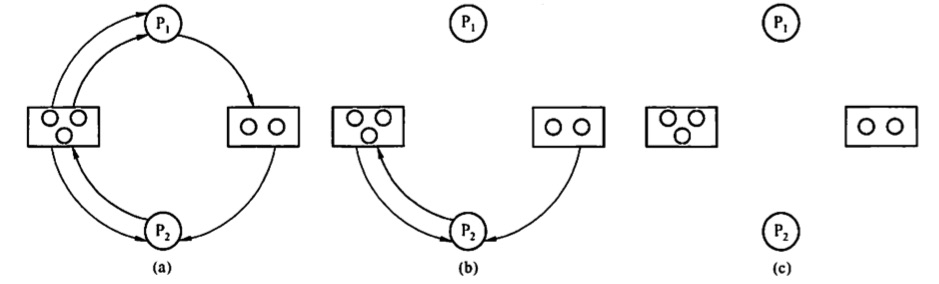

# 死锁
2022.07.12

[TOC]

## 死锁的概念

### 死锁的定义

在多道程序系统中，由于多个进程的并发执行，改善了系统资源的利用率并提高了系统的处理能力。然而，多个进程的并发执行也带来了新的问题一<u>死锁</u>。所谓死锁，是指<u>多个进程因竞争资源而造成的一种僵局（互相等待）</u>，若无外力作用，这些进程都将无法向前推进。

下面通过一些实例来说明死锁现象。

先看生活中的一个实例。在一条河上有一座桥，桥面很窄，只能容纳一辆汽车通行。若有两辆汽车分别从桥的左右两端驶上该桥，则会出现下达冲突情况：此时，左边的汽车占有桥面左边的一段，要想过桥还需等待右边的汽车让出桥面石边的一段：右边的汽车占有桥面右边的一段，要想过桥还需等待左边的汽车让出桥面左边的一段。此时，若左右两边的汽车都只能向前行驶，则两辆汽车都无法过桥。

在计算机系统中也存在类似的情况。例如，某计算机系统中只有一台打印机和一台输入设备，进程 P1正占用输入设备，同时又提出使用打印机的请求，但此时打印机正被进程 P2所占用，而P2在未释放打印机之前，又提出请求使用正被P1占用的输入设备。这样，两个进程相互无休止地等待下去，均无法继续执行，此时两个进程陷入死锁状态，

### 死锁产生的原因

1. <u>系统资源的竟争</u>

   通常系统中拥有的不可剥夺资源，其数量不足以满足多个进程运行的需要，使得进程在运行
   过程中，会因争夺资源而陷入僵局，如磁带机、打印机等。只有对<u>不可剥夺资源的竞争</u>才可能产生死锁，对可剥夺资源的竞争是不会引起死锁的。

2. <u>进程推进顺序非法</u>

   进程在运行过程中，<u>请求和释放资源的顺序不当</u>，也同样会导致死锁。例如，并发进程P1，P2
   分别保持了资源R1，R2，而进程 P1，申请资源 R2、进程P2，申请资源R1时，两者都会因为所需资源被占用而阻塞，于是导致死锁。

   <u>信号量使用不当也会造成死锁</u>。进程间彼此相互等待对方发来的消息，也会使得这些进程间无法继续向前推进。例如，进程A 等待进程 B 发的消息，进程B 又在等待进程 A 发的消息，可
   以看出进程 A 和B 不是因为竞争同一资源，而是在等待对方的资源导致死锁。

3. <u>死锁产生的必要条件</u>
   产生死锁必须同时满足以下 4个条件，只要其中任意一个条件不成立，死锁就不会发生

   1. **互斥条件**：进程要求对所分配的资源（如打印机）进行<u>排他性</u>使用，即在一段时间内某资源仅为一个进程所占有。此时若有其他进程请求该资源，则请求进程只能等待。
   2. **不剥夺条件**：进程所获得的资源在未使用完之前，不能被其他进程强行夺走，即只能由获得该资源的进程自己来释放（只能是主动释放)。
   3. **请求并保持条件**：进程已经保持了至少一个资源，但又提出了新的资源请求，而该资源
      己被其他进程占有，此时请求进程被阻塞，但对自己已获得的资源保持不放．
   4. **循环等待条件**：存在一种进程资源的循环等待链，链中每个进程己获得的资源同时被链中一个进程所请求。即存在一个处于等待态的进程集合 {P1,P2,P3,....,Pn}，其中Pi等待的资源被 P_{i+1} (i=0,1,...,n-1） 占有，Pn等待的资源被P0占有。

   直观上看，循环等待条件似乎和死锁的定义一样，其实不然。按死锁定义构成等待环所要求的条件更严，它要求Pi等待的资源必须由 Pi+1来满足，而循环等待条件则无此限制。例如，系统
   中有两台输出设备，P0占有一台，PK占有另一台，且K不属于集合 {0,1，...，n}。Pn等待一台输出设备，它可从P0获得，也可能从Pk获得。因此，虽然Pn,P0。和其他一些进程形成了循环等待圈，但PK不在圈内，若PK释放了输出设备，则可打破循环等待。因此循环等待只是死锁的必要条件．

<u>资源分配图含图而系统又不一定有死锁</u>的原因是，<u>同类资源数大于 1</u>。但若系统中每类资源都只有一个资源，则资源分配图含圈就变成了系统出现死锁的充分必要条件。要注意区分不剥夺条件与请求并保持条件。下面用一个简单的例子进行说明：若你手上拿着一个苹果（即便你不打算吃），别人不能把你手上的苹果拿走，则这就是不剥夺条件；若你左手拿着一个苹果，允许你右手再去拿一个苹果，则这就是请求并保持条件。

### 死锁的处理策略

为使系统不发生死锁，<u>必须设法破坏产生死锁的4 个必要条件之一</u>，或允许死锁产生，但当死锁发生时能检测出死锁，并有能力实现恢复。

1. <u>死锁预防</u>。设置某些限制条件，破坏产生死锁的4个必要条件中的一个或几个。
2. <u>避免死锁</u>。在资源的动态分配过程中，用某种方法防止系统进入不安全状态。
3. <u>死锁的检测及解除</u>。无须采取任何限制性措施，允许进程在运行过程中发生死锁。通过系统的检测机构及时地检测出死锁的发生，然后采取某种措施解除死锁。

预防死锁和避免死锁都属于事先预防策略，预防死锁的限制条件比较严格，实现起来较为简单，但往往导致系统的效率低，资源利用率低：避免死锁的限制条件相对宽松，资源分配后需要通过算法来判断是否进入不安全状态，实现起来较为复杂。

|   种类   |         资源分配策略         |               各种可能模式               |                   主要优点                   |                           主要缺点                           |
| :------: | :--------------------------: | :--------------------------------------: | :------------------------------------------: | :----------------------------------------------------------: |
| 死锁预防 |        保守，宁可闲置        | 一起请求所有资源，资源剥夺，资源按序分配 |     适用于突发式处理的进程，不必进行剥夺     | 效率低，进程初始化时间延长；剥夺次数过多；不便灵活申请新资源 |
| 死锁避免 | 折中，运行中判断是否产生死锁 |          寻找可能的安全允许顺序          |                 不必进行剥夺                 |         必须知道将来的资源需求，进程不能被长时间阻塞         |
| 死锁检测 |   宽松，只要允许就分配资源   |           定期检查死锁是否发生           | 不延长进程初始化时间，允许对死锁进行现场处理 |                  通过剥夺接触死锁，造成损失                  |

## 死锁预防

防止死锁的发生只需破坏死锁产生的4 个必要条件之一即可。

1. **破坏互斥条件**

   若允许系统资源<u>都能共享使用</u>，则系统不会进入死锁状态。但有些资源根本不能同时访问，如打印机等临界资源只能互斥使用。所以，破坏互斥条件而预防死锁的方法不太可行，而且在有的场合应该保护这种互斥性。

2. **破坏不剩夺条件**

   当一个已保持了某些不可剥夺资源的进程请求新的资源而得不到满足时，它<u>必须释放</u>己经保持的所有资源，待以后需要时再重新申请。这意味着，一个进程已占有的资源会被哲时释放，或者说是被剥夺，或从而破坏了不剥夺条件。

   该策略实现起来比较复杂，释放已获得的资源可能造成前一阶段工作的失效，反复地申请和释放资源会增加系统开销，降低系统吞吐量。这种方法常用于状态易于保存和恢复的资源，如CPU的寄存器及内存资源，一般不能用于打印机之类的资源。

3. **破坏请求并保持条件**

   采用<u>预先静态分配方法</u>，即进程在运行前一次申请完它所需要的全部资源，在它的资源未满
   足前，不把它投入运行。一旦投入运行，这些资源就一直归它所有，不再提出其他资源请求，这样就可以保证系统不会发生死锁。

   这种方式实现简单，但缺点也显而易见，系统资源被严重浪费，其中有些资源可能仅在运行
   初期或运行快结束时才使用，甚至根本不使用。而且还会导致“饥饿”现象，由于个别资源长期
   被其他进程占用时，将致使等待该资源的进程迟迟不能开始运行

4. **破坏循环等待条件**

  为了破坏循环等待条件，可采用<u>顺序资源分配法</u>。首先给系统中的资源编号，规定每个进程必须按编号递增的顺序请求资源，同类资源一次申请完。也就是说，只要进程提出申请分配资源
  Ri，则该进程在以后的资源申请中就只能申请编号大于Ri的资源这种方法存在的问题是，编号必须相对稳定，这就限制了新类型设备的增加：尽管在为资源编号时已考虑到大多数作业实际使用这些资源的顺序，但也经常会发生作业使用资源的顺序与系统规定顺序不同的情况，造成资源的浪费：此外，这种按规定次序申请资源的方法，也必然会给用户的编程带来麻烦。

> 小结：
>
> 1. 破坏互斥条件：所有资源都是共享资源（不可能）
> 2. 破坏不剩夺条件：所有资源可以剥夺
> 3. 破坏请求并保持条件：静态预先分配
> 4. 破坏循环等待条件：资源排序1～n。申请资源新编号要大于所有老编号。比如资源{3,5,6}。要继续申请7，可以申请；要继续申请4，需要先释放5，6

## 死锁避免

避免死锁同样属于事先预防策略，但并不是事先采取某种限制指施破坏死锁的必妥条件，而是在资源动态分配过程中，防止系统进入不安全状态，以避免发生死锁。这种方法所施加的限制条件较弱，可以获得较好的系统性能。

### 系统安全状态

避免死锁的方法中，允许进程动态地申请资源，但系统在进行资源分配之前，应先计算此次分配的安全性。若此次分配不会导致系统进入不安全状态，则允许分配；否则让进程等待。

所谓安全状态，是指系统能按某种进程推进顺序（P1，P2,…，Pn）为每个进程 P：分配其所需的资源，直至满足每个进程对资源的最大需求，使每个进程都可顺序完成。此时称P1，P2,⋯，Pn为安全序列。若系统无法我到一个安全序列，则称系统处于不安全状态。

假设系统中有三个进程P1，P2和P3，共有12台磁带机。进程P1共需要 10 台磁带机，P2和P3，分别需要 4 台和9台。假设在T1时刻，进程P1，P2和P3己分别获得5 台、2台和2台，尚有3台未分配

| 进程 | 最大需求 | 已分配 | 仍需要 | 系统剩余 |
| :--: | :------: | :----: | :----: | :------: |
|  P1  |    10    |   5    |   5    |          |
|  P2  |    4     |   2    |   2    |          |
|  P3  |    9     |   2    |   7    |          |
| 总计 |          |        |        |    3     |

T0时刻可用计算机：12 - 5 - 2 - 2 = 3 > 2

所以存在安全序列：P2，P1，P3

当没办法找到一个安全序列是系统进入不安全状态。并非所有的不安全状态都是死锁状态，但当系统进入不安全状态后，便可能进入死锁状态；反之，只要系统处于安全状态，系统便可避免进入死锁状态。

### 银行家算法

银行家算法是最著名的死锁避免算法，其思想是：把操作系统视为银行家，操作系统管理的资源相当于银行家管理的资金，进程向操作系统请求分配资源相当于用户向银行家货款。操作系统按照银行家制定的规则为进程分配资源。进程运行之前先声明对各种资源的最大需求量，当进程在执行中继续申请资源时，先测试该进程已占用的资源数与本次申请的资源数之和是否超过该进程声明的最大需求量。若超过则拒绝分配资源，若未超过则再测试系统现存的资源能否满足该进程尚需的最大资源量，若能满足则按当前的申请量分配资源，否则也要推迟分配。

1. 数据结构描述

   * **可利用资源向量 Available**：含有m个元素的数组，其中每个元素代表一类可用的资源数目。<u>Available[j]=K表示系统中现有Rj类资源K个</u>。
   * **最大需求矩阵 Max**：nxm矩阵，定义系统中n个进程中的每个进程对 m 类资源的最大需求。简单来说，一行代表一个进程，一列代表一类资源。Max[i,j]表示进程i需要Rj类资源的最大数目为K。
   * **分配矩阵 Allocation**:nxm 矩阵，定义系统中每类资源当前己分配给每个进程的资源数。Allocationt[i,j]一下表示进程 i当能己分得Rj类资源的数目为X。初学者容易混淆 Available 向量和Allocation 矩阵，在此特别提醒。
   * **需求矩阵 Need**: nxm矩阵，表示每个进程接下来最多还需要多少资源。Need[i,j]=K 表示进程i还需要Rj类资源的数目为K。
   * 上述三个矩阵间存在下述关系：**Need = Max-Allocation**
   * 一般情况下，在银行家算法的题目中，Max 矩阵和 Allocation 矩阵是已知条件，而求出 Need矩阵是解题的第一步。

   > 珍惜生命：自己有多少？它要多少？已经给了多少？还剩多少没给？

2. 银行家算法描述

   设Requesti是进程 Pi的请求向量，Requesti[j]=K 表示进程 Pi需要Rj资源K个。当Pi发出
   资源请求后，系统按下述步骤进行检查：

   1. *【查看本次“贷款”是否合法】*若Request[i,j]≤ Need[i,j]，则转向步骤②：否则认为出错，因为它所需要的资源数已超过
      它所宣布的最大值。
   2. *【查看本次“贷款”银行是否有足够资金】*若Request[i,j]≤Availabie[j]，则转向步骤③；否则，表示尚无足够资源，P,须等待。
   3. *【准备数据（银行的钱减少，贷款人钱增多，贷款人可以借的钱变少）】*系统试探着把资源分配给进程 Pi，并修改下面数据结构中的数值：
      Available = Available- Request_i;
      Allocation[i, j] = Allocation[i, j] + Request_i[j];
      Need[i, j] = Need[i, j]- Request_i[j];
   4. *【财务拿到数据查一查】*系统执行<u>安全性算法</u>，检查此次资源分配后，系统是否处于安全状态。若安全，才正式将资源分配给进程 Pi，以完成本次分配；否则，将本次的试探分配作废，恢复原来的资源分配状态，让进程Pi等待。

3. 安全性算法

   1. 设置<u>工作向量Work</u>，有m个元素，表示系统中的剩余可用资源数目。在执行安全性算法开
      始时，<u>Work = Available</u>。
   2. ① 初始时<u>安全序列</u>为空。
      ② 从Need 矩阵中找出符合下面条件的行：该行对应的进程不在安全序列中，而且该行小于等于 Work 向量，找到后，把对应的进程加入安全序列；若找不到，则执行步骤④。
      ③进程 Pi进入安全序列后，可顺利执行，直至完成，并释放分配给它的资源，因此应执行
      Work = Work + Allocation[i]，其中 Allocation[i]表示进程Pi代表的在 Allocation 矩阵中对应的行，返回步聚②。
      ④ 若此时安全序列中己有所有进程，则系统处于安全状态，否则系统处于不安全状态。

   > 我的理解：
   >
   > 假设一个人借了自己的全部贷款余额，然后换了所有资源，银行的资源就变多了。一次看看能不能把贷款份额都借了。

## 死锁的检测与解除

前面介绍的死锁预防和避免算法，都是在为进程分配资源时施加限制条件或进行检测，托系统为进程分配资源时不采取任何措施，则应该提供死锁检测和解除的手段。

### 资源分配图

系统死锁可利用资源分配图来描述。**用圆图代表一个进程，用框代表一类资源**。由于一种类型的资源可能有多个，因此用框中的一个圆代表一类资源中的一个资源。<u>从进程到资源的有向边称为请求边，表示该进程申请一个单位的该类资源；从资源到进程的边称为分配边，表示该类资源已有一个资源分配给了该进程</u>。
在图所示的资源分配图中，进程P1己经分得了两个R1资源，并又请求一个R2资源；进程P2分得了一个R1资源和一个R2资源，并又请求一个R1资源。

### 死锁定理

简化资源分配图可检测系统状态 S 是否为死锁状态。简化方法如下：

在资源分配图中，找出既不阻塞又不孤点的进程 P，(<u>即找出一条有向边与它相连，且该有向边对应资源的申请数量小于等于系统中已有的空闲资源数量</u>，如在图中，R1没有空闲资源，R2有一个空闲资源。）

若所有连接该进程的边均满足上述条件，则这个进程能继续运行直至完成，然后释放它所占有的所有资源）。<u>消去它所有的请求边和分配边</u>，使之成为孤立的结点。在图中，P1是满足这一条件的进程结点，将P1的所有边消去。

这里要注意一个问题，判断<u>某种资源是否有空闲，应该用它的资源数量减去它在资源分配图中的出度</u>，例如在上图中，R1的资源数为 3，而出度也为 3，所以民没有空闲资源，R2的资源数为2，出度为1，所以R2有一个空闲资源。

<u>S为死锁的条件是当且仅当 S 状态的资源分配图是不可完全简化的，该条件为死锁定理</u>。

### 死锁解除

一旦检测出死锁，就应立即采取相应的措施来解除死锁。死锁解除的主要方法有：
1）**资源剥夺法**。挂起某些死锁进程，并抢占它的资源，将这些资源分配给其他的死锁进程。但应防止被挂起的进程长时间得不到资源而处于资源西三的状态。
2）**撤销进程法**。强制撤销部分甚至全部死锁进程并剥夺这些进程的资源。撤销的原则可以按进程优先级和撤销进程代价的高低进行。
3）**进程回退法**。<u>让一（或多）个进程回退到足以回避死锁的地步</u>，进程回退时自愿释放资源而非被剥夺。要求系统保持进程的历史信息，<u>设置还原点</u>。

## 例题

* 系统的资源分配图在下列情况下，无法判断是否处于死锁状态的有（）。
  1.出现了环路
  2.没有环路
  3.每种资源只有一个，并出现环路
  4.每个进程结,点至少有一条请求边
  A. I. Il, III, IV
  B. I II IV
  C. I. IV
  D. 以上答案都不正确

  【答案：C】每种资源都有一个并出现环路，是不会有一个“就行出现”来还资源的，因为每种资源只有一个。

* 【2015统考真题】若系统S1采用死锁避免方法，S2采用死锁检测方法。下列叙述中，正确的是
  I. S1会限制用户申请资源的顺序，而S2不会
  II. S1需要进程运行所需的资源总量信息，而S2不需要
  III. S1不会给可能导致死锁的进程分配资源，而S2会
  A.仅II
  B.仅I、II
  C.仅I、III
  D. I. II. III

  【答案：C】银行家算法分配资源时不会有限制措施，但提供死锁的检测和解除手段。