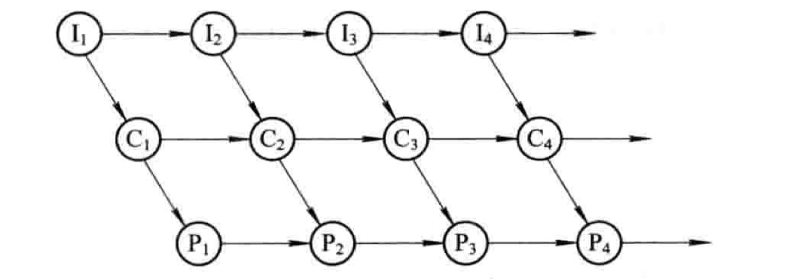
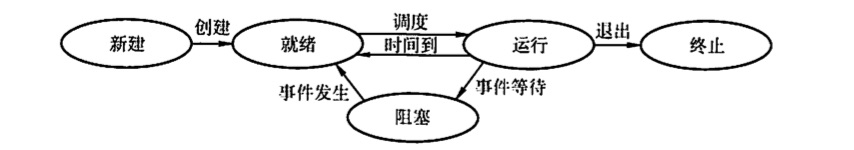
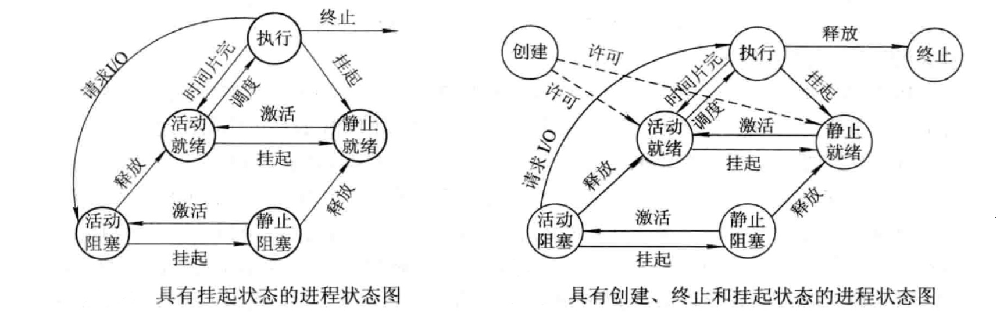
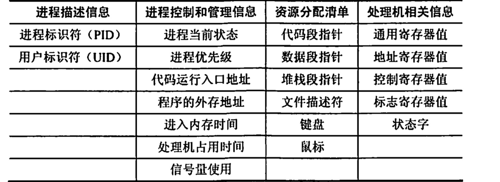
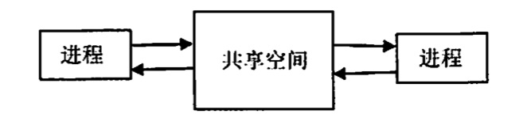
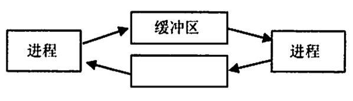
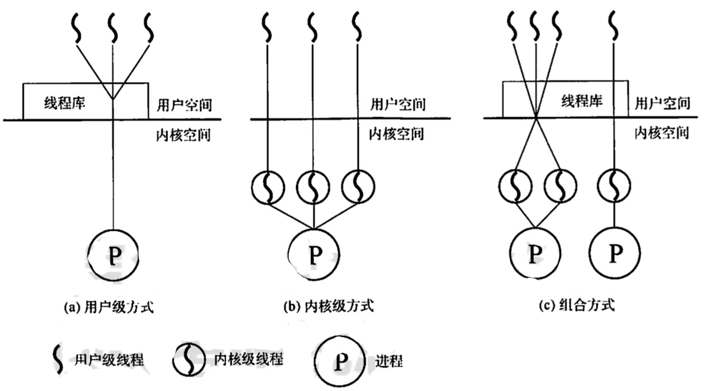
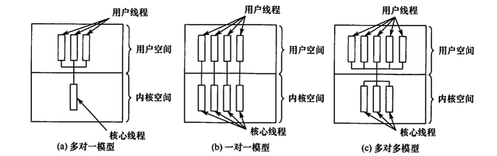
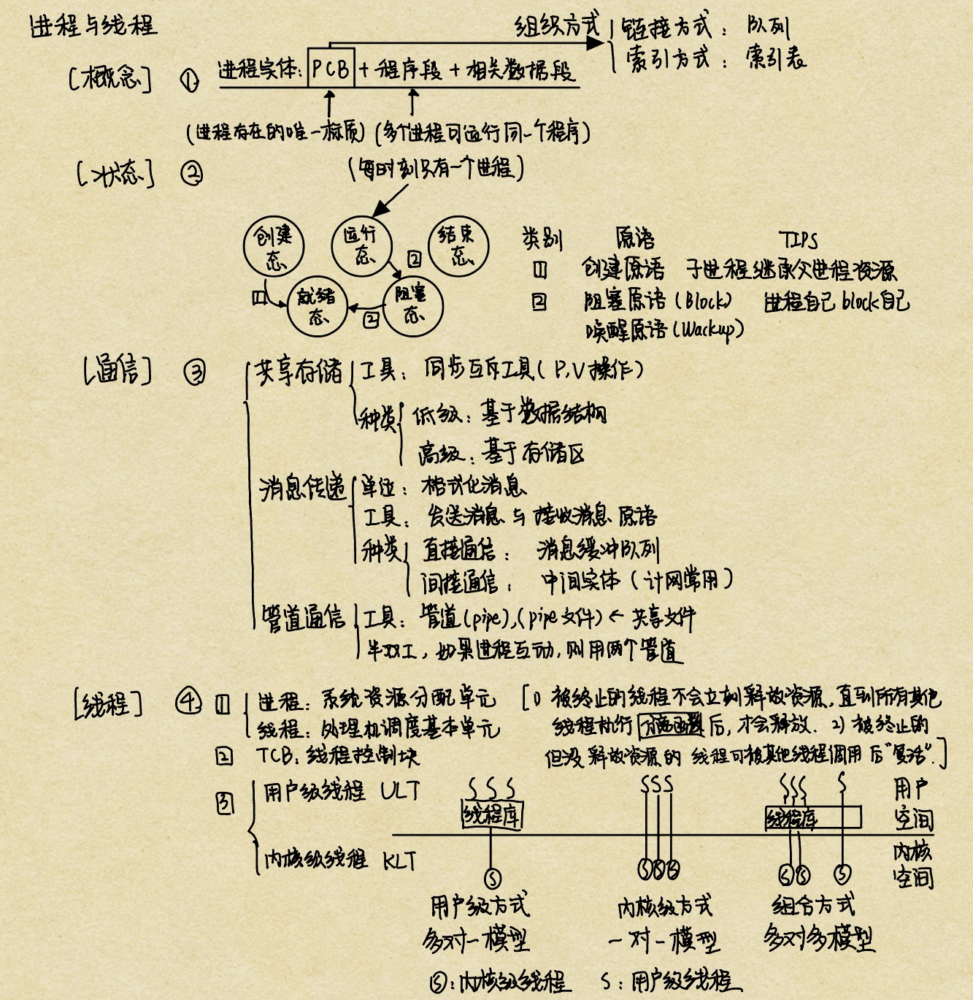

# 进程与线程
2022.10.05

[TOC]

## 前驱图与程序执行

1. 前驱图：描述程序执行先后顺序的前驱图——一个有向无环图(DAG图)、初始结点、终止结点

2. 程序的顺序执行：顺序性、封闭性(获得全机资源)、可再现性

   

   【案例中：I、C、P分别代表输入运算输出】

3. 程序的并发执行：间断性(计算可能因为缺少输入暂停进程)、失去封闭性(资源共享)、不可再现性

   

   【案例中：I、C、P分别代表输入运算输出】

## 进程的概念和特征

1. **进程控制块（PCB）**：描述进程、运行进程、控制进程
2. **进程实体 = 程序段 + 相关数据段 + PCB**
3. **PCB是进程存在的唯一标志**
4. 动态性（最基本）。有着创建、活动、暂停、终止等过程。
5. 并发性。
6. 独立性。**进程是进程实体的运行过程，是系统进行资源分配和调度的一个独立单位。**
7. 异步性。

## 进程的状态与切换

1. 五态转换

   1. **运行态**。进程正在处理机上运行。**在单处理机中，每个时刻只有一个进程处于运行态**。

   2. **就绪态**。进程获得了除处理机外的一切所需资源，一旦得到处理机，便可立即运行。系统中处于就绪状态的进程可能有多个，它们通常按照一定**策略**(如优先级策略)排成一个队列，称为**就绪队列**。

   3. **阻塞态**，又称等待态。进程正在等待某一事件而哲停运行，如等待某资源为可用（不包括处理机）或等待输入/输出完成。即使处理机空闲，该进程也不能运行。系统通常将处于阻塞态的进程也排成一个队列，甚至根据阻塞原因的不同，设置多个**阻塞队列**。

   4. **创建态**。进程正在被创建，尚未转到就绪态。创建进程需要多个步骤：首先申请一个空白PCB，并向PCB中填写用于控制和管理进程的信息；然后为该进程分配运行时所必须的资源；最后把该进程转入就绪态并插入就绪队列。<u>但是，如果进程所需的资源尚不能得到满足，如内存不足，则创建工作尚末完成，进程此时所处的状态称为创建态。</u>

   5. **结束态**。进程正从系统中消失，可能是进程正常结束或其他原因退出运行。进程需要结束运行时，系统首先将该进程置为结束态，然后进一步处理资源释放和回收等工作.

   6. > 区别就绪态和等待态：就绪态是指进程仅缺少处理器，只要获得处理机资源就立即运行；而等待态是指进程需要其他资源（除了处理机） 或等待某一事件。之所以把处理机和其他资源划分开，是因为在分时系统的时间片轮转机制中，每个进程分到的时间片是者干毫秒。也就是说，进程得到处理机的时间很短且非常频繁，进程在运行过程中实际上是频繁地转换到就绪态的；而其他资源（如外设）的使用和分配或某一事件的发生(如I/O 操作的完成）对应的时间相对来说很长，进程转换到等待态的次数也相对较少。这样来看，就绪态和等待态是进程生命周期中两个完全不同的状态，显然需要加以区分。

   7. 下图说明了5种进程状态的转换，而3种基本状态之间的转换如下：

      1. **就绪态$\to$运行态**：处于就绪态的进程被调度后，获得处理机资源 （分派处理机时间片），于是进程由就绪态转换为运行态。

      2. **运行态$\to$就绪态**：处于运行态的进程在时间片用完后，不得不让出处理机，从而进程由运行态转换为就绪态。此外，在可剥夺的操作系统中，当有更高优先级的进程就绪时，调度程序将正在执行的进程转换为就绪态，让更高优先级的进程执行。

      3. **运行态$\to$阻塞态**：进程请求某一资源（如外设）的使用和分配或等待某一事件的发生（如 I/O 操作的完成）时，它就从运行态转换为阻塞态。进程以系统调用的形式请求操作系统提供服务，这是一种特殊的、由运行用户态程序调用操作系统内核过程的形式。

      4. **阻塞态$\to$就绪态**：进程等待的事件到来时，如I/O操作结束或中断结束时，中断处理程序必须把相应进程的状态由阻塞态转换为就绪态。
      5. 

2. 七态转换

   > 总的来说，就是【就绪】与【阻塞】都分成了【静止】与【活动】两半。

   1. 挂起操作：进程挂起意味着进程处于静止状态。如果进程正在执行，则暂停执行。如果就绪，则不接受调度。
   2. 原语：Suspend(挂起原语)、Active(激活原语)
   3. 

## 进程的组织

### 程序控制块PCB

进程创建时：创建PCB， **PCB常驻内存**

进程执行时：通过PCB了解与管理进程

进程结束时：系统收回PCB

> * **进程**描述信息：**PID，UID**
> * 进程**控制**：**状态**(状态，优先级)，**地址**(代码入口，程序外存)，**时间**(进入内存时间，处理机占用时间)，信号量
> * **资源**分配清单：**指针**(代码段，数据段，堆栈段，文件描述符)，**外设**(键盘，鼠标)
> * **处理机**：**寄存器**(通用寄存器，地址寄存器，控制寄存器，标志寄存器，[状态字](https://baike.baidu.com/item/%E7%A8%8B%E5%BA%8F%E7%8A%B6%E6%80%81%E5%AD%97/10121343))

1) **进程描述信息**。进程标识符(内部标识符)：标志各个进程，每个进程都有一个唯一的标识号。用户标识符(外部标识符)：进程归属的用户，用户标识符主要为共享和保护服务。
2) **进程控制和管理信息**。进程当前状态：描述进程的状态信息，作为处理机分配调度的依据。进程优先级：描述进程抢占处理机的优先级，优先级高的进程可优先获得处理机。
3) **资源分配清单**，用于说明有关内存地址空间或虛拟地址空间的状况，所打开文件的列表和所使用的输入/输出设备信息。
4) **处理机相关信息**，也称处理机的上下文，主要指处理机中各寄存器的值。当进程处于执行态时，处理机的许多信息都在寄存器中。当进程被切换时，处理机状态信息都必须保存在相应的 PCB 中，以便在该进程重新执行时，能从断点继续执行。
5) 在一个系统中，通常存在着许多进程的 PCB，有的处于就绪态，有的处于阻塞态，而且阻塞的原因名不相同。为了方便进程的调度和管理，需要将各进程的 PCB 用适当的方法组织起来。目前，常用的**组织方式**有链接方式和索引方式两种。<u>**链接方式**将同一状态的 PCB 链接成一个**队列**，不同状态对应不同的队列，也可把处于阻塞态的进程的 PCB，根据其阻塞原因的不同，排成多个阻塞队列。**索引方式**将同一状态的进程组织在一个**索引表**中，索引表的表项指向相应的PCB，不同状态对应不同的索引表，如就绪索引表和阻塞索引表等。</u>

### 程序段

程序段就是能被进程调度程序调度到 CPU 执行的程序代码段。注意，程序可被多个进程共享，即**多个进程可以运行同一个程序**.

### 数据段
一个进程的数据段，可以是进程对应的程序加工处理的原始数据，也可以是程序执行时产生的中间或最终结果。

## 进程控制

### 进程的创建

使用**创建原语**

> 课本：
> 允许一个进程创建另一个进程，此时创建者称为**父进程**，被创建的进程称为**子进程**。<u>子进程可以继承父进程所拥有的资源。当子进程被撤销时，应将其从父进程那里获得的资源归还给父进程</u>。此外，在撤销父进程时，通常也会同时撤销其所有的子进程。
> 在操作系统中，终端用户登录系统、作业调度、系统提供服务、用户程序的应用请求等都会引起进程的创建。操作系统创建一个新进程的过程如下（创建原语）：
> 1）为新进程分配一个唯一的**进程标识号**，并申请一个空白 PCB PCB 是有限的）。若 PCB 申请失败，则创建失败。
> 2）为进程分配其运行**所需的资源**，如内存、文件、IO 设备和CPU 时间等（在PCB 中体
> 现）。这些资源或从操作系统获得，或仅从其父进程获得。<u>如果资源不足（如内存），则并不是创建失败，而是处于创建态，等待内存资源</u>。
> 3）**初始化** PCB，主要包括初始化标志信息、初始化处理机状态信息和初始化处理机控制信息，以及设置进程的优先级等。
> 4）若进程**就绪队列**能够接纳新进程，则将新进程插入就绪队列，等待被调度运行。

### 进程的终止

使用**终止原语**

> 课本：
>
> 引起进程终止的事件主要有：
>
> ①正常结束，表示进程的任务已完成并准备退出运行。
>
> ②异常结束，表示进程在运行时，发生了某种异常事件，使程序无法继续运行，如存储区越界、保护错、非法指令、特权指令错、运行超时、算术运算错、I/O 故障等。
>
> ③外界干预，指进程应外界的请求而终止运行，如操作员或操作系统干预、父进程请求和父进程终止。
> 操作系统终止进程的过程如下 （终止原语）：
> 1）根据被终止进程的标识符，检索出该进程的 PCB，从中读出该进程的状态。
> 2）若被终止进程处于执行状态，立即终止该进程的执行，将处理机资源分配给其他进程。
> 3）若该进程还有子孙进程，则应将其所有子孙进程终止。
> 4）将该进程所拥有的全部资源，或归还给其父进程，或归还给操作系统。
> 5）将该PCB 从所在队列（链表）中删除。

### 进程的阻塞与唤醒

使用：阻塞原语和唤醒原语

> 课本
>
> 正在执行的进程，由于期待的某些事件未发生，如请求系统资源失败、等待某种操作的完成新数据尚未到达或无新任务可做等，进程便通过调用**阻塞原语（Block）**，使自己由运行态变为阻塞态。可见，<u>阻塞是进程自身的一种主动行为</u>，也因此<u>只有处于运行态的进程（获得 CPU)，才可能将其转为阻塞</u>态。阻塞原语的执行过程如下：
> 1）找到将要被阻塞进程的标识号对应的 PCB。
> 2）若该进程为运行态，则保护其现场，将其状态转为阻塞态，停止运行。
> 3）把该PCB 插入相应事件的等待队列，将处理机资源调度给其他就绪进程。
>
> 当被阻塞进程所期待的事件出现时，如它所启动的 I/0 操作己完成或其所期待的数据已到达，
> 由有关进程（比如，释放该I/O 设备的进程，或提供数据的进程）调用**唤醒原语（Wakeup)**，将等待该事件的进程唤醒。唤醒原语的执行过程如下：
> 1）在该事件的等待队列中找到相应进程的 PCB。
> 2）将其从等待队列中移出，并置其状态为就绪态。
> 3）把该 PCB 插入就绪队列，等待调度程序调度．
> 应当注意，<u>Block 原语和 Wakeup 原语是一对作用刚好相反的原语，必须成对使用</u>。如果在某进程中调用了 Block 原语，则必须在与之合作的或其他相关的进程中 安排一条相应的 Wakeup原语，以便唤醒阻塞进程：否则阻塞进程将会因不能被唤醒而永远处于阻塞状态。

## 进程通信

### 共享存储

<u>在通信的进程之间存在一块可直接访问的共享空间</u>，通过对这片共享空间进行写/读操作实现进程之间的信息交换。在对共享空间进行写/读操作时，需要使用**同步互斥工具**（如，P 操作、V 操作），对共享空间的写/读进行控制。共享存储又分为两种：<u>**低级方式的共享**是基于</u><u>**数据结构**的共享</u>；<u>**高级方式的共享**则是基于**存储区**的共享</u>。操作系统只负责为通信进程提供可共享使用的存储空间和同步互斥工具，而数据交换则由用户自己安排读/写指令完成。

注意，进程空间一般都是独立的，进程运行期间一般不能访问其他进程的空间，想让两个进程共享空间，必须通过<u>特殊的系统调用实现</u>，而进程内的线程是自然共享进程空间的。简单理解就是，甲和乙中间有一个大布袋，甲和乙交换物品是通过大布袋进行的，甲把物品放在大布袋里，乙拿走。但乙不能直接到甲的手中拿东西，甲也不能直接到乙的手中拿东西。

### 消息传递

在消息传递系统中，进程间的数据交换以**格式化的消息(Message）**为单位。若通信的进程之间不存在可直接访问的共享空间，则必须利用操作系统提供的消息传递方法实现进程通信。进程通过系统提供的**发送消息和接收消息两个原语**进行数据交换。这种方式隐藏了通信实现细节，使通信过程对用户透明，简化了通信程序的设计，是当前应用最广泛的进程间通信机制。在微内核操作系统中，微内核与服务器之间的通信就采用了消息传递机制。由于该机制能很好地支持多处理机系统、分布式系统和计算机网络，因此也成为这些领域最主要的通信工具。

* **直接通信方式**。发送进程直接把消息发送给接收进程，并将它挂在接收进程的**消息缓冲队列**上，接收进程从消息缓冲队列中取得消息
* **间接通信方式**。发送进程把消息发送到某个中间实体，接收进程从中间实体取得消息。这种中间实体一般称为信箱。该<u>通信方式广泛应用于计算机网络中</u>。简单理解就是，甲要告诉乙某些事情，就要写信，然后通过邮差送给乙。直接通信就是邮差把信直接送到乙的手上；问接通信就是乙家门口有一个邮箱，邮差把信放到邮箱里。

### 管道通信

<u>管道通信是消息传递的一种特殊方式</u>。所谓“管道”，<u>是指用于连接一个读进程和一个写进程以实现它们之间的通信的一个**共享文件**，又名**pipe 文件**</u>。向管道（共享文件）提供输入的发送进程（即写进程），以字符流形式将大量的数据送入（写）管道：而接收管道输出的接收进程（即读进程）则从管道中接收（读）数据。为了协调双方的通信，管道机制必须提供以下三方面的协调能力：互斥、同步和确定对方的存在。
在Linux 中，管道是一种使用非常频繁的通信机制。从本质上说，管道也是一种文件，但它又和一般的文件有所不同，管道可以克服使用文件进行通信的两个问题，具体表现如下：
1）限制管道的大小。实际上，<u>管道是一个固定大小的缓冲区</u>。在 Linux 中，该缓冲区的大小为 4KB，这使得它的大小不像文件那样不加检验地增长。使用单个固定缓冲区也会带来问题，比如在写管道时可能变满，这种情况发生时，随后对管道的 `write()`调用将默认地被<u>阻塞</u>，等待某些数据被读取，以便腾出足够的空间供 `write()`调用写。
2）读进程也可能工作得比写进程快。当所有当前进程数据已被读取时，管道变空。当这种情况发生时，一个随后的 `read()`调用将默认地被<u>阻塞</u>，等待某些数据被写入，这解决了 `read()`调用返回文件结束的问题。

注意：从管道读数据是一次性操作，数据一旦被读取，就释放空间以便写更多数据。<u>管道只能采用半双工通信，即某一时刻只能单向传输。要实现父子进程互动通信，需定义两个管道</u>。

<u>管道可以理解为共享存储的优化和发展</u>，因为在共享存储中，若某进程要访问共享存储空间，则必须没有其他进程在该共享存储空间中进行写操作，否则访问行为就会被阻塞。而管道通信中，存储空间进化成了缓冲区，缓冲区只允许一边写入、另一边读出，因此只要缓冲区中有数据，进程就能从缓冲区中读出，而不必担心会因为其他进程在其中进行写操作而遭到阻塞，因为写进程会先把缓冲区写满，然后才让读进程读，当缓冲区中还有数据时，写进程不会往缓冲区写数据。当然，这也决定了管道通信必然是半双工通信。

## 线程和多线程模型

### 线程的基本概念

引入<u>进程</u>的目的是更好地使<u>多道程序并发执行</u>，提高资源利用率和系统吞吐量；

引入<u>线程</u>的目的是<u>减小程序在并发执行时所付出的时空开销</u>，提高操作系统的并发性能。

线程最直接的理解就是“轻量级进程”，它是一个基本的 CPU 执行单元，也是<u>程序执行流的最小单元</u>，由<u>线程 ID、程序计数器、寄存器集合和堆栈</u>组成。线程是进程中的一个实体，是被系统独立调度和分派的基本单位，线程自己不拥有系统资源，只拥有一点儿在运行中必不可少的资源，但它可与同属一个进程的其他线程共享进程所拥有的全部资源。一个线程可以创建和撤销另一个线程，同一进程中的多个线程之间可以并发执行。由于线程之间的相互制约，致使线程在运行中显现出间断性。线程也有就绪、阻塞和运行三种基本状态。

<u>引入线程后，进程的内涵发生了改变，进程只作为除 CPU 外的系统资源的分配单元，而线程则作为处理机的分配单元。由于一个进程内部有多个线程，若线程的切换发生在同一个进程内部，则只需要很少的时空开销</u>。下面从几个方面对线程和进程进行比较。

### 线程与进程的比较

1. <u>调度</u>。在传统的操作系统中，拥有资源和独立调度的基本单位都是进程，每次调度都要进行上下文切换，开销较大。在引入线程的操作系统中，<u>线程是独立调度的基本单位</u>，而<u>线程切换的代价远低于进程</u>。在同一进程中，线程的切换不会引起进程切换。但从一个进程中的线程切换到另一个进程中的线程时，会引起进程切换。
2. <u>并发性</u>。在引入线程的操作系统中，不仅进程之间可以并发执行，而且一个进程中的多个线程之间亦可并发执行，甚至不同进程中的线程也能并发执行，从而使操作系统具有更好的并发性，提高了系统资源的利用率和系统的吞吐量。
3. <u>拥有资源</u>。<u>**进程**是系统中拥有资源的基本单位</u>，而<u>线程不拥有系统资源</u>（仅有一点必不可少、能保证独立运行的资源），但线程可以访问其隶属进程的系统资源，这主要表现在属于同一进程的所有线程都具有相同的地址空间。要知道，若线程也是拥有资源的单位，则切换线程就需要较大的时空开销，线程这个概念的提出就没有意义。
4. <u>独立性</u>。每个进程都拥有独立的地址空间和资源，除了共享全局变量，不允许其他进程访问。某进程中的线程对其他进程不可见。同一进程中的不同线程是为了提高并发性及进行相互之间的合作而创建的，它们共享进程的地址空间和资源。
5. <u>系统开销</u>。在创建或撤销进程时，系统都要为之分配或回收进程控制块 PCB 及其他资源如内存空间、IO 设备等。操作系统为此所付出的开销，明显大于创建或撤销线程时的开销。类似地，在进程切换时涉及进程上下文的切换，而线程切换时只需保存和设置少量寄存器内容，开销很小。此外，由于同一进程内的多个线程共享进程的地址空间，因此这些线程之间的同步与通信非常容易实現，甚至无须操作系统的干预。
6. <u>支持多处理机系统</u>。对于传统单线程进程，不管有多少处理机，进程只能运行在一个处理机上。对于多线程进程，可以将<u>进程中的多个线程分配到多个处理机上执行</u>。

### 线程的属性

多线程操作系统中的进程己不再是一个基本的执行实体，但它仍具有与执行相关的状态。所谓进程处于 “执行” 状态，实际上是指该进程中的某线程正在执行。线程的主要属性如下：

1. 线程是一个<u>轻型实体</u>，它<u>不拥有系统资源</u>，但每个线程都应有一个唯一的标识符和一个线程控制块，线程控制块记录了线程执行的寄存器和栈等现场状态。

2. 不同的线程可以执行相同的程序，即同一个服务程序被不同的用户调用时，操作系统把它们创建成不同的线程。

3. 同一进程中的各个线程共享该进程所拥有的资源。

4. 线程是处理机的独立调度单位，多个线程是可以并发执行的。在单 CPU 的计算机系统中，各线程可交替地占用 CPU；在多CPU 的计算机系统中，各线程可同时占用不同的 CPU，若各个 CPU 同时为一个进程内的各线程服务，则可缩短进程的处理时间。

5) 一个线程被创建后，便开始了它的生命周期，直至终止。线程在生命周期内会经历阻塞态、就绪态和运行态等各种状态变化。

为什么线程的提出有利于提高系统并发性？可以这样来理解：由于有了线程，线程切换时，有可能会发生进程切换，也有可能不发生进程切换，平均而言每次切换所需的开销就变小了，因此能够让更多的线程参与并发，而不会影响到响应时间等问题。

### 线程的状态与转换

和进程一样

### 线程的组织与控制

#### 线程控制块

与进程类似，系统也为每个线程配置一个**线程控制块** **TCB**，用于记录控制和管理线程的信息。线程控制块通常包括：

①线程标识符；

②一组寄存器，包括程序计数器、 状态寄存器和通用寄存器：

③线程运行状态，用于描述线程正处于何种状态

④优先级

⑤线程专有存储区，线程切换时用于保存现场等

⑥堆栈指针，用于过程调用时保存局部变量及返回地址等。

同一进程中的所有线程都完全共享进程的地址空间和全局变量。各个线程都可以访问进程地址空间的每个单元，所以一个线程可以读、写或甚至清除另一个线程的堆栈。

#### 线程的创建

线程也是具有生命期的，它由创建而产生，由调度而执行，由终止而消亡。相应地，在操作系统中就有用于**创建线程和终止线程的函数**（**或系统调用**）。
用户程序启动时，通常仅有一个称为 “初始化线程”的线程正在执行，其主要功能是用于创建新线程。在创建新线程时，需要利用一个线程创建函数，并提供相应的参数，如指向线程主程序的入口指针、堆栈的大小、线程优先级等。线程创建西数执行完后，将返回一个线程标识符。

#### 线程的终止

一个线程完成自己的任务后，或线程在运行中出现异常而要被强制终止时，由终止线程调用相应的函数执行终止操作。但是有些线程（主要是系统线程）一旦被建立，便一直运行而不会被终止。通常，<u>线程被终止后并不立即释放它所占有的资源，只有当进程中的其他线程执行了分离函数后，被终止线程才与资源分离</u>，此时的资源才能被其他线程利用。<u>被终止但尚未释放资源的线程仍可被其他线程调用，以使被终止线程重新恢复运行</u>。

### 线程的实现方式

线程的实现可以分为两类：**用户级线程**(User-Level Thread, **ULT**） 和**内核级线程** (Kemnel-Level
Thread， **KLT**）。<u>内核级线程又称内核支持的线程</u>。

#### 用产级线程(ULT)

在用户级线程中，有关<u>线程管理</u>（创建、撤销和切换等）的<u>所有工作</u>都由<u>应用程序在用户空间中完成，内核意识不到线程的存在</u>。应用程序可以通过使用线程库设计成多线程程序。通常，应用程序从单线程开始，在该线程中开始运行，在其运行的任何时刻，可以通过调用线程库中的派生例程创建一个在相同进程中运行的新线程。下图说明了用户级线程的实现方式。对于设置了用户级线程的系统，其调度仍是以进程为单位进行的，各个进程轮流执行一个时间片。假设进程 A 包含1个用户级线程，进程 B 包含100 个用户级线程，这样，进程A 中线程的运行时问将是进程B中各线程运行时间的100 倍，因此对<u>线程来说实质上是不公平的</u>。

这种实现方式的优点如下：

①线程切换不需要转换到内核空间，<u>节省了模式切换的开销</u>。

②<u>调度算法可以是进程专用的</u>，不同的进程可根据自身的需要，<u>对自己的线程选择不同的调度算法</u>。
③用户级线程的实现与<u>操作系统平台无关</u>，对线程管理的代码是属于用户程序的一部分。

这种实现方式的缺点如下：

①系统调用的阻塞问题，当线程<u>执行一个系统调用时，不仅该线程被阻塞，而且进程内的所有线程都被阻塞</u>。

②<u>不能发挥多处理机的优势</u>，内核每次分配给一个进程的仅有一个CPU，因此进程中仅有一个线程能执行。

#### 内核级线程(KLT)

在操作系统中，无论是系统进程还是用户进程，都是在操作系统内核的支持下运行的，与内核紧密相关。内核级线程同样也是在内核的支持下运行的，线程管理的所有工作也是在内核空间内实现的。内核空间也为每个内核级线程设置一个线程控制块，内核根据该控制块感知某线程的存在，并对其加以控制。上图(b)，说明了内核级线程的实现方式。

这种实现方式的优点如下：

①能发挥多处理机的优势，内核能同时调度同一进程中的多个线程并行执行。

②如果进程中的一个线程被阻塞，内核可以调度该进程中的其他线程占用处理机，也可运行其他进程中的线程。

③内核支持线程具有很小的数据结构和堆栈，线程切换比较快、开销小。

④内核本身也可采用多线程技术，可以提高系统的执行速度和效率。
这种实现方式的缺点如下：

同一进程中的线程切换，需要从用户态转到核心态进行，系统开销较大。这是因为用户进程的线程在用户态运行，而线程调度和管理是在内核实现的。

#### 组合方式

有些系统使用组合方式的多线程实现。<u>在组合实现方式中，内核支持多个内核级线程的建立、调度和管理，同时允许用户程序建立、调度和管理用户级线程。</u>一些内核级线程对应多个用户级
线程，这是用户级线程通过时分多路复用内核级线程实现的。同一进程中的多个线程可以同时在
多处理机上并行执行，且在阻塞一个线程时不需要将整个进程阻塞，所以组合方式能结合 KLT 和
ULT 的优点，并且克服各自的不足。上图（C)展示了这种组合实现方式。

在线程实现方式的介绍中，提到了通过线程库来创建和管理线程。**线程库(thread library)**是为程序员提供<u>创建和管理线程的 API</u>。实现线程库主要的方法有如下两种：
①<u>在用户空间中提供一个没有内核支持的库</u>。这种库的所有代码和数据结构都位于用户空间
中。这意味着，调用库内的一个函数只导致用户空间中的一个本地函数的调用。
②<u>实现由操作系统直接支持的内核级的一个库</u>。对于这种情况，库内的代码和数据结构位于内核空间。调用库中的一个API 函数通常会导致对内核的系统调用。

目前使用的三种主要线程库是：POSIX Pthreads、Windows API、Java。Pthreads 作为 POSIX 标雅的扩展，可以提供用户级或内核级的库。Windows 线程库是用于 Windows 操作系统的内核级线程库。Java 线程 API 允许线程在Java 程序中直接创建和管理。然而，由于 JVM实例通常运行在宿主操作系统之上，Java 线程 API 通常采用宿主系统的线程库来实现，因此在Windows 系统中 Java 线程通常采用 Windows API 来实现，在类 UNIX 系统中采用 Pthreads来实现。

### 多线程模型

有些系统同时支持用户线程和内核线程，由于用户级线程和内核级线程连接方式的不同，从
而形成了下面三种不同的多线程模型。

#### 多对一模型

将多个用户级线程映射到一个内核级线程。这些用户线程一般属于一个进程，线程的调度和管理在用户空间完成。仅当用户线程需要访问内核时，才将其映射到一个内核级线程上，但是每次只允许一个线程进行映射。
优点：线程管理是在用户空间进行的，因而效率比较高。
缺点：如果一个线程在访问内核时发生阻寒，则整个进程都会被阻塞：在任何时刻，只有一个线程能够访问内核，多个线程不能同时在多个处理机上运行。

#### 一对一模型

将每个用户级线程映射到一个内核级线程。
优点：当一个线程被阻塞后，允许调度另一个线程运行，所以并发能力较强。
缺点：每创建一个用户线程，相应地就需要创建一个内核线程，开销较大。

#### 多对多模型

将n个用户线程映射到m 个内核级线程上，要求n≥m。
特点: 既克服了多对一模型并发度不高的缺点，又克服了一对一模型的一个用户进程占用太多内核级线程而开销太大的缺点。此外，还拥有上达两种模型各自的优点

## 例题

* (02)下列关于线程的叙述中，正确的是()。
  A. 线程包含CPU 现场，可以独立执行程序
  B. 每个线程有自己独立的地址空间
  C. 进程只能包含一个线程
  D. 线程之间的通信必须使用系统调用函数

  答案：A

* (08)在单处理器系统中，若同时存在10个进程，则处于就绪队列中的进程最多有()个

  答案：9

* (10)系统进程所请求的一次 I/O 操作完成后，将使进程状态从（ ）。
  A. 运行态变为就绪态
  B. 运行态变为阻塞态
  C. 就绪态变为运行态
  D. 阻塞态变为就绪态

  答案：D

* (12)并发进程失去封闭性，是指（）。
  A.多个相对独立的进程以各自的速度向前推进
  B.并发进程的执行结果与速度无关
  C.并发进程执行时，在不同时刻发生的错误
  D.并发进程共享变量，其执行结果与速度有关

  答案：D

* (18)下列几种关于进程的叙述中，()最不符合操作系统对进程的理解

  A. 进程是多程序环境中的完整程序
  B. 进程可以有程序、数据、PCB描述
  C. 线程是一种特殊的进程
  D. 进程时程序在一个数据集合上的运行过程，它是系统进程资源分配和调度的一个独立单元
  
  答案：A
  
* (20)若一个进程实体由 PCB、共享正文段、数据堆段和数据栈段组成，请指出下列序中的内容及相关数据结构各位于哪一段中。

  1. 全局赋值变量（）
  2. 未赋值的局部变量（）
  3. 函数调用实参传递值（）
  4. 用malloc()要求动态分配的存储区（）
  5. 常量值（如1995、"string" )（）
  6. 进程的优先级（）

  A.PCB
  B.正文段
  C.堆段
  D.栈段

  答案：B，D，D，C，B，A

* (22)系统动态 DLL 库中的系统线程，被不同的进程所调用，它们是（）的线程。
  A. 不同
  B. 相同
  C. 可能不同，也可能相同
  D. 不能被调用

  **答案**：B

* (26)在一个多道系统中，若就绪队列不空，就绪的进程数目越多，处理器的效率（）。
  A.越高
  B.越低
  C.不变
  D.不确定

  答案：C

* (27)在具有通道设备的<u>单处理器</u>系统中实现并发技术后, ()。
  A. 各进程在某一时刻并行运行，CPU与I/O设备间并行工作
  B. 各进程在某一时问段内并行运行，CPU 与I/O设各间串行工作
  C. 各进程在某一时间段内并发运行，CPU 与I/O 设备间并行工作
  D. 各进程在某一时刻并发运行，CPU 与I/O设备问串行工作

  答案：C

* (31)下面的叙述中，正确的是()。
  A. 线程是比进程更小的能独立运行的基本单位，可以脱离进程独立运行
  B. 引入线程可提高程序并发执行的程度，可进一步提高系统效率
  C. 线程的引入增加了程序执行时的时空开销
  D. 一个进程一定包含多个线程

  答案： B

* (33)在以下指达中，（）并不是多线程系统的特长。
  A. 利用线程并行地执行矩阵乘法运算
  B. Web服务器利用线程响应 HTTP 请求
  C. 键盘驱动程序为每个正在运行的应用配备一个线程，用以响应该应用的键盘输入
  D. 基于GUI 的调试程序用不同的线程分别处理用户输入、计算和跟踪等操作

  答案：C

* (40)一个进程被唤醒，意味着()

  A. 该进程可以重新竞争CPU

  B. 优先级变大

  C. PCB移动到就绪队列之首

  D. 进程变为运行态

  答案：A

* 【2020统考真题】下列关于父进程与子进程的叙述中，错误的是(）。
  A. 父进程与子进程可以并发执行
  B. 父进程与子进程共享虛拟地址空间
  C. 父进程与子进程有不同的进程控制块
  D. 父进程与子进程不能同时使用同一临界资源

  答案：B

## 总结

* 系统动态 DLL 库中的系统线程，被不同的进程所调用，它们是（相同）的线程。
* 在一个多道系统中，若就绪队列不空，就绪的进程数目越多，处理器的效率（不变）。
* 线程的引入（降低）了程序执行时的时空开销。
* 父进程与子进程不能同时使用同一临界资源。
* 父进程与子进程共享虛拟地址空间【错】

