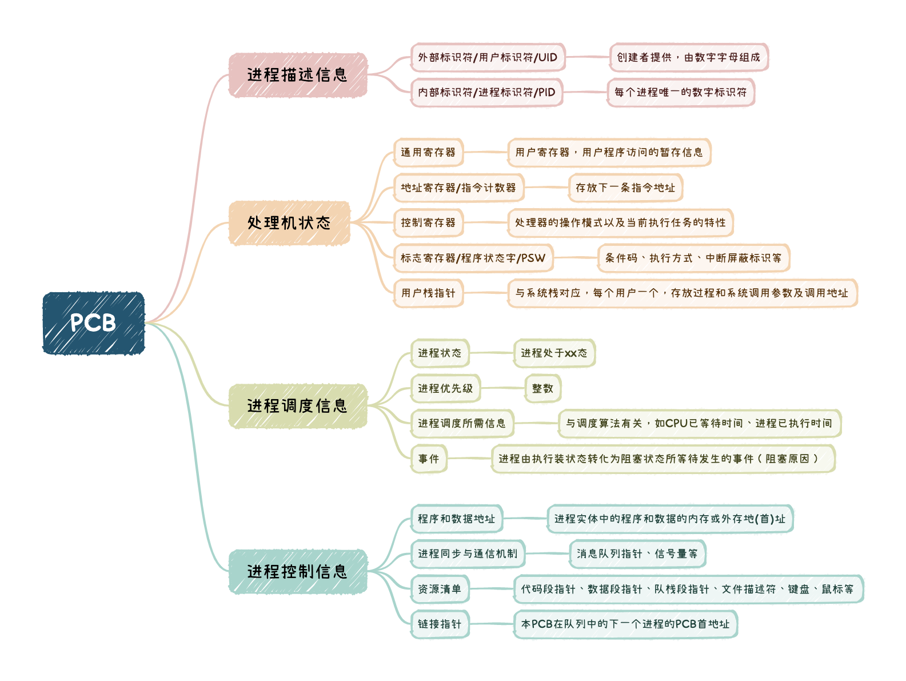
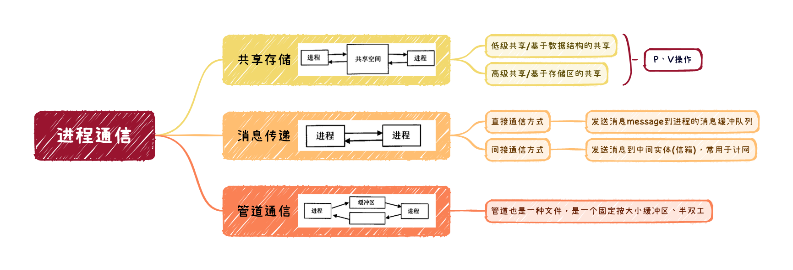
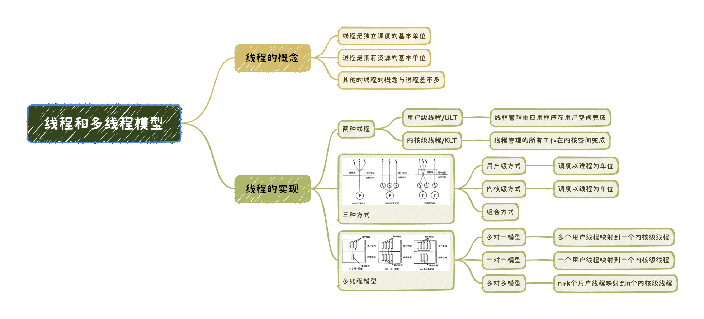

# 进程与线程

2022.10.14

[toc]

> 本文是《进程与线程》专题的精简总结版，包含概念关键词、图表汇总、易错点汇总。
>
> ➡️ [详细版入口](./进程与线程(详细版).md)

1. 前驱图与程序执行

   1. 前驱图(有向无环图，DAG图)
   2. 顺序执行与并发执行

2. 进程的概念和特征

   1. <u>进程实体 = 程序段 + 相关数据段 + 进程控制块(PCB)</u>
   2. <u>PCB是进程存在的唯一标志</u>
   3. 动态性（最基本，有着创建、活动、暂停、终止等过程），并发性，独立性，异步性。
   4. <u>进程是进程实体的运行过程，是系统进行资源分配和调度的一个独立单位</u>。
   5. 系统动态 DLL 库中的系统线程，被不同的进程所调用，它们是<u>（相同）</u>的线程。

3. 进程的状态与转换

   1. 运行态。<u>在单处理机中，每个时刻只有一个进程处于运行态</u>。

   2. 就绪态。系统中就绪状态的多个进程按照一定策略(如优先级策略)排成<u>就绪队列</u>。

   3. 阻塞态，又称等待态。可能根据阻塞原因的不同，设置<u>多个阻塞队列</u>。

   4. 创建态。<u>若进程所需资源不能满足（如内存不足），则创建工作尚末完成，进程此时处于创建态</u>。

   5. 结束态。进程需要结束运行时，系统首先将该进程置为结束态，再进一步处理资源释放和回收等工作。

      

   6. 七态转换：总的来说，就是 “就绪” 与 “阻塞” 都分成了 “静止” 与 “活动” 两半。

   7. 在一个多道系统中，若就绪队列不空，就绪的进程数目越多，处理器的效率<u>（不变）</u>。

4. 进程的组织

   1. 程序段 + 数据段 + PCB

   2. 程序可被多个进程共享，即<u>多个进程可以运行同一个程序</u>

      

5. 进程的控制

   1. 进程的创建，创建原语。
   2. 进程的终止，终止原语。正常结束、异常结束、外界干预。
   3. 进程的阻塞与唤醒，阻塞原语与唤醒原语，需要成对使用。

6. 进程的通信

   1. 父进程与子进程<u>（不能）</u>同时使用同一临界资源。
   2. 父进程与子进程共享虚拟地址空间？【错】

   

7. 线程和多线程模型

   * 线程的引入<u>（降低）</u>了程序执行时的时空开销。

   