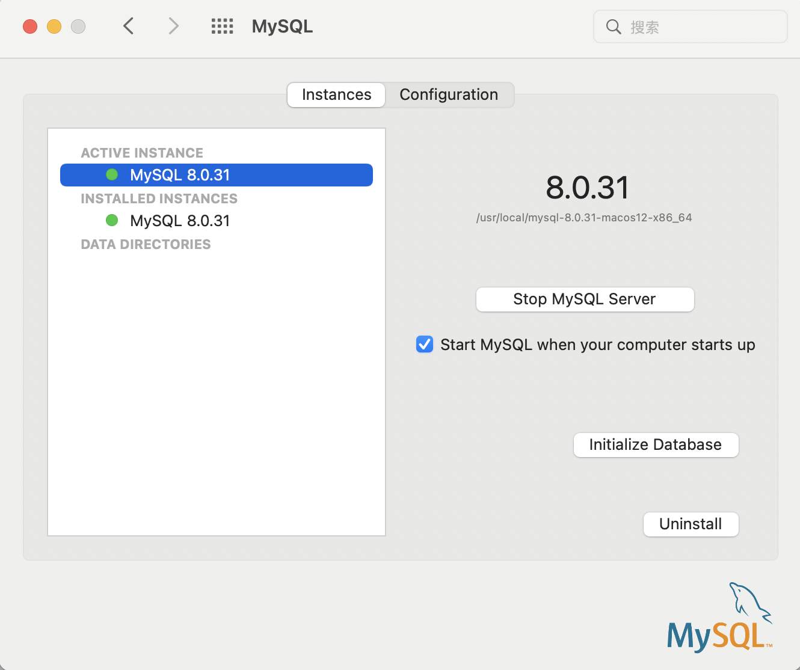
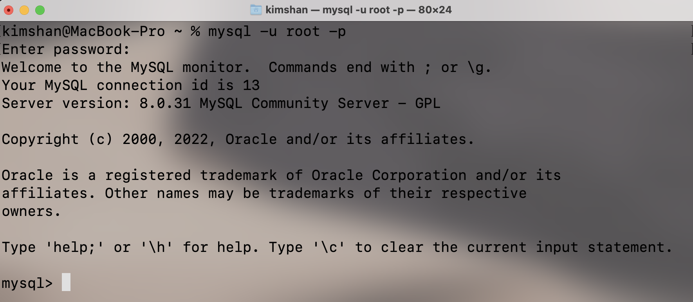
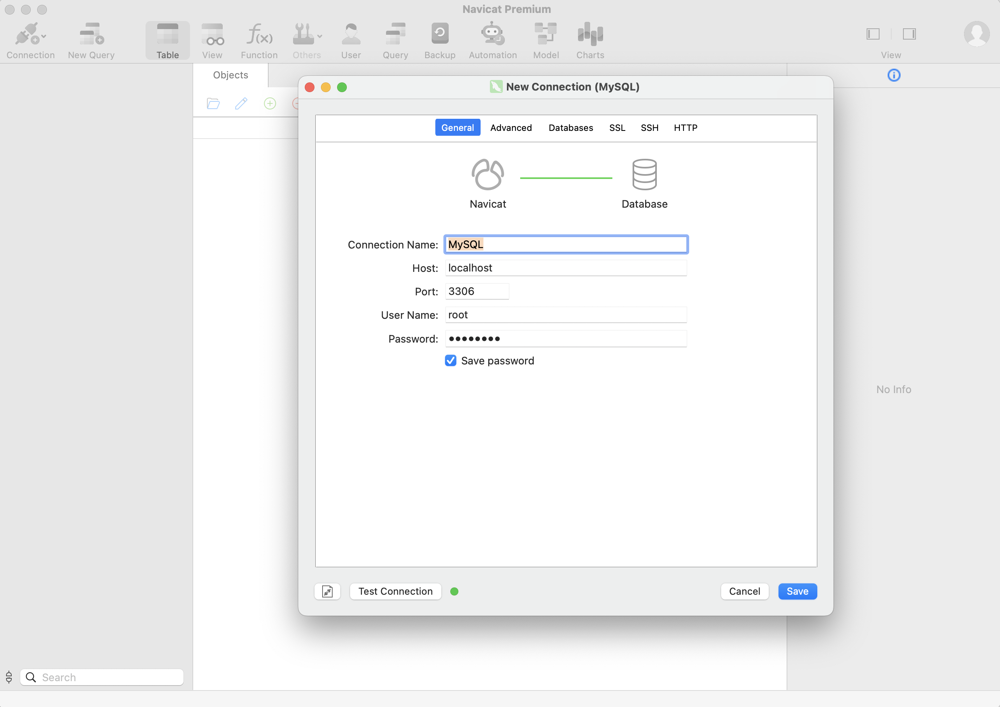
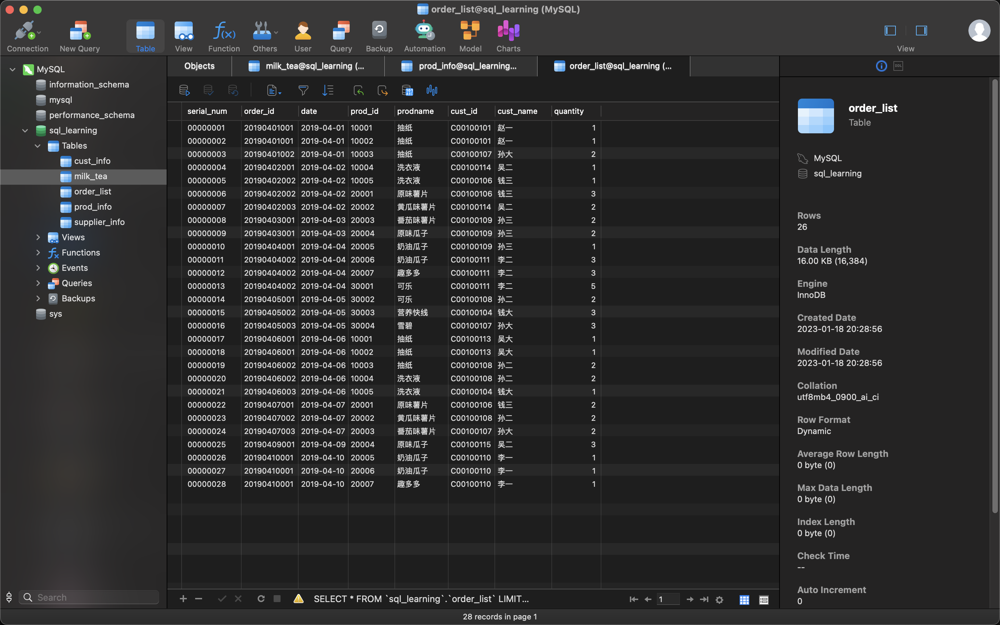

# 课程准备

2023.01.18

[toc]

## 资源链接整合

* SQL入门训练营课程
  * 课程地址：https://www.bilibili.com/video/BV1PJ411m7Lz
  * 链接: https://pan.baidu.com/s/10bagZkXQljhjnQM_-lQs_A?pwd=uhxy 提取码: uhxy 

* MySQL
  * 下载MySQL官网：https://downloads.mysql.com/archives/community/
  * 什么是MySQL？https://dev.mysql.com/doc/refman/8.0/en/what-is-mysql.html
  * MySQL的主要功能https://dev.mysql.com/doc/refman/8.0/en/features.html
  * MySQL 8.0参考手册https://dev.mysql.com/doc/refman/8.0/en/
* Navicat
  * 官网：https://www.navicat.com/en/
  * 免费版学习分享：http://www.itmind.net/18710.html

## 配置记录

运行环境：MacOS 12.6，i5

* 安装MySQL：系统偏好设置 -> MySQL

  

* [教程](https://blog.csdn.net/weixin_45182409/article/details/117753140)。配置命令行：在`.zshrc`里边加入`export PATH=${PATH}:/usr/local/mysql/bin`，命令行输入`mysql -u root -p`后输入密码可以登录

  

* 使用Navicat连接MySQL，选择新建链接，选择MySQL，填入密码，发现可以自动连接

  

* 在Navicat选择excel文件导入后的结果

  

