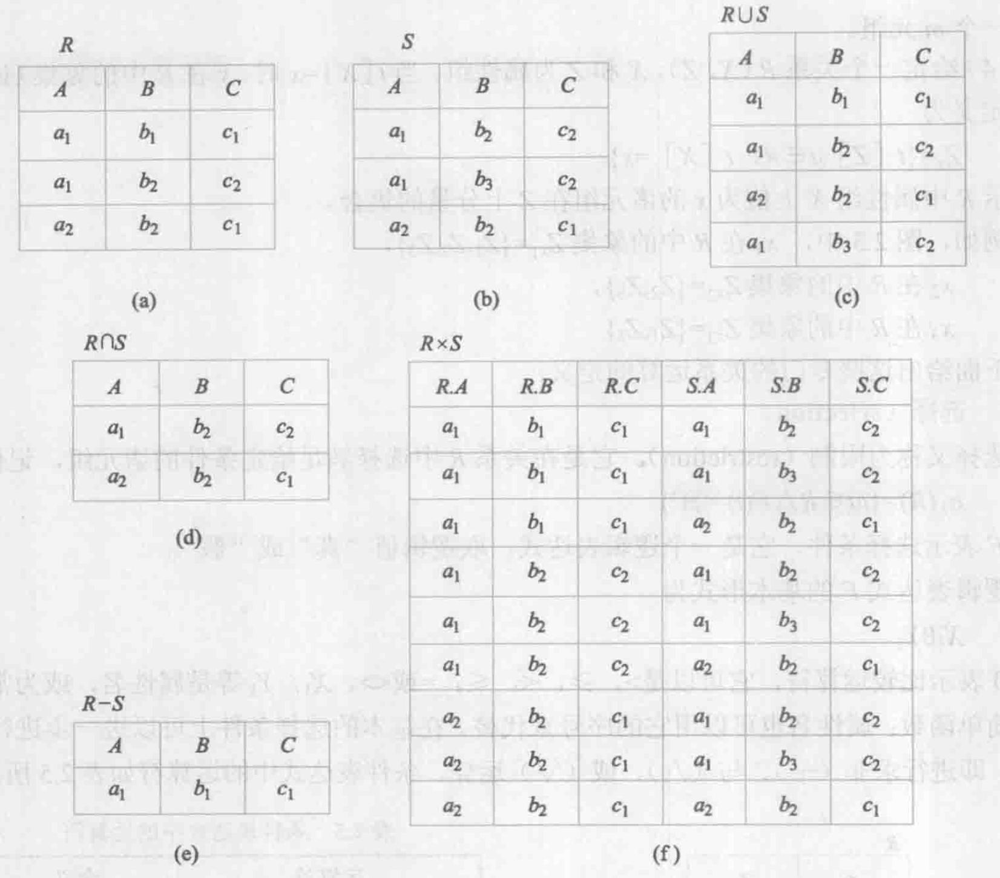
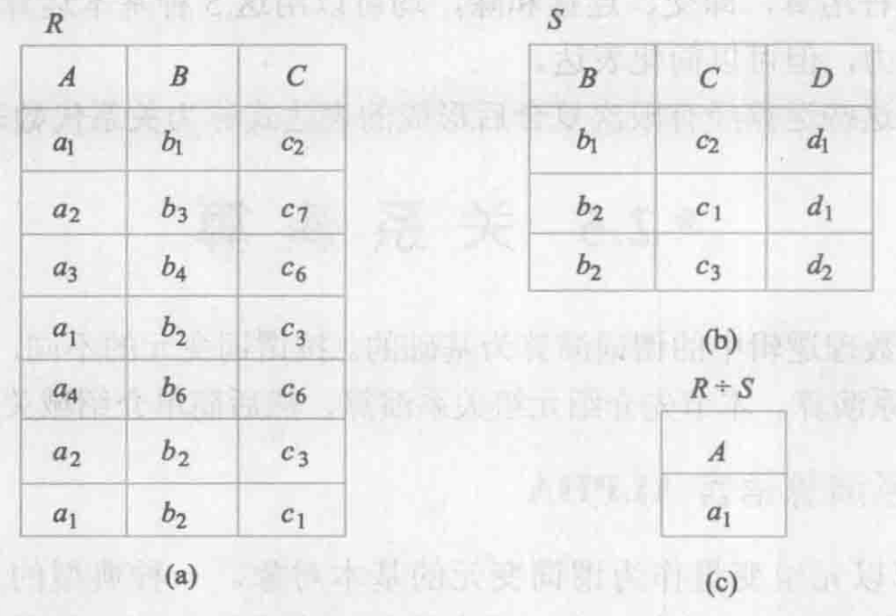

# 关系代数
2023.02.01

[TOC]

> 【关系代数（选择投影连接除）】 https://www.bilibili.com/video/BV1Aq4y1Y7wV/?share_source=copy_web&vd_source=0470ad56f59229195a0a7f79ab37cb27
>
> 上边这个网课里边有一些练习题

## 集合运算

交、并、补、笛卡尔积

## 关系运算

> * 数据库常用的latex：https://billc.io/2020/04/latex-relational-algebra/
> * 关系运算 连接：https://blog.csdn.net/u014395524/article/details/89420474

1. 选择$\sigma$：横着筛选行
2. 投影$\Pi$：竖着筛就行
3. 连接$\bowtie$：「学号 姓名」连接「姓名 性别」= 「学号 性别 姓名」
4. 取余$\div$：全部啥就除啥

> 除法：A的值a1对应的BC分别是{b1,c2}，{b2,c3}，{b2,c1}，我们可以发现{b1,c2}，{b2,c3}，{b2,c1}就是右边S的BC。a2，a3，a4均不能满足上述条件。所以a1是答案。