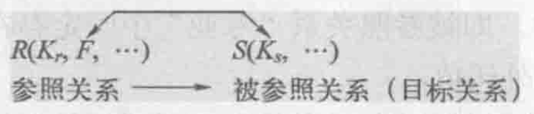

# 关系的完整性
2023.02.01

[TOC]

## Overview

1. 实体完整性：主属性不能取空值
2. 参照完整性：关系与关系的关系

## 实体完整性

* <u>实体完整性规则</u>是针对<u>基本关系</u>而言的。一个基本表通常对应现实世界的一个实体集。
* 现实世界中的<u>实体是可区分的</u>，即它们具有某种<u>唯一性标识</u>。
* 关系模型中以<u>主码</u>作为唯一性标识。
* 主码中的属性即<u>主属性不能取空值</u>。主属性取空值，就说明存在某个不可标识的实体，即存在不可区分的实体，这与第（2）点相矛盾，因此这个规则称为实体完整性

## 参照完整性

* 关系间的引用

  * 关系与关系间的引用案例

    学生（*学号*，姓名，性别，专业号，年龄）　 

    专业（*专业号*，专业名）

  * 学生、课程、学生与课程之间的<u>多对多联系</u>

    学生（*学号*，姓名，性别，专业号，年龄）     

    课程（*课程号*，课程名，学分）     

    选修（*学号*，*课程号*，成绩）

* 外码

  

  > 我的理解
  >
  > 外码，就是一条数据里边，用来连接到另一条数据的那条数据的主码。
  >
  > 比如：「学生学号，班长学号，xxx」，这里班长学号就是外吗。

  要求R的外码，要不是空置，要不是S的主码

## 用户定义的完整性

一些特殊的完整性约束，比如要求成绩在0～100

