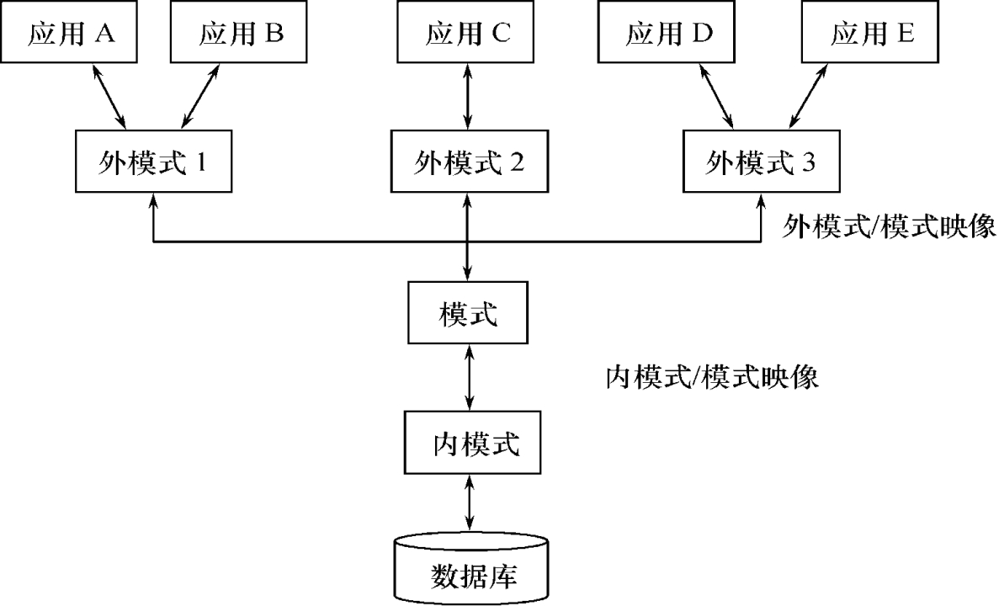

# 数据库系统的结构
2023.01.14

[TOC]

## Overview

1. 模式 / 逻辑模式
2. 外模式
3. 内模式
4. 外模式／模式映像 —— 逻辑独立性
5. 模式／内模式映像 —— 物理独立性

## 数据库系统模式的概念

1. 模式——型
2. 实例——值

## 数据库系统的三级模式结构

* **模式（Schema）/ 逻辑模式**
  * 数据库中全体数据的逻辑结构和特征的描述
  * 所有用户的公共数据视图
  * 一个数据库只有一个模式
  * 是数据库系统模式结构的中间层（与数据的物理存储细节和硬件环境无关，与具体的应用程序、开发工具及高级程序设计语言无关）
  * 数据的逻辑结构（数据项的名字、类型、取值范围等）
  * 数据之间的联系
  * 数据有关的安全性、完整性要求
* **外模式（External Schema）**：模式的子集
  * 数据库用户（包括应用程序员和最终用户）使用的**局部**数据的逻辑结构和特征的描述
  * 数据库用户的数据视图，是与某一应用有关的数据的逻辑表示
  * 模式与外模式的关系：一对多
  * 外模式与应用的关系：一对多
  * 外模式的用途保证：数据库安全性的一个有力措施、每个用户只能看见和访问所对应的外模式中的数据
* **内模式（Internal Schema） / 存储模式**
  * 是数据物理结构和存储方式的描述
  * 是数据在数据库内部的表示方式记录的存储方式（例如，顺序存储，按照B树结构存储， 按hash方法存储等）
  * 索引的组织方式数据
  * 是否压缩存储数据
  * 是否加密数据存储记录结构的规定
  * 一个数据库只有一个内模式

## 数据库的二级影响功能与数据独立性

### 外模式／模式映像

* 当模式改变时，数据库管理员对外模式／模式映象作相应改变，使外模式保持不变
* 应用程序是依据数据的外模式编写的，应用程序不必修改，保证了数据与程序的逻辑独立性，简称数据的**逻辑独立性**

### 模式／内模式映像

* 模式／内模式映象定义了数据全局逻辑结构与存储结构之间的对应关系。
  * 例如，说明逻辑记录和字段在内部是如何表示的数据库中
* 模式／内模式映象是唯一的该映象定义通常包含在模式描述中
* 保证数据的物理独立性
  * 当数据库的存储结构改变了（例如选用了另一种存储结构），数据库管理员修改模式／内模式映象，使模式保持不变。应用程序不受影响。
  * 保证了数据与程序的物理独立性，简称数据的**物理独立性**。

