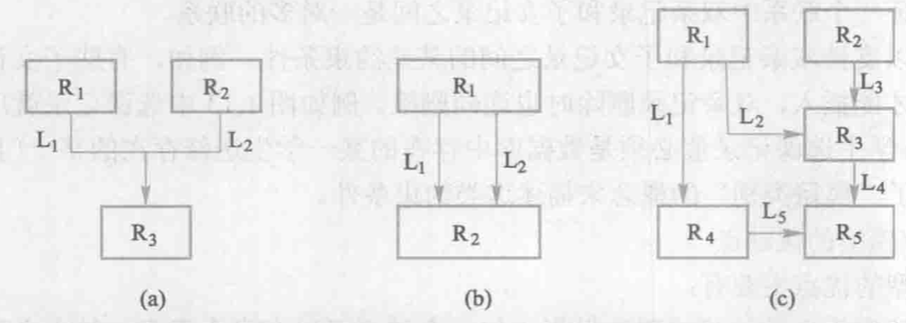
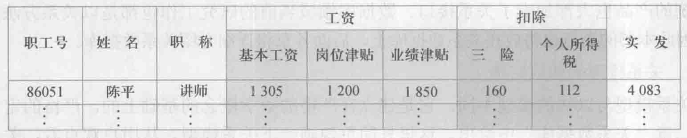

# 数据模型
2023.01.13

[TOC]

> 我的理解
>
> 柏拉图提出了“理念”的观点，数据模型也是一种“理念”，是对现实世界数据特征的抽象。数据模型就是现实世界的模拟。

## Overview

1. 现实世界 -(人认识的抽象)> 概念模型 -(数据库管理员)> 逻辑模型 -(数据库管理系统)> 物理模型
2. 数据结构、数据操作、完整性约束
3. 概念模型：实体、属性、key、实体型、实体集
4. 层次模型：树
5. 网状模型：“随便指向别的节点”
6. 关系模型

## 两类数据模型

* 第一类——**概念模型**/信息模型
  * 以<u>用户的观点</u>建模，主要用于数据库的设计
* 第二类——**逻辑与物理模型**
  * 逻辑模型：按<u>计算机系统的观点</u>进行建模
  * 物理模型：从逻辑模型到模型由数据库管理系统

## 概念模型

* 信息世界中的基本概念

  * **实体**：客观存在并可以相互区别的事物

  * **属性**：实体具有的某一特征

  * **码**：唯一表示实体属性集

  * **实体型**：实体名+一堆属性

    eg：学生（学号，姓名，性别，...）

  * **实体集**：同一类型的实体的集合

  * **联系**：实体之间的联系通常指不同实体集之间的联系

* 概念模型的一种表示方法：**实体—联系方法**

## 数据模型的组成要素

* 数据结构：静态
* 数据操作：动态
* 数据的完整性约束条件：正确性、有效性、相容性

## 常用的数据模型

* 结构化模型
  * 层析模型
  * 网状模型
* 关系模型
* 面向对象数据模型
* 对象关系数据模型
* 半结构化数据模型

## 层次模型

* 用**树形结构**表示各类实体以及实体间的联系

* 比如：行政机构，家族关系

* 结构简单，查询效率高，良好的完整性支持

* 案例：

  

  

* 特点：

  * 结点的双亲是唯一的只能直接处理<u>一对多</u>的实体联系每个记录类型
  * 可以定义一个排序字段，也称为码字段任何记录值
  * 只有按其路径查看时，才能显出它的全部意义
  * 没有一个子女记录值能够脱离双亲记录值而独立存在

* 存储

  * 邻接法
  * 链接法

## 网状模型

* 两个特征

  * 允许一个以上的节点无双亲
  * 一个结点可以有多于一个的双亲

* 案例

  

* 网状模型的操作，其中查询是“导航式查询”
* 完整性约束条件不像层次模型一样严格，允许插入尚未确定双亲的子女节点值，允许之删除双亲节点值，但现实中具体的网状数据库会添加自己的约束条件。

## 关系模型

1. 关系的每一个分量必须是一个不可分的数据项——不允许表中有表(下图)

   

2. 数据操作是**集合操作**（网状的是单记录操作），所有的操作对象和操作结果都是关系；存取路径对用户隐蔽，用户不用指明怎么做(网状需要提供路径)

3. 存储结构：实体与实体的联系用**表**来表示，表以**文件**形式存储

4. 完整性约束

   1. 实体完整性
   2. 参照完整性
   3. 用户定义完整性