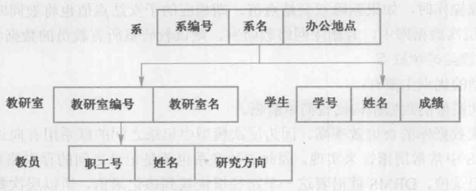
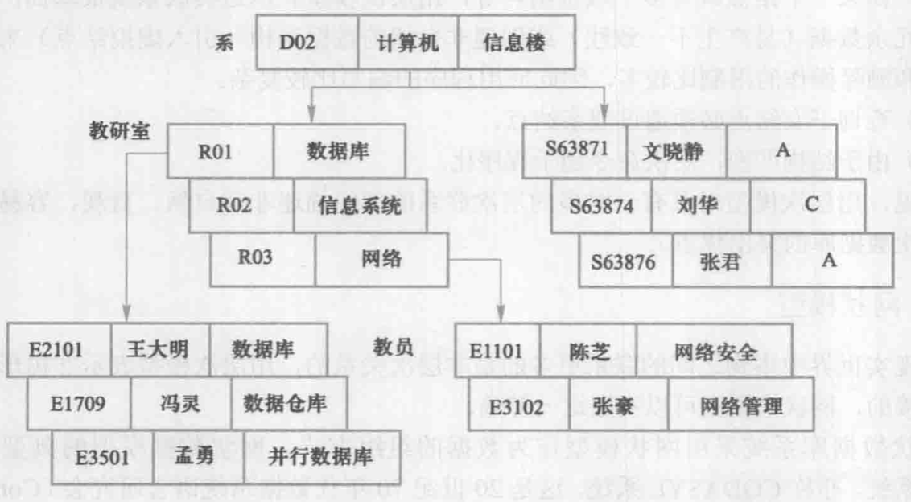

# 数据模型
2023.01.03
[TOC]

> 我的理解
>
> 柏拉图提出了“理念”的观点，数据模型也是一种“理念”，是对现实世界数据特征的抽象。数据模型就是现实世界的模拟。

## 两类数据模型

* 第一类——**概念模型**/信息模型
  * 以<u>用户的观点</u>建模，主要用于数据库的设计
* 第二类——**逻辑与物理模型**
  * 逻辑模型：按<u>计算机系统的观点</u>进行建模
  * 物理模型

## 概念模型

* 信息世界中的基本概念

  * **实体**：客观存在并可以相互区别的事物

  * **属性**：实体具有的某一特征

  * **码**：唯一表示实体属性集

  * **实体型**：实体名+一堆属性

    eg：学生（学号，姓名，性别，...）

  * **实体集**：同一类型的实体的集合

  * **联系**：实体之间的联系通常指不同实体集之间的联系

* 概念模型的一种表示方法：**实体—联系方法**

## 数据模型的组成要素

* 数据结构：静态
* 数据操作：动态
* 数据的完整性约束条件

## 常用的数据模型

* 结构化模型
  * 层析模型
  * 网状模型
* 关系模型
* 面向对象数据模型
* 对象关系数据模型
* 半结构化数据模型

## 层次模型

* 用**树形结构**表示各类实体以及实体间的联系

* 比如：行政机构，家族关系

* 结构简单，查询效率高，良好的完整性支持

* 案例：

  

  

## 网状模型

* 两个特征
  * 允许一个以上的节点无双亲
  * 一个结点可以有多于一个的双亲

## 关系模型

