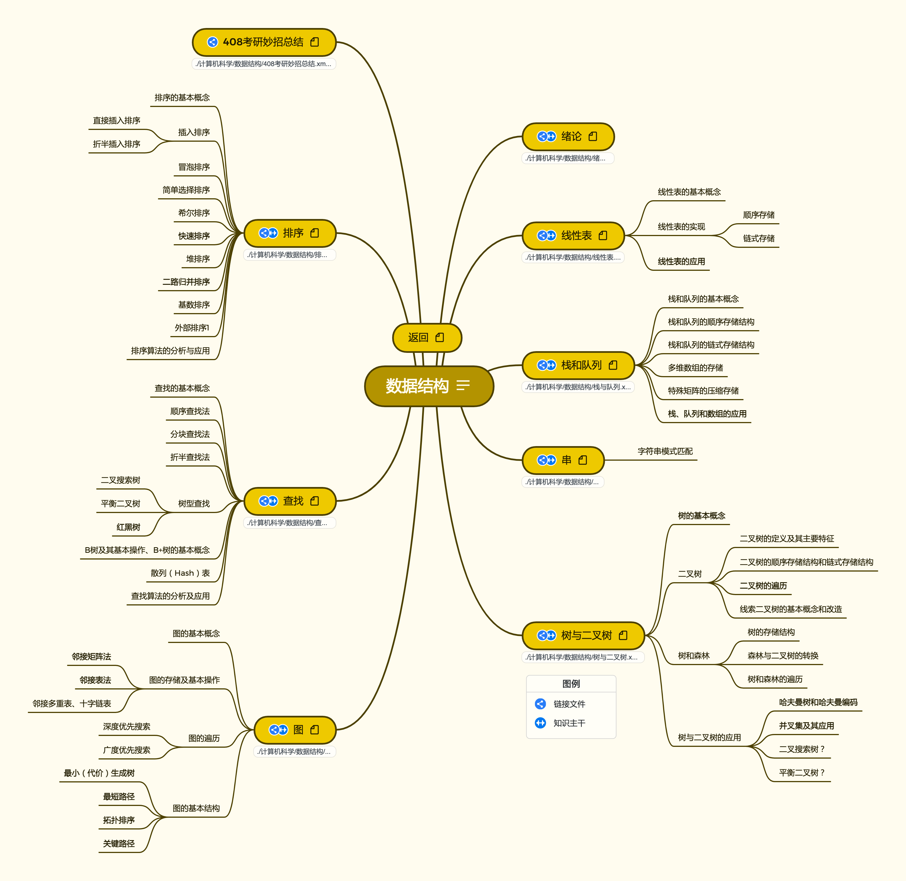

# PKM - 数据结构  

2023.03.09


## 介绍
数据结构按照408考研辅导进行梳理。


* **绪论**
  * [数据结构的基本概念](./notes/绪论/数据结构的基本概念.md)
  * [算法和算法评价](./notes/绪论/算法和算法评价.md)
    * *计算时间复杂度*
* **线性表**
  * [线性表的定义和基本操作](./notes/线性表/线性表的定义和基本操作.md)
  * [线性表的顺序表示](./notes/线性表/线性表的顺序表示.md)
    * *顺序表的实现与基本操作*
    * *利用顺序表设计并实现算法*
  * [线性表的链式表示](./notes/线性表/线性表的链式表示.md)
    * *链表的实现与基本操作*
    * *利用链表设计并实现算法*
* **栈、队列和数组**
  * [栈](./notes/栈、队列和数组/栈.md)
    * *基本概念、顺序/链式存储结构、入栈出栈顺序与条件判断*
  * [队列](./notes/栈、队列和数组/队列.md)
    * *基本概念、顺序/链式存储结构、入队出队顺序与条件判断、(受限)双端队列*
  * [栈和队列的应用](./notes/栈、队列和数组/栈和队列的应用.md)
    * *多维数组的存储*
    * *栈、队列和数组的应用：括号匹配，表达式求值(中缀，前缀，后缀的计算与转换)*
  * [数组和特殊矩阵](./notes/栈、队列和数组/数组和特殊矩阵.md)
    * *特殊矩阵的压缩存储：行优先/列优先，计算下标/位置等等*
* **串**
  * [串的定义和实现](./notes/串/串的定义和实现.md)
  * [串的模式匹配](./notes/串/串的模式匹配.md)
    * *KMP算法（部分匹配值->Next数组->匹配过程模拟）*
* **树与二叉树**
  * [树的基本概念](./notes/树与二叉树/树的基本概念.md)
    * *总结点数 = 总度数 + 1*
  * [二叉树的概念](./notes/树与二叉树/二叉树的概念.md)
    * *二叉树(普通、完全二叉树、顺序存储)的性质*
  * [二叉树的遍历和线索二叉树](./notes/树与二叉树/二叉树的遍历和线索二叉树.md)
    * *遍历：先序、中序、后序、层序、根据遍历顺序推测二叉树*
    * *线索二叉树*
  * [树、森林](./notes/树与二叉树/树、森林.md)
    * *树和森林与二叉树的转换，遍历(与二叉树遍历的关系)*
  * [树与二叉树的应用](./notes/树与二叉树/树与二叉树的应用.md)
    * *并查集*
    * *哈夫曼树、哈夫曼编码*
* **图**
  * [图的基本概念](./notes/图/图的基本概念.md)
  * [图的存储及基本操作](./notes/图/图的存储及基本操作.md)
    * *邻接表、邻接矩阵、十字链表、邻接多重表*
  * [图的遍历](./notes/图/图的遍历.md)
    * *BFS、DFS*
  * [图的应用](./notes/图/图的应用.md)
    * *最小生成树*
    * *最短路径：BFS、Dijkstra、Floyd*
    * *有向无环图(DAG图)*
    * *关键路径*
    * *拓扑排序*
* **查找**
  * [查找的基本概念](./notes/查找/查找的基本概念.md)
  * [顺序查找和折半查找](./notes/查找/顺序查找和折半查找.md)
    * *顺序查找、折半查找、分块查找*
  * [树型查找](./notes/查找/树型查找.md)
    * *二叉排序树(BST)：概念、删除结点、ASL*
    * *平衡二叉树(AVL)：平衡因子、插入(LL LR RL RR)*
    * *红黑树*
  * [B树和B+树](./notes/查找/B树和B+树.md)
    * *B树（非叶最少floor{m/2}子结点）、B+树*
  * [散列表](./notes/查找/散列表.md)
    * *线性探测法，计算ASL(成功、失败)*
* **排序**
  * [排序的基本概念](./notes/排序/排序的基本概念.md)
    * *最少比较次数上取整{log2 n!}，稳定性*
  * [插入排序](./notes/排序/插入排序.md)
    * *直接插入排序、折半插入排序、希尔排序*
  * [交换排序](./notes/排序/交换排序.md)
    * *冒泡排序、快速排序*
  * [选择排序](./notes/排序/选择排序.md)
    * *简单选择排序、堆排序*
  * [归并排序和基数排序](./notes/排序/归并排序和基数排序.md)
    * *归并排序、基数排序*
  * [各种内部排序算法的比较与应用](./notes/排序/各种内部排序算法的比较与应用.md)
    * *内部排序算法比较与应用*
  * [外部排序](./notes/排序/外部排序.md)
    * *多路平衡归并与败者树、置换选择排序、最佳归并树*

## 资源
链接: https://pan.baidu.com/s/1yakyIWoCXFwO-HIiEXGK6Q  
提取码: abya  
如果资源失效请联系我  

* __2023王道数据结构资料__ : 2023王道配套视频与习题解答  

  ```
  1. 2023数据结构知识点
  7. 2023王道数据结构.pdf（课本）
  ```
  
* __2022王道数据结构资料__ : 2022王道配套视频与习题解答  

  ```
  1. 2022数据结构知识点
  2. 2022数据结构知识点课件
  3. 2022数据结构知识点习题讲解
  4. 2022数据结构知识点思维导图
  5. 2022数据结构强化直播
  6. 2022数据结构考研真题讲解
  7. 2022王道数据结构.pdf（课本）
  8. 2022数据结构新增考点补充文档.pdf
  9. 22版数据结构勘误.pdf
  10. 408真题原题与解析
  11. 王道2022年计算机专业基础综合考试核心考点及模拟题.pdf
  12. 王道2022年计算机专业基础综合考试历年真题解析.pdf
  ```

* __2022天勤数据结构.pdf__: 2022年408考研辅导教材  

* **(Github)习题同步笔记** : https://github.com/CharlesShan-hub/DataStructureNotes  

* **(Github)C语言可复用数据结构实现**：https://github.com/CharlesShan-hub/CDataStructure

* **数据结构与算法(公众号)**（电子书）

* **北邮计算机数据结构课件**

* **算法导论（原书第3版） by Thomas H.Cormen Charles E.Leiserson Ronald L.Rivest Clifford Stein.pdf**

## 外部资料

__算法可视化网站__ :https://www.cs.usfca.edu/~galles/visualization/Algorithms.html  

__多语言高颜值算法可视化网站__: https://algorithm-visualizer.org/

**2021数据结构学习笔记（严蔚敏版）笔记**:https://blog.csdn.net/m0_52344565/article/details/122138318

## 版本
* **V1 2021.08.22**

  按照《2022年数据结构考研复习指导》与相关课程进行整理，完成全部知识框架搭建  

* **V2 2021.11.27**

  按照《2022年数据结构考研复习指导》与相关课程进行整理，进行习题归纳与知识整合  

* **V3 2022.10.27**

  按照《2023年数据结构考研复习指导》与相关课程进行整理，完成文档式知识笔记  

## 更新计划

* 适配知识图谱倒入工具
* 将学习脉络改造成《算法导论》内容