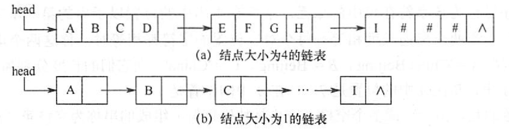

# 串的定义和实现
2022.09.12

[TOC]

1. 定长顺序存储

   ```C++
   #define MAXLEN 255
   typedef struct{
     char ch[MAXLEN];
     int length;
   } SString;
   ```

2. 堆分配存储

   ```C++
   typedef struct{
     char *ch;
     int length;
   } HString;
   ```

3. 块链存储

   

   
