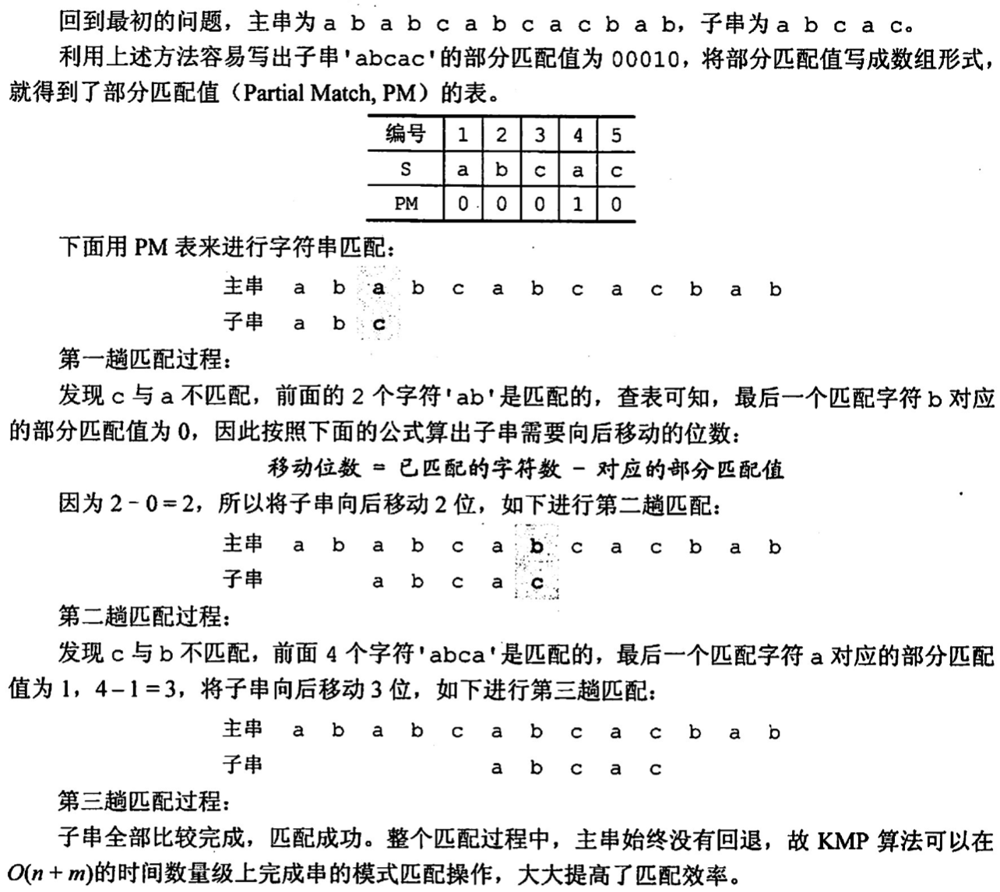
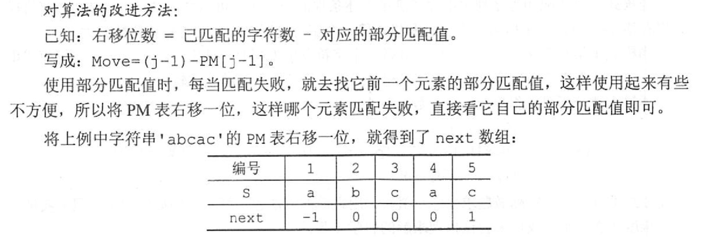

# 串的模式匹配
2022.12.10

[TOC]

## 简单的模式匹配算法

```C++
int Index1(SString S,SString T){
    /**
     * 朴素模式匹配算法1（用于展示）
     * 
     * 返回匹配位置，匹配失败返回0
     */

    int i=1;
    SString Sub;
    while(i<=S.length - T.length +1){
        SubString(Sub,S,i,T.length);
        PrintNSpace(i-1);
        StrPrint(Sub);           // test
        if(StrCompare(Sub,T)!=0){
            i++;
            printf("  --- x\n"); // test
        }
        else{
            printf("  --- √\n"); // test
            return i;
        }
    }
    return 0;
}

int Index2(SString S,SString T){
    /**
     * 朴素模式匹配算法2
     * 
     * 返回匹配位置，匹配失败返回0
     */
    int i=1,j=1;
    while(i<=S.length && j<=T.length){
        if(S.ch[i]==T.ch[j]){
            i++;j++; //同时后移
        }else{
            i=i-j+2; // i从下一位重新计算
            j=1;     // j也回到开头
        }
    }
    if(j>T.length)
        // 匹配成功
        return i-T.length;
    else
        // 匹配失败
        return 0;
}
```

## KMP算法

> 讲的非常好的课：[木子喵的KMP](https://www.bilibili.com/video/BV1234y1y7pm)

1. 计算部分匹配值：从前1个到前n个，分别计算前缀集合和后缀集合最长的相等元素长度。

   比如`char str[] ="ababa" `：

   | 前n个字符 |      前缀       |      后缀       | 最长相等长度 |
   | :-------: | :-------------: | :-------------: | :----------: |
   |     a     |       {}        |       {}        |      0       |
   |    ab     |       {a}       |       {b}       |      0       |
   |    aba    |     {a,ab}      |     {ba,a}      |      1       |
   |   abab    |   {a,ab,aba}    |   {bab,ab,b}    |      2       |
   |   ababa   | {a,ab,aba,abab} | {baba,aba,ba,a} |      3       |

   部分匹配值：00123

2. **移动位数 = 已匹配位数 - 部分匹配值**

   

3. 改进算法——Next数组

   

```C++
int Index3(SString S,SString T){
    /**
     * KMP算法（演示版）
     * 
     * 返回匹配位置，匹配失败返回0
     */
    // 计算next数组
    int next[T.length];
    SString temp1;
    SString temp2;
    for(int i=1;i<T.length+1;i++){
        if(i==1){
            next[i]=0;
            continue;
        }else if(i==2){
            next[i]=1;
            continue;
        }
        for(int j=1;j<i;j++){
            SubString(temp1,T,1,j); // 前缀
            SubString(temp2,T,i-j,j); // 后缀
            if(StrCompare(temp1,temp2)==0){
                next[i]=j;
                break;
            }else{
                next[i]=1;
            }
        }
    }
    for(int i=1;i<T.length+1;i++){
        printf("%d ",next[i]);
    }
    printf("\n");
    // 模式匹配
    int i=1,j=1,count=1,temp=0;
    StrPrintln(T);
    while(i<=S.length && j<=T.length){
        //printf("%d(%d) %d(%d) %d\n",i,S.length,j,T.length,count);
        count++;
        if(S.ch[i]==T.ch[j]){
            //printf("√--%d:%c  %d:%c\n",i,S.ch[i],j,T.ch[j]);
            i++;j++; //同时后移
        }else{
            //printf("x--%d:%c  %d:%c\n",i,S.ch[i],j,T.ch[j]);
            temp=j; // for test
            j=next[j];
            if(j==0){
                i++;j=1;
            }
            //printf("-->%d:%c  %d:%c\n",i,S.ch[i],j,T.ch[j]);
            PrintNSpace(i-1);
            StrPrint(T);
            printf("  next[%d]:%d\n",temp,next[temp]);
        }
    }
    if(j>T.length)
        // 匹配成功
        return i-T.length;
    else
        // 匹配失败
        return 0;
}

int Index4(SString S,SString T){
    /**
     * KMP算法（演示版）
     * 
     * 返回匹配位置，匹配失败返回0
     */
    // 计算next数组
    int next[T.length];
    SString temp1;
    SString temp2;
    for(int i=1;i<T.length+1;i++){
        if(i==1){
            next[i]=0;
            continue;
        }else if(i==2){
            next[i]=1;
            continue;
        }
        for(int j=1;j<i;j++){
            SubString(temp1,T,1,j); // 前缀
            SubString(temp2,T,i-j,j); // 后缀
            if(StrCompare(temp1,temp2)==0){
                next[i]=j;
                break;
            }else{
                next[i]=1;
            }
        }
    }
    // 模式匹配
    int i=1,j=1,count=1;
    while(i<=S.length && j<=T.length){
        count++;
        if(S.ch[i]==T.ch[j]){
            i++;j++; //同时后移
        }else{
            j=next[j];
            if(j==0){
                i++;j=1;
            }
        }
    }
    if(j>T.length)
        // 匹配成功
        return i-T.length;
    else
        // 匹配失败
        return 0;
}
```

## 例题

1. 【2015 统考真题】已知字符串S为’abaab[a]abacacaabaabcc"，模式串t为'abaab[c]".采用KMP 算法进行匹配，第一次出现“失配”（S[i]≠t[j]）时，i=j=5，則下次开始匹配时，i和j的值分别是（）。
   A. i=1, j=0
   B. i=5, j=0
   C. i=5, j=2
   D. ¡=6, j=2

   【答案】：

   | 前n个字符 |         前缀          |         后缀          | 最长相等长度 | NEXT  |
   | :-------: | :-------------------: | :-------------------: | :----------: | :---: |
   |     a     |          {}           |          {}           |      0       |  -1   |
   |    ab     |          {a}          |          {b}          |      0       |   0   |
   |    aba    |        {a,ab}         |        {ba,a}         |      1       |   0   |
   |   abaa    |      {a,ab,aba}       |      {baa, aa,a}      |      1       |   1   |
   |   abaab   |    {a,ab,aba.abaa}    |    {baab,aab,ab,b}    |      2       |   1   |
   |  abaaba   | {a,ab,aba.abaa,abaab} | {baaba,aaba,aba,ba,a} |      3       | **2** |

   **主字符串指针不变，子字符串指针退回到next[j]** = next[5] = 2，C

2. 【2019 统考真题】设主串I='abaabaabcabaabc'，模式串S'abaabc"，来用 KMP算法进行模式匹配，到匹配成功时为止，在匹配过程中进行的单个字符间的比较次数是(）。
   A. 9
   B. 10
   C. 12
   D. 15

   【答案】：

   [a] [b] [a] [a] [b] [a] abcabaabc，[a]baabc， 6

   abaab [a] [a] [b] [c] abaabc，ab[a]abc， 4，B