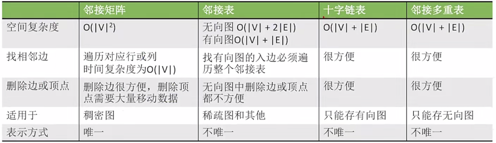
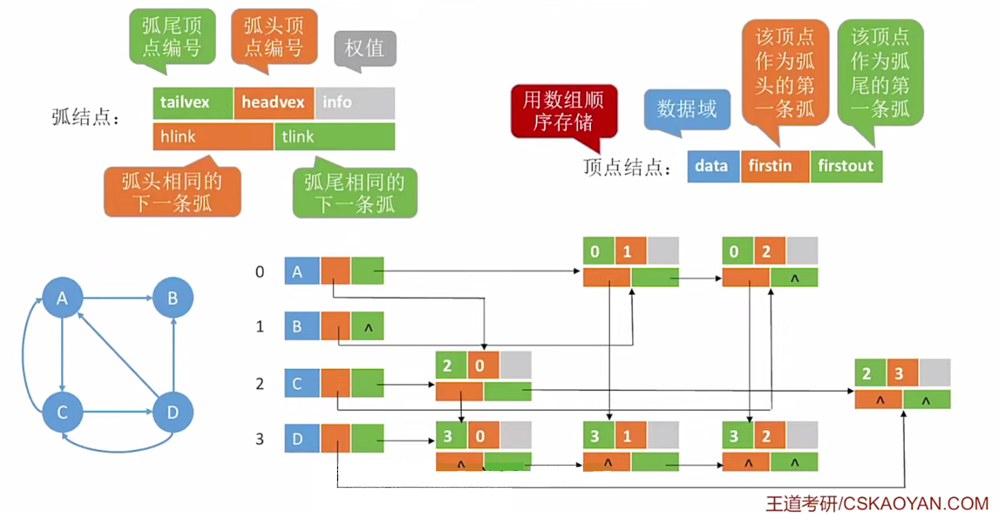
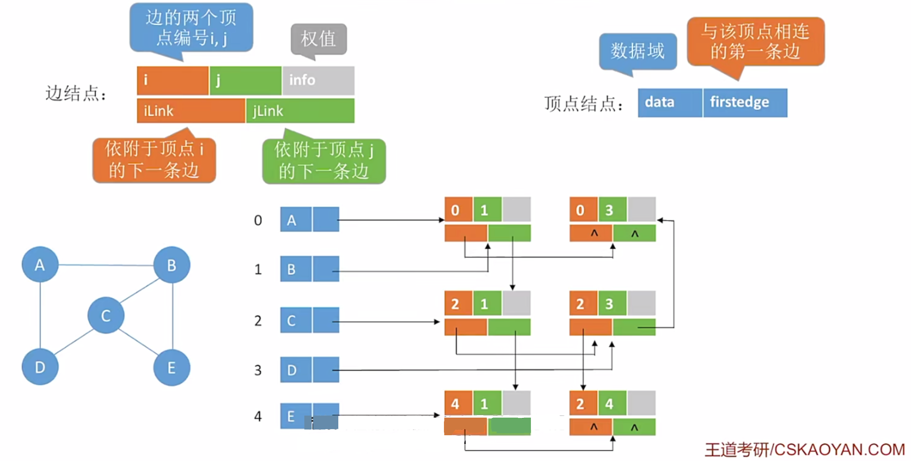
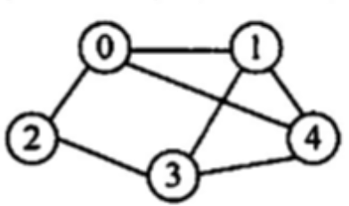

# 图的存储及基本操作
2022.09.15

[TOC]



## 邻接矩阵

```C
/** 邻接矩阵（图）
 * 
 * Author: Charles Shan
 * Date: 2022.07.17
 * Version: 1.0
 * 
 *  内容包括:
 *  邻接矩阵结点与邻接矩阵的定义
 *  UnWeightGraphInit      无权图初始化
 *  WeightGraphInit        带权图初始化
 *  GetWeight              获取边的权重
 *  AddNode                添加(指定下标)结点
 *  DeleteNode             删除(指定下标)节点
 *  AddEdgeDirected        添加有向边
 *  AddEdge                添加边
 *  PrintGraph             打印图
 *  FirstNeighbor          寻找第一个邻居的下标(没有返回0)
 *  NextNeighbor           寻找某邻居后的下一个邻居下标(没有返回0)
 *  FirstNeighborValue     寻找第一个邻居的下标(没有返回0)与值
 *  NextNeighborValue      寻找某邻居后的下一个邻居下标(没有返回0)与值
 *  GetVexnum              获取结点数
 *  GetIndegree            入度
 *  TestInit               构建测试图
 */

/**
 * 定义
 *
 * EdgeElement 边元素
 * GraphNode 结点
 * MGraph 图
 *
 */

#define EdgeElementNone 0  // 节点元素为空
#define EdgeElementInf -1  // 节点元素位无穷
#define MaxVerNum 50       // 邻接矩阵表示法中节点最大个数
#define EdgeWeight int     // 边的权重默认为int

typedef struct EdgeElement
{
    // Weight is the value of an Element
    EdgeWeight weight;
    // Others to be defind here
    // ...
}EdgeElement;
typedef struct GraphNode
{
	Element data;                           // 数据元素
	bool valid;                             // 有效
}GraphNode;
typedef struct
{
	GraphNode Vex[MaxVerNum];               // 顶点
	EdgeElement Edge[MaxVerNum][MaxVerNum]; // 邻接矩阵
	int vexnum,arcnum;                      // 图当前顶点数和边数/弧数
	bool weight;                            // 是否为带权图
}MGraph;
int edge_ele_get_weight(EdgeElement e){
    return e.weight;
}

void edge_ele_set_weight(EdgeElement &e,EdgeWeight weight){
    e.weight = weight;
}

EdgeElement edge_ele_init(EdgeWeight weight){
    EdgeElement e;
    edge_ele_set_weight(e,weight);
    return e;
}

void edge_ele_copy(EdgeElement &to, EdgeElement from){
    edge_ele_set_weight(to,from.weight);
}

bool edge_ele_equal(EdgeElement e1, EdgeElement e2){
    return e1.weight == e2.weight;
}

bool edge_ele_none(EdgeElement e){
    return e.weight == EdgeElementNone;
}

bool edge_ele_inf(EdgeElement e){
    return e.weight == EdgeElementInf;
}

/**
 * 图的操作
 *
 */

void UnWeightGraphInit(MGraph &G){
	G.vexnum = 0;
	G.arcnum = 0;
	G.weight = false;
	for(int i=0;i<MaxVerNum;i++){
		G.Vex[i].valid = false;
		for(int j=0;j<MaxVerNum;j++)
			edge_ele_set_weight(G.Edge[i][j],EdgeElementNone);
	}
}

void WeightGraphInit(MGraph &G){
	G.vexnum = 0;
	G.arcnum = 0;
	G.weight = true;
	for(int i=0;i<MaxVerNum;i++){
		G.Vex[i].valid = false;
		for(int j=0;j<MaxVerNum;j++)
			edge_ele_set_weight(G.Edge[i][j],EdgeElementInf);
	}
}

EdgeWeight GetWeight(MGraph G,int i,int j){
	return edge_ele_get_weight(G.Edge[i][j]);
}

bool AddNode(MGraph &G,Element e){
	int i = 1;
	while(G.Vex[i].valid==true) i++;
	if(i==MaxVerNum) return false;
	ele_copy(G.Vex[i].data,e);
	G.Vex[i].valid = true;
	G.vexnum++;
	return true;
}

void DeleteNode(MGraph &G,int x){
	G.Vex[x].valid = false;
	for(int i=1;i<MaxVerNum;i++){
		edge_ele_set_weight(G.Edge[x][i],G.weight?EdgeElementInf:EdgeElementNone);
		edge_ele_set_weight(G.Edge[i][x],G.weight?EdgeElementInf:EdgeElementNone);
	}
	G.vexnum--;
}

bool AddEdgeDirected(MGraph &G,int x,int y,EdgeElement value){
    if(edge_ele_none(value)) return false;
	edge_ele_copy(G.Edge[x][y],value);
    return true;
}

bool AddEdge(MGraph &G,int x,int y,EdgeElement value){
	if(edge_ele_none(value)) return false;
	edge_ele_copy(G.Edge[x][y],value);
	edge_ele_copy(G.Edge[y][x],value);
	return true;
}

void PrintGraph(MGraph G){
	int temp=0,templ=0,tempr=0;
	// 上表头
	printf("    ");
	for(int i=1;i<G.vexnum+1;i++){
		if(G.Vex[i+temp].valid==false){
			temp++;
			i--;
		}else{
			printf(" %2d",ele_get_weight(G.Vex[i+temp].data));
		}
	}
	printf("\n   |");
	for(int i=1;i<G.vexnum+1;i++)
		printf("---");
	printf("\n");
	// 内容与左表头
	tempr=0;
	for(int i=1;i<G.vexnum+1;i++){
		if(G.Vex[i+tempr].valid==false){
			tempr++;
			i--;
			continue;
		}else
			printf(" %d |",ele_get_weight(G.Vex[i+tempr].data));
		templ=0;
		for(int j=1;j<G.vexnum+1;j++){
			if(G.Vex[j+templ].valid==false){
				templ++;
				j--;
				continue;
			}
			if((i+tempr)==(j+templ))
				printf("  \\");
			else if(edge_ele_inf(G.Edge[i+tempr][j+templ]))
				printf("  .");
			else
				printf(" %2d",GetWeight(G,i+tempr,j+templ));
				
		}
		printf("\n");
	}
}

int FirstNeighbor(MGraph G,int v){
	for(int i=1;i<G.vexnum+1;i++)
		if(!edge_ele_none(G.Edge[v][i]) && !edge_ele_inf(G.Edge[v][i]) && G.Vex[i].valid)
			return i;
	return 0;
}

int NextNeighbor(MGraph G,int v, int h){
	for(int i=h+1;i<G.vexnum+1;i++)
		if(!edge_ele_none(G.Edge[v][i]) && !edge_ele_inf(G.Edge[v][i]) && G.Vex[i].valid)
			return i;
	return 0;
}

int FirstNeighborValue(MGraph G,int v,EdgeWeight &value){
	for(int i=1;i<G.vexnum+1;i++)
		if(!edge_ele_none(G.Edge[v][i]) && !edge_ele_inf(G.Edge[v][i]) && G.Vex[i].valid){
			value = GetWeight(G,v,i);
			return i;
		}
	return -1;
}

int NextNeighborValue(MGraph G,int v, int h,EdgeWeight &value){
	for(int i=h+1;i<G.vexnum+1;i++)
		if(!edge_ele_none(G.Edge[v][i]) && !edge_ele_inf(G.Edge[v][i]) && G.Vex[i].valid){
			value = GetWeight(G,v,i);
			return i;
		}
	return -1;
}

int GetVexnum(MGraph G){
    return G.vexnum;
}

int GetIndegree(MGraph G,int n){
	if(G.Vex[n].valid==false)
		return -1;
	int count=0;
	for(int i=1;i<MaxVerNum;i++)
		if(!edge_ele_none(G.Edge[i][n]) && !edge_ele_inf(G.Edge[i][n]) && G.Vex[i].valid)
			count++;
	return count;
}

void TestInit(MGraph &G){
	// 初始化
	//WeightGraphInit(G);
	UnWeightGraphInit(G);

	// 构建一些边与结点;
	int temp[] = {1,2,3,4,5,6,7,8};
	for(int i=0;i<sizeof(temp)/sizeof(temp[0]);i++)
		AddNode(G,ele_build(temp[i]));
	AddEdge(G,1,2,edge_ele_init(1));
	AddEdge(G,2,6,edge_ele_init(1));
	AddEdge(G,6,3,edge_ele_init(1));
	AddEdge(G,6,7,edge_ele_init(1));
	AddEdge(G,3,7,edge_ele_init(1));
	AddEdge(G,3,4,edge_ele_init(1));
	AddEdge(G,4,7,edge_ele_init(1));
	AddEdge(G,4,8,edge_ele_init(1));
	AddEdge(G,7,8,edge_ele_init(1));
	PrintGraph(G);
	printf(
		"\n 1 - 2   3 - 4\n"
		"     | / | / |\n"
		" 5   6 - 7 - 8\n");
}

typedef double FloydCost[MaxVerNum][MaxVerNum];

void GetFloWeight(MGraph G,FloydCost &Cost){
	for(int i=1;i<GetVexnum(G)+1;i++)
		for(int j=1;j<GetVexnum(G)+1;j++){
			if(!edge_ele_none(G.Edge[i][j]) && !edge_ele_inf(G.Edge[i][j]))
				Cost[i][j]=GetWeight(G,i,j);
		}
}

typedef struct DijArray
{
	bool final[MaxVerNum];  // 是否找到最短路径
	double dist[MaxVerNum]; // 最短路径长度
	int path[MaxVerNum];    // 路径前驱(-1表示未改变)
}DijArray;

void GetDijWeight(MGraph G,DijArray &Array,int n){
    for(int i=1;i<GetVexnum(G)+1;i++)
    	if(!edge_ele_none(G.Edge[n][i]) && !edge_ele_inf(G.Edge[n][i])){
    		Array.dist[i]=GetWeight(G,n,i);
    		Array.path[i]=0;
    	}
}

void test_adjacency_matrix(){
	printf("图(邻接矩阵)测试\n");
	// 创造图
    MGraph G;
	TestInit(G);

	// 获取邻居
	int value = 0;
	printf("\n获取3的第一个邻居 : %d\n",FirstNeighbor(G,3));
	FirstNeighborValue(G,3,value);
	printf("获取3的第一个邻居的值 : %d\n",value);
	printf("获取3的下一个邻居 : %d\n",NextNeighbor(G,3,FirstNeighbor(G,3)));
	NextNeighborValue(G,3,FirstNeighbor(G,3),value);
	printf("获取3的下一个邻居的值 : %d\n",value);

	// 测试入度
	printf("结点3的入度 : %d \n",GetIndegree(G,3));

	// 删除一些结点与边
	printf("\n删除一些结点(2)与边(6,3):\n");
	DeleteNode(G,2);
	PrintGraph(G);
}

```

输出测试

```
图(邻接矩阵)测试
      1  2  3  4  5  6  7  8
   |------------------------
 1 |  \  1  0  0  0  0  0  0
 2 |  1  \  0  0  0  1  0  0
 3 |  0  0  \  1  0  1  1  0
 4 |  0  0  1  \  0  0  1  1
 5 |  0  0  0  0  \  0  0  0
 6 |  0  1  1  0  0  \  1  0
 7 |  0  0  1  1  0  1  \  1
 8 |  0  0  0  1  0  0  1  \

 1 - 2   3 - 4
     | / | / |
 5   6 - 7 - 8

获取3的第一个邻居 : 4
获取3的第一个邻居的值 : 1
获取3的下一个邻居 : 6
获取3的下一个邻居的值 : 1
结点3的入度 : 3 

删除一些结点(2)与边(6,3):
      1  3  4  5  6  7  8
   |---------------------
 1 |  \  0  0  0  0  0  0
 3 |  0  \  1  0  1  1  0
 4 |  0  1  \  0  0  1  1
 5 |  0  0  0  \  0  0  0
 6 |  0  1  0  0  \  1  0
 7 |  0  1  1  0  1  \  1
 8 |  0  0  1  0  0  1  \
```

## 邻接表

```C
/** 邻接矩阵（图）
 *
 * Author: Charles Shan
 * Date: 2022.09.10
 * Version: 2.0
 *
 *  内容包括:
 *  邻接矩阵结点与邻接矩阵的定义
 *  UnWeightGraphInit      无权图初始化
 *  WeightGraphInit        带权图初始化
 *  GetWeight              获取边的权重
 *  AddNode                添加(指定下标)结点
 *  DeleteNode             删除(指定下标)节点
 *  AddEdgeDirected        添加有向边
 *  AddEdge                添加边
 *  PrintGraph             打印图
 *  FirstNeighbor          寻找第一个邻居的下标(没有返回0)
 *  NextNeighbor           寻找某邻居后的下一个邻居下标(没有返回0)
 *  FirstNeighborValue     寻找第一个邻居的下标(没有返回0)与值
 *  NextNeighborValue      寻找某邻居后的下一个邻居下标(没有返回0)与值
 *  GetVexnum              获取结点数
 *  GetIndegree            入度
 *  TestInit               构建测试图
 */

#define MaxVerNum 50
#define NONE 0
#define EdgeWeight int     // 边的权重默认为int

typedef struct ArcNode
{
    int adjvex;           // 边/弧指向哪个节点
    struct ArcNode *next; // 指向下一条弧的指针
    EdgeWeight value;     // 权值(默认为1)
    // other info
}ArcNode;

typedef struct VNode{
    Element data;        // 顶点数据
    ArcNode *first;      // 第一条边/弧
    //data
}VNode,LGraph[MaxVerNum],AdjList[MaxVerNum];

// 为了方便,Graph的第一个结点数据存放结点数量

bool AddEdgeDirected(AdjList &G,int x,int y,EdgeWeight value){
    ArcNode *p = NULL;
    ArcNode *q = NULL;
    // 头插x-y
    q = (ArcNode*)malloc(sizeof(ArcNode));
    q->adjvex = y;
    q->value = value;
    p = G[x].first;
    G[x].first = q;
    G[x].first->next = p;
    return true;
}

bool AddEdge(AdjList &G,int x,int y,EdgeWeight value){
    AddEdgeDirected(G,x,y,value);
    AddEdgeDirected(G,y,x,value);
    return true;
}

bool AddNode(AdjList &G,Element data){
    ArcNode *p = NULL;
    int count = 1;
    while(ele_get_weight(G[count].data)!=NONE){
        count++;
    }
    G[count].data=data;
    return true;
}

int FirstNeighbor(AdjList G,int v){
    if(G[v].first==NULL)
        return -1;
    else
        return G[v].first->adjvex;
}

int NextNeighbor(AdjList G,int v, int h){
    ArcNode *p=G[v].first;
    while(p!=NULL && p->adjvex!=h)
        p=p->next;
    if(p->next==NULL)
        return -1;
    else
        return p->next->adjvex;
}

void PrintGraph(AdjList G){
    ArcNode *p = NULL;
    for(int i=1;i<MaxVerNum;i++){
        if(ele_get_weight(G[i].data)!=NONE){
            printf(" %d ",ele_get_weight(G[i].data));
            if(G[i].first!=NULL)
                printf("-> ");
            for(p=G[i].first;p!=NULL;p=p->next)
                printf("%d(%2d) ",p->adjvex,p->value);
            printf("\n");
        }
    }
}

int GetVexnum(AdjList G){
    return int(ele_get_weight(G[0].data));
}

void InitGraph(AdjList &G){
    for(int i=0;i<MaxVerNum;i++){
        ele_init(G[i].data,NONE);
        G[i].first = NULL;
    }
}

void TestInit(AdjList &G){
    // 构建新图
    InitGraph(G);
    // 构建一些边与结点;
    int temp[] = {1,2,3,4,5,6,7,8};
    for(int i=0;i<sizeof(temp)/sizeof(temp[0]);i++)
        ele_init(G[i+1].data,temp[i]);
    ele_init(G[0].data,8);
    //AddEdge(G,5,1,1);
    AddEdge(G,1,2,1);
    AddEdge(G,2,6,1);
    AddEdge(G,6,3,1);
    AddEdge(G,6,7,1);
    AddEdge(G,3,7,1);
    AddEdge(G,3,4,1);
    AddEdge(G,4,7,1);
    AddEdge(G,4,8,1);
    AddEdge(G,7,8,1);

    PrintGraph(G);
    printf(
        "\n 1 - 2   3 - 4\n"
        "     | / | / |\n"
        " 5   6 - 7 - 8\n");
}

void test_adjacency_list()
{
    printf("图(邻接表)测试\n");
    LGraph G;
    TestInit(G);

    printf("\n获取5的第一个邻居 :%d\n",FirstNeighbor(G,5));
    printf("获取3的第一个邻居 :%d\n",FirstNeighbor(G,3));
    printf("获取3的第二个邻居 : %d\n",NextNeighbor(G,3,4));
    printf("获取3的第三个邻居 : %d\n",NextNeighbor(G,3,7));
    printf("获取3的第四个邻居 : %d\n",NextNeighbor(G,3,6));
    printf("获取图的结点个数: %d\n",GetVexnum(G));
}
```

测试结果

```
图(邻接表)测试
 1 -> 2( 1) 
 2 -> 6( 1) 1( 1) 
 3 -> 4( 1) 7( 1) 6( 1) 
 4 -> 8( 1) 7( 1) 3( 1) 
 5 
 6 -> 7( 1) 3( 1) 2( 1) 
 7 -> 8( 1) 4( 1) 3( 1) 6( 1) 
 8 -> 7( 1) 4( 1) 

 1 - 2   3 - 4
     | / | / |
 5   6 - 7 - 8

获取5的第一个邻居 :-1
获取3的第一个邻居 :4
获取3的第二个邻居 : 7
获取3的第三个邻居 : 6
获取3的第四个邻居 : -1
获取图的结点个数: 8
```

## 十字链表（有向图）



## 邻接多重表（无向图）



## 例题

1. 关于图的存储结构，（ ）是错误的。
   A. 使用邻接矩阵存储一个图时，在不考虑压缩存储的情况下，所占用的存储空间大小只与图中的顶点数有关，与边数无关
   B. 邻接表只用于有向图的存储，邻接矩阵适用于有向图和无向图
   C. 若一个有向图的邻接矩阵的对角线以下的元素为0，则该图的拓扑序列必定存在
   D.存储无向图的邻接矩阵是对称的，故只需存储邻接矩阵的下（或上）三角部分

   【答案】：B

2. 若图的邻接矩阵中主对角线上的元素皆为0，其余元素全为1，则可以断定该图一定（ ）。
   A.是无向图
   B.是有向图
   C.是完全图
   D.不是带权图

   【答案】：C

3. 在含有n个顶点和e条边的无向图的邻接矩阵中，零元素的个数为（ ）。
   A. e
   B. 2e
   C.n^2 -e
   D. n^2 -2e

   【答案】：D

4. 带权有向图G用邻接矩阵存储，则vi的入度等于邻接短阵中（）。
   A. 第i行非∞的元素个数
   B. 第i列非∞的元素个数
   C. 第i行非∞且非0的元素个数
   D. 第i列非∞且非0的元素个数

   【答案】：D

5. 一个有n个顶点的图用邻接短阵A表示，若图为有向图，顶点vi的入度是（)；若图为无向图，顶点vi的度是(）。
   A. $\sum_{i=1}^n A[i][j]$
   B. $\sum_{j=1}^n A[j][i]$
   C. $\sum_{i=1}^n A[j][i]$
   D. $\sum_{j=1}^n A[i][j]$或$\sum_{j=1}^n A[j][i]$

   【答案】：B，D

6. 下列哪种图的邻接矩阵是对称矩阵？

   A. 有向网
   B. 无向网
   C. [AOV网](https://baike.baidu.com/item/AOV网?fromModule=lemma_search-box)
   D. [AOE 网](https://baike.baidu.com/item/AOE网/9991645?fr=aladdin)

   【答案】：B

7. 从邻接矩阵
   $$
   A= \begin{matrix}
   0&1&0\\
   1&0&1\\
   0&1&0
   \end{matrix}
   $$
   可以看出该图具有（ ）个结点；若是有向图，则该图共有（ ）条弧；若是无向图，则共有（ ）条边
   ①A. 9	B. 3	C.6	D.1	E． 以上答案均不正确
   ②A.5	 B.4	 C. 3	D.2	E． 以上答案均不正确
   ③A.5	B.4	C. 3	D.2	E． 以上答案均不正确

   【答案】：B、B、D

8. 以下关于图的存储结构的叙述中，正确的是(）。
   A. 一个图的邻接矩阵表示唯一，邻接表表示唯一
   B. 一个图的邻接矩阵表示唯一，邻接表表示不唯一
   C.一个图的邻接矩阵表示不唯一，邻接表表示唯一
   D. 一个图的邻接矩阵表示不唯一，邻接表表示不唯一

   【答案】：B

9. 用邻接表法存储图所用的空间大小(）。
   A与图的顶点数和边数有关
   C.只与图的顶点数有关
   B.只与图的边数有关
   D.与边数的平方有关

   【答案】：A

10. 若邻接表中有奇数个边表结点，则(）
    A图中有奇数个结点
    B. 图中有偶数个结点
    C.图为无向图
    D.因为有向图

    【答案】：D

11. 在**有向图**的邻接表存储结构中，顶点v在边表中出现的次数是（）
    A. 项点v的度
    B. 顶点v的出度
    C. 顶点v的入度
    D. 依附于顶点v的边数

    **【答案】**：D -> C

12. n个顶点的无向图的邻接表最多有（）个边表结点。
    A. n^2
    B. n(n-1)
    C. n(n+1)
    D.n(n -1)/2

    【答案】：D

13. 假设有n个顶点、e条边的有向图用邻接表表示，则删除与某个顶点v相关的所有边的时间复杂度为（）.
    A. O(n)
    C.O(n+e)
    B. O(e)
    D. O(ne)

    【答案】：C

14. 对邻接表的叙述中，（）是正确的。
    A. 无向图的邻接表中，第i个项点的度为第i个链表中结点数的两倍
    B. 邻接表比邻接矩阵的操作更简便
    C. 邻接矩阵比邻接表的操作更简便
    D. 求有向图结点的度，必须遍历整个邻接表

    【答案】：C -> D

15. 邻接多重表是（）的存储结构。

A. 无向图	C无向因和有向图
B. 有向图	D.都不是

**【答案】**：A

16. 十字链表是（）的存储结构。

    A. 无向图	C无向因和有向图
    B. 有向图	D.都不是

    **【答案】**：B

17. 【2015 统考真题】己知含有5个顶点的图G如下图所示。
    

    请回答下列问题：
    1）写出图G的邻接矩阵A（行、列下标从0开始）。
    2）求A^2，矩阵A^2中位于0行3列元素值的含义是什么？
    3）若已知具有n（n≥2）个项点的图的邻接短阵为B，则Bm(2≤m≤n）中非零元素的的含义是什么？

    1. |   \   |  0   |  1   |  2   |  3   |  4   |
       | :---: | :--: | :--: | :--: | :--: | :--: |
       | **0** |  0   |  1   |  1   |  0   |  1   |
       | **1** |  1   |  0   |  0   |  1   |  1   |
       | **2** |  1   |  0   |  0   |  1   |  0   |
       | **3** |  0   |  1   |  1   |  0   |  1   |
       | **4** |  1   |  1   |  0   |  1   |  0   |

    2. $$
       \begin{matrix}
       3&1&0&3&1\\
       1&3&2&1&2\\
       0&2&2&0&1\\
       3&1&0&3&3\\
       1&2&2&1&3
       \end{matrix}
       $$

       代表从结点0到结点3有三条两条边组成的路径。

    3. aij≠0意味着通过m-1个中间节点可以连接结点i和结点j

18. 【2021 统考真题】已知无向连通图G由顶点集V和边集E组成，|E|＞0，当G中度为奇数的顶点个数为不大于2的偶数时，G存在包含所有边且长度为|E|的路径（称为EL路径）。设图G采用邻接矩阵存储，类型定义如下：

    ```c
    typedef struct{//图的定义
      //图中实际的顶点数和边数
      int numVertices, numEdges;
      //顶点表。MAxV 为已定义常量
      char VerticesList[MAXV];
      //邻接矩阵
      int Edge [MAXV] [MAXV];
    }MGraph;
    ```

    请设计算法 int IsExistEL (MGraph G)，判断G是否存在旺路径，若存在，则返回1，否则返回0。要求：

    1）给出算法的蒸本设计思想。
    2，粮据设科思想，来角C或C++实现
    3）说明你所设计算法的时间复杂度和空问复杂度

    1. 利用邻接矩阵存储图，从头遍历每一个结点，计算结点的度，如果判断结点的度为奇数，设置的count计数变量加一。如果发现count>2，则返回0.遍历结束如果count为0或2则返回1，否则返回0

    2. ```C
       int IsExistEL (MGraph G){
         int count = 0;
         int flag=0;
         for(int i=0;i<numVertices;i++){
           for(int j=0;j<numVertices;j++)
             if(G.Edge[i][j]==1) flag = !flag;
           if(flag) count++;
           if(count>2) return 0;
         }
        	if(count==1) return 0;
         return 1;
       }
       ```

    3. 时间复杂度：O(n^2)， 空间复杂度O(1)