# 图的应用
2022.09.17

[TOC]

## 高密度总结

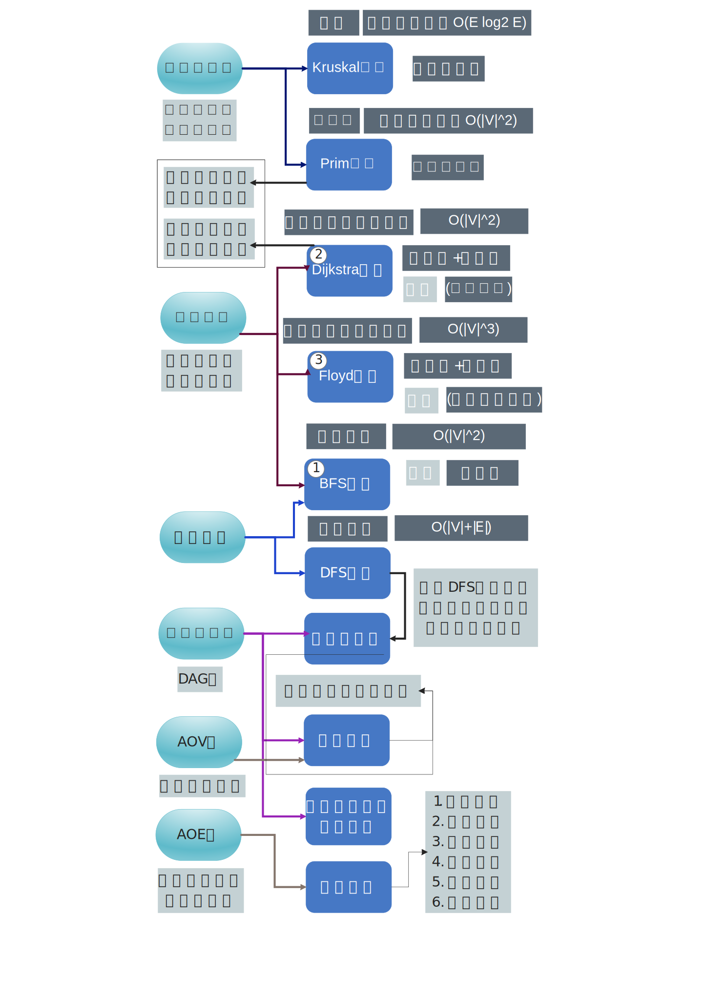

## 最小生成树

最小生成树是让所有的边的权值之和最小。

### Prim

1. 步骤：选定一个结点，找到与他相连的路径代价最小的结点组成集合。然后每次都找到一个与**本集合**相连的路径代价最小的结点并入集合。
2. 时间复杂度，O(V^2)，只与结点个数相关，适合稠密图

###  Kruskal

1. 步骤：选定代价最小边，连通两个结点，组成一个并查集。每次选取剩余边中代价最小的，进行并查集的并操作。
2. 时间复杂度，O(E log_2 E)，只与边数相关，适合稀松图

## 最短路径

### 总览

|            | BFS                            | Dijkstra                       | Floyd                          |
| ---------- | ------------------------------ | ------------------------------ | ------------------------------ |
| 思想       | 树的层序遍历<br />图的广度优先 | 每次找到距离<br />最小的连进来 | 每次添加一个<br />结点作为中转 |
| 类型       | 单源                           | 单源                           | 多源                           |
| 无权图     | ✅                              | ✅                              | ✅                              |
| 带权图     | ❌                              | ✅                              | ✅                              |
| 负权值     | ❌                              | ❌                              | ✅                              |
| 负权值回路 | ❌                              | ❌                              | ❌                              |

### BFS

1. 算法思想：就是树遍历里边的层次遍历/图的广度优先遍历。按照树的深度决定距离，所以用于无权图。

2. 运行结果演示

   ```
   最短路径 - BFS
   
   1 - 2   3 - 4
   |   | / | / |
   5   6 - 7 - 8
   
    BFS算法简介:
   d[] 代表从某一结点到另一结点的跳数
   path[] 代表
   
   BFS算法(从2开始):
   
           | 1    2    3    4    5    6    7    8
      d[]  | 1    0    2    3    2    1    2    3
    path[] | 2   -1    6    7    1    2    6    7
    
   
   BFS算法(从3开始):
           | 1    2    3    4    5    6    7    8
      d[]  | 3    2    0    1    4    1    1    2
    path[] | 2    6   -1    3    1    3    3    4
   ```

3. 核心代码

   ```C
   void BFS_MIN_Distance(Graph G,int u,BFSArray &array){
     bool visited[MaxVerNum]={0};
     LinkQueue Q;
     LinkQueueInit(Q);
     array[0][u] = 0; // visit
     visited[u] = true;
     LinkQueueEn(Q, ele_build(u));
     Element e;
     while(!LinkQueueEmpty(Q)){
       LinkQueueDe(Q,e);
       u = ele_get_weight(e);
       for(int w=FirstNeighbor(G,u);w>=0;w=NextNeighbor(G,u,w)){
         if(visited[w]) continue;
         array[0][w] = array[0][u]+1; // visit
         array[1][w] = u;             // visit
         visited[w]=true;
         LinkQueueEn(Q, ele_build(w));
       }
     }
   }
   ```


### Dijkstra

1. [Dijkstra及和Prim算法区别](https://blog.csdn.net/dutmathjc/article/details/105888831)

   * Prim算法中的距离是【新结点】到【已经访问过的结点的【集合】】的距离
   * Dijkstra中的距离是【新新节点】到【已经访问过的结点中的【根结点】】的距离

2. 时间复杂度：O(n^2)

3. 核心代码

   ```C
   void dijkstra(Graph G,int start,DijArray &array){
   	// start是位序,从1开始
   
   	// 初始
   	array.final[start] = true;  // 是否找到最短路径
   	array.dist[start] = 0;      // 最短路径长度
   	array.path[start] = -1;     // 路径前驱(-1表示未改变)
   	DijPrintf(array,GetVexnum(G),start);
   	// 进行n-1次循环
   	double min_dist = INFINITY; // 用来寻找最小值点(值)
   	int min_dist_id = 1;        // 用来寻找最小值点(点)
   	int last_min_id = start;    // 用来寻找最小值点(上个点)
   	int value;                  // 用来更新下一个点(值)
   	for(int n=1;n<GetVexnum(G);n++){
   		// 寻找dist最小的未标记结点
   		min_dist = INFINITY;
   		min_dist_id = -1;
   		for(int i=1;i<GetVexnum(G)+1;i++){
   			if(array.final[i])
   				continue;
   			if(array.dist[i]<=min_dist){
   				min_dist = array.dist[i];
   				min_dist_id = i;
   			}
   		}
           printf(" ->%d\n",min_dist_id);
   
   		// 标记最小未标记点
   		array.final[min_dist_id] = true;
   		if(array.dist[min_dist_id]+array.dist[last_min_id]<array.dist[min_dist_id]) {
               array.dist[min_dist_id] += array.dist[last_min_id];
               array.path[min_dist_id] = last_min_id;
           }
   		last_min_id = min_dist_id;
   
   		// 寻找各是否可以进行路径替换
   		if(array.dist[min_dist_id]==INFINITY)
   			continue;
   		for(int next=FirstNeighborValue(G,min_dist_id,value);
   			next!=-1;next=NextNeighborValue(G,min_dist_id,next,value)){
   			if(array.final[next]){
                   printf("  %d->%d : Already In Path\n",min_dist_id,next);
                   continue;
               }
               if(array.dist[min_dist_id]+value<array.dist[next]){
                   printf("  %d->%d : %.1f+%d<%.1f\n",min_dist_id,next,array.dist[min_dist_id],value,array.dist[next]);
                   array.dist[next] = array.dist[min_dist_id]+value;
   				array.path[next] = min_dist_id;
   			}else{
                   printf("  %d->%d : %.1f+%d>=%.1f\n",min_dist_id,next,array.dist[min_dist_id],value,array.dist[next]);
               }
   		}
   		
   		// 打印结果
   		DijPrintf(array,GetVexnum(G),min_dist_id);
   	}
   }
   ```

4. 运行结果

   ```
   最短路径 - Dijkstra
    1 -> 5( 5) 2(10) 
    2 -> 5( 2) 3( 1) 
    3 -> 4( 4) 
    4 -> 3( 6) 1( 7) 
    5 -> 4( 2) 3( 9) 2( 3) 
   
    Dijkstra算法简介:
   final: 代表结点是否已经加入路径
   path: 代表下一跳地址
   
   Dijkstra算法(开始节点名称:1):
     [ 1]  |   1*    2    3    4    5
     final |    √    x    x    x    x
     dist  |  0.0 10.0    x    x  5.0
     path  |    x    1    x    x    1
   
    ->5
     5->4 : 5.0+2<inf
     5->3 : 5.0+9<inf
     5->2 : 5.0+3<10.0
     [ 5]  |    1    2    3    4   5*
     final |    √    x    x    x    √
     dist  |  0.0  8.0 14.0  7.0  5.0
     path  |    x    5    5    5    1
   
    ->4
     4->3 : 7.0+6<14.0
     4->1 : Already In Path
     [ 4]  |    1    2    3   4*    5
     final |    √    x    x    √    √
     dist  |  0.0  8.0 13.0  7.0  5.0
     path  |    x    5    4    5    1
   
    ->2
     2->5 : Already In Path
     2->3 : 8.0+1<13.0
     [ 2]  |    1   2*    3    4    5
     final |    √    √    x    √    √
     dist  |  0.0  8.0  9.0  7.0  5.0
     path  |    x    5    2    5    1
   
    ->3
     3->4 : Already In Path
     [ 3]  |    1    2   3*    4    5
     final |    √    √    √    √    √
     dist  |  0.0  8.0  9.0  7.0  5.0
     path  |    x    5    2    5    1
   
    1 -> 5( 5) 2(10) 
    2 -> 5( 2) 3( 1) 
    3 -> 4( 4) 
    4 -> 3( 6) 1( 7) 
    5 -> 4( 2) 3( 9) 2( 3) 
   
    Dijkstra算法简介:
   final: 代表结点是否已经加入路径
   path: 代表下一跳地址
   
   Dijkstra算法(开始节点名称:2):
     [ 2]  |    1   2*    3    4    5
     final |    x    √    x    x    x
     dist  |    x  0.0  1.0    x  2.0
     path  |    x    x    2    x    2
   
    ->3
     3->4 : 1.0+4<inf
     [ 3]  |    1    2   3*    4    5
     final |    x    √    √    x    x
     dist  |    x  0.0  1.0  5.0  2.0
     path  |    x    x    2    3    2
   
    ->5
     5->4 : 2.0+2<5.0
     5->3 : Already In Path
     5->2 : Already In Path
     [ 5]  |    1    2    3    4   5*
     final |    x    √    √    x    √
     dist  |    x  0.0  1.0  4.0  2.0
     path  |    x    x    2    5    2
   
    ->4
     4->3 : Already In Path
     4->1 : 4.0+7<inf
     [ 4]  |    1    2    3   4*    5
     final |    x    √    √    √    √
     dist  | 11.0  0.0  1.0  4.0  2.0
     path  |    4    x    2    5    2
   
    ->1
     1->5 : Already In Path
     1->2 : Already In Path
     [ 1]  |   1*    2    3    4    5
     final |    √    √    √    √    √
     dist  | 11.0  0.0  1.0  4.0  2.0
     path  |    4    x    2    5    2
   
   ```

   

### Floyd

1. 算法思想：每次考虑加一个结点作为中转

2. 关键代码

   ```C
   void floyd(Graph G,FloydCost &Cost,FloydPath &Path){
   	for(int k=1; k<GetVexnum(G)+1; k++){
   		for(int i=1; i<GetVexnum(G)+1; i++){
   			for(int j=1; j<GetVexnum(G)+1; j++){
   				if(Cost[i][j]>Cost[i][k]+Cost[k][j]){
   					Cost[i][j]=Cost[i][k]+Cost[k][j];
   					Path[i][j]=k;
   				}
   			}
   		}
   	}
   }
   ```

   

3. 运行结果

   ```
   最短路径 - floyd
    1 -> 3(13) 2( 6) 
    2 -> 3( 4) 1(10) 
    3 -> 1( 5) 
   
   floyd算法:
   
    Cost(1):
      0.0  6.0 13.0
     10.0  0.0  4.0
      5.0 11.0  0.0
    
    Path(1)
      ·  ·  ·
      ·  ·  ·
      ·  1  ·
    
    Cost(2):
      0.0  6.0 10.0
     10.0  0.0  4.0
      5.0 11.0  0.0
    
    Path(2)
      ·  ·  2
      ·  ·  ·
      ·  1  ·
    
    Cost(3):
      0.0  6.0 10.0
      9.0  0.0  4.0
      5.0 11.0  0.0
    
    Path(3)
      ·  ·  2
      3  ·  ·
      ·  1  ·
    
   构建测试图2:
   
    1 -> 5(10) 3( 1) 
    2 -> 5( 5) 4( 1) 
    3 -> 5( 7) 2( 1) 
    4 -> 5( 1) 
    5 
   
   floyd算法:
   
    Cost(1):
      0.0    x  1.0    x 10.0
        x  0.0    x  1.0  5.0
        x  1.0  0.0    x  7.0
        x    x    x  0.0  1.0
        x    x    x    x  0.0
    
    Path(1)
      ·  ·  ·  ·  ·
      ·  ·  ·  ·  ·
      ·  ·  ·  ·  ·
      ·  ·  ·  ·  ·
      ·  ·  ·  ·  ·
    
    Cost(2):
      0.0    x  1.0    x 10.0
        x  0.0    x  1.0  5.0
        x  1.0  0.0  2.0  6.0
        x    x    x  0.0  1.0
        x    x    x    x  0.0
    
    Path(2)
      ·  ·  ·  ·  ·
      ·  ·  ·  ·  ·
      ·  ·  ·  2  2
      ·  ·  ·  ·  ·
      ·  ·  ·  ·  ·
    
    Cost(3):
      0.0  2.0  1.0  3.0  7.0
        x  0.0    x  1.0  5.0
        x  1.0  0.0  2.0  6.0
        x    x    x  0.0  1.0
        x    x    x    x  0.0
    
    Path(3)
      ·  3  ·  3  3
      ·  ·  ·  ·  ·
      ·  ·  ·  2  2
      ·  ·  ·  ·  ·
      ·  ·  ·  ·  ·
    
    Cost(4):
      0.0  2.0  1.0  3.0  4.0
        x  0.0    x  1.0  2.0
        x  1.0  0.0  2.0  3.0
        x    x    x  0.0  1.0
        x    x    x    x  0.0
    
    Path(4)
      ·  3  ·  3  4
      ·  ·  ·  ·  4
      ·  ·  ·  2  4
      ·  ·  ·  ·  ·
      ·  ·  ·  ·  ·
    
    Cost(5):
      0.0  2.0  1.0  3.0  4.0
        x  0.0    x  1.0  2.0
        x  1.0  0.0  2.0  3.0
        x    x    x  0.0  1.0
        x    x    x    x  0.0
    
    Path(5)
      ·  3  ·  3  4
      ·  ·  ·  ·  4
      ·  ·  ·  2  4
      ·  ·  ·  ·  ·
      ·  ·  ·  ·  ·
    
   构建测试图3:
   
         3         -----------
    /(7)   (7)\    |1-3-2:14 |
   1-(6)-4-(6)-2   |1-4-2:12 |
    \(1)   (1)/    |1-5-6-2:3|
     5 -(1)- 9     -----------
   
    1 -> 5( 1) 4( 6) 3(10) 
    2 
    3 -> 2(10) 
    4 -> 2( 6) 
    5 -> 6( 1) 
    6 -> 2( 1) 
   
   floyd算法:
   
    Cost(1):
      0.0    x 10.0  6.0  1.0    x
        x  0.0    x    x    x    x
        x 10.0  0.0    x    x    x
        x  6.0    x  0.0    x    x
        x    x    x    x  0.0  1.0
        x  1.0    x    x    x  0.0
    
    Path(1)
      ·  ·  ·  ·  ·  ·
      ·  ·  ·  ·  ·  ·
      ·  ·  ·  ·  ·  ·
      ·  ·  ·  ·  ·  ·
      ·  ·  ·  ·  ·  ·
      ·  ·  ·  ·  ·  ·
    
    Cost(2):
      0.0    x 10.0  6.0  1.0    x
        x  0.0    x    x    x    x
        x 10.0  0.0    x    x    x
        x  6.0    x  0.0    x    x
        x    x    x    x  0.0  1.0
        x  1.0    x    x    x  0.0
    
    Path(2)
      ·  ·  ·  ·  ·  ·
      ·  ·  ·  ·  ·  ·
      ·  ·  ·  ·  ·  ·
      ·  ·  ·  ·  ·  ·
      ·  ·  ·  ·  ·  ·
      ·  ·  ·  ·  ·  ·
    
    Cost(3):
      0.0 20.0 10.0  6.0  1.0    x
        x  0.0    x    x    x    x
        x 10.0  0.0    x    x    x
        x  6.0    x  0.0    x    x
        x    x    x    x  0.0  1.0
        x  1.0    x    x    x  0.0
    
    Path(3)
      ·  3  ·  ·  ·  ·
      ·  ·  ·  ·  ·  ·
      ·  ·  ·  ·  ·  ·
      ·  ·  ·  ·  ·  ·
      ·  ·  ·  ·  ·  ·
      ·  ·  ·  ·  ·  ·
    
    Cost(4):
      0.0 12.0 10.0  6.0  1.0    x
        x  0.0    x    x    x    x
        x 10.0  0.0    x    x    x
        x  6.0    x  0.0    x    x
        x    x    x    x  0.0  1.0
        x  1.0    x    x    x  0.0
    
    Path(4)
      ·  4  ·  ·  ·  ·
      ·  ·  ·  ·  ·  ·
      ·  ·  ·  ·  ·  ·
      ·  ·  ·  ·  ·  ·
      ·  ·  ·  ·  ·  ·
      ·  ·  ·  ·  ·  ·
    
    Cost(5):
      0.0 12.0 10.0  6.0  1.0  2.0
        x  0.0    x    x    x    x
        x 10.0  0.0    x    x    x
        x  6.0    x  0.0    x    x
        x    x    x    x  0.0  1.0
        x  1.0    x    x    x  0.0
    
    Path(5)
      ·  4  ·  ·  ·  5
      ·  ·  ·  ·  ·  ·
      ·  ·  ·  ·  ·  ·
      ·  ·  ·  ·  ·  ·
      ·  ·  ·  ·  ·  ·
      ·  ·  ·  ·  ·  ·
    
    Cost(6):
      0.0  3.0 10.0  6.0  1.0  2.0
        x  0.0    x    x    x    x
        x 10.0  0.0    x    x    x
        x  6.0    x  0.0    x    x
        x  2.0    x    x  0.0  1.0
        x  1.0    x    x    x  0.0
    
    Path(6)
      ·  6  ·  ·  ·  5
      ·  ·  ·  ·  ·  ·
      ·  ·  ·  ·  ·  ·
      ·  ·  ·  ·  ·  ·
      ·  6  ·  ·  ·  ·
      ·  ·  ·  ·  ·  ·
   ```

   ## 有向无环图(DAG)

   

## 拓扑排序

1. **AOV网**：顶点表示活动的网
2. 拓扑排序方法：每次pop出一个入度为0的点，以此类推


## 关键路径

> [什么是AOV网与AOE网？——以及AOV网与AOE网区别和运用](https://blog.csdn.net/liu17234050/article/details/106729076/)

1. **AOE网**：E代表edge，边代表活动，结点代表事件的网
2. 事件最早 -> **活动最早** -> 事件最迟 -> **活动最迟** -> **时间余量** ->  关键路径

## 例题

1. 任何一个无向连通图的最小生成树（）
   A.有一棵或多棵
   B. 只有一棵
   C. 一定有多棵
   D.可能不存在

   【答案】：B -> A

2. 用Prim 算法和Kruskal 算法构造图的最小生成树，所得到的最小生成树（）。
   A.相同
   B. 不相同
   C.可能相同，可能不同
   D.无法比较

   【答案】：C

3. 以下叙述中，正确的是(）。
   A.只要无向连通图中没有权值相同的边，则共最小生成树唯一
   B. 只要无向图中有权值相同的边，则其最小生成树一定不唯一
   C. 从n个顶点的连通图中选取n一1条权值最小的边，即可构成最小生成树
   D.设连通图G含有n个顶点，则含有n个项点、n-1条边的子图一定是G的生成树

   【答案】：A

4. 以下叙述中，正确的是().
   A.最短路径一定是简单路径
   B. Dijkstra 算法不适合求有回路的带权图的最短路径
   C. Dijkstra 算法不适合求任意两个顶点的最短路径
   D. Floyd 其法家两个項点的最短路径时，path\_{k-1}一定是path\_{k}的子集

   【答案】：B -> A

5. 已知带权连通无向图G=(V,E)。其中 V={v1, v2, v3, v4, v5, v6, v7}, E={(v1,v2)10, (v1,v3)2, (v3,v4)2, (v3,v6)11, (v2,v5)1, (v4,v5)4, (v4,v6)6, (v5,v7)7, (v6,v7)3} （注：顶点偶对措号外的数据表尔边上的权值)，V1到V7最短路径上经过的顶点序列是
   A. 1,2,5,7
   B, 1,3,4,6,7
   C, 1,3,4,5,7
   D. 1,2,5,4,6,7

   【答案】：

   | 1    | 2    | 3    | 4    | 5    | 6    | 7    |
   | ---- | ---- | ---- | ---- | ---- | ---- | ---- |
   | √    | √    | √    | √    | √    | √    | x    |
   | 0    | 10   | 2    | 4    | 8    | 10   | 13   |
   | -1   | 1    | 1    | 3    | 4    | 4    | 6    |

   7 6 4  3 1 -> B

6. 下面的（ ）方法可以判斯出一个有向图是否有环（回路）。
   I.深度优先遍历 II拓扑排序 III. 求最短路程 IV. 求关键路径
   A. 1,2,4
   B. 1,3,4
   C. 1,2,3
   D.会部可以

   【答案】：A

7. 在有向图G的拓扑序列中，Vi顶点在Vj顶点之前，則下到情形不可能出现的是（ ）
   A. G中有中有弧<vi,vj>
   B. G中有一条vi到vj的路径
   C. G中没有弧vi, vj
   D. G中有一条vj到vi的路径

   【答案】：D

8. 若一个有向图的頂点不能排在一个拓扑序列中，期可判定该有向图（ ）
   A. 是一个有根的有向图
   B. 是一个强速通图
   C. 含有多个入度为0的顶点
   D. 含有顶点数目大于1的强连通分量

   【答案】：C -> D

9. 以下关于拓扑排序的说法中，错误的是（）。
   I 若某有向图存在环路，则该有向图一定不存在拓扑排序
   II 在拓扑排序算法中为暂存入度为零的项点，可以使用栈，也可以使用队列
   III. 若有向图的拓扑有序序列唯一，则图中每个顶点的入度和出度最多为1
   A. I、 III
   B. II、 III
   C. II
   D. III

   【答案】：D

10. 下图所示有向图的所有拓扑序列共有（）个

    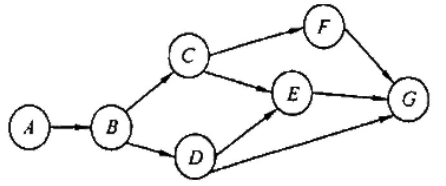

    A. 4	B.6	C.5	D.7

    【答案】：

    ABC{FDEG,D{FEG,EFG}}

    ABDC{FEG,EFG}，5个

11. 若一个有向图具有有序的拓扑排序序列，则它的邻接矩阵必定为（）
    A.对称
    B.稀疏
    C.三角
    D.一般

    【答案】：C

12. 下列关于图的说法中，正确的是(）。
    I．有向图中顶点V的度等于其邻接短阵中第V行中1的个数
    II. 无向图的邻接矩阵一定是对称短阵，有向困的邻接短阵一定是非对称矩阵
    III. 在图G的最小生成树G中，某条边的权值可能会超过未选边的权值
    <u>IV. 若有向无环困的拓扑序列唯一，则可以唯一确定该图</u>
    A.I、II和III
    B.III和IV
    C. III
    D. IV

    **【答案】**：B -> D

13. 若某带权图为G=(V,E)，其中V={1,2,3,4,5,6,7,8,9,10}，E={<1,2>5, <1,3,>6, <2,5,>3, <3,5>6, <3,4,>3, <4,5,>3, <4,7,>1, <4,8,>4, <5,6,>4, <5,7,>2, <6,10>4, <7,9,>5, <8,9>2, <9,10>2}（注：边括号外的数据表示边上的权值），则G的关键路径的长度为（ ）.
    A. 19
    B. 20
    C. 21
    D. 22

    【答案】：C

    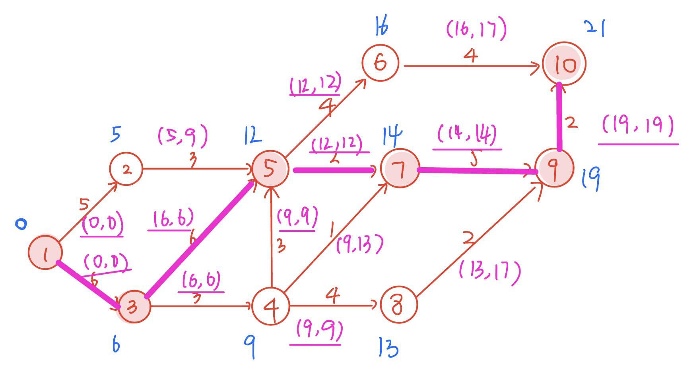

14. 下面关于求关键路径的说法中，不正确的是(）。
    A．求关键路径是以拓扑排序为基础的
    B.一个事件的最早发生时问与以该事件为始的孤的活动的最早开始时间相同
    C. 一个**事件**的最迟发生时间是以该事件为尾的弧的活动的最迟开始时间与该活动的持续时间的差
    D．关键活动一定位于关键路径上

    【答案】：D -> C

15. 下列关于关键路径的说法中，正确的是(）
    I. 改变网上某一关键路径上的任一关键活动后，必将产生不同的关键路径

    II. 在AOE 图中，关键路径上活动的时间延长多少，整个工程的时间也就随之延长多少
    III. 缩短关键路径上任意一个关键活动的持续时间可缩短关键路径长度
    IV.缩短所有关键路径上共有的任意一个关键活动的持续时问可缩短关键路径长度
    V.缩短多条关键路径上共有的任意一个关键活动的持续时间可缩短关键路径长度
    A. II和V
    B. I、II和IV
    C.II和IV
    D. I和IV

    【答案】：C

16. 用DFS 遍历一个无环有向图，并在DFS 算法退栈返回时打印相应的顶点，则输出的顶点序列是（）。
    A.逆拓扑有序
    B. 拓扑有序
    C.无序的
    D.无法确定

    【答案】：A

17. 【2010统考真题】对下图进行拓扑排序，可得不同拓扑序列的个数是(）.

    

    A.4
    B. 3
    C. 2
    D 1
    【答案】：B

18. 【2012统考真题】下列关于最小生成树的叙述中，正确的是(）
    I. 最小生成树的代价唯一
    II.  所有权值最小的边一定会出现在所有的最小生成树中
    III. 使用Prim 算法从不同顶点开始得到的最小生成树一定相同
    IV. 使用Prim 算法和Kruskal 算法得到的最小生成树总不相同
    A. 仅I
    B. 仅II
    C. 仅I、III
    D. 仅II、IV

    【答案】：B -> A

19. 【2012 统考真题】对下图所示的有向带权图，若来用Dijkstra 算法求从源点a到共他各项点的最短路径，则得到的第一条最短路径的目标顶点是b，第二条最短路径的目标顶点是C，后续得到的其余各最短路径的目标顶点依次是(）.

    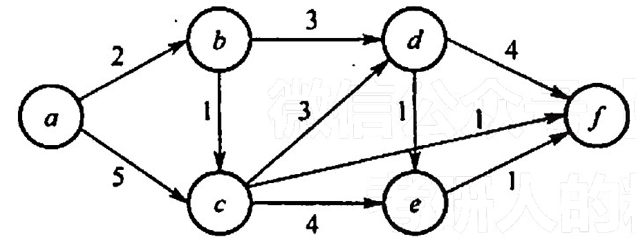

    A. d, e, f
    B. e, d, f
    C. f, d, e
    D. f, e, d
    【答案】：abcfde，C

    | a    | b    | c    | d    | e    | f    |
    | ---- | ---- | ---- | ---- | ---- | ---- |
    | √    | √    | √    | √    |      | √    |
    | 0    | 2    | 3    | 5    | 7    | 4    |
    | -1   | a    | b    | b    | c    | c    |

20. 【2013 统考真题】下列 AOE 网表示一项包含8个活动的工程。通过同时加快若千活动的进度可以缩短整个工程的工期。下列选项中，加快其进度就可以缩短工程工期的是(）.

    A. c和e
    B. d和c
    C. f和d
    D. f和h

    【答案】：C

21. 【2012 統考真题】若用邻接矩阵存储有向图，短阵中主对角线以下的元素均为零，则关于该图拓扑序列的结论是(）.
    A. 存在，且唯一
    B. 存在，且不唯一
    C.存在，可能不唯一
    D.无法确定是否存在

    【答案】：C

22. 【2014 统考真题】对下图所示的有向图进行拓扑排序，得到的拓扑序列可能是（）.

    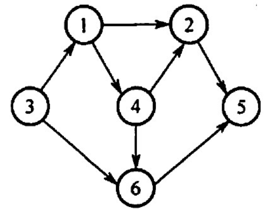

    A. 3,1,2,4,5,6
    B. 3.1.2.4,6,5
    C. 3,1,4,2,5,6
    D. 3,1,4,2,6,5

    【答案】：D

23. 【2015 统考真题】求下面的带权图的最小（代价）生成树时，可能是 Kruskal 算法第2次选中但不是Prim 算法（从V4开始）第2次选中的边是（）

    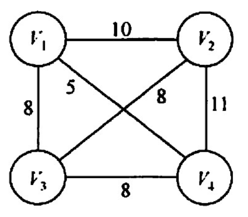

    A. (V1,V3)
    B. (V1,V4)
    C. (V2,V3)
    D. (V3,V4)

    【答案】：C

    Kruskal：1-4 ，888

24. 【2016 统考真题】使用Dikstra 算法求下图中从顶点1到其他各顶点的最短路径，依次得到的各最短路径的目标顶点是（ ）

    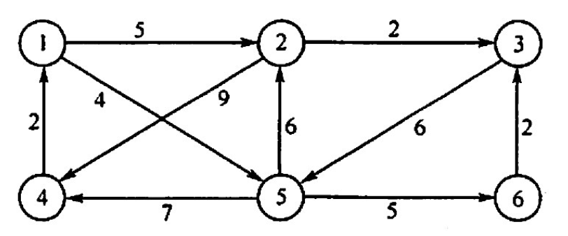

    A. 5,2,3,4,6
    B. 5,2,3,6,4
    C. 5,2,4,3,6
    D. 5,2,6,3,4

    【答案】：52364，B

    | 1    | 2    | 3    | 4    | 5    | 6    |
    | ---- | ---- | ---- | ---- | ---- | ---- |
    | √    | √    | √    |      | √    |      |
    | 0    | 5    | 7    | 11   | 4    | 9    |
    | -1   | 1    | 2    | 5    | 1    | 5    |

25. 【2016 统考真题】若对n个项点、e条弧的有向图采用邻接表存储，则拓扑排序算法的时间复杂度是（ ）。

    A. O(n)
    B. O(n+e)
    C. O(n^2)
    D. O(ne)

    【答案】：B

    > https://www.bilibili.com/video/BV1964y1a7o6?p=8
    >
    > 原来构造了一个数组来记录入度。

26. 【2018 统考真题】下列选项中，不是如下有向图的拓扑序列的是（)。

    

    A. 1.5.2.3.6.4
    B. 5,1,2,6,3,4
    C. 5.1.2.3.6.4
    D. 5.2,1.6.3.4

    【答案】：D

27. 【2019 统考真题】下图所示的 AOE 网表示一项包含8个活动的工程。活动d的最早开始时问和最迟开始时间分别是（)

    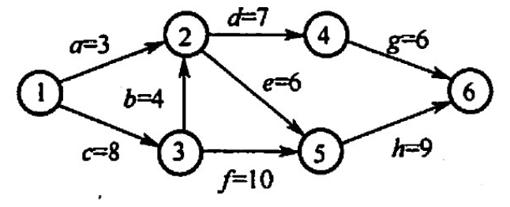

    A. 3和7
    B. 12和12
    C. 12和14
    D. 15和15

    【答案】：C

28. 【2019 统考真题】用有向无环图描迷表达式`(x+y)((x+y)/x)`，需要的项点个数至少是(）
    A. 5
    B. 6
    C. 8
    D. 9

    【答案】：A

29. 【2020 统考真题】已知无向图G 如下所示，使用克鲁斯卡尔（Kruskal）算法求图G的最小生成树，加到最小生成树中的边依次是（）

    

    A. (b, f), (b, d), (a, e), (c, e), (b, e)
    B. (b, f), (b, d), (b, e), (a, e), (c, e)
    C. (a, e), (b, e), (c, e), (b, a), (b, A)
    D. (a, e), (c, e), (b, e), (b, A), (b, d)

    【答案】：A

30. 【2020 统考真题】修改递归方式实现的困的深度优先搜索(DFS）算法，将输出（访问）顶点信息的语句移到退出递归前（即执行输出语句后立刻退出递归）。来用修改后的算法遍历有向无环图 G，若输出结果中包含G中的全部顶点，则输出的顶点序列是G的(）。
    A. 拓扑有序序列
    B. 逆拓扑有序序列
    C. 广度优先搜索序列
    D. 深度优先搜索序列

    【答案】：B

31. **【2020 統考真题】**若使用 AOE 网估算工程进度，则下列叙述中正确的是（）。
    A. 关键路径是从源点到汇点边数最多的一条路径
    B. 关键路径是从源点到汇点路径长度最长的路径
    C. 增加任一关键活动的时间不会延长工程的工期
    D. 编短任一关键活动的时问将会缩短工程的工期

    【答案】：D -> B

32. 【2021 统考真题】给定如下有向图，该图的拓扑有序序列的个数是(）

    

    A. 1 B. 2 C. 3 D. 4

    【答案】：A

33. 【2021 统考真题】使用Dikstra 算法求下图中从顶点1到其余各项点的最短路径，将当前找到的从项点1到顶点2，3，4,5的最短路径长度保存在数组dist 中，求出第二条最短路径后，dist 中的内容更新为（）。

    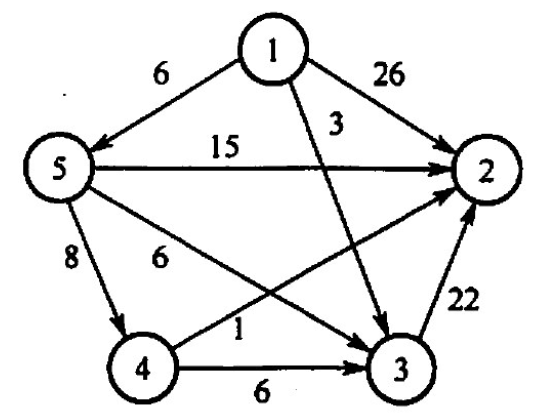

    A. 26, 3, 14, 6
    B. 25, 3, 14, 6
    C. 21, 3, 14, 6
    D. 15, 3, 14, 6

    【答案】：C

    | 1    | 2    | 3    | 4    | 5    |
    | ---- | ---- | ---- | ---- | ---- |
    | √    |      | √    |      | √    |
    | 0    | 21   | 3    | 14   | 6    |
    | -1   | 6    | 1    | 5    | 1    |

34. 【2009 统考真题】带权图（权值非负，表示边连接的两顶点间的距离）的最短路径问题是找出从初始顶点到目标顶点之间的一条最短路径。假设从初始顶点到目标顶点之间存在路径，现有一种解决该问题的方法：
    ① 设最短路径初始时仅包含初始顶点，令当前顶点么为初始顶点，
    ②选择离u最近且尚未在最短路径中的一个顶点V，加入最短路径，修政当前项点点u=V
    ③ 重复步聚②，直到么是目标项点时为止。请问上述方法能否求得最短路径？若该方法可行，请证明；否則，请举例说明。

    【答案】

    不可行，比如，本来可以1->3->4代价为4，但是却选择了1->2->4代价为5

    ```mermaid
    stateDiagram-v2
    1 --> (2)\n2\n(3)
    1 --> (3)\n3\n(1)
    (3)\n3\n(1) --> 4
    (2)\n2\n(3) --> 4
    ```

35. 【2011 统考真题】已知有6个顶点（顶点编号为0~5）的有向带权图G，其邻接矩阵 A为上三角矩阵，按行为主序（行优先）保存在如下的一维数组中

    [4,6,∞,∞,∞,5,∞,∞,∞,4,3,∞,∞,3,3]

    要求：
    1）写出图G的邻接矩阵 A。
    2）画出有向带权图G。
    3）求图G的关键路径，并计算该关键路径的长度。

    【答案】：

    

    1. |      | 1    | 2    | 3    | 4    | 5    | 6    |
       | ---- | ---- | ---- | ---- | ---- | ---- | ---- |
       | 1    |      | 4    | 6    | ∞    | ∞    | ∞    |
       | 2    |      |      | 5    | ∞    | ∞    | ∞    |
       | 3    |      |      |      | 4    | 3    | ∞    |
       | 4    |      |      |      |      | ∞    | 3    |
       | 5    |      |      |      |      |      | 3    |
       | 6    |      |      |      |      |      |      |

    2. 带权图：

    3. 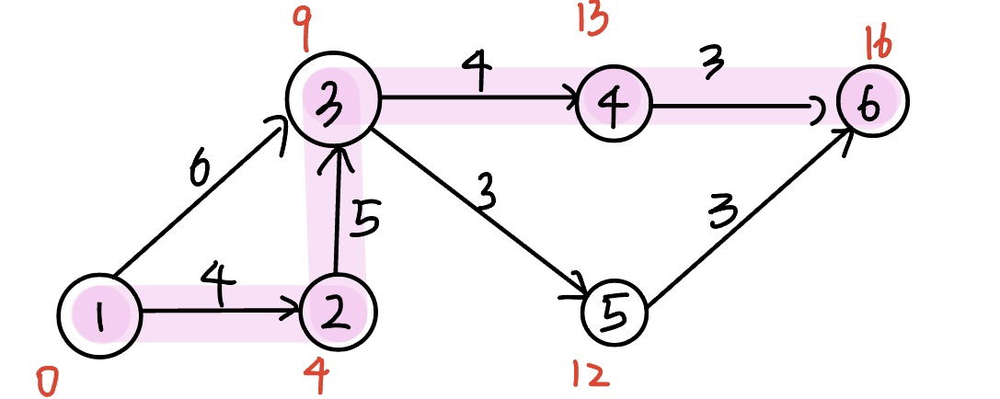

36. 【2014 统考真题】某网络中的路由器运行OSPF路由协议，下表是路由器R1 维护的主要链路状态信息（ISI），R1构造的网络拓扑图（见下图）是根据题下表及R1 的接口名构造出来的网络拓扑。

    

    请回答下列问题，
    1）本题中的网络可抽象为数据结构中的哪种逻辑结构？
    2）针对表中的内容，设计合理的链式存储结构，以保存表中的链路状态信息(LSI)。要求给出链式存储结枸的数据类型定义，并画出对应表的链式存储结构示意图（示意图中可仅以 ID标识结点)
    3）按照 Dijkstra 算法的策略，依次给出 R1 到达子网 192.1.x.x 的最短路径及费用

    【答案】：

    1. 无向图

    2. #### 

       ```C
       typedef struct{
         unsigned int ID,IP;
       }LinkNode;
       typedef struct{
         unsigned int Prefix, Mask;
       }NetNode;
       typedef struct{
         int Flag; // Flag=1为link，Flag=2为net
         union{
           LinkNode Lnode;
           NetNode Nnode;
         }LinkORNet;
         unsigned int Metric;
         struct Node *next;
       }ArcNode;
       typedef struct hNode{
         unisgned int RouterID;
         ArcNode *LN_link;
         Struct hNode *next;
       }HNODE;
       ```

       

    3. 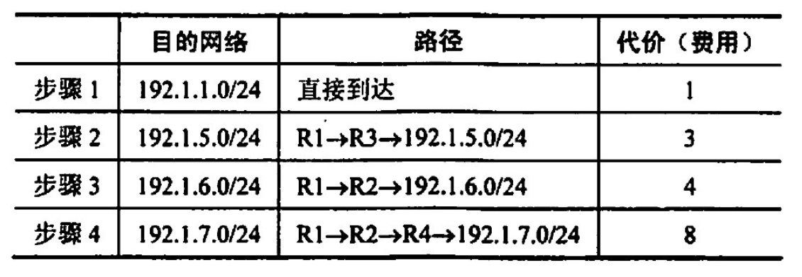

37. 【2017 统考真题】使用Prim 算法求带权连通图的最小（代价）生成树（MST)。请回答下列问题：
    1）对下列图G，从顶点A开始求G的MST，依次给出按算法选出的边．
    2）图G的MST 是唯一的吗？
    3）对任意的带权连通图，满足什么条件时，其MST 是唯一的？

    

    【答案】：

    1. | A    | B    | C    | D    | E    |
       | ---- | ---- | ---- | ---- | ---- |
       | √    | √    |      | √    | √    |
       | 0    | 6    | 10   | 4    | 5    |
       | -1   | A    | D    | A    | A    |

       ADEBC

    2. 不唯一

    3. 不存在权值相等的边

38. 【2018 统考真题】拟建设一个光通信骨千网络连通 BJ,CS,XA,QD,JN,NJ,TL和WH等8个城市，下图中无向边上的权值表示两个城市之可备选光缆的铺设费用。
    请回答下列问题：
    1）仅从铺设费用角度出发，给出所有可能的最经济的光缆铺设方案（用带权图表示），并计算相应方案的总费用。
    2）该图可来用图的哪种存储结构？给出求解问题1）所用的算法名称。
    3）假设每个城市采用一个路由器按1）中得到的最经济方案组网，主机H1 直接连接在 TL 的路由器上，主机H2 直接连接在BJ的路由器上．若H1向H2发送一个TTL=5的IP分组，则H2 是否可以收到该IP分组？

    

    【答案】：

    1. 

       13

    2. 可以用邻接矩阵或邻接表，构造最小生成树用prim算法或krustal算法

    3. 方案1不可收到，方案2可以收到
