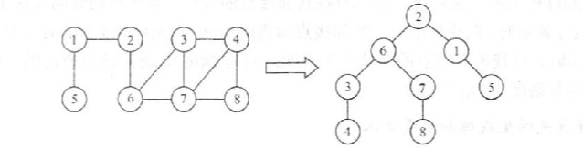
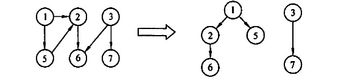
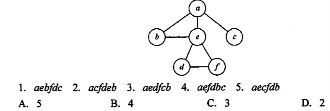
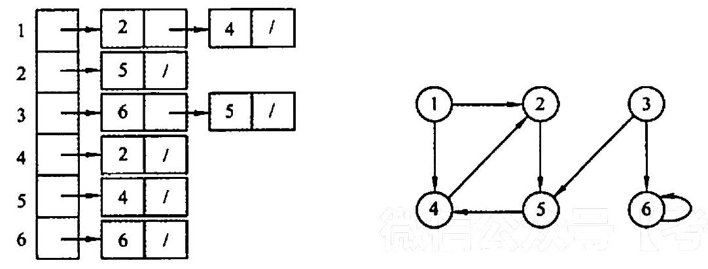
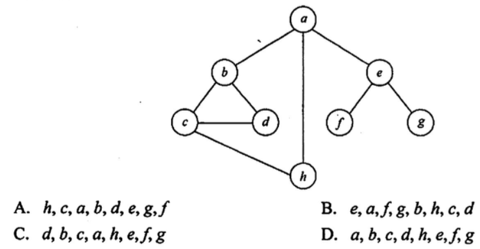
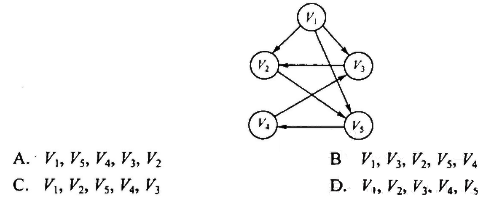

# 图的遍历
2022.09.15

[TOC]

## BFS（广度优先）

1. 【思想】和树的**层次遍历**一个思想，借助一个辅助队列保存当前结点的其余的边。另外借助一个visit数组，记录哪些结点已经被访问过了。

2. 【复杂度】
 |   内容    | 时间复杂度 | 空间复杂度 |
   | :-------: | :--------: | :--------: |
   | 辅助队列Q |            |    O(V)    |
   |  邻接表   |   O(V+E)   |            |
   | 邻接矩阵  |   O(V^2)   |            |

3. 【单源最短路径求解】也可以用visit数组保存路径长度，（之前是保存bool类型，是否访问），如果不是0代表访问过。新的结点路径长度为刚才结点路径+1即可。

4. 【广度优先生成树，生成森林】

   

## DFS（深度优先）

1. 【思想】类似于树的**先序遍历**，借助递归/栈实现。

2. 【复杂度】
|   内容    | 时间复杂度 | 空间复杂度 |
| :-------: | :--------: | :--------: |
| 递归形成的栈 |  |    O(V)    |
|  邻接表   |   O(V+E)   |            |
| 邻接矩阵  |   O(V^2)   |            |

  3. 【深度优先生成树，生成森林】

     

## 例题

1. 下列关于广度优先算法的说法中，正确的是（ ）

   I.  当各边的权值相等时，广度优先算法可以解决单源最短路径问题
   II. 当各边的权值不等时，广度优先算法可用来解决单源最短路径问题
   III.广度优先遍历算法类似于树中的后序遍历算法
   IV. 实现图的广度优先算法时，使用的数据结构是队列
   A. I、 IV
   B. II、III、IV
   C. II、IV
   D. I、III、IV

   【答案】：A

2. 对于一个非连通无向图G，采用深度优先遍历访问所有顶点，在 DFSTraverse 函数(见考点讲解DFS 部分）中调用DFS 的次数正好等于（）。
   A.顶点数
   B.边数
   C.连通分量数
   D.不确定

   **【答案】**：A -> C

3. 对一个有n个顶点、e条边的图来用邻接表表示时，进行DFS 遍历的时问复杂度为(），空间复杂度为（)：进行BFS 遍历的时问复杂度为（），空间复杂度为（）.
   A. O(n)
   B. O(e)
   C. O(n+e)
   D. O(1)

   【答案】：CACA

4. 对有n个顶点、e条边的图采用邻接短阵表示时，进行 DFS 遍历的时问复杂度为（ ），进行 BFS 遍历的时间复杂度为（）
   A. O(n^2)
   B. O(e)
   C. O(n+e)
   D. O(e^2)

   【答案】：AA

5. 无向图G=(V,E)，其中 V={a,b,c,d,e,f}，E={(a,b),(a,e), (a,c), (b,e),(c,f),(f,d),(e,d)}，对该图从a开始进行深度优先遍历，得到的顶点序列正确的是(）.
   A. a, b, e, c, d,f 
   B. a, c,f, e, b, d
   C. a, e, b, c,f, d
   D. a, e, d, f, c, b

   【答案】：abedcf,acfd,aed，D

6. 如下图所示，在下面的5个序列中，符合深度优先遍历的序列个数是(）。

   

   【答案】：D

7. 用邻接表存储的图的深度优先遍历算法类似于树的（ ），而其广度优先遍历算法类似于树的（）。
   A. 中序遍历
   B. 先序遍历
   C. 后序遍历
   D. 按层次遍历

   【答案】：BD

8. 一个有向图G的邻接表存储如下图所示，从项点1出发，对图G调用深度优先遍历所得项点序列是（ )；按广度优先遍历所得项点序列是（ ）

   

   A. 125436
   B. 124536
   C. 124563
   D. 362514

   【答案】：A、B

9. 无向图G=(V，E），其中V={a.b,c,d.e.f}，E={(a, b),(a.e),(a,c),(b,e),(c,f),(f,d),(e,d)}，对图进行深度优先遍历，不能得到的序列（ ）

   A. acfdeb
   B. aebdfc
   C. aedfcb
   D. abecdf

   【答案】：acfdeb，aebdfc，aedfcb，D

10. 判断有向图中是否存在回路，除可以利用拓扑排序外，还可以利用（ ）。
    A. 求关键路径的方法
    B.求最短路径的 Dikstra 算法
    C.深度优先遍历算法
    D.广度优先遍历算法

    【答案】：C

11. 使用DFS 算法递归地遍历一个无环有向图，并在退出递归时输出相应顶点，这样得到的顶点序列是（）。
    A. 逆拓扑有序
    B. 拓扑有序
    C. 无序的
    D. 都不是

    【答案】：A

12. 设无向图G=(V，E），和G'=(V',E')，若G'是G的生成树，则下列说法中错误的是( )。
    A. G'为G的子图
    B. G'为G的连通分量
    C. G'为G的极小连通子图且V=M
    D. G'是G的一个无环子图

    【答案】：B

13. 图的广度优先生成树的树高比深度优先生成树的树高（ ）。
    A. 小或相等
    B. 小
    C. 大或相等
    D. 大

    【答案】：A

14. 对有n个顶点、e条边且使用邻接表存储的有向图进行广度优先遍历，其算法的时问复杂度是（ ）。
    A. O(n)
    B. O(e)
    C. O(n+e)
    D. O(ne)

    【答案】：C

15. 【2013 统考真题】若对如下无向图进行遍历，則下列选项中，不是广度优先遍历序列的是（）

    

    【答案】：hcabde，eafgb[hcd]，dbca[he]，a[bhe] D

16. 【2015 统考真题】设有向图G-(V，E)的，顶点集V= （V0，V1,V2，V3)，边集B={(V0,V1),(V0,V2),(V0,V3),(V1,V3)}。若从顶点V0开始对图进行深度优先遍历，則可能得到的不同遍历序列个数是（）。
    A. 2
    B.3
    C. 4
    D.5

    【答案】：D

17. . 【2016 统考真题】下列选项中，不是下图深度优先搜索序列的是
    

    【答案】：D

## 源码

```C
#include <stdio.h>
#include <stdlib.h>
#include <stdbool.h>
//#include "AdjacencyMatrix.h" // 邻接矩阵
//typedef MGraph Graph; 不能正常运行，可能因为先import的邻接矩阵
//#include "AdjacencyList.h" // 邻接表
typedef LGraph Graph;

void visit(int v){
	printf("%d ",v);
}

// 广度优先遍历辅助数组
bool BFSvisited[MaxVerNum]={0};

// 广度优先遍历(顶点)
void BFS(Graph G, int v, bool init=true){
	/** 初始化广度优先遍历辅助数组
	 * 1. 如果需要初始化则将所有位置为未访问
	 * 2. 不需要初始化的情况:BFS遍历森林
	 */
	if(init)
		for(int i=1;i<GetVexnum(G)+1;i++)
			BFSvisited[i]=false;
	/** 广度优先遍历辅助队列 
	 * 1. 开启BFS访问结点(首结点
	 * 2. 依次访问结点(队列出队) , 结点的子节点如果未访问就入队
	 */
	LinkQueue Q;
    LinkQueueInit(Q);
	visit(v);
	BFSvisited[v]=true;
    LinkQueueEn(Q, ele_build(v));
    Element e;
	while(!LinkQueueEmpty(Q)){
        LinkQueueDe(Q,e);
        v = ele_get_weight(e);
		for(int w=FirstNeighbor(G,v);w>=0;w=NextNeighbor(G,v,w)){
			if(!BFSvisited[w]){
				visit(w);
				BFSvisited[w]=true;
                LinkQueueEn(Q, ele_build(w));
			}
		}
	}
}

// 广度优先遍历(图)
void BFSTraverse(Graph G){
	for(int i=1;i<GetVexnum(G)+1;i++)
			BFSvisited[i]=false;
	for(int i=1;i<GetVexnum(G)+1;i++)
		if(!BFSvisited[i])
			BFS(G,i,false);
}

// 深度优先遍历辅助队列
bool DFSvisited[MaxVerNum] = {false};

// 深度优先遍历(点)
void DFS(Graph G, int v, bool init=true){
	if(init)
		for(int i=1;i<GetVexnum(G)+1;i++)
			DFSvisited[i]=false;
	visit(v);
	DFSvisited[v]=true;
	for(int w=FirstNeighbor(G,v);w>=0;w=NextNeighbor(G,v,w))
		if(!DFSvisited[w])
			DFS(G,w,false); 
}

// 深度优先遍历(图)
void DFSTraverse(Graph G){
	for(int i=1;i<GetVexnum(G)+1;i++)
			DFSvisited[i]=false;
	for(int i=1;i<GetVexnum(G)+1;i++)
		if(!DFSvisited[i])
			DFS(G,i,false);
}

void test_graph_traverse()
{
	printf("图的遍历\n");
	Graph G;
	TestInit(G);

	printf("\n广度优先遍历(2):");
	BFS(G,2);
	printf("\n广度优先遍历(5):");
	BFS(G,5);
	printf("\n广度优先遍历(7):");
	BFS(G,7);
	printf("\n广度优先遍历(图):");
	BFSTraverse(G);

	printf("\n深度优先遍历(2):");
	DFS(G,2);
	printf("\n深度优先遍历(图):");
	DFSTraverse(G);
}

```

输出结果

```
图的遍历
 1 -> 2( 1) 
 2 -> 6( 1) 1( 1) 
 3 -> 4( 1) 7( 1) 6( 1) 
 4 -> 8( 1) 7( 1) 3( 1) 
 5 
 6 -> 7( 1) 3( 1) 2( 1) 
 7 -> 8( 1) 4( 1) 3( 1) 6( 1) 
 8 -> 7( 1) 4( 1) 

 1 - 2   3 - 4
     | / | / |
 5   6 - 7 - 8

广度优先遍历(2):2 6 1 7 3 8 4 
广度优先遍历(5):5 
广度优先遍历(7):7 8 4 3 6 2 1 
广度优先遍历(图):1 2 6 7 3 8 4 5 
深度优先遍历(2):2 6 7 8 4 3 1 
深度优先遍历(图):1 2 6 7 8 4 3 5 
```

