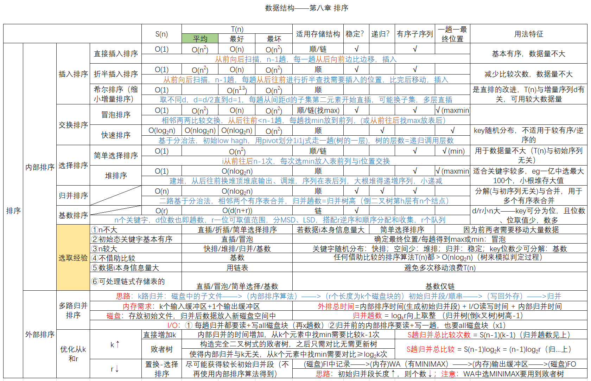

# 各种内部排序算法的比较与应用
2022.10.26

[TOC]

【贡献：https://github.com/bywcy】

1. 若要求排序是稳定的，且关键字为实数，则在下列排序方法中应选(）
   A.直接插入排序
   B.选择排序
   C.基数排序
   D.快速排序

   【答案】：A

2. 以下排序方法中时间复杂度为O(nlog2 n）且稳定的是()。
   A.堆排序
   B.快速排序
   C.归并排序
   D.直接插入排序

   【答案】：C

3. 设被排序的结点序列共有N个结点，在该序列中的结点已十分接近有序的情况下，用直接插入排序、归并排序和快速排序对其进行排序，这些算法的时间复杂度应为（）。
   A. O(N), O(N), O(N)
   B. O(N), O(Nlog2 N), O(Nlog2 N)
   C. O(N), O(Nlog2 N), O(N^2)
   D. O(N^2), O(Nlog2 N), O(N^2)

   【答案】：C

4. 下列排序算法中属于稳定排序的是（①），平均时间复杂度为O（nlog2 n）的是（②），在最好的情况下，时间复杂度可以达到线性时间的有(③）
   I.冒泡排序 II.堆排序
   III.选择排序 IV.直接插入排序
   V.希尔排序 VI.归并排序
   VII.快速排序

   【答案】：

   1. I、IV、VI
   2. II、VI、VII
   3. I、IV

5. 就排序算法所用的辅助空间而言，堆排序、快速排序和归并排序的关系是( )
   A. 堆排序<快速排序<归并排序
   B. 堆排序<归并排序<快速排序
   C. 堆排序>归并排序>快速排序
   D. 堆排序>快速排序>归并排序

   【答案】：A

6. 排序趟数与序列的原始状态无关的排序方法是（ ）。
   I.直接插入排序 II.简单选择排序 III.冒泡排序 IV.基数排序
   A. I、III
   B. I、II、TV
   C. I、II、III
   D. I、IV

   【答案】：B

7. 若序列的原始状态为(1,2,3,4,5,10,6,7,8,9)，要想使得排序过程中的元素比较次数最少，则应该来用（ ）方法。
   A.插入排序
   B.选择排序
   C.希尔排序
   D.冒泡排序

   【答案】：D->A

8. 一般情况下，以下查找效率最低的数据结构是（ ）
   A.有序顺序表
   B.二叉排序树
   C.堆
   D.平衡二叉树

   【答案】：C

9. 排序趟数与序列的原始状态有关的排序方法是（）排序法.

   A.插入
   B.选择
   C.冒泡
   D.基数

   【答案】：C

10. 【2012 统考真题】在内部排序过程中，对尚未确定最终位置的所有元素进行一遍处理称为一趟排序。下列排序方法中，每趟排序结束都至少能够确定一个元素最终位置的方法是（ ）.
    I.简单选择排序 II.希尔排序 III. 快速排序
    IV. 堆排序 V.2路归并排序
    A.仅I、III、IV
    B.仅I、III、V
    C.仅I、III、IV
    D.仅III、IV、V

    【答案】：A

11. 【2015 统考真题】下列排序算法中，元素的移动次数与关键宇的初始排列次序无关的是( ).
    A. 直接插入排序 
    B. 起泡排序
    C. 基数排序
    D. 快速排序

    【答案】：A->C

12. 【2017 统考真题】下列排序方法中，若将顺序存储更换为链式存储，则算法的时间效率会降低的是（ ）.
    I.插入排序 II.选择排序 III.起泡排序 IV. 希尔排序 V.堆排序
    A. 仅I、II
    B. 仅II、III
    C. 仅III、IV
    D. 仅IV、V

    【答案】：C->D

13. 【2019 統考真题】选择一个排序算法时，除算法的时空效率外，下列因素中，还需要考虑的是( ）。
    I.数据的规模 II.数据的存储方式 III. 算法的稳定性 IV. 数据的初始状态
    A.仅I
    B.仅I、II
    C.仅II、III、IV
    D.I、II、III、IV

    【答案】：D

14. 【2020 统考真题】对大部分元素已有序的数组排序时，直接插入排序比简单选择排序效率更高，其原因是（ ）
    I.   直接插入排序过程中元素之间的比较次数更少
    II.  直接插入排序过程中所需的辅助空间更少
    III. 直接插入排序过程中元素的移动次数更少
    A. 仅I
    B. 仅III
    C. 仅I、II
    D. I、II、III、IV

    【答案】：B->A