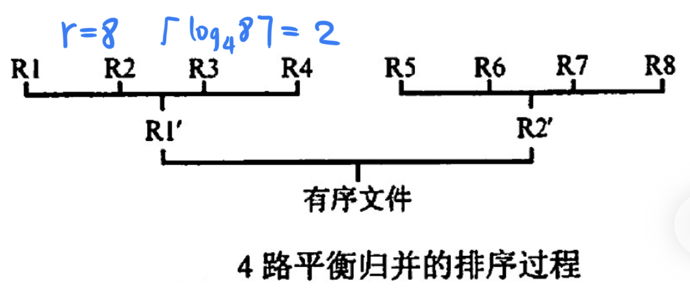
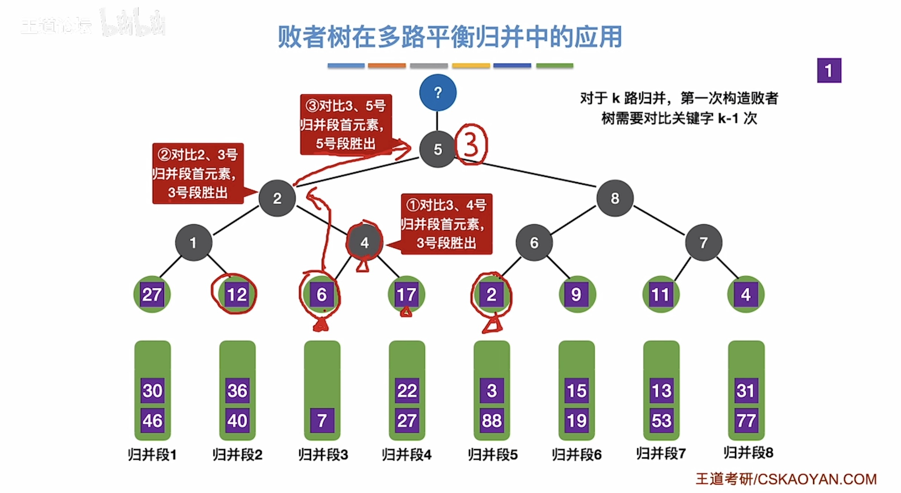
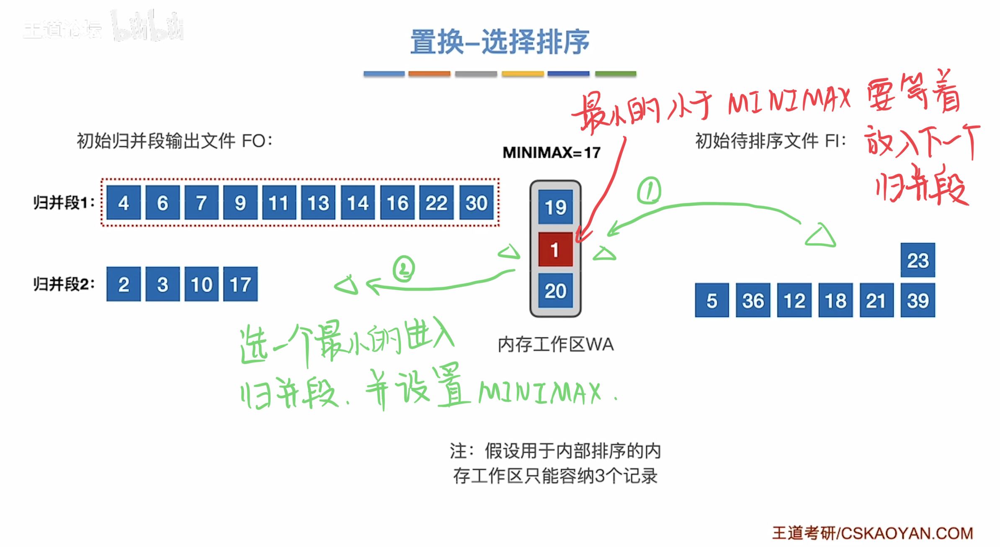
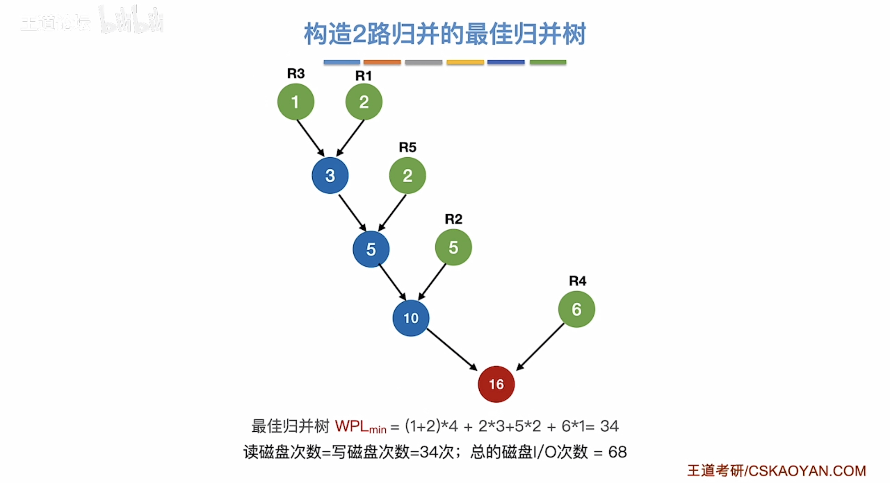
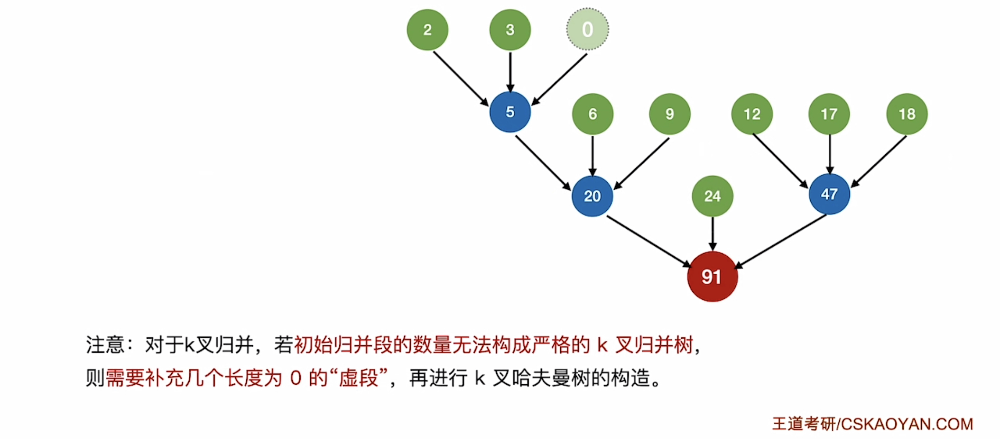
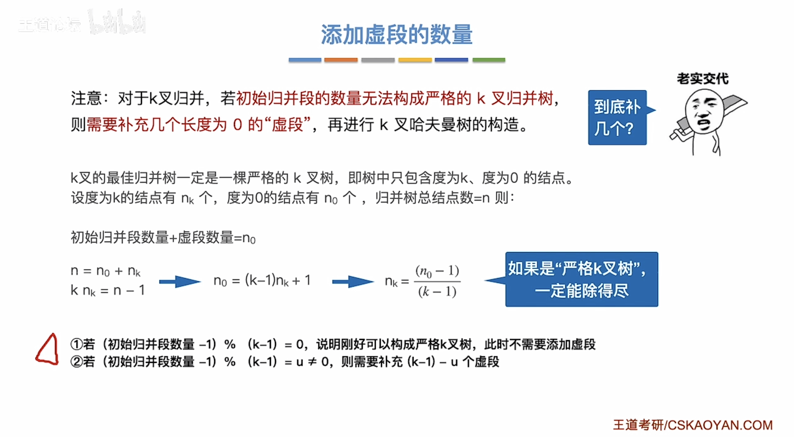

# 外部排序
2022.10.27

[TOC]

## 外部排序基本概念

① 外部排序指待排序**文件较大**，内存一次放不下，需存放在外存的文件的排序。
② 为**减少**平衡归并中**外存读写次数**所采取的方法：**增大归并路数和减少归并段个数**。
③ 利用**败者树**增大归并路数。
④ 利用**置换-选择排序**增大归并段长度来减少归并段个数。
⑤ 由长度不等的归并段，进行多路平衡归并，需要构造**最佳归并树**。

## 外部排序的方法

1. 普通的外部排序方法：生成初始归并段，第一趟归并，第二趟.....

2. 外部排序通常使用：归并排序法

3. 两个步骤：

   1. 根据内存缓冲区大小，划分归并段
   2. 对归并段进行归并

4. 外部排序时间 = 内部排序时间 + 外存读写时间 + 内部归并时间

5. r个归并段进行k路归并：树的高度-1 = $\lceil \log_kr \rceil$ = 归并趟数

   

6. **增大k可以减少归并趟数**

## 多路平衡归并与败者树

* k路归并败者树深度：$\lceil \log_2 k \rceil$
* k路归并败者树单个元素比较次数：$\lceil \log_2 k \rceil$
* k路归并败者树总比较次数：$\lceil \log_kr \rceil(n-1)\lceil \log_2k \rceil=(n-1)\lceil \log_2r \rceil$

## 置换-选择排序

原始数据 -(置换选择排序)-> 初始归并段

> 【王道计算机考研 数据结构-哔哩哔哩】 https://b23.tv/aq4eOoz

## 最佳归并树

初始归并段 -(最佳归并树)-> 归并排序(败者树)

注意读写磁盘总数是带全路径长度的两倍！

注意多路归并的情况！可能要补充长度为0的虚段！

## 例题

1. 设在磁盘上存放有375000个记录，做5路平衡归并排序，内存工作区能容纳 600 个记录，为把所有记录排好序，需要做（）趟归并排序。
   A. 3
   B. 4
   C. 5
   D. 6

   【答案】：375000 / 600 = 625，625 = 5^4，B

2. 设有5个初始归并段，每个归并段有20个记录，采用5路平衡归并排序，若不采用败者树，使用传统的顺序选出最小记录（简单选择排序）的方法，总的比较次数为(①); 若采用败者树最小的方法，总的比较次数约(②）。
   A. 20
   B. 300
   C. 396
   D. 500

   【答案】：100x5=500，100xlog_5 100=300, DB -> CB

   4*
   
3. 置换-选择排序的作用是（）
   A. 用于生成外部排序的初始归并段
   B. 完成将一个碰盘文件排序成有序文件的有效的外部排序算法
   C. 生成的初始归并段的长度是内存工作区的2倍
   D. 对外部排序中输入/归并/输出的并行处理

   【答案】：A

4. 最佳归并树在外部排序中的作用是（）。
   A. 完成m路归并排序
   B. 设计m路归并排序的优化方案
   C. 产生初始归并段
   D. 与锦标赛树的作用类似

   【答案】：B

5. 在下列关于外部排序过程输入输出级冲区作用的叙述中，**不**正确的是（）

   A. 暂存揄入/输出记录
   B. 内部归并的工作区
   C. 产生初始归并段的工作区
   D. 传送用户界面的消息

   【答案】：C -> D

6. 在做m路平街归并排序的过程中，为实现输入/内部归并/输出的并行处理，需要设置(①）个输入缓冲区和（②）个输出缓冲区。
   ① A. 2 B.m C. 2m- 1 D. 2m
   ② A. 2 B.m C. 2m -1 D. 2m

   【答案】：CA -> DA

7. 【2013 统考真题】已知三叉树下中6个叶结点的权分别是2，3，4，5，6，7，T的带权（外部）路径长度最小是（）
   A. 27
   B. 46
   C. 54
   D. 56

   【答案】：{023}->5,{455}->14,{14,6,7}->27，带权！3x(2+3)+2x(4+5)+1x(6+7)=31+15=46,B

8. 【2019 统考真题】设外存上有120 个初始归并段，进行12 路归并时，为实现最佳归并，需要补充的虛段个数是（）。
   A. 1
   B. 2
   C. 3
   D. 4

   【答案】：B