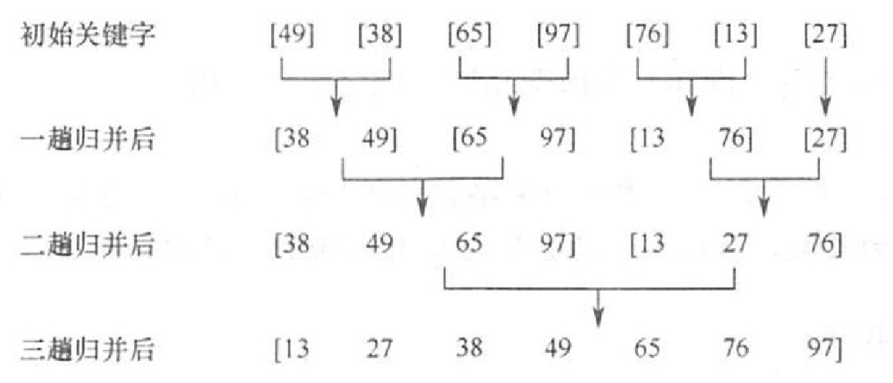
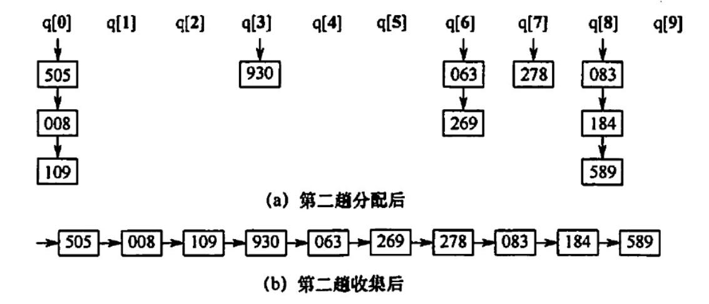
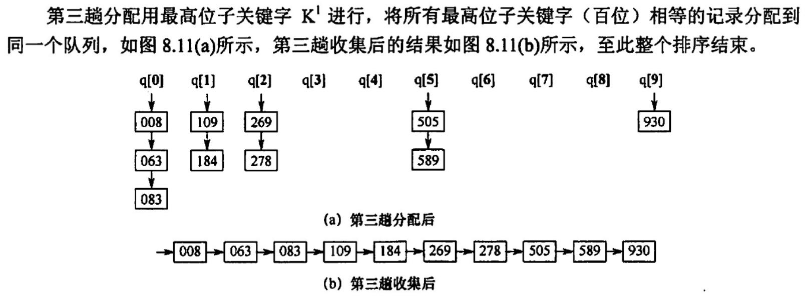

# 归并排序和基数排序
2022.10.22

[TOC]

## 归并排序

二路归并排序示例：

## 基数排序

时间效率：一趟分配O(n),一趟收集O(r),d趟综合O(d(n+r))；n是元素个数，r是某指标的种类，d是指标个数

稳定性：稳定

## 例题

1. 以下排序方法中，（ ）在一趟结束后不一定能选出一个元素放在其最终位置上。
   A. 简单选择排序 
   B. 冒泡排序
   C. 归并排序
   D. 堆排序

   【答案】：C

2. 以下排序算法中，（ ）不需要进行关键字的比较。
   A. 快速排序
   B. 归并排序
   C. 基数排序
   D. 堆排序

   【答案】：C

3. 在下列排序算法中，平均情况下空间复杂度为 O(n) 的是（ )，最坏情况下空间复杂度为O(n)的是（ ）
   I.  希尔排序
   II. 堆排序
   III.冒泡排序
   IV. 归并排序
   V.  快速排序
   VI. 基数排序
   A. I、IV、VI
   B. II、V
   C. IV、V
   D. IV

   **【答案】：D,C**

4. 下列排序方法中，排序过程中比较次数的数量级与序列初始状态无关的是（ ）。
   A. 归并排序
   B. 插入排序
   C. 快速排序
   D. 冒泡排序

   【答案】：A

5. 若对27个元素只进行三趟多路归并排序，则选取的归并路数最少为（）
   A. 2
   B. 3
   C. 4
   D. 5

   【答案】：B

6. 2路归并排序中，归并趟数的数量级是（）。
   A. O(n)
   B. O(log2n)
   C. O(nlog2n)
   D. O(n^2)

   【答案】：B

7. 将两个各有N个元素的有序表合并成一个有序表，最少的比较次数是（），最多的比较次数是（）
   A. N
   B. 2N-1
   C. 2N
   D. N-1

   【答案】：AB

8. 一组经过第一趟2路归并排序后的记录的关键字为 {25,50,15,35,80,85,20,40,35,70}，其中包含5个长度为2的有序表，用2路归并排序方法对该序列进行第二趟归并后的结果为（）。
   A. 15, 25, 35, 50, 80, 20, 85, 40, 70, 36
   B. 15, 25, 35, 50, 20, 40, 80, 85, 36, 70
   C. 15, 25, 50, 35, 80, 85, 20, 36, 40, 70
   D. 15, 25, 35, 50, 80, 20, 36, 40, 70, 85

   【答案】：B

9. 若将中国人按照生日（不考虑年份，只考虑月、日）来排序，则使用下列排序算法时：最快的是（）
   A. 归并排序
   B. 希尔排序
   C. 快速排序
   D. 基数排序

   【答案】：D

10. 对{05,45,13, 55,94,17,42}进行基数排序，一趟排序的结果是（）.
    A. 05,46, 13,55,94, 17,42
    B. 05, 13, 17, 42, 46, 55, 94
    C. 42,13,94,05,55,46, 17
    D. 05, 13, 46, 55, 17, 42, 94

    【答案】：C

11. 【2013 统考真题】对给定的关键字序列 110,119，007,911,114， 120， 122 进行基数排序，第2趟分配收集后得到的关键宇序列是（）。
    A. 007,110,119,114,911, 120, 122
    B. 007, 110, 119, 114, 911, 122, 120
    C. 007,110,911,114,119,120, 122
    D. 110, 120, 911, 122, 114, 007, 119

    【答案】：C

    007

    110，911，114，119

    120，122

12. 【2016 统考真题】对 10TB 的数据文件进行排序，应使用的方法是(）。

    A. 希尔排序
    B.堆排序
    C.快速排序
    D.归并排序

    【答案】：D

13. 【2017 统考真题】在内部排序时，若选择了归并排序而未选择插入排序，则可能的理由是（ ）.
    I．归并排序的程序代码更短
    II．归并排序的占用空问更少
    III. 归并排序的运行效率更高
    A. 仅I
    B. 仅III
    C. 仅I、II
    D. 仅I、III

    【答案】：B

14. 【2021 统考真题】设数组 S[] = {93,945,372,9,146,151,301,485,236,327,43,892}，来用最低位优先（LSD）基数排序将 S 排列成升序序列。第一趟分配、收集后，元素 372之前、之后紧邻的元素分别是（ ）。
    A. 43,  892
    B. 236, 301
    C. 301, 892
    D. 485, 301

    【答案】：C