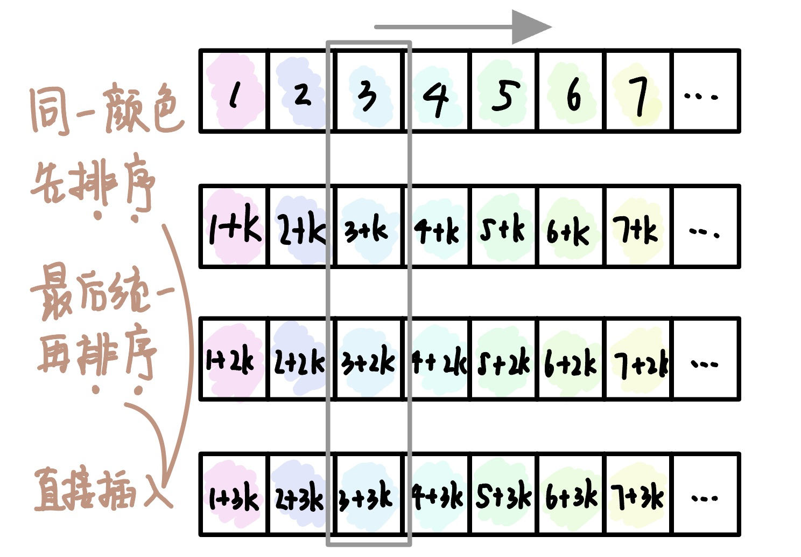

# 插入排序
2022.09.19

[TOC]

## 直接插入排序

从头到尾一个个排序。第i+1轮判断num[i]的大小，num[0]到num[i-1]已经排好序，要将num[i]插入到num[0]至num[i-1]中。

空间复杂度：O(1)

时间复杂度：最好O(n)，最坏O(n^2)

稳定性：稳定

适用性：顺序存储的线性表

```C
void InserSort(ElemType A[], int n){
  for(int i=2;i<=n;i++) // 依次将A[2]～A[n]插入前面已经排序序列
    if(A[i]<A[i-1]){    // 发现逆序，需要将该元素插入到前边
      A[0]=A[i];        // 将该元素放到哨兵位置
      for(int j=i-1;A[0]<A[j];j--)
        A[j+1]=A[j];    // 从后向前依次向后移动
      A[j+1]=A[0];      // 元素复制到插入位置
    }
}
```

## 折半插入排序

直接插入中首先从后向前移动元素，实际就是在找位置。这一步可以优化成先用折半查找找到位置，然后集体移动元素。

空间复杂度：O(1)

时间复杂度：最好O(n)，最坏O(max{nlog2 n, n^2})=O(n^2)

稳定性：稳定

适用性：顺序存储的线性表

```C
void InserSort(ElemType A[], int n){
  int low,mid,high;
  for(int i=2;i<=n;i++){ // 依次将A[2]到A[n]插入前面的已排序序列
    A[0]=A[i];           // 将A[i]暂存到A[0]
    // Step 1. 折半查找
    low=1;high=i-1;      // 折半查找范围
    while(low<=high){
      mid = (low+high)/2;
      if(A[mid]>A[0]) high=mid-1; // 取左一半
      else low=mid+1;   // 取右一半
    }
    // Step 2. 统一后移
    for(int j=i-1;j>=high+1;j--)
      A[j+1]=A[j];
    A[high+1]=A[0];
  }
}
```

## 希尔排序

将一个表分成n个字表，每个字表内进行**直接插入排序**。然后再对整体进行**直接插入排序**。



空间复杂度：O(1)

时间复杂度：特定范围n：O(n^1.3)，最坏O(n^2)

稳定性：不稳定

适用性：顺序存储的线性表

## 例题

1. 对5个不同的数据元素进行直接插入排序，最多需要进行的比较次数是（ ）。
   A. 8
   B. 10
   C. 15
   D. 25

   【答案】：1+2+3+4=10，B

2. 在待排序的元素序列基本有序的前提下，效率最高的排序方法是（ ）
   A. 直接插入排序 
   B. 简单选择排序
   C. 快速排序
   D. 归并排序

   【答案】：A

3. 对有n个元素的顺序表来用直接插入排序算法进行排序，在最坏情况下所需的比较次数是（ ）；在最好情況下所需的比较次数是（ ）。
   A. n-1
   B. n+1
   C. n/2
   D. n(n-1)/2

   【答案】：DA

4. 数据序列{8,10,13,4,6,7,22,2,33只能是（）两趟排序后的结果。
   A. 简单选择排序 B.起泡排序
   C．直接插入排序 D.堆排序

   【答案】：C

5. 用直接插入排序算法对下列4个表进行（从小到大）排序，比较次数最少的是(）
   A. 94,32,40,90,80,46,21,69
   B. 21, 32, 46, 40, 80, 69, 90, 94
   C. 32,40,21, 46,69,94,90,80
   D. 90,69,80,46,21, 32,94,40

   【答案】：B

6. 在下列算法中，（）算法可能出现下列情况：在最后一趟开始之前，所有元素都不在最终位置上。
   A.堆排序
   B.冒泡排序
   C．直接插入排序 
   D.快速排序

   【答案】：C

7. 希尔排序属于（）.
   A. 插入排序
   B.交换排序
   C.选择排序
   D.归并排序

   【答案】：A

8. 对序列{15,9,7,8,20,-1,4}用希尔排序方法排序，经一趟后序列变为{15,-1,4,8,20,9,7}，则该次采用的增量是(）。
   A. 1
   B. 4
   C. 3
   D. 2

   【答案】：D -> B

9. 若对于第9题中的序列，经一趟排序后序列变成{9,15,7,8,20,-1,4}，则来用的是下列的（ ）.
   A. 选择排序
   B.快速排序
   C.直接插入排序 
   D.冒泡排序

   【答案】：C

10. 对序列{98,36,-9,0,47,23,1,8，10,7}来用希尔排序，下列序列（ ）是增量为4的一趟排序结果。
    A. (10, 7, -9, 0, 47, 23, 1, 8, 98, 36}
    B. (-9, 0, 36, 98, 1, 8, 23, 47, 7, 10}
    C. {36,98,-9,0,23,47,1,8,7,10}
    D.以上都不对

    【答案】：A

11. 折半插入排序算法的时问复杂度为（ ）。

    A.O(n)
    B. O(nlog_2 n)
    C. O(n^2)
    D.O(n^3)

    【答案】：C

12. 有些排序算法在每趟排序过程中，都会有一个元素被放置到其最终位置上，（）算法不会出现此种情况。
    A. 希尔排序
    B.堆排序
    C.冒泡排序
    D.快速排序

    【答案】：A

13. 以下排序算法中，不稳定的是(）。
    A.冒泡排序
    B.直接插入排序
    C.希尔排序
    D.归并排序

    【答案】：C

14. 以下排序算法中，稳定的是(）。
    A. 快速排序
    B. 堆排序
    C.直校插入排序
    D.简单选择排序

    【答案】：C

15. 【2009 统考真题】若数据元素序列{11,12，13,7,8,9,23,4,5}是采用下列排序方法之一得到的第二趟排序后的结果，则该排序算法只能是(）。

    A.冒泡排序
    B. 插入排序
    C.选择排序
    D.2路归并排序

    【答案】：B

16. 【2012统考真题】对同一待排序序列分別进行折半插入排序和直接插入排序，两者之问可能的不同之处是(）。
    A. 排序的总趟数
    B.元素的移动次数
    C.使用辅助空问的数量
    D.元素之间的比较次数

    【答案】：D

17. 【2014 统考其题】用希尔排序方法对一个数据序列进行排序时，若第1趟排序结果为9,1,4,13,7,8,20,23,15，则该道排序采用的增量（问隔）可能是（）
    A. 2
    B.3
    C.4
    D. 5

    【答案】：B

18. 【2015 统考真题】希尔排序的组内排序来用的是（）。
    A．直接插入排序 B.折半插入排序 C.快速排序D.归并排序

    【答案】：A

19. 【2018 统考真题】对初始数据序列(8,3,9,11,2,1,4,7,5,10,6)进行希尔排序。若第一趟排序结果为(1,3,7,5,2,6,4,9,11,10,8), 第二趟排序结果为(1,2,5,4,3,7,5,8,11,10,9}，則两道排序采用的增量（问隔）依次是(）。
    A. 3,1
    B. 3,2
    C. 5,2
    D. 5,3

    【答案】：D

